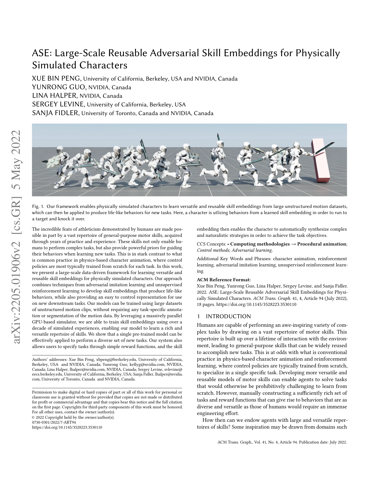
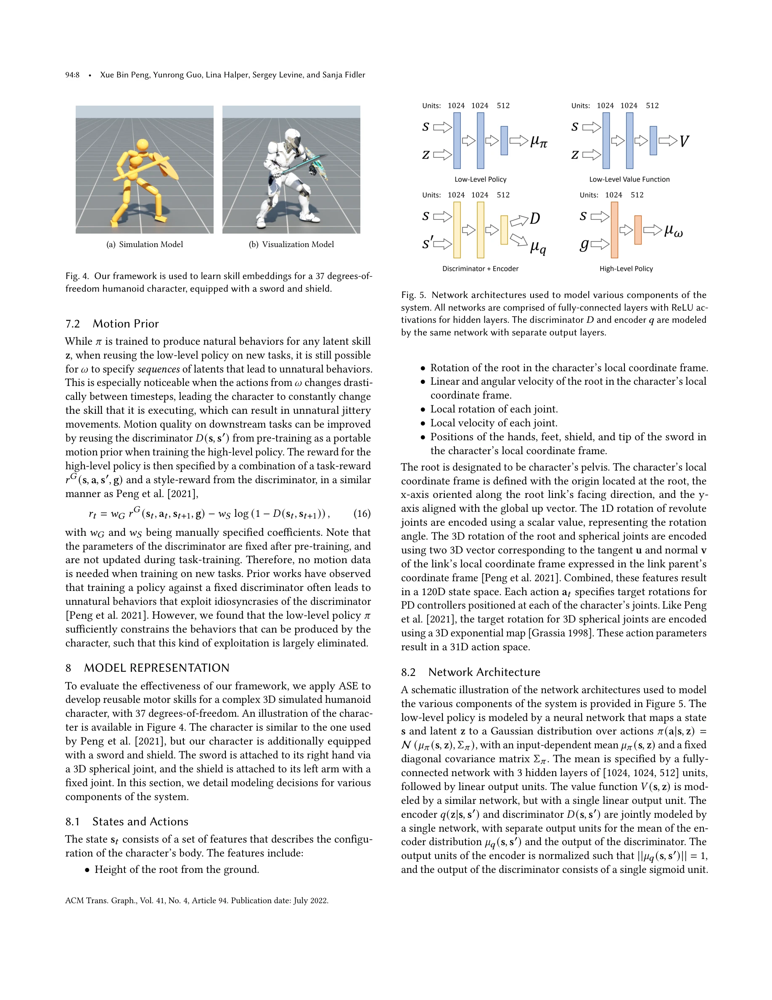
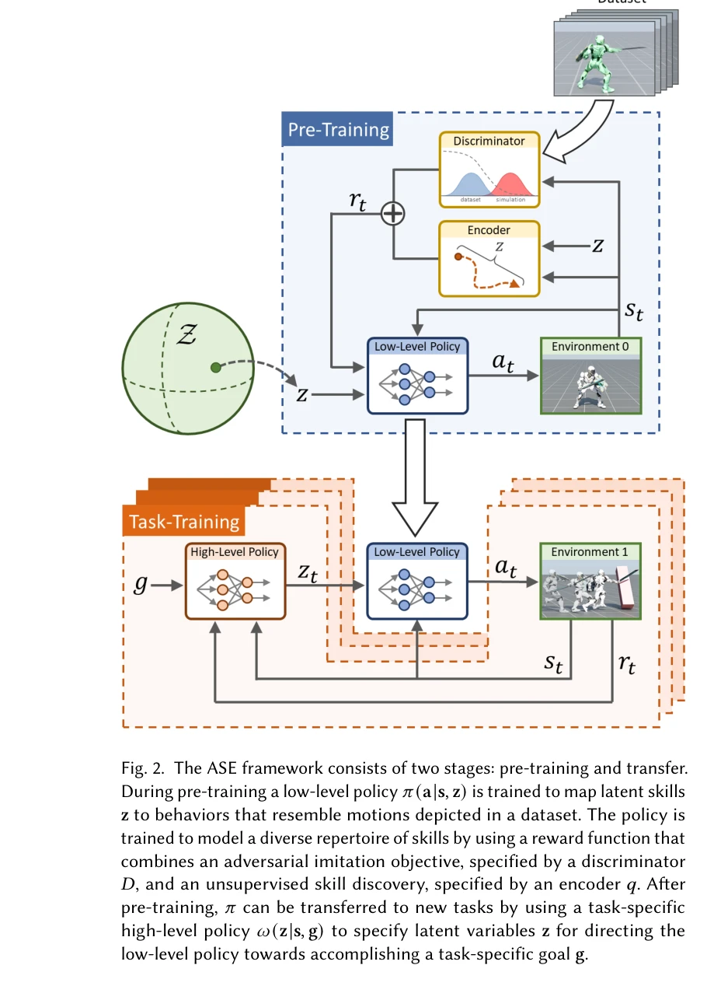

# ASE: Large-Scale Reusable Adversarial Skill Embeddings for Physically Simulated Characters

> **저자**: Xue Bin Peng, Yunrong Guo, Lina Halper, Sergey Levine, Sanja Fidler | **날짜**: 2022-05-04 | **URL**: [https://arxiv.org/abs/2205.01906](https://arxiv.org/abs/2205.01906)

---

## Essence

*Fig. 1. Our framework enables physically simulated characters to learn versatile and reusable skill embeddings from larg*

대규모 비정형 모션 데이터셋으로부터 adversarial imitation learning과 unsupervised reinforcement learning을 결합하여 물리 시뮬레이션 캐릭터의 재사용 가능한 스킬 임베딩을 학습하는 데이터 기반 프레임워크를 제시한다. 학습된 스킬 임베딩은 다양한 새로운 과제에 효과적으로 전이되며 자연스러운 행동을 합성한다.

## Motivation

- **Known**: 물리 기반 캐릭터 애니메이션에서는 일반적으로 각 과제별로 제어 정책을 처음부터 학습한다. 데이터 기반 방법은 모션 추적이나 reward engineering을 통해 자연스러운 행동을 생성할 수 있으나, 대규모 비정형 데이터셋으로부터 재사용 가능한 다목적 스킬을 학습하기는 어렵다.
- **Gap**: 기존 방법들은 특정 과제에 최적화되거나 모션 추적에 의존하여 새로운 과제로의 전이가 제한적이며, 인간처럼 다양하고 일반화된 motor skill 레퍼토리를 학습할 수 있는 확장 가능한 프레임워크가 부재하다.
- **Why**: 재사용 가능한 스킬 임베딩은 새로운 과제 학습 시 강력한 사전 정보(prior)를 제공하여 학습 효율을 크게 향상시킬 수 있으며, 컴퓨터 비전 및 자연어 처리에서의 사전 학습 패러다임을 물리 기반 캐릭터 제어에 적용할 수 있다.
- **Approach**: 정보 최대화(information maximization) 목표를 통해 다양한 스킬 습득을 장려하는 low-level latent variable 모델을 adversarial imitation learning으로 사전 학습하고, 이를 high-level policy의 추상 행동 공간으로 활용하여 새로운 과제를 수행한다. Isaac Gym의 대규모 병렬 GPU 시뮬레이터를 활용하여 십 년분의 시뮬레이션 경험으로부터 학습한다.

## Achievement

*Fig. 4. Our framework is used to learn skill embeddings for a 37 degrees-of-*

- **대규모 스킬 습득**: 100개 이상의 다양한 모션 클립으로부터 task-specific annotation 없이 자동으로 일반화된 다목적 motor skill들을 학습
- **높은 전이 성능**: 단일 사전 학습 모델이 diverse한 새로운 과제에 효과적으로 적용되며 자연스럽고 기민한 행동 합성
- **견고한 회복 전략**: 무작위 초기 상태로부터의 회복 학습으로 외부 perturbation에 대한 높은 robustness 달성
- **간단한 reward 함수 인터페이스**: 사용자가 간단한 reward function으로 과제를 지정하면 시스템이 복잡하고 자연스러운 전략을 자동 합성

## How

*Fig. 2. The ASE framework consists of two stages: pre-training and transfer.*

- Information maximization objective를 포함한 adversarial imitation learning으로 latent variable 모델 사전 학습
- Unsupervised reinforcement learning을 통해 비정형 모션 데이터셋의 다양한 특성을 반영한 skill diversity 증대
- Isaac Gym 기반 대규모 병렬 시뮬레이터로 십 년 규모의 시뮬레이션 경험 생성
- Low-level skill embedding을 high-level policy의 행동 공간으로 재정의하여 downstream task 수행
- Random initial state recovery 학습으로 robust recovery behavior 획득 후 새로운 과제에 통합

## Originality

- Information maximization을 adversarial imitation learning과 결합하여 비정형 모션 데이터로부터 diverse skill embedding 학습하는 novel objective 제시
- Latent variable model의 스킬 임베딩을 high-level policy의 추상 행동 공간으로 활용하는 two-stage 전이 학습 구조 설계
- Random initial state recovery를 통해 습득한 robustness를 downstream task에 seamless integration하는 방법론
- 대규모 GPU 병렬 시뮬레이션을 활용한 십 년 규모 사전 학습으로 기존 대비 학습 규모를 획기적으로 확장

## Limitation & Further Study

- 사전 학습 모션 데이터셋의 품질과 다양성에 매우 의존적이며, 특정 모션 스타일이나 신체 유형으로 제한된 데이터셋의 경우 일반화 성능 저하
- Reward function 설계가 여전히 필요하며, 복잡한 과제에 대한 적절한 reward engineering은 여전히 과제
- Sim-to-real transfer에 대한 논의 및 실제 로봇 플랫폼에서의 검증이 부재
- 후속 연구로 더 복잡한 다인(multi-agent) 상호작용 과제에 대한 확장 및 구조화된 계층적 스킬 표현 학습 필요

## Evaluation

- Novelty: 4/5
- Technical Soundness: 4/5
- Significance: 4/5
- Clarity: 4/5
- Overall: 4/5

**총평**: 본 논문은 adversarial imitation learning과 information maximization을 결합하여 대규모 비정형 모션 데이터로부터 재사용 가능한 스킬 임베딩을 학습하는 혁신적인 프레임워크를 제시한다. 십 년 규모의 대규모 사전 학습과 탁월한 전이 성능으로 물리 기반 캐릭터 애니메이션 분야에 significant contribution을 제공한다.
