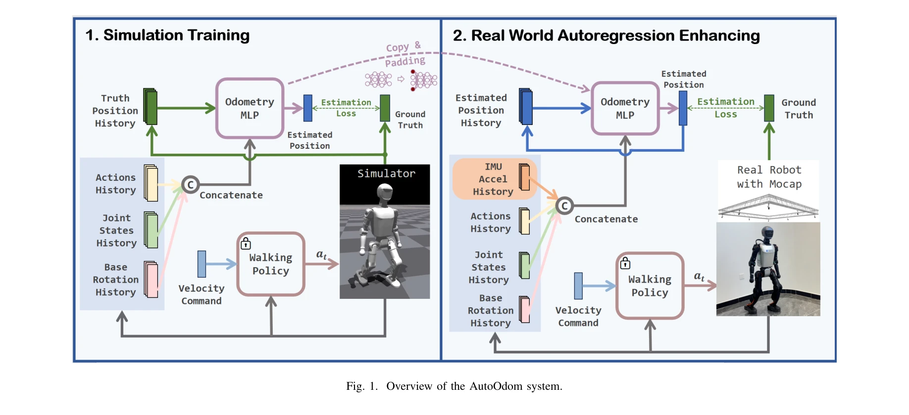

# AutoOdom: Learning Auto-regressive Proprioceptive Odometry for Legged Locomotion

> **저자**: Changsheng Luo, Yushi Wang, Wenhan Cai, Mingguo Zhao | **날짜**: 2025-11-24 | **URL**: [https://arxiv.org/abs/2511.18857](https://arxiv.org/abs/2511.18857)

---

## Essence

*Fig. 1. Overview of the AutoOdom system.*

AutoOdom은 자동회귀 학습을 기반으로 하는 2단계 훈련 패러다임으로 다리 로봇의 고유감각 주행거리 추정 성능을 크게 향상시킨 시스템이다. 대규모 시뮬레이션 데이터로 비선형 동역학을 학습하고 제한된 실제 데이터로 sim-to-real 갭을 해결한다.

## Motivation

- **Known**: 필터링 기반 방법(EKF, UKF)은 모델 불확실성과 누적 드리프트로 10% 이상의 위치 오차를 초래하고, 순수 학습 기반 방법은 대량의 실제 데이터가 필요하며 시뮬레이션-현실 갭 문제가 있다.
- **Gap**: 기존 접근법들은 필터링의 모델 의존성, 혼합 방식의 분석 성분 제약, 순수 학습의 sim-to-real 전환 문제 중 하나 이상에서 한계를 가진다. 적은 실제 데이터로도 효과적으로 시뮬레이션 기반 모델을 개선할 수 있는 방법이 부재하다.
- **Why**: GPS와 카메라가 작동하지 않는 환경에서 다리 로봇의 정확한 위치 추정은 자율 네비게이션과 제어에 필수적이며, 특히 점프나 회전 같은 동적 동작 중에도 신뢰할 수 있는 시스템이 필요하다.
- **Approach**: 자동회귀 학습을 도입하여 모델이 자신의 예측으로부터 학습하도록 하고, 2단계 훈련으로 (1) 시뮬레이션에서 복잡한 동역학 학습, (2) 실제 데이터로 autoregressive enhancement를 수행한다.

## Achievement

*Fig. 4. Trajectory comparison between AutoOdom and Legolas on some test sequences. Blue: ground truth, orange: AutoOdom,*

- **성능 개선**: Legolas 베이스라인 대비 절대 궤적 오차 57.2%, Umeyama 정렬 오차 59.2%, 상대 자세 오차 36.2% 개선
- **효율적 sim-to-real 전환**: 제한된 실제 데이터로도 시뮬레이션 기반 모델의 sim-to-real 갭을 효과적으로 해소
- **자동회귀 견고성**: 자신의 예측으로부터 학습하여 센서 노이즈와 동적 환경에 대한 복원력 강화
- **포괄적 검증**: Booster T1 휴머노이드 로봇에서 광범위한 ablation 연구를 통해 센서 양식 선택과 시간적 모델링에 대한 통찰 제공

## How

*Fig. 1. Overview of the AutoOdom system.*

- **다중 센서 입력**: 접촉 상태 At, 명령 속도 vcmd_t, 각속도 ωt, IMU 가속도 at, 관절 위치 qt, 관절 속도 q̇t, 회전 행렬 Rt, 위치 변화 Δpt를 통합
- **Stage 1 시뮬레이션 훈련**: Booster Gym 플랫폼의 대규모 데이터로 비선형 동역학과 빠르게 변하는 접촉 상태 학습
- **Stage 2 자동회귀 강화**: 실제 데이터에서 모델 예측을 입력으로 사용하여 자동회귀 학습으로 노이즈 견고성 개선
- **Pose 예측**: 연속 프레임 간 pose 변화량과 분산을 예측하여 궤적 추정
- **Window 기반 설계**: 연속 적분의 오류 누적을 제거하기 위해 시간 윈도우 기반 formulation 사용

## Originality

- **자동회귀 학습 메커니즘**: 모델이 자신의 예측으로부터 학습하도록 설계하여 노이즈 견고성을 강화하는 새로운 접근
- **효율적 2단계 훈련**: 대규모 시뮬레이션과 제한된 실제 데이터를 조합하여 sim-to-real 갭을 효과적으로 해소하는 방법론
- **센서 모달리티 분석**: IMU 가속도 데이터의 counterintuitive 역할 등 고유감각 센서 선택에 대한 새로운 통찰 제공
- **포괄적 ablation 연구**: 시간적 모델링과 센서 선택에 대한 체계적인 분석으로 설계 선택의 타당성 검증

## Limitation & Further Study

- **플랫폼 특정성**: Booster T1 휴머노이드 로봇에서만 검증되어 다양한 다리 로봇 형태로의 일반화 가능성 미지수
- **실제 데이터 요구**: Stage 2에서 제한적이지만 여전히 특정 환경/움직임에 대한 실제 데이터 필요
- **접촉 상태 모델링**: 복잡한 발-지면 상호작용의 정확한 모델링 여전히 challenges 존재
- **후속 연구 방향**: 다양한 지형(모래, 진흙 등)에서의 성능 검증, 장시간 궤적에 대한 누적 오차 분석, 다양한 로봇 플랫폼으로의 전이 학습 방법 개발

## Evaluation

- Novelty: 4/5
- Technical Soundness: 4/5
- Significance: 4/5
- Clarity: 4/5
- Overall: 4/5

**총평**: AutoOdom은 자동회귀 학습과 효율적인 2단계 훈련으로 proprioceptive odometry의 중요한 한계를 해결하며, 강력한 실험 결과와 포괄적 ablation 연구로 견고한 기여를 제시한다. 다만 특정 로봇 플랫폼 검증과 다양한 환경으로의 일반화 가능성 확인이 후속 과제다.
