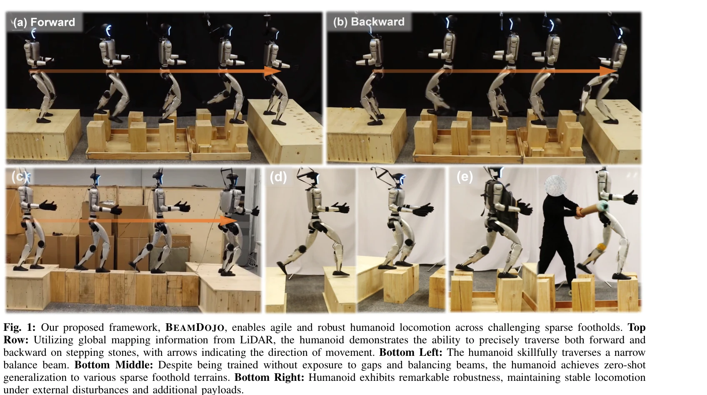

# BeamDojo: Learning Agile Humanoid Locomotion on Sparse Footholds

> **저자**: Huayi Wang, Zirui Wang, Junli Ren, Qingwei Ben, Tao Huang, Weinan Zhang, Jiangmiao Pang | **날짜**: 2025-02-14 | **URL**: [https://arxiv.org/abs/2502.10363](https://arxiv.org/abs/2502.10363)

---

## Essence

*Fig. 1: Our proposed framework, BEAMDOJO, enables agile and robust humanoid locomotion across challenging sparse foothol*

BeamDojo는 샘플링 기반의 다각형 발 보상 함수와 이중 critic 아키텍처를 결합한 2단계 강화학습 프레임워크로, 휴머노이드 로봇이 디딤돌과 같은 드문 디딤점을 가진 복잡한 지형에서 민첩하고 정밀한 보행을 학습하게 한다.

## Motivation

- **Known**: 기존 학습 기반 접근법은 점 모양 발을 가정하거나 드문 보상 신호로 인해 복잡한 지형 학습에 어려움을 겪으며, 사족 로봇에서는 성과가 있었으나 휴머노이드 로봇에는 적용이 제한적이다.
- **Gap**: 휴머노이드 로봇의 다각형 발 기하학을 위한 적절한 보상 설계 부족과 드문 디딤점 보상으로 인한 비효율적인 학습 과정, 그리고 실제 지형에서의 신뢰할 수 있는 지각 정보 획득의 어려움이 있다.
- **Why**: 휴머노이드 로봇이 위험한 지형을 안전하고 민첩하게 통과하는 능력은 실제 환경 탐색, 구조 활동, 산업 응용에서 중요하며, 이를 위해서는 정밀한 발 배치와 안정적인 보행이 필수적이다.
- **Approach**: BeamDojo는 2단계 접근법으로, 첫 번째 단계에서 평탄한 지형에서 과제 지형 정보를 제공하며 훈련하고, 두 번째 단계에서 실제 과제 지형에서 정책을 미세 조정하며, LiDAR 기반 고도 맵을 통해 실세계 배포를 가능하게 한다.

## Achievement

*Fig. 1: Our proposed framework, BEAMDOJO, enables agile and robust humanoid locomotion across challenging sparse foothol*

- **샘플링 기반 다각형 발 보상**: 다각형 발의 안전 영역과의 겹침을 평가하는 새로운 보상 함수 설계로 기존 점 발 기반 방법의 한계 극복
- **이중 critic 아키텍처**: 밀집 보행 보상과 드문 디딤점 보상을 별도로 학습하여 학습 과정 안정화
- **2단계 RL 프레임워크**: 지형 역학 완화를 통한 효율적인 탐색으로 조기 종료 문제 해결 및 표본 효율성 증대
- **실세계 배포 실현**: LiDAR 기반 elevation map과 도메인 랜더마이제이션으로 80% 영점샷 sim-to-real 전이 성공률 달성
- **강건한 성능**: 외부 교란과 추가 하중 하에서도 높은 성공률 유지 및 미학습 지형에 대한 영점샷 일반화 능력 입증

## How

*Fig. 3: Overview of BEAMDOJO. (a) Training in Simulation: In stage 1, proprioceptive and perceptive information, locomot*

- 발 아래에서 n개 지점을 샘플링하고 안전 영역과의 접촉 여부로 다각형 발의 배치 평가
- PPO 기반 강화학습에서 locomotion reward와 foothold reward를 이중 critic으로 분리 학습
- Stage 1: 평탄한 지형에서 과제 지형에 대한 지각 정보(elevation map)를 제공하면서 훈련하되, 실패 시 에피소드 종료 대신 페널티만 부과
- Stage 2: Stage 1의 정책을 실제 sparse foothold 지형에서 미세 조정
- Unitree G1 휴머노이드 로봇에 LiDAR 센서를 탑재하여 로봇 중심의 elevation map 구성
- 시뮬레이션에서 LiDAR 노이즈, 카메라 각도, 지형 변형 등에 대한 도메인 랜더마이제이션 적용

## Originality

- 휴머노이드 로봇의 다각형 발 기하학을 명시적으로 고려한 최초의 end-to-end RL 기반 sparse foothold 보행 프레임워크
- 지형 역학 완화를 통한 새로운 2단계 훈련 패러다임으로 표본 효율성 극대화
- 이중 critic 구조로 서로 다른 특성의 보상 신호를 효과적으로 통합
- LiDAR 기반 elevation map으로 depth camera의 시야각 제한을 극복하고 전후 움직임 모두 가능하게 함

## Limitation & Further Study

- 시뮬레이션-실제 환경 간의 완벽한 일치가 아직 부분적으로 존재하여, 더 다양한 실제 지형에서의 일반화 성능 검증 필요
- 2단계 훈련 프레임워크의 첫 번째 단계에서 과제 지형 정보를 완벽하게 시뮬레이션하기 어려울 수 있으며, 이는 특정 복잡한 지형에서 성능 저하 가능성
- LiDAR 기반 elevation map의 계산 비용과 로봇 탑재 시스템의 복잡성 증가로 인한 실시간 성능 제약 고려 필요
- 더 높은 속도의 민첩한 보행, 더 극단적인 외부 교란, 더 다양한 지형 유형(예: 불규칙한 암벽)에 대한 확장 성능 평가 수행 필요
- 다른 휴머노이드 로봇 플랫폼으로의 전이 가능성과 일반화 능력에 대한 추가 연구 필요

## Evaluation

- Novelty: 4/5
- Technical Soundness: 3/5
- Significance: 4/5
- Clarity: 4/5
- Overall: 4/5

**총평**: BeamDojo는 휴머노이드 로봇의 다각형 발 기하학을 명시적으로 처리하고 2단계 훈련으로 표본 효율성을 높인 혁신적인 프레임워크로, 시뮬레이션과 실제 로봇 실험을 통해 sparse foothold에서의 민첩한 보행 능력을 입증하여 로봇 보행 제어 분야에 중요한 기여를 한다.
