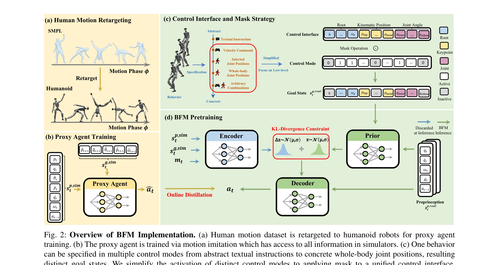
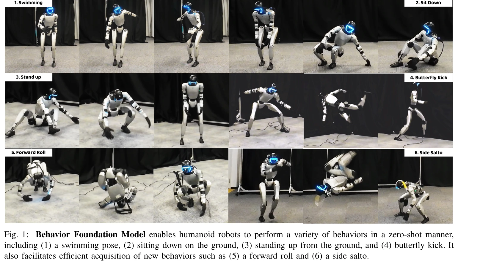

# Behavior Foundation Model for Humanoid Robots

> **저자**: Weishuai Zeng, Shunlin Lu, Kangning Yin, Xiaojie Niu, Minyue Dai, Jingbo Wang, Jiangmiao Pang | **날짜**: 2025-09-17 | **DOI**: [10.48550/arXiv.2509.13780](https://doi.org/10.48550/arXiv.2509.13780)

---

## Essence

*Fig. 2: Overview of BFM Implementation. (a) Human motion dataset is retargeted to humanoid robots for proxy agent*

본 논문은 휴머노이드 로봇의 다양한 제어 태스크에 일반화 가능한 행동 기반 파운데이션 모델(BFM)을 제안하며, masked online distillation과 CVAE를 결합하여 대규모 행동 데이터셋으로 사전학습한다.

## Motivation

- **Known**: 휴머노이드 로봇의 전신 제어(WBC)는 로코모션, 원격조종, 모션 트래킹 등에서 진전을 이루었지만, 기존 WBC 프레임워크는 태스크별로 특화되어 있고 보상 엔지니어링이 필요하며 태스크 간 일반화가 제한적이다.
- **Gap**: 기존 WBC 시스템은 제어 모드(속도 명령, VR 신호, 모션 레퍼런스)에 따라 개별적으로 설계되어 크로스태스크 일반화가 어렵고, 임의의 제어 모드에 대응하거나 새로운 행동을 빠르게 습득하는 데 한계가 있다.
- **Why**: 다양한 휴머노이드 로봇 애플리케이션을 위해 단일의 통합된 제어 프레임워크가 필요하며, 파운데이션 모델 방식으로 대규모 행동 데이터로부터 재사용 가능한 행동 지식을 학습하면 새로운 태스크에 빠르게 적응할 수 있다.
- **Approach**: 모든 제어 모드를 통일된 행동 생성 문제로 재정의하고, masked online distillation 프레임워크와 CVAE를 통합한 BFM을 대규모 행동 데이터셋으로 사전학습한 후, residual learning을 통해 새로운 행동을 효율적으로 습득한다.

## Achievement

*Fig. 1: Behavior Foundation Model enables humanoid robots to perform a variety of behaviors in a zero-shot manner,*

- **통합 행동 학습 패러다임**: 태스크별 특화 학습에서 벗어나 다양한 제어 모드(텍스트, 속도 명령, 관절 위치 등)를 통일된 행동 생성 문제로 재정의하는 개념적 전환을 달성
- **다중 제어 모드 지원**: 단일의 sparsity mask를 통해 임의의 제어 모드 조합을 지원하며 HOVER의 고정 모드 우선순위 제약을 극복
- **구조화된 잠재공간**: CVAE 기반 설계로 행동 합성과 모듈레이션이 가능한 잠재공간을 제공하며, 실제 휴머노이드에서 이를 검증
- **효율적 신행동 습득**: residual learning을 통해 사전학습된 BFM 지식을 활용하여 새로운 행동(forward roll, side salto 등)을 재학습 없이 빠르게 습득
- **시뮬레이션-현실 적용**: 시뮬레이션과 실제 휴머노이드 플랫폼 양쪽에서 광범위한 WBC 태스크(수영, 앉기, 서기, 나비 킥 등)에 대한 강건한 일반화 능력 입증

## How

*Fig. 2: Overview of BFM Implementation. (a) Human motion dataset is retargeted to humanoid robots for proxy agent*

- 인간 모션 데이터셋을 SMPL을 통해 휴머노이드 로봇에 재타게팅하여 시뮬레이션에서 proxy agent를 motion imitation으로 학습
- Proxy agent로부터 다양한 제어 모드를 포함한 행동 데이터를 수집하고, masked online distillation과 DAgger 프레임워크를 결합하여 BFM을 사전학습
- CVAE 구조를 통해 행동 분포를 모델링하며, KL-divergence 제약으로 구조화된 잠재공간 학습을 유도
- 제어 인터페이스를 root, kinematic position, joint angle의 합집합으로 단순화하고 목표 상태에 따라 마스크를 적용하여 다양한 제어 모드 구현
- 사전학습된 BFM을 기반으로 residual learning을 적용하여 새로운 행동을 효율적으로 습득하고, 행동 합성을 위해 잠재공간에서 선형 보간 활용

## Originality

- 기존 태스크별 특화 제어에서 통합 행동 학습으로의 패러다임 전환을 체계적으로 제시한 첫 시도
- HOVER의 이단계 마스킹 전략을 개선하여 단순한 sparsity mask로 임의의 제어 모드 조합을 지원
- MaskedMimic의 가상 아바타 한계를 넘어 실제 휴머노이드에 적용 가능한 구체적 구현 제시
- CVAE 선택의 이론적·실증적 근거를 명확히 제시하고 잠재공간 특성(합성, 모듈레이션)을 분석
- Masked online distillation과 CVAE의 새로운 결합으로 다양한 하위 태스크 학습 가능

## Limitation & Further Study

- Proxy agent의 성능에 의존하므로 시뮬레이션-현실 격차(sim-to-real gap) 영향을 받을 가능성
- 사전학습 데이터셋의 규모와 다양성이 최종 성능을 결정하는데, 논문에서 데이터셋 크기 분석 부족
- 실제 휴머노이드에서 테스트된 행동 개수가 제한적이며, 더 복잡한 조작(manipulation) 태스크에의 확장 가능성 미지수
- 마스크 전략의 설계 선택(root, kinematic position, joint angle만 포함)이 고수준 추상적 제어(자연언어)에서 최적인지 명확하지 않음
- 후속 연구로 대규모 다중 로봇 데이터셋 확보, 더 복잡한 조작 태스크 확장, sim-to-real 전이학습 개선 필요

## Evaluation

- Novelty: 4/5
- Technical Soundness: 3/5
- Significance: 4/5
- Clarity: 4/5
- Overall: 4/5

**총평**: 본 논문은 휴머노이드 로봇 제어의 통합 행동 학습 패러다임을 명확히 제시하고 masked online distillation과 CVAE를 통한 실제적 구현으로 다양한 제어 모드 지원과 빠른 신행동 습득을 실현했으며, 시뮬레이션과 실제 플랫폼 양쪽에서 광범위하게 검증하여 범용 휴머노이드 제어의 새로운 방향을 제시한다.

## Related Papers

- 🔄 다른 접근: [[papers/1642_RGMP_Recurrent_Geometric-prior_Multimodal_Policy_for_General/review]] — 행동 기반 파운데이션 모델과 RGMP의 기하학적 추론 정책은 휴머노이드 일반화의 서로 다른 사전학습 전략
- 🔗 후속 연구: [[papers/1863_DemoHLM_From_One_Demonstration_to_Generalizable_Humanoid_Loc/review]] — DemoHLM의 단일 데모 학습이 BFM의 대규모 행동 데이터셋 사전학습을 효율적 활용으로 확장
- 🏛 기반 연구: [[papers/1782_A_Survey_of_Behavior_Foundation_Model_Next-Generation_Whole-/review]] — 행동 파운데이션 모델 조사가 BFM의 휴머노이드 특화 행동 모델 개발을 위한 이론적 기반
- 🔗 후속 연구: [[papers/1813_Being-0_A_Humanoid_Robotic_Agent_with_Vision-Language_Models/review]] — 행동 기초 모델을 VLM과 모듈식 스킬 라이브러리와 통합하여 복잡한 장기 과제 수행이 가능한 시스템으로 확장한다.
- 🏛 기반 연구: [[papers/1412_GR00T_N1_An_Open_Foundation_Model_for_Generalist_Humanoid_Ro/review]] — generalist humanoid robot을 위한 open foundation model의 이론적 기반을 행동 기초 모델로 구체화한다.
- 🔄 다른 접근: [[papers/1412_GR00T_N1_An_Open_Foundation_Model_for_Generalist_Humanoid_Ro/review]] — GR00T N1과 Behavior Foundation Model 모두 휴머노이드를 위한 foundation model이지만 전자는 VLA 구조, 후자는 행동 기반 접근을 취한다
- 🔗 후속 연구: [[papers/1666_Scaling_Large_Motion_Models_with_Million-Level_Human_Motions/review]] — MotionLib의 대규모 모션 데이터가 Behavior Foundation Model의 휴머노이드 행동 학습에서 더 풍부한 motion prior를 제공할 수 있다
- 🔄 다른 접근: [[papers/1642_RGMP_Recurrent_Geometric-prior_Multimodal_Policy_for_General/review]] — RGMP의 기하학적 추론 기반 정책과 BFM의 행동 기반 파운데이션 모델은 휴머노이드 조작의 서로 다른 일반화 전략
- 🏛 기반 연구: [[papers/1761_Zero-Shot_Whole-Body_Humanoid_Control_via_Behavioral_Foundat/review]] — 휴머노이드를 위한 behavior foundation model에서 unlabeled dataset과 전신 제어라는 공통 목표를 가진다.
- 🔗 후속 연구: [[papers/1813_Being-0_A_Humanoid_Robotic_Agent_with_Vision-Language_Models/review]] — 행동 기초 모델에 VLM과 모듈식 스킬 라이브러리를 통합하여 복잡한 장기 과제를 수행할 수 있는 완전한 시스템을 구현한다.
- 🔄 다른 접근: [[papers/1782_A_Survey_of_Behavior_Foundation_Model_Next-Generation_Whole-/review]] — 두 논문 모두 휴머노이드를 위한 행동 기초 모델을 다루지만 하나는 서베이, 다른 하나는 구체적 구현이다.
- 🏛 기반 연구: [[papers/1863_DemoHLM_From_One_Demonstration_to_Generalizable_Humanoid_Loc/review]] — BFM의 대규모 행동 데이터셋 사전학습이 DemoHLM의 단일 데모 일반화를 위한 기본 행동 표현
- 🔄 다른 접근: [[papers/1888_DreamZero_World_Action_Models_are_Zero-shot_Policies/review]] — Vision-Language-Action 모델과 행동 기반 모델은 모두 범용적인 휴머노이드 정책 학습을 목표로 하지만 서로 다른 접근 방식을 사용한다.
- 🔗 후속 연구: [[papers/1904_EgoVLA_Learning_Vision-Language-Action_Models_from_Egocentri/review]] — Behavior Foundation Model이 EgoVLA의 vision-language-action 학습을 humanoid robots에 특화된 foundation model로 확장한다.
- 🏛 기반 연구: [[papers/1944_General_Humanoid_Whole-Body_Control_via_Pretraining_and_Fast/review]] — Behavior Foundation Model의 대규모 사전학습 개념이 FAST의 pretraining과 fast adaptation 프레임워크의 이론적 기반을 제공합니다.
- 🔗 후속 연구: [[papers/1989_Human-Humanoid_Robots_Cross-Embodiment_Behavior-Skill_Transf/review]] — Behavior Foundation Model의 기초 개념을 다양한 휴머노이드 플랫폼 간 스킬 전이로 확장한 발전된 형태다.
- 🏛 기반 연구: [[papers/2161_Trinity_A_Modular_Humanoid_Robot_AI_System/review]] — 행동 기반 모델이 모듈식 휴머노이드 AI 시스템의 핵심 기반이다.
