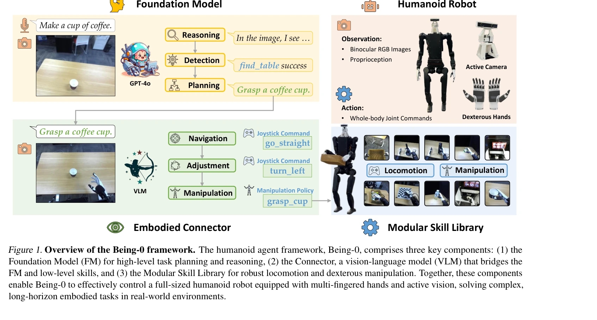
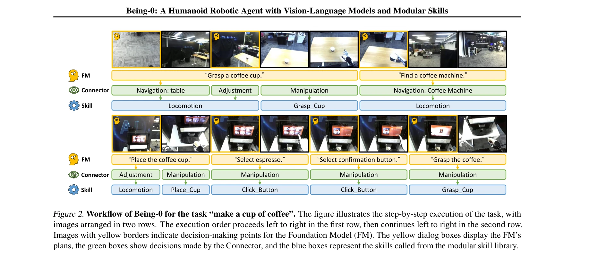

# Being-0: A Humanoid Robotic Agent with Vision-Language Models and Modular Skills

> **저자**: Haoqi Yuan, Yu Bai, Yuhui Fu, Bohan Zhou, Yicheng Feng, Xinrun Xu, Yi Zhan, Börje F. Karlsson, Zongqing Lu | **날짜**: 2025-03-16 | **URL**: [https://arxiv.org/abs/2503.12533](https://arxiv.org/abs/2503.12533)

---

## Essence

*Figure 1. Overview of the Being-0 framework. The humanoid agent framework, Being-0, comprises three key components: (1) *

Being-0는 Foundation Model, VLM 기반 Connector, 모듈식 스킬 라이브러리를 계층적으로 통합하여 인간형 로봇이 복잡한 장기 과제를 수행할 수 있도록 하는 프레임워크이다. Connector 모듈이 언어 기반 계획을 실행 가능한 스킬 명령으로 변환하고 보행과 조작을 동적으로 조율한다.

## Motivation

- **Known**: 최근 Foundation Model과 학습 기반 로봇 스킬을 결합한 에이전트 연구가 로봇 팔, 바퀴 달린 로봇, 사족 로봇에서 진전을 보였다. 인간형 로봇의 경우 개별 스킬(보행, 조작, 전신 제어)에 대한 연구는 존재하지만 완전 자율 에이전트 구축은 미개척 분야이다.
- **Gap**: Foundation Model을 직접 로봇 스킬과 결합하면 장기 과제에서 오류 누적과 모듈 지연 편차로 인해 견고성과 효율성이 저하된다. 특히 인간형 로봇의 이족 보행 불안정성은 빈번한 보행 명령 조정을 요구하는데, 기존 FM은 추론 효율과 embodied 장면 이해에 제한이 있다.
- **Why**: 인간형 로봇이 현실 세계에서 인간 수준의 성능으로 자율 과제를 수행하는 것은 embodied AI의 궁극적 목표이며, 이를 위해서는 고수준 인지와 저수준 제어를 효과적으로 연결하는 아키텍처가 필수적이다.
- **Approach**: VLM 기반 Connector를 도입하여 FM의 계획과 모듈식 스킬 라이브러리 사이의 격차를 해소하고, 실시간 보행·조작 명령 생성과 동적 조율을 수행한다. 실내 네비게이션 데이터로 Connector를 학습시켜 embodied 지식을 경량 VLM에 증류한다.

## Achievement

*Figure 2. Workflow of Being-0 for the task “make a cup of coffee”. The figure illustrates the step-by-step execution of *

- **계층적 프레임워크**: FM은 클라우드에, Connector와 스킬 라이브러리는 온보드 계산 장치에 배포하여 효율적 실행 가능
- **높은 완수율**: 네비게이션과 조작이 포함된 복잡한 장기 과제에서 평균 84.4% 완수율 달성
- **효율성 향상**: FM 기반 에이전트 대비 4.2배 향상된 네비게이션 효율
- **다중 지능형 손과 능동 카메라 지원**: 41-DoF 인간형 로봇의 다지 손과 2-DoF 목의 능동 비전 활용
- **Connector의 기여 입증**: 보행 명령 조정 및 조작과의 seamless 연결로 과제 성공률 향상

## How

*Figure 2. Workflow of Being-0 for the task “make a cup of coffee”. The figure illustrates the step-by-step execution of *

- **모듈식 스킬 라이브러리**: 보행 스킬은 조이스틱 명령 기반, 조작 스킬은 언어 설명과 함께 teleoperation과 imitation learning으로 학습
- **VLM 기반 Connector**: 1인칭 실내 네비게이션 이미지와 언어 지시, 객체 레이블, bounding box 주석으로 학습
- **실시간 명령 생성**: Connector가 FM의 언어 계획과 시각 관측을 받아 보행·조작 스킬 명령을 고주파수로 생성
- **보행 조정 메커니즘**: Connector가 조작 과제 초기화 상태 개선을 위해 보행 명령으로 로봇 자세 조정
- **능동 카메라 활용**: 2-DoF 목으로 카메라 방향 조절하여 네비게이션과 조작 중 장면 이해 향상

## Originality

- **인간형 로봇용 hierarchical agent framework**: 기존 연구는 로봇 팔, 바퀴 로봇, 사족 로봇 중심이었으나, 인간형 로봇의 이족 보행 불안정성과 조작 복잡성을 고려한 설계는 새로움
- **Connector 모듈의 novel 역할**: FM과 스킬 라이브러리 사이의 중간층으로서 경량 VLM을 사용하여 실시간 반응성과 embodied 이해를 동시에 확보
- **embodied 데이터를 통한 증류**: 실내 네비게이션 데이터로 VLM을 학습시켜 특정 embodied 작업에 최적화된 Connector 구현
- **보행-조작 동적 조율**: 조작 전 보행 명령으로 자세 조정하는 seamless 연결 방식은 기존 에이전트에서 미흡한 부분

## Limitation & Further Study

- **FM의 클라우드 의존**: Foundation Model이 클라우드에 배포되어 네트워크 지연 및 가용성에 의존
- **스킬 라이브러리의 확장성**: 현재 보행과 조작 스킬에 제한되어 있으며, 새로운 과제 유형에 대한 일반화 정도 미명시
- **실내 환경 중심 평가**: 실내 대규모 환경에서만 평가되었으며, 실외 환경이나 다양한 지형에 대한 성능 불명확
- **Connector 학습 데이터**: 실내 네비게이션 데이터에 의존하므로, 다양한 환경이나 조작 작업의 데이터 부재 시 성능 저하 가능
- **후속 연구 방향**: (1) 온디바이스 경량 FM 개발로 완전 자율성 확보, (2) 다양한 환경과 과제로 스킬 라이브러리 확장, (3) 동적 장애물 회피 등 복잡한 네비게이션 시나리오 강화

## Evaluation

- Novelty: 4/5
- Technical Soundness: 3/5
- Significance: 4/5
- Clarity: 4/5
- Overall: 4/5

**총평**: Being-0는 인간형 로봇을 위한 실용적이고 효율적인 hierarchical agent 프레임워크로, Connector 모듈을 통한 창의적인 중간층 설계와 실제 하드웨어 구현으로 embodied AI 분야에 의미 있는 기여를 한다. 높은 완수율과 4.2배 효율성 향상은 제안 방식의 효과를 입증하지만, FM의 클라우드 의존성과 실내 중심 평가는 실용성 확대를 위한 개선 과제이다.

## Related Papers

- 🔗 후속 연구: [[papers/1252_ActiveUMI_Robotic_Manipulation_with_Active_Perception_from_R/review]] — VoxPoser의 LLM+VLM 조합을 Being-0의 계층적 VLM-Connector 구조로 발전시킨 포괄적 시스템
- 🔗 후속 연구: [[papers/1647_RoboPlayground_구조화된_물리_도메인을_통한_로봇_평가_민주화/review]] — RoboPlayground의 언어 기반 작업 정의를 Being-0의 Foundation Model 기반 장기 과제 수행으로 확장
- 🏛 기반 연구: [[papers/1844_Cognition_to_Control_-_Multi-Agent_Learning_for_Human-Humano/review]] — 다중 에이전트 학습의 계층적 프레임워크가 Being-0의 모듈식 스킬 조율을 위한 기본 협업 구조
- 🔗 후속 연구: [[papers/1812_Behavior_Foundation_Model_for_Humanoid_Robots/review]] — 행동 기초 모델에 VLM과 모듈식 스킬 라이브러리를 통합하여 복잡한 장기 과제를 수행할 수 있는 완전한 시스템을 구현한다.
- 🔄 다른 접근: [[papers/2161_Trinity_A_Modular_Humanoid_Robot_AI_System/review]] — 계층적 휴머노이드 AI 시스템에서 하나는 Being-0, 다른 하나는 Trinity 모듈식 아키텍처를 제시한다.
- 🏛 기반 연구: [[papers/1915_Endowing_GPT-4_with_a_Humanoid_Body_Building_the_Bridge_Betw/review]] — GPT-4에 휴머노이드 몸체를 부여하는 기초 연구가 Being-0의 언어-행동 연결 메커니즘에 활용된다.
- 🔄 다른 접근: [[papers/1821_BFM-Zero_A_Promptable_Behavioral_Foundation_Model_for_Humano/review]] — 휴머노이드의 복잡한 장기 과제 수행을 위해 VLM 기반 모듈식 스킬 vs promptable behavioral foundation model이라는 다른 아키텍처를 비교할 수 있다
- 🔗 후속 연구: [[papers/2039_LangWBC_Language-directed_Humanoid_Whole-Body_Control_via_En/review]] — Being-0의 언어 기반 계획이 LangWBC의 언어 지향 전신 제어로 확장되어 더 세밀한 동작 제어를 달성할 수 있다
- 🏛 기반 연구: [[papers/1670_SENTINEL_A_Fully_End-to-End_Language-Action_Model_for_Humano/review]] — end-to-end 언어-행동 모델이 Being-0의 Connector 모듈에서 언어 명령을 실행 가능한 스킬로 변환하는 이론적 기반을 제공한다
- 🏛 기반 연구: [[papers/1647_RoboPlayground_구조화된_물리_도메인을_통한_로봇_평가_민주화/review]] — Being-0의 모듈식 스킬 라이브러리가 자연어 작업 정의와 재현 가능한 명세 컴파일의 기반 구조
- 🏛 기반 연구: [[papers/1252_ActiveUMI_Robotic_Manipulation_with_Active_Perception_from_R/review]] — Being-0의 VLM 기반 언어-행동 변환 구조가 VoxPoser의 언어 기반 조작 계획 방법론과 직접적으로 연관
- 🔗 후속 연구: [[papers/1812_Behavior_Foundation_Model_for_Humanoid_Robots/review]] — 행동 기초 모델을 VLM과 모듈식 스킬 라이브러리와 통합하여 복잡한 장기 과제 수행이 가능한 시스템으로 확장한다.
- ⚖️ 반론/비판: [[papers/1821_BFM-Zero_A_Promptable_Behavioral_Foundation_Model_for_Humano/review]] — 단일 정책 기반 foundation model vs 모듈식 스킬 라이브러리라는 상반된 아키텍처 철학을 비교하여 각각의 장단점을 분석할 수 있다
- 🔗 후속 연구: [[papers/1844_Cognition_to_Control_-_Multi-Agent_Learning_for_Human-Humano/review]] — Being-0의 모듈식 스킬 조율을 다중 에이전트 협업으로 확장한 인간-휴머노이드 협업 프레임워크
- 🔄 다른 접근: [[papers/1915_Endowing_GPT-4_with_a_Humanoid_Body_Building_the_Bridge_Betw/review]] — GPT-4를 휴머노이드에 적용하는 것과 비전-언어 모델 기반 휴머노이드 에이전트는 유사한 목표를 다른 방식으로 달성한다.
- 🔗 후속 연구: [[papers/2161_Trinity_A_Modular_Humanoid_Robot_AI_System/review]] — 비전-언어 모델 기반 휴머노이드 에이전트가 모듈식 AI 시스템의 구체적 확장이다.
