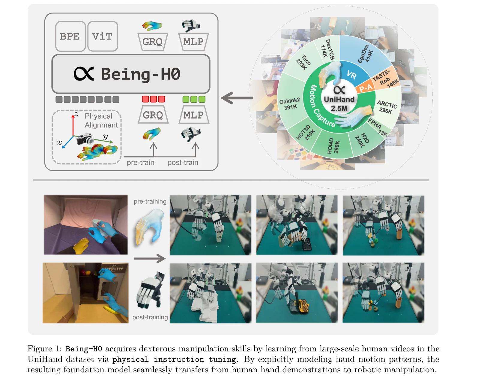
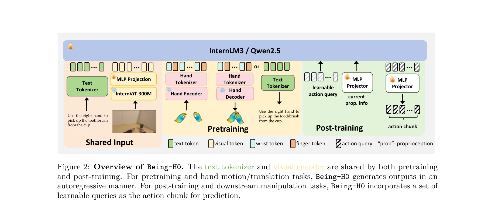
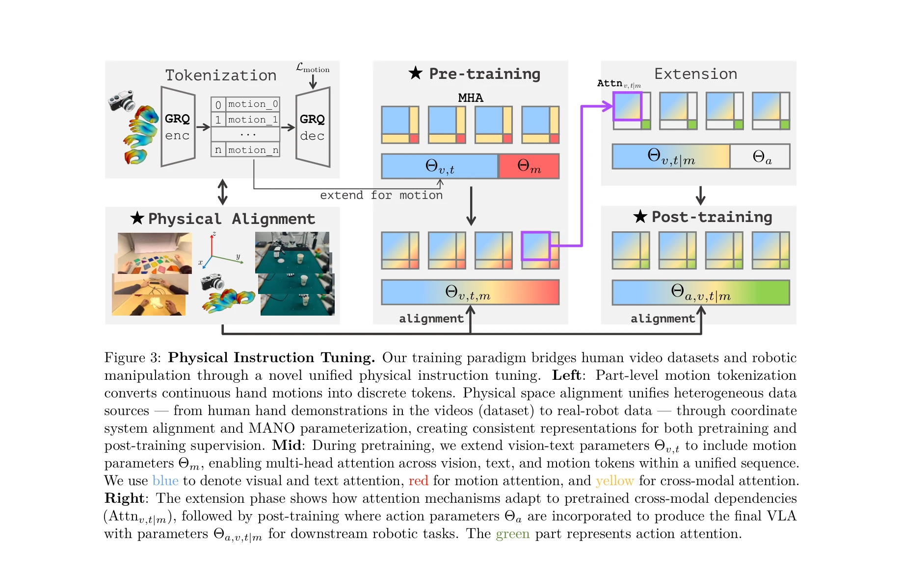

# Being-H0: Vision-Language-Action Pretraining from Large-Scale Human Videos

> **저자**: Hao Luo, Yicheng Feng, Wanpeng Zhang, Sipeng Zheng, Ye Wang, Haoqi Yuan, Jiazheng Liu, Chaoyi Xu, Qin Jin, Zongqing Lu | **날짜**: 2025-07-21 | **URL**: [https://arxiv.org/abs/2507.15597](https://arxiv.org/abs/2507.15597)

---

## Essence

*Figure 1: Being-H0 acquires dexterous manipulation skills by learning from large-scale human videos in the*

Being-H0는 대규모 인간 비디오로부터 학습한 민첩한 Vision-Language-Action 모델로, physical instruction tuning 패러다임을 통해 인간의 손 동작을 명시적으로 모델링하여 로봇 조작 작업으로 전이한다.

## Motivation

- **Known**: Vision-Language-Action 모델들은 로봇 조작을 위해 제안되었으나, 텔레조종 데이터 부족과 sim-to-real 갭으로 인해 복잡한 민첩한 작업에서 성능이 제한적이다.
- **Gap**: 기존 VLA들은 인간 비디오의 풍부한 다양성을 활용하지 못하고 있으며, 2D 시각/텍스트 입력과 3D 액션 공간 간의 이질적 간격을 명시적으로 다루지 않는다.
- **Why**: 인간의 손은 최고의 민첩한 조작 표준을 제공하며, web-scale 인간 비디오 데이터를 활용하면 LLM/LMM의 성공을 반복할 수 있고, 이는 로봇 조작의 혁신을 가능하게 한다.
- **Approach**: Physical instruction tuning 패러다임을 제안하여 human video pretraining, physical space alignment, post-training adaptation을 결합하고, part-level motion tokenization으로 밀리미터 수준의 정확도를 달성한다.

## Achievement

*Figure 2: Overview of Being-H0. The text tokenizer and visual encoder are shared by both pretraining*

- **Physical Instruction Tuning 패러다임**: 인간 비디오와 로봇 조작 간의 이질성을 해결하는 새로운 학습 패러다임을 제시
- **Part-Level Motion Tokenization**: 연속 손 동작의 밀리미터 수준 정확도를 유지하면서 autoregressive 아키텍처와 호환성을 확보
- **UniHand 데이터셋**: 1억 5천만 개 이상의 샘플을 포함한 대규모 데이터셋으로 motion capture, VR, RGB-only 비디오를 통합
- **민첩한 VLA 모델**: 명시적 동작 모델링을 기반으로 한 최초의 대규모 human video 기반 민첩한 VLA

## How

*Figure 3: Physical Instruction Tuning. Our training paradigm bridges human video datasets and robotic*

- Grouped residual quantization (GRQ)를 활용한 부분 수준 동작 토큰화로 손가락 움직임의 정밀도 보존
- Vision, language, motion 간 공유 attention 메커니즘을 갖춘 unified autoregressive 아키텍처 구성
- 3D 공간 추론을 위한 physical space alignment를 통해 이질적 카메라 시스템과 좌표계 통일
- Pretraining과 post-training 단계 구분을 통한 순차적 학습: 인간 손 동작 학습 후 로봇 제어 적응
- Motion capture, VR, RGB-only 비디오 등 다양한 소스를 통합하는 확장 가능한 데이터 큐레이션 파이프라인

## Originality

- LLM의 visual instruction tuning을 물리적 영역으로 확장한 physical instruction tuning 개념 도입
- 인간 손을 명시적 '기초 조작기(foundation manipulator)'로 활용하는 접근법 - 기존 implicit learning 방식과 차별화", '대규모 human video 데이터로부터 민첩한 VLA를 학습하는 최초의 시도
- 이질적 데이터 소스(motion capture, VR, RGB)를 3D space alignment로 통합하는 파이프라인

## Limitation & Further Study

- 논문에서 실제 로봇 조작 실험 결과의 정량적 평가 지표가 상세히 제시되지 않음 - 시뮬레이션과 실제 환경 간 성능 격차 검증 필요
- 로봇 형태(morphology)가 인간과 크게 다른 경우 전이 성능 저하 가능성 미분석
- Millimeter-level 정확도 달성의 계산 비용과 inference latency에 대한 논의 부족
- 후속연구: 다양한 로봇 플랫폼(6-finger hand, 4-finger gripper 등)에서의 성능 평가 필요
- 후속연구: 객체의 물리적 특성(fragility, texture)을 고려한 학습 메커니즘 개발

## Evaluation

- Novelty: 4/5
- Technical Soundness: 4/5
- Significance: 4/5
- Clarity: 4/5
- Overall: 4/5

**총평**: Being-H0는 대규모 인간 비디오로부터 민첩한 로봇 조작을 학습하는 새로운 패러다임을 제시하며, physical instruction tuning과 part-level motion tokenization을 통해 기존 VLA의 데이터 부족 문제를 혁신적으로 해결한다. 명시적 동작 모델링 접근법과 UniHand 데이터셋은 로봇 공학 분야에 중요한 기여를 제공한다.
