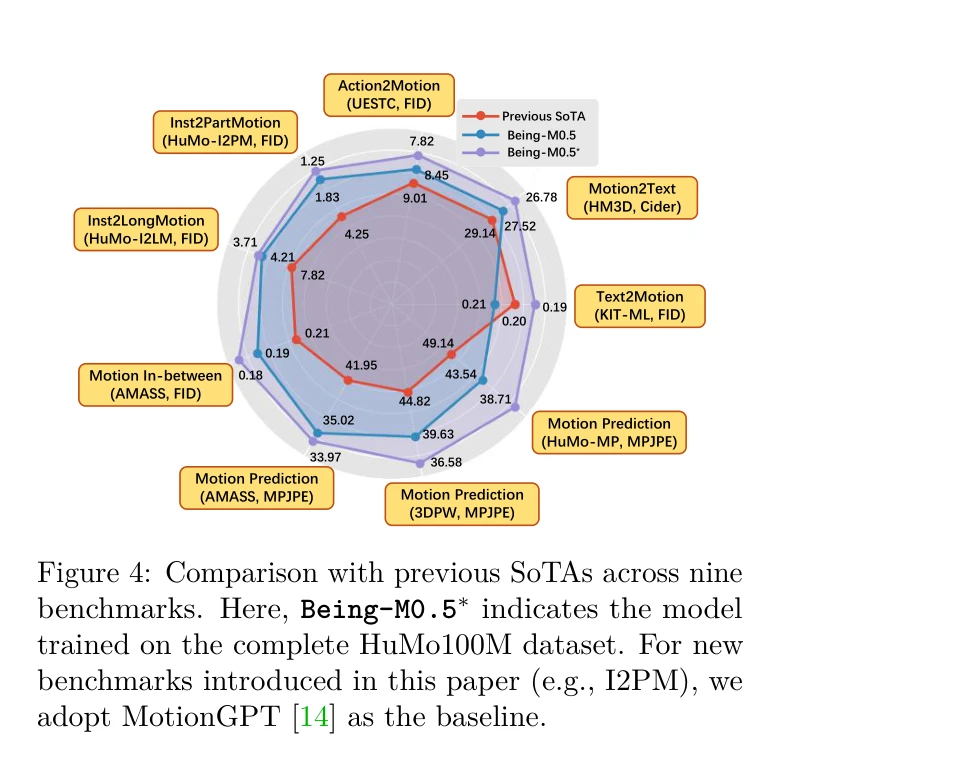
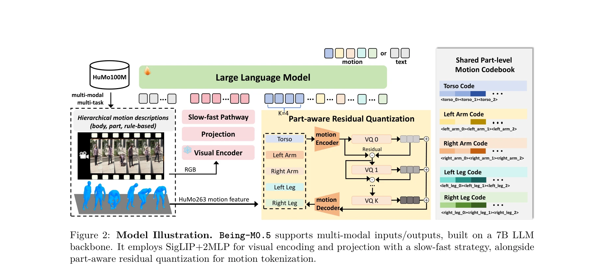

# Being-M0.5: A Real-Time Controllable Vision-Language-Motion Model

> **저자**: Bin Cao, Sipeng Zheng, Ye Wang, Lujie Xia, Qianshan Wei, Qin Jin, Jing Liu, Zongqing Lu | **날짜**: 2025-08-11 | **URL**: [https://arxiv.org/abs/2508.07863](https://arxiv.org/abs/2508.07863)

---

## Essence

*Figure 1: Leveraging our million-scale dataset HuMo100M, we present Being-M0.5, the first real-time, control-*

Being-M0.5는 HuMo100M이라는 백만 규모의 대규모 데이터셋을 기반으로 한 최초의 실시간 제어 가능 vision-language-motion model로, part-aware residual quantization을 통해 신체 각 부위에 대한 세밀한 제어를 가능하게 한다.

## Motivation

- **Known**: 최근 vision-language model들은 다중 모달 학습을 통해 우수한 성능을 보여주고 있으며, motion generation 분야에도 LLM 기반의 접근법들이 도입되었다. 하지만 기존 VLMMs은 실시간 처리와 종합적인 제어 가능성에서 한계를 보인다.
- **Gap**: 기존 vision-language-motion model들은 다양한 사용자 명령에 대한 부적절한 응답, 제한된 pose 초기화, 장기 시퀀스 생성 성능 부족, 미지의 시나리오 처리 불충분, 신체 부위별 세밀한 제어 부재 등 다섯 가지 제어성 측면에서 병목이 존재한다.
- **Why**: motion generation은 비디오 게임, 영화 제작, 휴머노이드 로봇 등 현실 응용에서 변혁적 잠재력을 가지고 있으나, 실시간 처리와 종합적 제어 가능성의 부족이 실제 배포를 저해하고 있다.
- **Approach**: Being-M0.5는 5백만 개의 motion sequence와 1억 개의 다중 작업 지시 인스턴스를 포함하는 HuMo100M 데이터셋을 구축하고, part-level annotation과 long-form motion, text-aligned visual clip을 제공하며, part-aware residual quantization을 통해 신체 부위별 독립적인 제어를 가능하게 한다.

## Achievement

*Figure 4: Comparison with previous SoTAs across nine*

- **HuMo100M 데이터셋**: 5백만 motion sequence와 100백만 다중 작업 지시 인스턴스를 포함한 최대 규모의 다중 모달 motion dataset 구축
- **part-level annotation**: 신체 부위별 세밀한 감독 신호를 제공하여 부위별 제어를 가능하게 함
- **장기 motion 생성**: motion concatenation 방법을 통해 공간-시간적으로 일관된 장기 motion sequence 생성
- **실시간 성능**: frame-by-frame motion code decoding을 통해 real-time 생성 달성
- **다양한 벤치마크에서 SOTA**: diverse motion generation task에서 최첨단 성능 달성

## How

*Figure 2: Model Illustration. Being-M0.5 supports multi-modal inputs/outputs, built on a 7B LLM*

- Visual encoder를 통해 다중 모달 입력(이미지, 텍스트, motion) 처리
- Part-aware residual quantization (PRQ)를 통해 전체 신체 motion feature를 해부학적으로 의미 있는 joint grouping으로 분해하고 discrete part-level code로 양자화
- LLM backbone을 활용하여 자연어 지시사항 해석 및 motion code 생성
- Part-level motion codebook을 공유하여 신체 각 부위(torso, right_arm, left_leg 등)에 대한 독립적 제어 실현
- Multi-task 학습 패러다임으로 diverse control signal 처리 (text instruction, pose initialization, part control 등)

## Originality

- Motion generation에서 part-level annotation과 part-aware residual quantization을 최초로 도입하여 신체 부위별 세밀한 제어 가능
- Motion concatenation 방법을 통해 web-collected motion data로부터 공간-시간적으로 일관된 장기 motion sequence 생성
- Text-aligned visual clip을 활용한 약한 감독(weak supervision) 학습으로 인터넷 수집 motion data의 품질 문제 해결
- Motion decoding strategy를 체계적으로 분석하여 real-time 성능 달성을 위한 설계 insights 제공

## Limitation & Further Study

- 현재 모델은 7B 파라미터 규모로 더 큰 모델로의 확장 가능성 미제시
- Part-level control의 해부학적 joint grouping이 고정되어 있어 사용자 정의 부위 제어 불가능
- HuMo100M의 web-collected data에서 나올 수 있는 도메인 편향성에 대한 분석 부재
- 실시간 성능이 GPU 종류에 따라 다양하게 나타나는데, 다양한 하드웨어 환경에 대한 최적화 여지 존재
- 후속 연구: 적응형 joint grouping을 통한 사용자 정의 부위 제어, 더 큰 모델 규모로의 성능 향상 연구, 도메인 적응 학습 방법 개발

## Evaluation

- Novelty: 4/5
- Technical Soundness: 3/5
- Significance: 4/5
- Clarity: 4/5
- Overall: 4/5

**총평**: Being-M0.5는 HuMo100M과 part-aware residual quantization이라는 두 가지 주요 혁신을 통해 motion generation의 제어 가능성과 실시간 성능 문제를 동시에 해결하며, 대규모 데이터셋과 모델 설계 통찰력으로 실제 응용 배포의 새로운 기준을 제시한다.

## Related Papers

- 🔄 다른 접근: [[papers/1814_Being-H0_Vision-Language-Action_Pretraining_from_Large-Scale/review]] — 동일한 Being 시리즈로 H0는 manipulation, M0.5는 motion generation에 특화되어 vision-language 모델의 다른 응용을 보여준다.
- 🏛 기반 연구: [[papers/1952_GENMO_A_GENeralist_Model_for_Human_MOtion/review]] — GENMO의 generalist motion model 개념과 Being-M0.5의 controllable motion model이 대규모 데이터 기반 모션 생성의 공통 방향을 제시한다.
- 🔗 후속 연구: [[papers/2119_OmniControl_Control_Any_Joint_at_Any_Time_for_Human_Motion_G/review]] — part-aware residual quantization을 확장하여 인간 모션의 모든 관절을 동시에 제어할 수 있는 omnidirectional 제어를 실현한다.
- 🧪 응용 사례: [[papers/1666_Scaling_Large_Motion_Models_with_Million-Level_Human_Motions/review]] — 백만 규모 motion 데이터셋(HuMo100M)이 대규모 인간 모션 학습에 실제 적용되는 구체적 사례이다.
- 🔗 후속 연구: [[papers/1683_SoccerDiffusion_Toward_Learning_End-to-End_Humanoid_Robot_So/review]] — 실시간 제어 가능한 비전-언어-모션 모델의 개념을 축구라는 특정 도메인으로 확장하여 경기 데이터 기반 학습을 구현했다.
- 🏛 기반 연구: [[papers/1814_Being-H0_Vision-Language-Action_Pretraining_from_Large-Scale/review]] — Being-H0의 vision-language-action pretraining이 Being-M0.5의 controllable motion model 개발에 기반 기술을 제공한다.
- 🧪 응용 사례: [[papers/2067_Learning_to_Control_Physically-simulated_3D_Characters_via_G/review]] — 비디오에서의 모션 모방이 실시간 제어 가능한 vision-language-motion 생성에 직접 적용된다.
- 🔗 후속 연구: [[papers/2159_TrajBooster_Boosting_Humanoid_Whole-Body_Manipulation_via_Tr/review]] — Being-M0.5의 real-time vision-language-motion 모델에 TrajBooster의 trajectory 전이 기법을 통합하면 더 풍부한 데이터로 성능 향상 가능
- 🏛 기반 연구: [[papers/2168_UniAct_Unified_Motion_Generation_and_Action_Streaming_for_Hu/review]] — Being-M0.5의 실시간 controllable vision-language-motion 기술이 UniAct의 multimodal 명령 처리와 streaming pipeline 구현을 위한 기반을 제공합니다.
