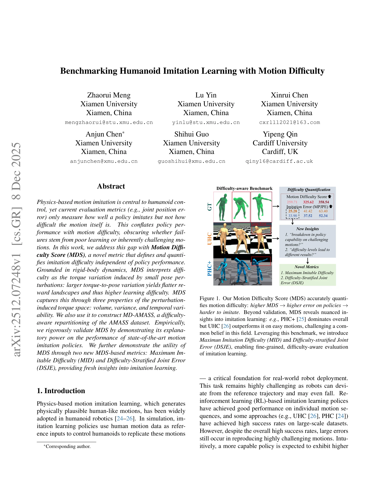

# Benchmarking Humanoid Imitation Learning with Motion Difficulty

> **저자**: Zhaorui Meng, Lu Yin, Xinrui Chen, Anjun Chen, Shihui Guo, Yipeng Qin | **날짜**: 2025-12-08 | **URL**: [https://arxiv.org/abs/2512.07248](https://arxiv.org/abs/2512.07248)

---

## Essence

*Figure 1. Our Motion Difficulty Score (MDS) accurately quanti-*

본 논문은 인간형 로봇의 동작 모방 학습에서 정책 성능과 동작 난이도를 분리하여 평가하기 위해 Motion Difficulty Score (MDS)를 제안하며, 이를 통해 실패가 학습 부족인지 본질적으로 어려운 동작인지를 구분할 수 있게 한다.

## Motivation

- **Known**: Physics-based motion imitation은 인간형 로봇 제어의 핵심이며, UHC와 PHC 같은 최신 정책들이 AMASS 데이터셋에서 높은 성공률을 달성했다. 그러나 기존 평가 지표(관절 위치 오차 등)는 정책 성능만 측정하고 동작 자체의 난이도는 반영하지 않는다.
- **Gap**: 동작 모방의 난이도를 명시적으로 정의하고 정량화하는 메트릭이 부재하여, 정책 능력 제한과 본질적으로 어려운 동작을 구분할 수 없다. 이는 기존 motion datasets이 난이도 주석을 제공하지 않기 때문이다.
- **Why**: 동작 난이도를 분리하면 정책 개발 방향을 명확히 하고, 동작 최적화나 물리 가능한 동작 복원 같은 후속 연구에 활용할 수 있으며, 더 정확한 벤치마킹이 가능해진다.
- **Approach**: Rigid-body dynamics에 기초하여 작은 자세 perturbation으로 유도되는 토크 변화를 난이도로 정의하고, 토크 공간의 volume, variance, temporal variability를 특성화하는 세 가지 구성 요소로 MDS를 계산한다. 이를 통해 MD-AMASS라는 난이도 기반 AMASS 데이터셋 재분할을 구성한다.

## Achievement

**Motion Difficulty Score (MDS) 제안**: Rigid-body dynamics에서 파생된 동작 난이도의 첫 번째 명시적 정의를 제시하며, Spectral Diversity, Variance Diversity, Segment Diversity의 세 구성요소로 계산함

**MD-AMASS 데이터셋**: 난이도 기반으로 AMASS를 재분할한 첫 번째 벤치마크 데이터셋을 구축함

**MDS 검증**: 최신 motion imitation 정책들(PHC+, UHC, GT)의 성능 경향이 MDS로 신뢰성 있게 설명됨을 실증적으로 입증함

**파생 메트릭**: Maximum Imitable Difficulty (MID)와 Difficulty-Stratified Joint Error (DSJE)를 통해 기존에 불가능했던 난이도 인식 평가와 새로운 통찰(예: PHC+는 전체에서 우세하지만 UHC는 쉬운 동작에서 더 우수)을 제공함

## How

- Rigid-body dynamics 방정식으로부터 특정 동작에 대응하는 고유한 토크 존재함을 도출
- 제한된 자세 오차 근처(bounded pose error neighborhood) 내에서 유도되는 토크 변화의 특성을 정의
- Spectral Diversity: 토크 공간의 volume을 특성화
- Variance Diversity: 토크 공간의 variance를 측정
- Segment Diversity: 시간에 따른 동작 난이도의 변동성을 캡처
- 이 세 성분을 집계하여 최종 MDS 계산
- MD-AMASS 구성 및 PHC+, UHC 등 정책에 대한 광범위한 실증 검증 수행

## Originality

- 동작 난이도를 처음으로 명시적으로 정의하고 rigid-body dynamics에 기초한 수학적 틀을 제공함
- 토크 변화의 volume, variance, temporal variability를 종합적으로 고려하는 새로운 접근방식
- 기존의 의미론적 분류(예: 'dance' vs 'locomotion')가 아닌 물리 기반 난이도 분류
- 난이도 정보를 활용한 Maximum Imitable Difficulty와 Difficulty-Stratified Joint Error 같은 새로운 평가 메트릭

## Limitation & Further Study

- MDS의 세 구성 요소(Spectral, Variance, Segment Diversity)의 가중치 결정 방법이 명확하지 않을 수 있음
- 실제 로봇 환경에서의 검증이 부재하며, 시뮬레이션 환경(특정 물리 엔진)에만 국한됨
- 동작 데이터의 노이즈나 품질 차이가 MDS에 미치는 영향 분석 부족
- MD-AMASS 구성이 기존 AMASS의 특정 특성에 의존할 수 있어 다른 데이터셋으로의 확장성 검증 필요
- 정책 아키텍처 다양성에 대한 실증이 제한적(주로 PHC+, UHC 중심)

## Evaluation

- Novelty: 4/5
- Technical Soundness: 3/5
- Significance: 4/5
- Clarity: 4/5
- Overall: 4/5

**총평**: 본 논문은 동작 모방 학습에서 오래된 문제(정책 성능 vs 동작 난이도의 혼동)를 처음으로 명확히 정의하고 수학적으로 해결하는 창의적인 접근을 제시하며, MD-AMASS 구성과 광범위한 실증 검증을 통해 실용적 가치를 입증한다. 다만 실제 로봇 환경으로의 확장과 일반화 가능성에 대한 추가 검증이 요구된다.
