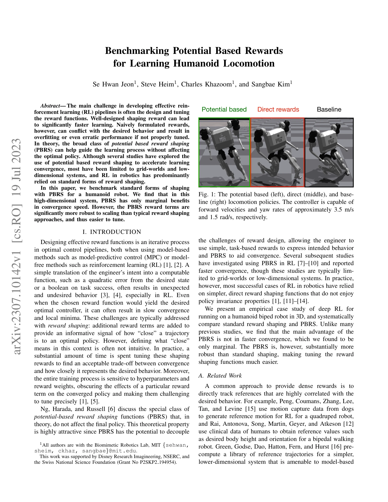

# Benchmarking Potential Based Rewards for Learning Humanoid Locomotion

> **저자**: Se Hwan Jeon, Steve Heim, Charles Khazoom, Sangbae Kim | **날짜**: 2023-07-19 | **URL**: [https://arxiv.org/abs/2307.10142](https://arxiv.org/abs/2307.10142)

---

## Essence

*Fig. 2: A visualization of a tracking reward in both direct-*

본 논문은 humanoid 로봇의 고차원 보행 학습에서 potential-based reward shaping (PBRS)과 direct reward shaping (DRS)을 벤치마크하여, PBRS가 수렴 속도에서는 한계적 이점만 제공하지만 보상 척도에 대해 훨씬 더 견고하다는 것을 실증적으로 입증한다.

## Motivation

- **Known**: 보상 함수 설계는 RL 파이프라인의 주요 도전 과제이며, 이론적으로 PBRS는 최적 정책을 변하지 않게 하면서 학습을 가속화할 수 있다. 그러나 기존 연구는 주로 gridworld나 저차원 시스템에 제한되어 있다.
- **Gap**: 고차원 로보틱 시스템에서 PBRS의 실질적 효과에 대한 체계적인 실증 연구가 부족하며, 특히 humanoid 로봇의 보행 학습에서 DRS와의 비교가 미흡하다.
- **Why**: 보상 함수 튜닝은 로보틱 RL의 실무에서 상당한 시간을 소모하는 문제이므로, PBRS의 실제 성능과 견고성을 이해하는 것이 효율적인 RL 파이프라인 구축에 중요하다.
- **Approach**: 3D humanoid biped 로봇의 보행 태스크에서 deep RL을 사용하여 표준 DRS와 PBRS를 동일한 조건 하에서 체계적으로 비교하고, 수렴 속도와 보상 척도 견고성을 분석한다.

## Achievement

*Fig. 3: Values for the total baseline rewards during training*

- **한계적 수렴 속도 개선**: PBRS는 고차원 humanoid 보행 학습에서 DRS 대비 수렴 속도 향상이 미미함을 실증적으로 입증
- **높은 보상 척도 견고성**: PBRS 보상 항이 DRS에 비해 척도 변화에 훨씬 더 견고하여 하이퍼파라미터 튜닝이 용이함
- **실무적 인사이트**: 고차원 시스템에서 PBRS의 주요 가치는 수렴 속도 개선이 아닌 튜닝 용이성에 있음을 규명

## How

*Fig. 1: The potential based (left), direct (middle), and base-*

- Humanoid biped 로봇 시뮬레이션 환경에서 동일한 기본 보상과 관측을 사용하여 PBRS와 DRS를 독립적으로 학습
- Potential 함수 Φ(s)로 DRS 항 R(s)을 사용하여 PBRS 항 P(s_k, s_{k+1}) = γΦ(s_{k+1}) - Φ(s_k)를 구성
- 학습 곡선, 수렴된 정책의 성능, 보상 항의 척도 민감도를 정량적으로 비교 분석
- 부동점 접촉 상태, 신체 높이, 속도 추적 등 다양한 관측 정보를 구성하여 환경 피드백 제공

## Originality

- 고차원 실제 humanoid 로봇 시스템에서의 PBRS 벤치마크는 기존 gridworld/저차원 연구와 달리 현실적 로보틱 컨텍스트 제공
- PBRS의 주요 이점이 수렴 속도가 아닌 보상 척도 견고성임을 처음 실증한 결과는 기존 이론적 예상과 상이
- DRS와 PBRS의 직접적 공정한 비교 설정(동일 기본 보상 사용)으로 각 방법의 순수한 효과 분리

## Limitation & Further Study

- 단일 humanoid 보행 태스크에 대한 케이스 스터디로서, 다른 로보틱 태스크나 환경에의 일반화 가능성 불명확
- PBRS 성능 저하 이유에 대한 깊이 있는 분석 부족 — 고차원 함수 근사의 한계인지, 알고리즘 특성인지 불명확
- value function을 potential으로 사용하는 경우 등 다양한 potential 함수 선택에 대한 탐색 미흡
- **후속 연구**: 다중 태스크 환경에서의 PBRS 효과, 더 정교한 potential 함수 설계, 함수 근사 오류의 영향 분석 필요

## Evaluation

- Novelty: 3/5
- Technical Soundness: 3/5
- Significance: 4/5
- Clarity: 4/5
- Overall: 4/5

**총평**: 본 논문은 고차원 로보틱 시스템에서 PBRS의 실제 효과를 실증적으로 검증한 중요한 케이스 스터디로, 보상 함수 설계의 실무적 지침(특히 견고성 측면)을 제공한다. 다만 단일 태스크 벤치마크와 이론-실전 간 격차의 원인 분석이 보강된다면 더욱 강력한 기여가 될 것이다.

## Related Papers

- 🔄 다른 접근: [[papers/1816_Benchmarking_Humanoid_Imitation_Learning_with_Motion_Difficu/review]] — 두 논문 모두 humanoid 학습의 벤치마킹을 다루지만 하나는 reward shaping, 다른 하나는 motion difficulty에 집중한다.
- 🏛 기반 연구: [[papers/1828_Booster_Gym_An_End-to-End_Reinforcement_Learning_Framework_f/review]] — PBRS 벤치마킹 결과가 Booster Gym의 reward 함수 설계에 중요한 가이드라인을 제공한다.
- 🔗 후속 연구: [[papers/2108_Multi-task_Deep_Reinforcement_Learning_with_PopArt/review]] — potential-based reward shaping이 PopArt과 결합된 multi-task RL에서 보상 척도 정규화 문제를 해결하는 데 확장될 수 있다
- 🧪 응용 사례: [[papers/1805_Architecture_Is_All_You_Need_Diversity-Enabled_Sweet_Spots_f/review]] — PBRS의 보상 척도 견고성이 계층화 제어 구조에서 각 레벨의 보상 함수 설계에 실용적으로 적용될 수 있다
- 🏛 기반 연구: [[papers/1624_PRIMAL_Physically_Reactive_and_Interactive_Motor_Model_for_A/review]] — PRIMAL의 두 단계 학습 패러다임이 Benchmarking Potential Based Rewards의 휴머노이드 학습 평가 방법론을 활용할 수 있다
- 🏛 기반 연구: [[papers/1800_AMOR_Adaptive_Character_Control_through_Multi-Objective_Rein/review]] — Potential Based Rewards 벤치마킹이 AMOR의 multi-objective 보상 설계 방법론에 중요한 기준을 제공합니다.
- 🏛 기반 연구: [[papers/1805_Architecture_Is_All_You_Need_Diversity-Enabled_Sweet_Spots_f/review]] — 두 논문 모두 humanoid 보행 학습에서 reward shaping의 중요성을 다루지만 LCA는 아키텍처 관점에서 접근한다.
- 🏛 기반 연구: [[papers/1816_Benchmarking_Humanoid_Imitation_Learning_with_Motion_Difficu/review]] — Motion Difficulty Score가 potential-based reward의 효과를 평가하는 객관적 지표로 활용될 수 있어 벤치마킹 방법론을 제공한다.
- 🏛 기반 연구: [[papers/1917_Example-based_Motion_Synthesis_via_Generative_Motion_Matchin/review]] — GenMM의 Bidirectional similarity 기반 생성 비용 함수가 potential based rewards 설계에 이론적 기반을 제공한다.
- 🏛 기반 연구: [[papers/1928_Feature-Based_vs_GAN-Based_Learning_from_Demonstrations_When/review]] — Feature-based vs GAN-based 비교 분석이 potential based rewards를 활용한 휴머노이드 학습의 방법론 선택 기준을 제공한다.
- 🏛 기반 연구: [[papers/2137_PhysDiff_Physics-Guided_Human_Motion_Diffusion_Model/review]] — 물리 기반 보상을 통한 휴머노이드 학습의 벤치마킹이 PhysDiff의 물리 제약 효과를 평가하는 기준을 제공한다.
