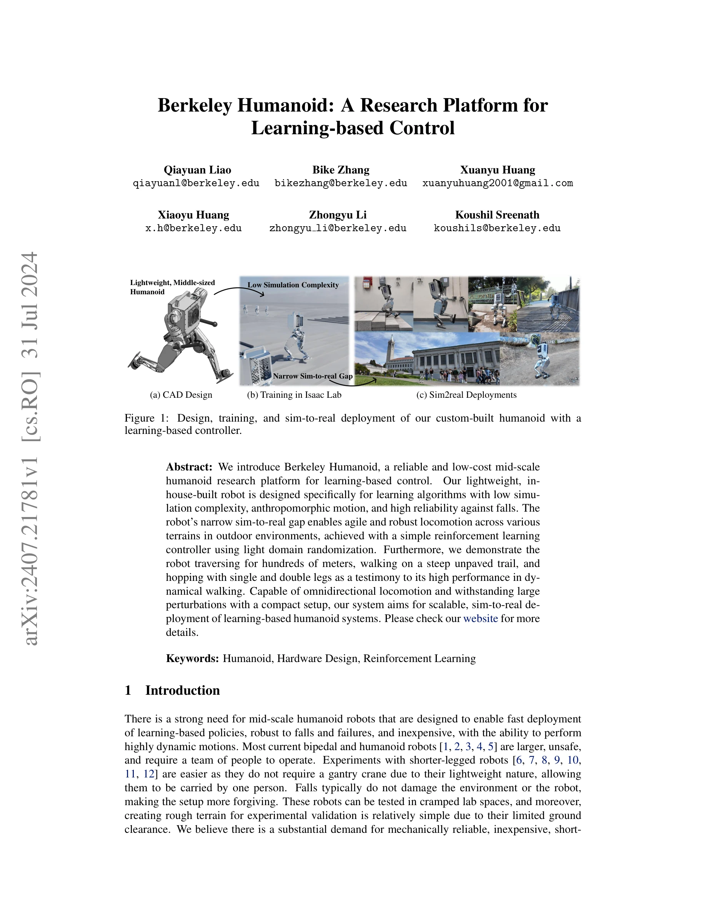
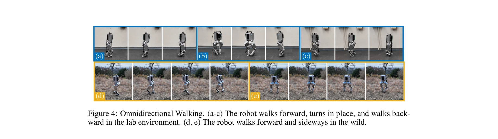
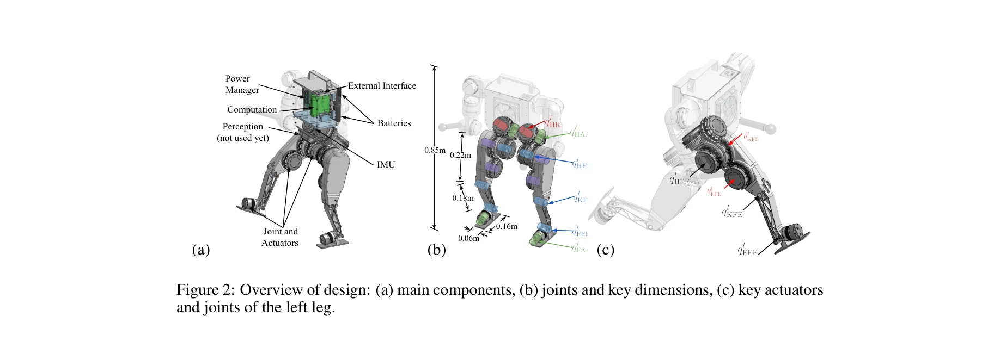

# Berkeley Humanoid: A Research Platform for Learning-based Control

> **저자**: Qiayuan Liao, Bike Zhang, Xuanyu Huang, Xiaoyu Huang, Zhongyu Li, Koushil Sreenath | **날짜**: 2024-07-31 | **URL**: [https://arxiv.org/abs/2407.21781](https://arxiv.org/abs/2407.21781)

---

## Essence

*Figure 1: Design, training, and sim-to-real deployment of our custom-built humanoid with a*

학습 기반 제어를 위해 특별히 설계된 저비용 중형 휴머노이드 로봇 플랫폼인 Berkeley Humanoid를 제시하며, 좁은 sim-to-real 갭과 높은 신뢰성으로 다양한 지형에서 동적 보행을 실현한다.

## Motivation

- **Known**: 기존의 full-scale 휴머노이드는 높은 비용과 안전 문제가 있으며, 소형 휴머노이드는 동적 운동 능력이 제한적이다. 학습 기반 제어는 높은 성능을 보이지만 시뮬레이션과 실제 환경 간의 갭이 크다.
- **Gap**: 중형 휴머노이드를 위한 학습 기반 제어는 낮은 무게중심과 높은 감도로 인한 제어 어려움이 있으며, 복잡한 전달 메커니즘으로 인한 큰 sim-to-real 갭이 존재한다. 또한 저비용이면서 높은 성능을 모두 만족하는 플랫폼이 부족하다.
- **Why**: 중형 휴머노이드는 연구실 공간 내에서 수행 가능하고 낙하로 인한 피해가 적으면서도 동적 과제를 수행할 수 있어 학습 기반 제어 연구의 빠른 반복이 필요하다. 이러한 플랫폼은 학습 기반 휴머노이드 시스템의 확장 가능한 배포를 가능하게 한다.
- **Approach**: 학습 기반 제어에 최적화된 하드웨어 설계와 custom modular actuator, 낮은 시뮬레이션 복잡도, 경량 domain randomization을 활용하여 sim-to-real 갭을 최소화한다. Isaac Lab을 이용한 reinforcement learning 정책 학습으로 간단하면서도 견고한 제어를 실현한다.

## Achievement

*Figure 4: Omnidirectional Walking. (a-c) The robot walks forward, turns in place, and walks back-*

- **저비용 중형 휴머노이드 플랫폼**: 약 10,000 USD의 가격으로 fully electric 구동 및 6 DoF 다리를 갖춘 16kg의 로봇 개발
- **동적 보행 능력**: 수백 미터 주행, 가파른 비포장 오솔길 보행, 단다리 및 양다리 hopping 등 다양한 지형에서의 견고한 동적 운동 실현
- **좁은 sim-to-real 갭**: 간단한 RL 제어기와 경량 domain randomization으로 높은 신뢰성을 달성
- **전방향 운동**: 방향 변화 및 외란 저항 능력을 갖춘 omnidirectional locomotion 지원

## How

*Figure 2: Overview of design: (a) main components, (b) joints and key dimensions, (c) key actuators*

- Custom modular actuator 설계: integrated transmission, hollow shaft, EtherCAT 통신을 통해 높은 토크 밀도와 낮은 복잡도 실현
- 낮은 시뮬레이션 복잡도: 간단한 모터 모델과 actuator 모델링으로 학습 효율 향상
- Hardware-algorithm 공동 설계: learning-based control을 위해 저비용 IMU 센서 활용 가능하도록 설계
- Isaac Lab 기반 정책 학습: lightweight domain randomization을 통한 sim-to-real 전이
- 견고한 mechanical design: 낙하 및 외란에 대한 높은 신뢰성 확보

## Originality

- 학습 기반 제어에 특화된 중형 휴머노이드 플랫폼의 체계적 설계 및 구현
- Custom actuator 개발을 통한 높은 토크 밀도와 낮은 시뮬레이션 복잡도의 양립
- 경량 domain randomization만으로 복잡한 지형에서의 robust locomotion 달성
- Open-source codebase 제공으로 재현 가능성 및 확장성 제시

## Limitation & Further Study

- 팔(arm) 기능이 제한적이어서 주로 보행 과제에만 초점을 맞춤
- 현재 IMU 센서만 활용하고 있으며 추가 센서(발 접촉 감지 등) 활용 가능성 미탐색
- 제어 정책의 단순성은 장점이지만 더 복잡한 운동(조작 등)으로의 확장 가능성이 불명확함
- 실외 환경에서의 광범위한 테스트는 제시되었으나 극한 환경에서의 견고성 추가 검증 필요
- 후속 연구로서 더 복잡한 조작 과제, 다중 로봇 협력, 학습 알고리즘의 고도화 등이 고려될 수 있음

## Evaluation

- Novelty: 4/5
- Technical Soundness: 3/5
- Significance: 4/5
- Clarity: 4/5
- Overall: 4/5

**총평**: Berkeley Humanoid는 학습 기반 휴머노이드 제어 연구를 위한 실용적이고 비용 효율적인 플랫폼으로, 하드웨어와 제어 알고리즘의 통합 설계를 통해 중요한 sim-to-real 문제를 해결한 가치 있는 기여이다. Open-source 공개 계획은 커뮤니티 연구를 촉진할 것으로 예상된다.

## Related Papers

- 🔄 다른 접근: [[papers/1864_Demonstrating_Berkeley_Humanoid_Lite_An_Open-source_Accessib/review]] — 둘 다 학습 기반 제어를 위한 저비용 휴머노이드를 제공하지만 중형과 소형이라는 서로 다른 크기 전략을 택한다
- 🔗 후속 연구: [[papers/1881_Distillation-PPO_A_Novel_Two-Stage_Reinforcement_Learning_Fr/review]] — Distillation-PPO의 2단계 학습 프레임워크가 Berkeley Humanoid의 sim-to-real transfer 성능을 더욱 향상시킬 수 있다
- 🏛 기반 연구: [[papers/2006_Humanoid-Gym_Reinforcement_Learning_for_Humanoid_Robot_with/review]] — Humanoid-Gym 환경이 Berkeley Humanoid의 학습 기반 제어 알고리즘 개발과 테스트에 필요한 표준화된 플랫폼을 제공한다
- 🔄 다른 접근: [[papers/1828_Booster_Gym_An_End-to-End_Reinforcement_Learning_Framework_f/review]] — 두 논문 모두 학습 기반 humanoid 플랫폼을 제시하지만 Berkeley는 하드웨어 설계, Booster는 소프트웨어 프레임워크에 중점을 둔다.
- 🔄 다른 접근: [[papers/1796_AGILOped_Agile_Open-Source_Humanoid_Robot_for_Research/review]] — 학습 기반 제어를 위한 연구 플랫폼으로 Berkeley Humanoid vs AGILOped라는 서로 다른 오픈소스 휴머노이드 설계를 비교할 수 있다
- 🏛 기반 연구: [[papers/1639_Residual_Off-Policy_RL_for_Finetuning_Behavior_Cloning_Polic/review]] — Berkeley Humanoid의 학습 기반 제어 플랫폼이 Residual Off-Policy RL의 이족 로봇 실시간 학습 실험의 하드웨어 기초를 제공함
- 🏛 기반 연구: [[papers/1709_The_Duke_Humanoid_Design_and_Control_For_Energy_Efficient_Bi/review]] — 학습 기반 제어를 위한 연구 플랫폼의 개념을 에너지 효율성에 중점을 둔 10-DoF 휴머노이드로 구체화하여 패시브 다이내믹스를 활용했다.
- 🏛 기반 연구: [[papers/1828_Booster_Gym_An_End-to-End_Reinforcement_Learning_Framework_f/review]] — Berkeley Humanoid 플랫폼에서 검증된 하드웨어 특성이 Booster Gym 프레임워크 설계에 중요한 참고가 되었다.
- 🔄 다른 접근: [[papers/1796_AGILOped_Agile_Open-Source_Humanoid_Robot_for_Research/review]] — Berkeley Humanoid와 함께 연구용 humanoid 플랫폼이지만 AGILOped는 더 접근 가능한 가격대를 제공합니다.
- 🏛 기반 연구: [[papers/1864_Demonstrating_Berkeley_Humanoid_Lite_An_Open-source_Accessib/review]] — Berkeley Humanoid의 학습 기반 제어 플랫폼 경험이 Berkeley Humanoid Lite의 강화학습 기반 locomotion controller 개발에 필요한 기초를 제공한다
- 🔗 후속 연구: [[papers/1881_Distillation-PPO_A_Novel_Two-Stage_Reinforcement_Learning_Fr/review]] — Berkeley Humanoid의 학습 기반 제어 플랫폼이 Distillation-PPO의 2단계 강화학습 프레임워크를 효과적으로 검증하고 적용할 수 있다
