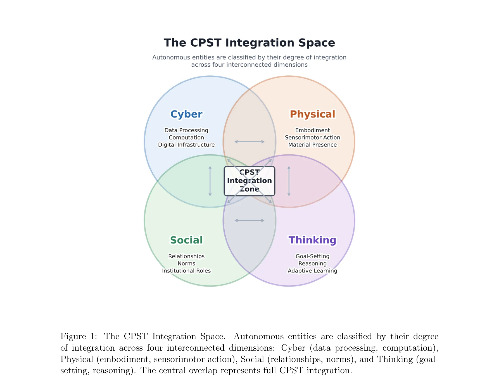
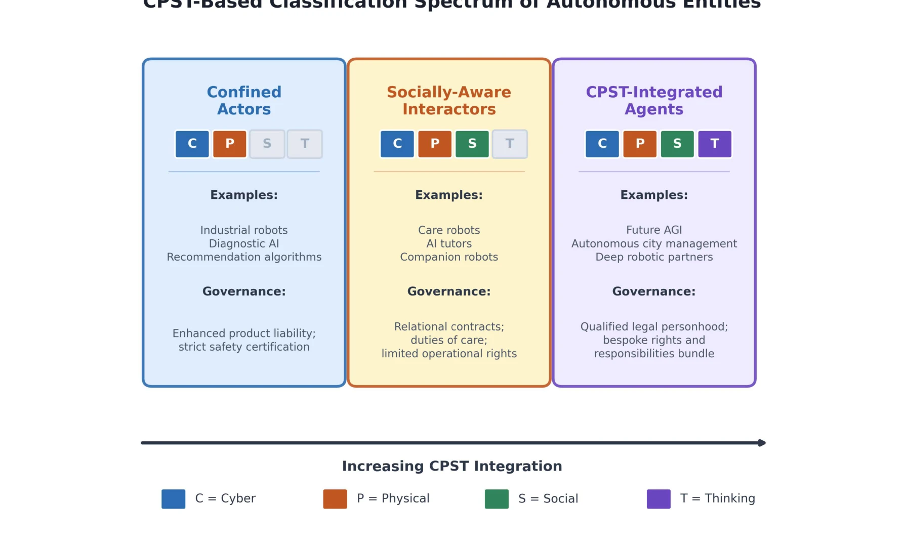

# Beyond Tools and Persons: Who Are They? Classifying Robots and AI Agents for Proportional Governance

> **저자**: Huansheng Ning, Jianguo Ding | **날짜**: 2026-04-07 | **DOI**: [10.48550/arXiv.2604.05568](https://doi.org/10.48550/arXiv.2604.05568)

---

## Essence

*Figure 1: The CPST Integration Space.*

CPST(Cyber-Physical-Social-Thinking) 공간 이론에 기반한 로봇과 AI 에이전트의 분류 프레임워크를 제안하여, 기존의 '도구' vs '인격' 이분법적 법적 범주의 한계를 극복하고 비례적 거버넌스를 위한 온톨로지를 제시한다.

## Motivation

- **Known**: 현재 규제 체계(EU AI Act 등)는 위험도 기반 분류에 초점을 맞추고 있으며, 자율 시스템의 본질적 특성과 그에 따른 거버넌스 요구사항의 관계를 규정하지 못하고 있다. 법적 전통은 '물체(도구)'와 '인격(사람)' 두 범주만 제공해 왔다.
- **Gap**: 자율 로봇과 AI 에이전트의 급속한 상용화가 법적 프레임워크를 앞지르고 있으며, 어떤 실체가 어떤 종류의 엔티티인지(what kind of entity) 결정하기 위한 기초적 온톨로지가 부재하다. 도구도 인격도 아닌 중간 상태의 엔티티들을 다루기 위한 체계화된 분류 기준이 없다.
- **Why**: 휴머노이드 로봇이 의료, 가정 환경에 배치되고 있고 AI 에이전트가 금융 결정을 자율적으로 내리는 상황에서, 이들이 야기하는 손해, 관계 형성, 자율성에 대한 일관된 법적 규제 체계가 긴급히 필요하다.
- **Approach**: CPST 공간 이론의 네 가지 차원(Cyber, Physical, Social, Thinking)에 걸친 통합 정도에 따라 자율 시스템을 분류하는 프레임워크를 제안하고, 표준화된 평가 지표와 복합 평가 프로토콜을 개발하여 규제 기관이 사용 가능한 형태로 구체화한다.

## Achievement

*Figure 2: CPST-Based Classification Spectrum of Autonomous Entities.*

- **CPST 기반 3단계 분류 체계**: Confined Actors(고립된 행위자), Socially-Aware Interactors(사회적 상호작용 인식 에이전트), CPST-Integrated Agents(깊이 있게 통합된 에이전트)를 정의하고 각각에 비례적 거버넌스 모델(제품책임, 관계적 돌봄의무, 제한적 법적 인격)을 제시함
- **다학제적 평가 지표 개발**: 로보틱스, 인간-로봇 상호작용, 사회 컴퓨팅, 인지과학에서 도출한 표준화된 평가 지표와 규제용 복합 평가 프로토콜 제안
- **시간적 역동성 고려**: 엔티티가 진화하면서 분류 카테고리 간 전이되는 과정을 다루는 메커니즘 제시
- **정책 구현 로드맵**: 2027년 EU AI Act 재검토 전 국제 표준화를 위한 세 가지 구체적 정책 단계 제시

## How

*Figure 1: The CPST Integration Space.*

- CPST 공간의 네  차원을 거버넌스 관련 특성으로 정의: Cyber(계산 자율성), Physical(물리적 구체화), Social(관계 참여 깊이), Thinking(인지적 자율성)
- 각 차원의 통합도를 측정할 수 있는 표준화된 메트릭 개발(예: Cyber 차원은 독립적 정보 처리, 지속적 디지털 상태, 네트워크 연결성 등으로 측정)
- 다차원 측정값을 종합하여 세 가지 분류 카테고리로 매핑하는 평가 프로토콜 설계
- 각 카테고리에 부여되는 법적 지위, 규제 의무, 책임 체계를 명확히 구조화
- 시간에 따른 카테고리 전이를 추적하고 업데이트하기 위한 제도적 설계(분류 기관, 재평가 주기 등)

## Originality

- 기존의 위험도 기반(EU AI Act) 또는 안전성 기반(EU Machinery Regulation) 규제에서 벗어나 엔티티의 본질적 특성(ontology)을 중심으로 하는 새로운 분류 패러다임 제시
- CPST 공간 이론을 법적·규제적 프레임으로 확장 적용하여 다차원적 통합도를 거버넌스 기준으로 삼은 점(Social과 Thinking 차원 추가가 특히 혁신적)
- 도구-인격의 이분법을 넘어 '제한적 법적 인격(qualified legal personhood)' 등 중간 지위를 구체적으로 정의함으로써 Novelli, Gunkel 등 선행 이론을 실용적 규제 프레임으로 구현", '표준화된 평가 지표와 제도적 구현 방안까지 제시하여 이론과 정책의 간극을 좁힘

## Limitation & Further Study

- **평가 지표의 정량화 난제**: Social 및 Thinking 차원의 일부 특성(예: '관계 형성 깊이
- 자율적 추론')이 정량적으로 측정하기 어려우며, 문화적·맥락적 차이가 반영되지 않을 가능성", '**조작 및 책임 회피 우려**: 기업이 카테고리 경계에서 자신의 엔티티를 저등급으로 재분류하려 시도할 수 있으며, 이를 감시하는 제도적 메커니즘의 구체성 부족
- **긴급성과 실현 가능성의 괴리**: 2027년 EU AI Act 재검토 전 국제 표준화를 요구하나, 국가 간 법체계와 문화적 가치관 차이로 인한 합의 난제 미해결
- **신흥 기술 변화 추적 부재**: 생성 AI의 급속한 진화로 인한 emergent properties에 대응하는 동적 업데이트 메커니즘이 충분히 상세하지 않음
- **후속 연구 방향**: 각 CPST 차원별 구체적 벤치마크 개발, 실제 로봇/AI 시스템 배치 사례에 대한 실증적 검증, 국제 정책 협의 과정의 설계

## Evaluation

- Novelty: 4/5
- Technical Soundness: 3/5
- Significance: 4/5
- Clarity: 4/5
- Overall: 4/5

**총평**: 본 논문은 AI 및 로봇 거버넌스의 근본적 온톨로지 문제를 CPST 이론으로 해결하려는 야심찬 시도로, 기존 위험도/안전성 중심의 규제에서 엔티티 특성 중심으로의 패러다임 전환을 제시한다. 다만 평가 지표의 정량화, 국제 표준화의 현실성, 신기술 추적 메커니즘에 대한 더 깊은 논의가 필요하다.
