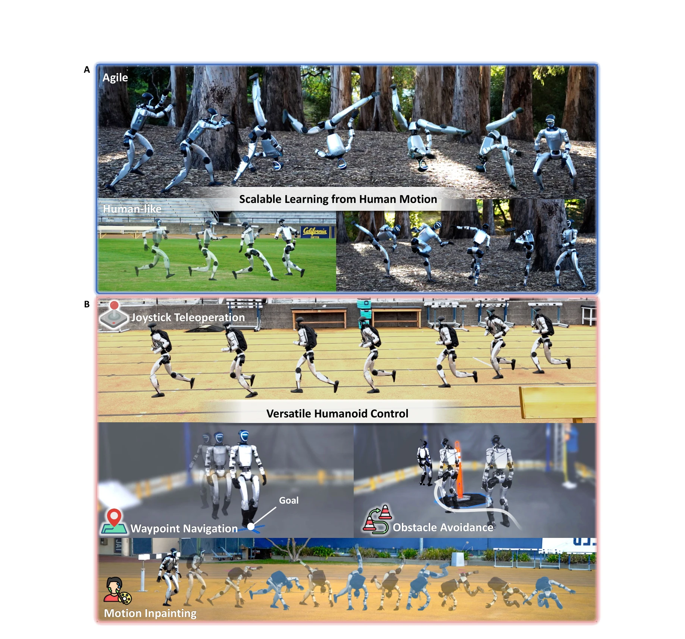
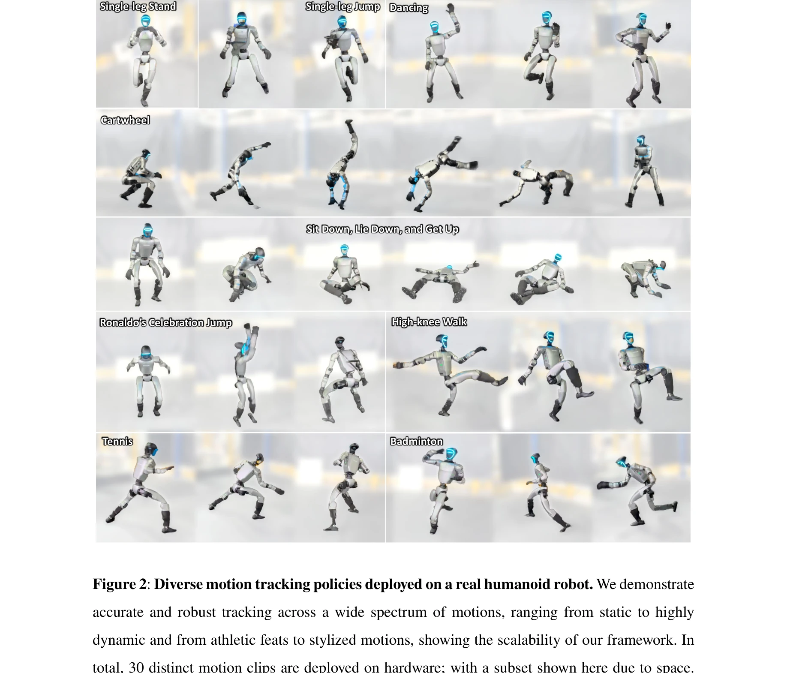

# BeyondMimic: From Motion Tracking to Versatile Humanoid Control via Guided Diffusion

> **저자**: Qiayuan Liao, Takara E. Truong, Xiaoyu Huang, Yuman Gao, Guy Tevet, Koushil Sreenath, C. Karen Liu | **날짜**: 2025-08-11 | **URL**: [https://arxiv.org/abs/2508.08241](https://arxiv.org/abs/2508.08241)

---

## Essence

*Figure 1: Overview of the proposed versatile humanoid control framework. (A) Scalable*

BeyondMimic은 human motion tracking을 통해 humanoid robot이 다양한 민첩한 동작을 학습하고, diffusion model 기반의 classifier guidance를 활용하여 학습 중에 만나지 않은 새로운 작업을 온라인 최적화로 해결할 수 있는 통합 제어 프레임워크이다.

## Motivation

- **Known**: RL 기반의 motion tracking은 DeepMimic이나 Adversarial Motion Priors를 통해 자연스러운 동작을 생성할 수 있지만, 동작별 튜닝이 필요하고 다양한 작업에 대한 확장성이 부족하다. 계층적 제어나 VAE 기반 생성 모델은 특정 작업에는 효과적이지만 일반화 성능이 제한적이다.
- **Gap**: 기존 방법들은 다양한 동작을 학습하면서도 자연스러운 움직임을 유지하고, 동시에 학습되지 않은 새로운 작업에 대해 동작 수정 없이 온라인으로 적응할 수 있는 통합 프레임워크가 부족하다.
- **Why**: humanoid robot이 인간 수준의 민첩성, 자연스러움, 다재다능함을 동시에 갖추려면 단순한 모방을 넘어 다양한 기술을 효율적으로 구성하고 미지의 작업에 적응할 수 있어야 하므로 중요하다. 이는 현실 환경에서 인간과 협력하는 로봇을 실현하기 위한 핵심 요소이다.
- **Approach**: 첫째, 고전역학 원리에 기반한 정확한 액추에이션 모델링과 시스템 구현으로 compact하고 원칙적인 RL 보상 함수를 개발하여 모든 동작에서 공유 가능한 하이퍼파라미터를 달성한다. 둘째, state-action co-diffusion model을 학습하여 classifier guidance를 통해 test 시점의 온라인 최적화로 미지 작업을 해결한다.

## Achievement

*Figure 2: Diverse motion tracking policies deployed on a real humanoid robot. We demonstrate*

- **다양한 민첩한 동작의 통일된 학습**: aerial cartwheels, spin-kicks, flip-kicks, sprinting을 포함한 광범위한 동작을 단일 설정과 공유 하이퍼파라미터로 최첨단 인간 수준의 성능으로 학습
- **온라인 최적화 기반의 작업 적응**: motion inpainting, joystick teleoperation, obstacle avoidance 등 학습 중 만나지 않은 작업을 classifier guidance를 통해 zero-shot으로 해결
- **실제 로봇 배포 검증**: 옥외 환경을 포함한 다양한 조건에서 자연스럽고 민첩한 동작을 실현하며, 작업별 튜닝 없이 단일 제어기로 다양한 작업 처리
- **원칙적인 보상 설계**: 모션별 튜닝을 피하고 3개의 정규화 항과 통합된 작업 보상으로 단순화된 RL 공식화를 달성하여 확장성 향상

## How

- 고전역학 기반의 정확한 로봇 액추에이션 모델링으로 시뮬레이션-현실 격차 최소화
- 보상 함수를 물리적 일관성을 위한 3개 정규화 항과 모든 동작에 일반화 가능한 단일 작업 보상으로 축약
- 필수적인 물리 속성에만 domain randomization 적용하여 제어 목표 저하 방지
- state-action co-diffusion model로 미래 상태와 액션 모두에 대한 비용 공식화 가능하도록 설계
- classifier guidance를 통해 test 시점에서 임의의 미분 가능한 목적 함수로 온라인 최적화 수행
- 예측 제어 방식의 diffusion model로 다양한 미지 작업에 적응 가능한 통합 제어기 구현

## Originality

- motion tracking의 compact 보상 공식화를 통해 처음으로 동작별 튜닝 없이 다양한 민첩 동작을 통일된 설정으로 학습하는 접근
- state-action co-diffusion model과 classifier guidance의 결합으로 단일 제어기가 미지 작업에 온라인 최적화로 적응하는 novel 기법
- 인간 모션 학습과 diffusion 기반 온라인 최적화를 결합한 humanoid 제어의 첫 통합 프레임워크
- 실제 로봇 배포에서 작업별 미세조정 없이 다양한 다운스트림 작업을 처리하는 첫 사례

## Limitation & Further Study

- 학습된 동작의 분포를 벗어나는 작업에 대한 적응 성능이 명시적으로 분석되지 않음
- classifier guidance의 정렬 강도(guidance weight) 선택에 대한 자동화 방법 부재로 작업별 수동 조정 필요 가능성
- diffusion model 기반 온라인 최적화의 계산 비용과 실시간성 보장에 대한 상세한 논의 부족
- 현실 환경의 극단적 변수(심한 경사, 극단적 온도 등)에 대한 로버스트성 평가 제한적
- 후속 연구로 meta-learning을 통한 하이퍼파라미터 자동 적응, 더 다양한 실제 배포 환경 테스트, 장기 연속 작업 수행 능력 강화 필요

## Evaluation

- Novelty: 4/5
- Technical Soundness: 3/5
- Significance: 4/5
- Clarity: 4/5
- Overall: 4/5

**총평**: BeyondMimic은 humanoid 제어에서 human-level agility, naturalness, versatility를 동시에 달성하는 최초의 실용적 통합 프레임워크로, 고전역학 기반 compact 설계와 diffusion 기반 온라인 최적화의 조합을 통해 확장성과 적응성에서 기존 방법을 크게 개선한다. 실제 로봇 배포 성공과 학습되지 않은 다양한 작업의 zero-shot 해결은 humanoid 로봇 분야에서 실질적이고 의미 있는 진전을 나타낸다.
