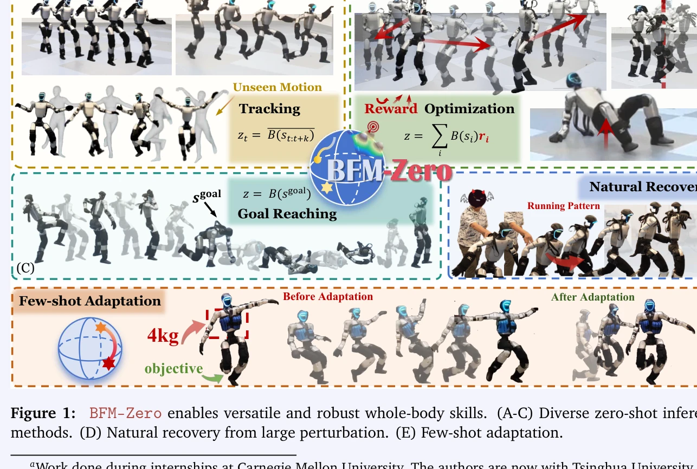

# BFM-Zero: A Promptable Behavioral Foundation Model for Humanoid Control Using Unsupervised Reinforcement Learning

> **저자**: Yitang Li, Zhengyi Luo, Tonghe Zhang, Cunxi Dai, Anssi Kanervisto, Andrea Tirinzoni, Haoyang Weng, Kris Kitani, Mateusz Guzek, Ahmed Touati, Alessandro Lazaric, Matteo Pirotta, Guanya Shi | **날짜**: 2025-11-06 | **DOI**: [10.48550/arXiv.2511.04131](https://doi.org/10.48550/arXiv.2511.04131)

---

## Essence

*Figure 2: An overview of the BFM-Zero framework. After the pre-training stage, BFM-Zero forms a latent*

BFM-Zero는 unsupervised RL과 Forward-Backward 모델을 활용하여 휴머노이드 로봇의 다양한 제어 작업을 단일 정책으로 수행할 수 있는 promptable behavioral foundation model을 제시한다. 공유 잠재 공간에 모션, 목표, 보상을 임베딩하여 zero-shot 추론과 few-shot 적응을 가능하게 한다.

## Motivation

- **Known**: Vision-Language-Action 모델과 같은 foundation model이 로봇 제어에서 성공하고 있으며, sim-to-real 파이프라인과 on-policy RL(PPO)을 기반으로 한 모션 추적이 휴머노이드 로봇 제어에서 진전을 이루고 있다.
- **Gap**: 기존 휴머노이드 제어 방식은 task-specific으로 설계되거나 시뮬레이션에만 제한되어 있으며, off-policy unsupervised RL이 실제 로봇의 sim-to-real 갭과 동적 교란에 대해 견고하게 작동할 수 있는지 불명확하다.
- **Why**: 휴머노이드 로봇이 다양한 실제 환경에서 여러 작업을 수행하려면 재학습 없이 다양한 목표에 적응할 수 있는 통합된 정책이 필요하며, 이는 실용적인 배포를 가능하게 한다.
- **Approach**: BFM-Zero는 motion capture 데이터로 정규화된 online off-policy unsupervised RL을 통해 공유 잠재 표현을 학습하고, domain randomization, history-dependent asymmetric learning, auxiliary reward shaping을 적용하여 sim-to-real 갭을 해소한다.

## Achievement

*Figure 1: BFM-Zero enables versatile and robust whole-body skills. (A-C) Diverse zero-shot inference*

- **Zero-shot 추론 다중 인터페이스**: motion tracking, goal reaching, reward optimization 등 다양한 downstream task를 재학습 없이 수행 가능
- **실제 로봇 검증**: Unitree G1 휴머노이드에서 동적 댄싱, 복구, 다양한 자세 도달 등을 성공적으로 시연
- **Few-shot 적응**: zero-shot 성능이 부족할 때 소수의 환경 상호작용만으로 효율적 개선 가능
- **첫 번째 off-policy unsupervised BFM**: 휴머노이드 실제 배포에서 unsupervised RL 기반 foundation model의 첫 사례

## How

*Figure 2: An overview of the BFM-Zero framework. After the pre-training stage, BFM-Zero forms a latent*

- FB-CPR 알고리즘 기반: latent task feature φ, latent-conditioned policy πz, successor features Fz를 활용하여 공유 잠재 공간 학습
- Pre-training 단계: 온라인 reward-free 상호작용과 unlabeled motion capture 데이터를 결합하여 일반화된 표현 학습
- Domain randomization: 시뮬레이션에서 다양한 환경 조건을 적용하여 로봇의 강건성 강화
- History-dependent asymmetric learning: 시뮬레이션에서만 이용 가능한 특권 정보(privileged information)를 활용한 비대칭 학습
- Auxiliary reward: joint limit 등 안전 제약을 위한 auxiliary reward 추가
- Zero-shot 추론: 학습된 정책에 task-specific 임베딩(목표, 모션 시퀀스, 보상)을 조건으로 주어 다양한 작업 수행
- Few-shot 적응: 잠재 공간에서 sampling-based optimization을 통해 post-training

## Originality

- Off-policy unsupervised RL을 휴머노이드 실제 로봇 제어에 적용한 첫 시도로, 기존 on-policy PPO 기반 접근과 근본적으로 다른 패러다임 제시
- Forward-Backward 모델과 motion capture 정규화를 결합하여 objective-centric이고 설명 가능한 잠재 공간 구성
- Single promptable policy로 multiple downstream task (tracking, goal reaching, reward optimization)를 zero-shot으로 처리하는 통합 인터페이스 구현
- History-dependent asymmetric learning과 critical reward shaping을 통한 실용적 sim-to-real 갭 해결 전략

## Limitation & Further Study

- Motion capture 데이터의 품질과 다양성이 학습된 표현의 품질에 미치는 영향에 대한 분석 부족
- Zero-shot 성능이 task complexity에 따라 변동하는 경우에 대한 자세한 실패 사례 분석 필요
- Unitree G1 특정 하드웨어에 대한 최적화로 다른 휴머노이드 플랫폼으로의 일반화 가능성 미확인
- Few-shot 적응에 필요한 환경 상호작용의 샘플 효율성 개선 방안 탐색 필요
- 고수준 계획과의 통합이나 매니퓰레이션 작업 확장에 대한 후속 연구 필요

## Evaluation

- Novelty: 4/5
- Technical Soundness: 3/5
- Significance: 4/5
- Clarity: 4/5
- Overall: 4/5

**총평**: BFM-Zero는 unsupervised RL을 통해 휴머노이드 로봇의 실제 배포에서 처음으로 promptable foundation model을 성공적으로 구현하였으며, zero-shot 다중 작업 수행과 few-shot 적응의 균형을 이루는 실용적 솔루션을 제시한다. 이는 로봇 제어의 패러다임 전환을 제시하는 중요한 기여이다.
