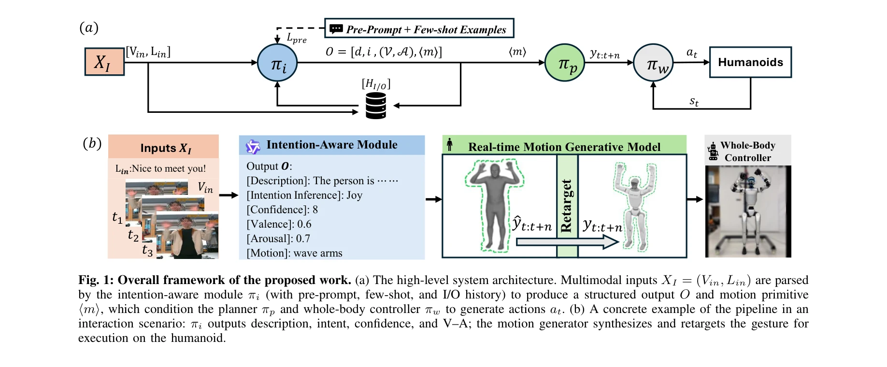
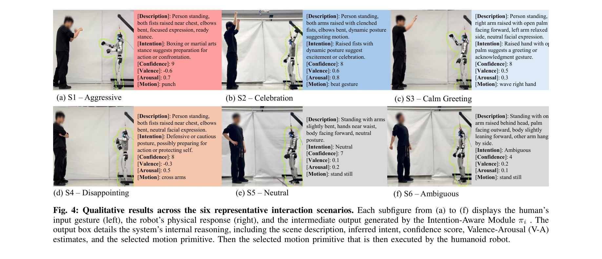

# Bi-Level Motion Imitation for Humanoid Robots

> **저자**:  | **날짜**:  | **URL**: [https://sites.google.com/view/bmi-corl2024](https://sites.google.com/view/bmi-corl2024)

---

## Essence

*Fig. 1: Overall framework of the proposed work. (a) The high-level system architecture. Multimodal inputs XI = (Vin, Lin*

HIAER는 Vision Language Model을 이용해 인간의 사회적 의도와 감정 맥락(Valence-Arousal)을 인식하고, 이를 바탕으로 text-to-motion diffusion model과 RL 기반 whole-body controller를 통해 인간형 로봇이 실시간으로 표현력 있는 제스처를 생성하는 계층적 프레임워크이다.

## Motivation

- **Known**: 최근 VLM은 인간의 고수준 의도 이해에 뛰어나고, diffusion 기반 motion generation은 대규모 데이터셋(AMASS, HumanML3D)을 바탕으로 다양하고 자연스러운 동작을 생성할 수 있다.
- **Gap**: 기존 접근법들은 기능적 목표 분해에 집중하여 암묵적 감정 의도 해석이 부족하고, 사회적 맥락에 근거하지 않은 고립된 동작 생성으로 인해 인간-로봇 상호작용의 완전한 폐루프를 달성하지 못하고 있다.
- **Why**: 효과적인 인간-로봇 상호작용은 의도 추론과 사회적으로 적절한 비언어적 반응 생성의 긴밀한 결합이 필수적이며, 이는 신뢰 구축, 협업 촉진, 사용자 참여도 향상에 핵심적이다.
- **Approach**: ICL과 Chain-of-Thought prompting을 활용한 VLM 기반 intention-aware module이 시각-언어 입력으로부터 의도와 V-A 추정치를 도출하고, 이를 DART text-to-motion diffusion model의 조건으로 전달하여 RL 기반 whole-body controller가 물리 로봇에서 실행한다.

## Achievement

*Fig. 4: Qualitative results across the six representative interaction scenarios. Each subfigure from (a) to (f) displays*

- **계층적 의도-감정-동작 폐루프**: VLM의 세밀한 사회적 의도 및 감정 맥락 추론을 Valence-Arousal 파라미터로 체계화하여 인간형 로봇의 적응형 응답 생성 실현
- **실시간 저지연 성능**: DART diffusion model과 RL 기반 controller의 통합으로 실제 HRI 시나리오에서 지연 없이 문맥에 맞는 제스처 생성 가능
- **사회적 적절성 검증**: 실제 인간형 로봇 실험에서 제안 시스템이 기존 방법 대비 사회적 지능성과 문맥적 적절성에서 높은 평가 획득

## How

*Fig. 1: Overall framework of the proposed work. (a) The high-level system architecture. Multimodal inputs XI = (Vin, Lin*

- **Vision Language Model 기반 의도 추론**: ICL과 CoT prompting을 통해 VLM이 시각-언어 입력 및 대화 이력으로부터 scene description, intent, confidence score, V-A 추정치, motion primitive를 구조화된 출력으로 생성
- **Valence-Arousal 공간 활용**: 2차원 V-A 공간의 감정 사분면(고각성-부정감정, 고각성-긍정감정, 저각성-긍정감정, 저각성-부정감정, 중립)을 정의하여 로봇의 응답 스타일 변조
- **Text-to-motion diffusion 기반 동작 생성**: DART model이 VLM 출력의 motion primitive와 V-A 조건을 바탕으로 인간 동작 궤적 생성 및 로봇 운동학으로 retarget
- **RL 기반 whole-body controller**: πi→πp→πw의 3단계 계층구조로 고수준 의도로부터 저수준 제어 명령 도출, 대규모 motion dataset 기반 학습으로 자연스럽고 다양한 동작 실행 보장

## Originality

- **사회적 의도-감정 통합 추론**: 기존 VLM 활용이 기능적 목표 분해에 국한된 반면, 이 연구는 암묵적 감정 맥락까지 V-A 파라미터로 명시적 모델링하는 첫 시도
- **폐루프 상호작용 설계**: 의도 추론→동작 생성→물리 실행의 완전한 계층적 파이프라인으로 언어모델과 embodied 제어의 유기적 통합
- **ICL 기반 사회적 추론**: Few-shot examples와 prompt history를 활용하여 VLM의 in-context learning 능력을 사회적 의도 인식에 특화시킨 설계

## Limitation & Further Study

- **VLM의 의도-감정 추론 정확성**: 복잡한 다중 의도나 미묘한 감정 변화에 대한 VLM의 추론 성능 평가 부족, 문화적 차이에 따른 감정 해석 편향 미다룬 점
- **V-A 공간의 단순화**: 2차원 V-A 파라미터로 복잡한 인간 감정을 완전히 포착하지 못할 가능성
- **로봇 플랫폼 의존성**: 특정 인간형 로봇(humanoid)에 국한된 평가, 타 로봇 형태로의 일반화 가능성 미검증
- **후속 연구 방향**: 다중 모달 감정 인식(음성, 생리신호 등) 통합, 더 정교한 감정-동작 매핑 모델 개발, 장기 상호작용에서의 적응 학습 메커니즘 탐구

## Evaluation

- Novelty: 4/5
- Technical Soundness: 4/5
- Significance: 4/5
- Clarity: 4/5
- Overall: 4/5

**총평**: 본 연구는 VLM의 사회적 추론과 diffusion 기반 동작 생성을 RL 제어와 통합하여 인간형 로봇의 실시간 의도-인식 표현 동작 생성을 실현한 첫 종합적 프레임워크로, 기술적 정교성과 사회적 상호작용의 완전성 측면에서 매우 높은 기여도를 보인다.
