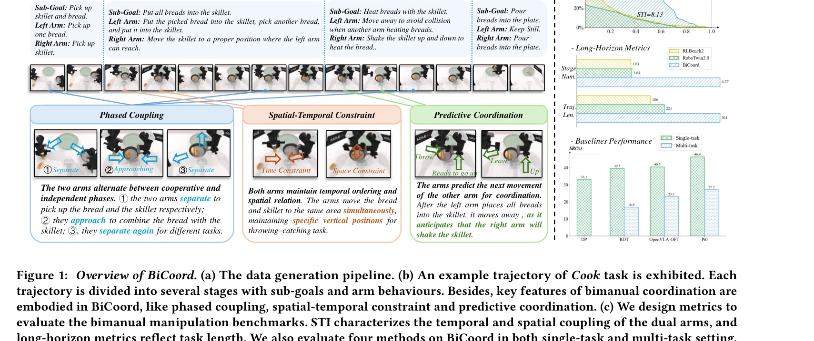
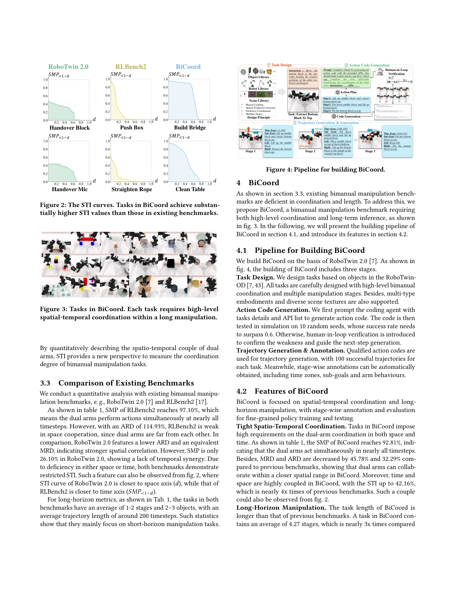

# BiCoord: 장기간 시공간 협응 양팔 조작 벤치마크

> **저자**:  | **날짜**: 2026-04-07 | **URL**: [https://arxiv.org/abs/2604.05831](https://arxiv.org/abs/2604.05831)

---

## Essence

*Figure 1: Overview of BiCoord. (a) The data generation pipeline. (b) An example trajectory of Cook task is exhibited. Ea*

BiCoord는 장시간의 연속적 양팔 의존성과 동적 역할 교환이 필요한 협응 양팔 조작 벤치마크를 제안하며, 시간적·공간적·복합 협응 메트릭을 개발하여 기존 정책들의 한계를 노출한다.

## Motivation

- **Known**: RoboTwin과 RLBench2 같은 시뮬레이션 벤치마크들이 양팔 조작을 위한 데이터 기반 학습을 진전시켜 왔으나, 기존 작업들은 단기 지평선이고 약하게만 협응되어 있다.
- **Gap**: 기존 벤치마크는 짧은 지평선의 작업만 제공하고 약한 협응만을 요구하여, 실제 양팔 행동의 시공간 결합을 포착하지 못한다.
- **Why**: 인간 수준의 로봇 기술성을 달성하기 위해서는 장시간에 걸친 양팔의 지속적인 협응과 역할 교환을 이해하고 실행할 수 있는 모델이 필수적이다.
- **Approach**: 다양한 장시간 협응 양팔 조작 작업으로 구성된 BiCoord 벤치마크를 구축하고, 시간적·공간적·시공간적 관점에서 협응을 정량화하는 메트릭 체계를 설계한다.

## Achievement

*Figure 1: Overview of BiCoord. (a) The data generation pipeline. (b) An example trajectory of Cook task is exhibited. Ea*

- **BiCoord 벤치마크 구축**: 연속적 팔 간 의존성과 동적 역할 교환을 특징으로 하는 장시간 협응 양팔 조작 작업 컬렉션 개발
- **다층 협응 특성**: 위상적 결합(phased coupling), 시공간 제약(spatial-temporal constraints), 예측적 협응(predictive coordination) 세 가지 핵심 특성 체계화
- **정량화 메트릭**: STI(Spatial-Temporal Integral)를 포함한 시간적, 공간적, 시공간적 협응 측정 메트릭 체계 개발
- **방법론 평가**: DP, RDT, Pi0, OpenVLA-OFT 등 대표적 조작 정책들이 장시간 고결합 작업에서 근본적 한계를 갖는다는 실증적 증거 제시

## How

*Figure 4: Pipeline for building BiCoord.*

- 작업 정의 → 계획 및 동작 스크립트 → 검증 → 궤적 생성의 4단계 데이터 생성 파이프라인 구축
- 각 궤적을 부분 목표와 팔 행동으로 구분하여 단계별 주석(stage-wise annotation) 수행
- 동시 이동 시간(SMT), 동시 이동 비율(SMP), 최소 상대 거리(MRD), 평균 상대 거리(ARD), STI 등 5가지 시공간 협응 메트릭 설계
- 궤적 길이(TL), 단계 개수(SN), 조작 객체 개수(ON) 등 장시간 특성 메트릭 도입
- 4가지 기존 조작 정책에 대한 단일 작업 및 다중 작업 설정에서 체계적 평가

## Originality

- 기존 양팔 벤치마크(RLBench2, RoboTwin)와 달리 장시간 지평선과 높은 협응도를 동시에 특징으로 하는 첫 벤치마크
- 인간 양팔 동작의 특성을 반영한 위상적 결합, 시공간 제약, 예측적 협응 개념을 형식화하고 작업 설계에 구체화
- 시공간 적분(STI)을 통한 새로운 협응 정량화 방식 도입으로 기존 메트릭의 한계 극복

## Limitation & Further Study

- 시뮬레이션 기반 벤치마크로서 실제 로봇 환경으로의 이전(sim-to-real transfer) 성능이 검증되지 않음
- 현재 평가된 정책들이 모두 실패하는 상황에서, 이러한 문제를 해결하기 위한 구체적인 알고리즘 개선 제안이 부족함
- 다양한 로봇 플랫폼(embodiment)에 대한 일반화 가능성이 명확하지 않음
- 후속 연구는 시공간 협응을 명시적으로 모델링하는 새로운 정책 설계와 실제 환경에서의 검증에 초점을 맞춰야 함

## Evaluation

- Novelty: 4/5
- Technical Soundness: 3/5
- Significance: 4/5
- Clarity: 4/5
- Overall: 4/5

**총평**: BiCoord는 양팔 로봇 조작 분야에서 중요한 공백을 채우는 잘 설계된 벤치마크로, 장시간 지평선과 긴밀한 협응이라는 현실적 요구를 반영하며 정량화된 메트릭을 통해 향후 연구의 명확한 방향을 제시한다.
