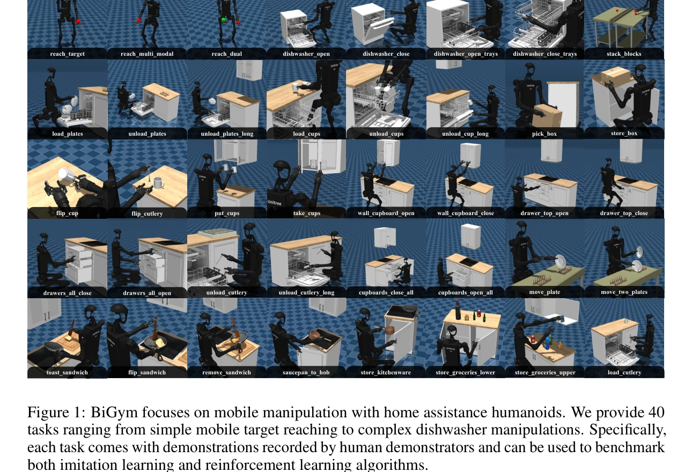

# BiGym: A Demo-Driven Mobile Bi-Manual Manipulation Benchmark

> **저자**: Nikita Chernyadev, Nicholas Backshall, Xiao Ma, Yunfan Lu, Younggyo Seo, Stephen James | **날짜**: 2024-07-10 | **URL**: [https://arxiv.org/abs/2407.07788](https://arxiv.org/abs/2407.07788)

---

## Essence

*Figure 1: BiGym focuses on mobile manipulation with home assistance humanoids. We provide 40*

BiGym은 인간이 수집한 데모를 포함한 40개의 다양한 이족 이족 조작 작업을 제공하는 모바일 휴머노이드 로봇 학습 벤치마크로, Imitation Learning과 Demo-Driven RL 알고리즘을 평가할 수 있게 설계되었다.

## Motivation

- **Known**: 기존 벤치마크(MetaWorld, RLBench)는 단일 팔 조작이나 motion planner가 생성한 비현실적인 데모에 의존하며, 현실의 복잡한 모바일 이족 조작 작업을 충분히 지원하지 못한다.
- **Gap**: RLBench의 motion planner 기반 데모는 실제 인간 시연의 다양성과 자연스러움을 반영하지 못하며, 모바일 이족 조작과 부분 관찰성(partial observability)을 동시에 다루는 벤치마크가 부재하다.
- **Why**: 모바일 이족 조작은 다중 해법 공간, 장기 시간대 작업, 희소 보상 환경을 포함하는 도전적인 문제이며, 현실적인 인간 데모 기반 벤치마크는 알고리즘의 실제 성능을 정확히 평가하는 데 필수적이다.
- **Approach**: Unitree H1 휴머노이드를 기반으로 VR 텔레옵을 통해 50개의 인간 수집 데모를 포함한 40개 작업을 구축하고, 전체 신체 모드와 이족 모드를 분리하여 로코모션과 조작을 독립적으로 평가할 수 있도록 설계했다.

## Achievement

*Figure 1: BiGym focuses on mobile manipulation with home assistance humanoids. We provide 40*

- **40개 다양한 작업**: 목표 도달부터 식기세척기 조작까지 집안일 시뮬레이션 작업 범위 제공
- **인간 수집 데모**: Motion planner 대신 VR 텔레옵으로 수집한 자연스럽고 다중양식(multi-modal) 데모로 실제 로봇 궤적의 다양성 반영
- **부분 관찰성 POMDP**: RGB-D 3카메라 뷰와 고유수용감각 데이터로 부분 관찰 설정을 현실적으로 구성
- **유연한 제어 모드**: 전체 신체 모드(로코모션+조작)와 이족 모드(조작만)로 연구 초점에 따른 분리 가능
- **IL과 RL 모두 지원**: 희소 보상과 데모로 Imitation Learning과 Demo-Driven RL 알고리즘 벤치마킹 가능

## How

*Figure 2: (a) BiGym builds upon Unitree H1 robot with 3 RGB-D cameras at the head, left wrist, and right*

- Unitree H1 휴머노이드 플랫폼에 머리, 왼쪽 손목, 오른쪽 손목에 RGB-D 카메라 3개 장착
- VR 장치를 이용한 인간 텔레옵을 통해 각 작업당 50개의 자연스러운 다중양식 데모 수집
- Whole-Body Mode(관절 각도 + 부유 베이스)와 Bi-Manual Mode(관절 각도, 하체는 고정 제어기) 분리
- 부분 관찰 Markov 결정 과정(POMDP) 공식화로 시간 시계열 관찰과 행동 기록으로 믿음 상태 학습 요구
- 희소 보상 설정으로 실제 가정 환경의 보상 신호 설계 어려움 반영

## Originality

- **인간 데모 기반 모바일 이족 벤치마크**: 기존 단일 팔 또는 로코모션만의 벤치마크와 달리 인간 데모를 포함한 모바일 이족 조작 벤치마크 최초 제공
- **다중양식 데모**: Motion planner 대신 인간 텔레옵으로 수집한 다양한 해결 전략을 담은 현실적 데모
- **분리된 제어 모드**: 로코모션과 조작을 분리할 수 있는 유연한 구조로 연구 초점의 명확한 구분 가능
- **부분 관찰성 문제 설정**: POMDPs로 동적 카메라 뷰와 제한된 정보 하에서의 신경망 기반 믿음 상태 학습 도입
- **IL과 RL 통합 평가**: 기존 RL 중심 벤치마크와 달리 Imitation Learning과 Demo-Driven RL을 동등하게 지원

## Limitation & Further Study

- **시뮬레이션-실제 갭**: Mujoco 기반 시뮬레이션에서의 성능이 실제 H1 로봇과의 sim2real 전이 성공률 미제시
- **제한된 환경 다양성**: 40개 작업이 주로 주방과 식탁 환경에 집중되어 있으며 야외나 다른 공간 환경 미포함
- **데모 수집 효율성**: VR 텔레옵 기반 50개 데모 수집 비용과 확장성 제약에 대한 상세 분석 부재
- **알고리즘 벤치마킹 결과 미흡**: 추상 본문에서 SOTA IL과 RL 알고리즘의 구체적 성능 지표 미제공
- **후속 연구**: 실제 로봇 검증, 더 많은 환경 다양성 추가, 자체 피드백으로 더 많은 데모 합성 가능성 탐색 필요

## Evaluation

- Novelty: 4/5
- Technical Soundness: 3/5
- Significance: 4/5
- Clarity: 4/5
- Overall: 4/5

**총평**: BiGym은 인간이 수집한 현실적 다중양식 데모와 모바일 이족 조작의 복잡성을 체계적으로 다루는 최초의 종합 벤치마크로, Imitation Learning과 Demo-Driven RL 연구에 중요한 기여를 한다. 다만 실제 로봇 검증과 환경 다양성 확대가 향후 영향력 확대를 위해 필요하다.

## Related Papers

- 🔗 후속 연구: [[papers/1644_RoboCasa_Large-Scale_Simulation_of_Everyday_Tasks_for_Genera/review]] — RoboCasa의 대규모 시뮬레이션 환경과 BiGym의 mobile bi-manual benchmark가 함께 포괄적인 manipulation 학습 환경을 구성한다.
- 🏛 기반 연구: [[papers/2089_ManiSkill-HAB_A_Benchmark_for_Low-Level_Manipulation_in_Home/review]] — ManiSkill-HAB의 low-level manipulation과 BiGym의 mobile manipulation이 계층적인 manipulation 벤치마크 생태계를 형성한다.
- 🏛 기반 연구: [[papers/1794_AGILE_A_Comprehensive_Workflow_for_Humanoid_Loco-Manipulatio/review]] — 데모 기반 mobile bi-manual manipulation 벤치마크가 loco-manipulation 학습 워크플로우의 평가 기준을 제공한다.
- 🔄 다른 접근: [[papers/1806_ARMADA_Augmented_Reality_for_Robot_Manipulation_and_Robot-Fr/review]] — 데모 수집에서 하나는 인간이 직접 수집한 실제 데모, 다른 하나는 AR 기반 가상 데모를 활용한다.
- 🔗 후속 연구: [[papers/2169_UniDex_A_Robot_Foundation_Suite_for_Universal_Dexterous_Hand/review]] — bi-manual manipulation 벤치마크를 universal dexterous handling을 위한 robot foundation suite로 확장한다.
- 🔄 다른 접근: [[papers/1863_DemoHLM_From_One_Demonstration_to_Generalizable_Humanoid_Loc/review]] — BiGym은 40개 다양한 작업으로 모바일 이족 조작을 다루지만 DemoHLM은 단일 시연으로부터 일반화된 로코-매니퓰레이션을 학습하는 다른 접근법을 제시한다.
- 🔗 후속 연구: [[papers/1869_DexMimicGen_Automated_Data_Generation_for_Bimanual_Dexterous/review]] — BiGym의 데모 기반 학습 개념을 DexMimicGen이 양손 정교 조작으로 확장하여 자동화된 대규모 궤적 생성을 가능하게 한다.
- 🏛 기반 연구: [[papers/2007_HumanoidBench_Simulated_Humanoid_Benchmark_for_Whole-Body_Lo/review]] — HumanoidBench가 제공하는 전신 로코-매니퓰레이션 벤치마크 프레임워크가 BiGym의 이족 조작 작업 설계에 기초가 된다.
- 🔄 다른 접근: [[papers/1644_RoboCasa_Large-Scale_Simulation_of_Everyday_Tasks_for_Genera/review]] — RoboCasa는 kitchen 중심 시뮬레이션을, BiGym은 이동형 양손 조작에 중점을 두어 범용 로봇 학습을 다르게 접근함
- 🔄 다른 접근: [[papers/1806_ARMADA_Augmented_Reality_for_Robot_Manipulation_and_Robot-Fr/review]] — 로봇 조작 데이터 수집에서 하나는 AR 기반 물리적 로봇 없는 방식, 다른 하나는 실제 로봇 데모 방식을 사용한다.
- 🔗 후속 연구: [[papers/1794_AGILE_A_Comprehensive_Workflow_for_Humanoid_Loco-Manipulatio/review]] — 데모 기반 학습 벤치마크의 표준화된 워크플로우를 실제 loco-manipulation 학습에 적용한 확장이다.
- 🔄 다른 접근: [[papers/1863_DemoHLM_From_One_Demonstration_to_Generalizable_Humanoid_Loc/review]] — DemoHLM의 단일 시연 기반 일반화와 BiGym의 40개 다양한 작업 벤치마크는 휴머노이드 로코-매니퓰레이션 학습에서 데이터 효율성 vs 다양성의 서로 다른 접근법이다.
- 🏛 기반 연구: [[papers/1868_DexHub_and_DART_Towards_Internet_Scale_Robot_Data_Collection/review]] — DART의 클라우드 기반 군중 데이터 수집이 BiGym의 다양한 이족 조작 작업에 필요한 대규모 시연 데이터를 효율적으로 수집하는 플랫폼을 제공한다.
- 🏛 기반 연구: [[papers/2007_HumanoidBench_Simulated_Humanoid_Benchmark_for_Whole-Body_Lo/review]] — BiGym의 demo-driven mobile manipulation benchmark가 HumanoidBench의 humanoid manipulation task 설계 기초를 제공한다.
- 🔗 후속 연구: [[papers/2009_HumanoidGen_Data_Generation_for_Bimanual_Dexterous_Manipulat/review]] — 양손 조작 벤치마크가 휴머노이드 양손 데이터 생성의 평가 확장이다.
- 🔗 후속 연구: [[papers/2089_ManiSkill-HAB_A_Benchmark_for_Low-Level_Manipulation_in_Home/review]] — 시연 기반 모바일 양손 조작 벤치마크의 확장된 구현을 보여준다.
- 🧪 응용 사례: [[papers/2101_Mobi-π_Mobilizing_Your_Robot_Learning_Policy/review]] — BiGym의 mobile bi-manual manipulation 환경에서 Mobi-π의 정책 모빌라이제이션 기법을 실제 적용할 수 있다
- 🔗 후속 연구: [[papers/2103_MobileH2R_Learning_Generalizable_Human_to_Mobile_Robot_Hando/review]] — BiGym의 mobile bi-manual benchmark를 human-robot handover라는 구체적 상호작용으로 발전시킨 연구다
