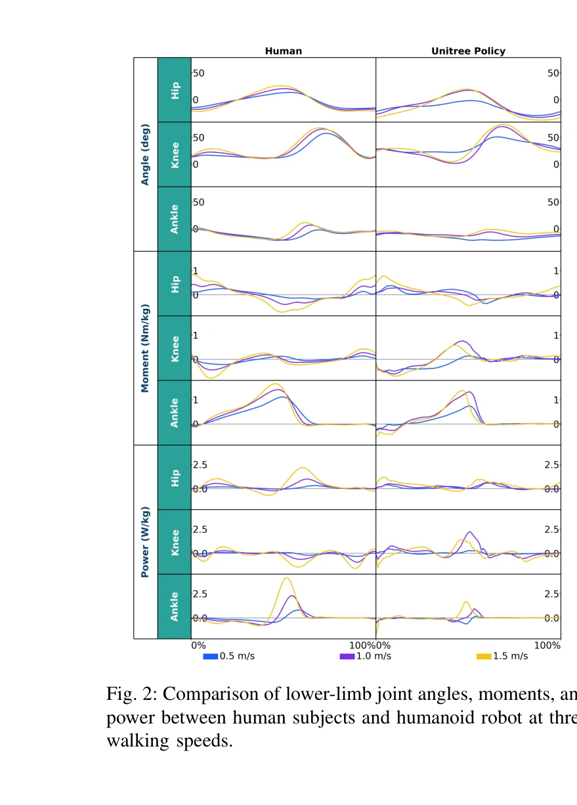
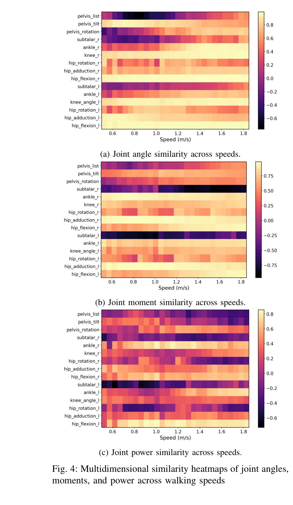

# Biomechanical Comparisons Reveal Divergence of Human and Humanoid Gaits

> **저자**: Luying Feng, Yaochu Jin, Hanze Hu, Wei Chen | **날짜**: 2026-02-25 | **URL**: [https://arxiv.org/abs/2602.21666](https://arxiv.org/abs/2602.21666)

---

## Essence

*Fig. 2: Comparison of lower-limb joint angles, moments, and*

본 논문은 Gait Divergence Analysis Framework (GDAF)를 제안하여 인간과 휴머노이드 로봇의 보행 간 생체역학적 차이를 정량적으로 분석하고, 28개 속도에서 수집한 공개 데이터셋과 분석 도구를 제공한다.

## Motivation

- **Known**: RL/IL 기반 휴머노이드 컨트롤러가 시각적으로 자연스러운 보행을 생성할 수 있으며, 이미테이션 러닝이 로봇 움직임 생성에 유망한 접근법으로 부상했다.
- **Gap**: 기존 인간-로봇 보행 비교는 고정된 또는 불일관한 속도 조건에서만 수행되어 속도 변화에 따른 생체역학적 특성 변화를 체계적으로 평가하지 못했고, 정량적 평가 기준이 부족하다.
- **Why**: 휴머노이드 로봇이 실세계 환경에서 활동할 때 자연스러운 보행은 기능 효율성, 공중 수용도, 그리고 재활 기기 테스트 플랫폼으로서의 신뢰성을 직접적으로 영향미친다.
- **Approach**: GDAF라는 통합 생체역학 평가 프레임워크를 개발하여 운동학 및 동역학 지표를 다차원으로 정량화하고, 속도 연속성(0.05 m/s 간격, 28속도)을 갖춘 대규모 휴머노이드 데이터셋을 수집하여 체계적 비교를 수행한다.

## Achievement

*Fig. 4: Multidimensional similarity heatmaps of joint angles,*

- **GDAF 프레임워크**: 관절 각도 유사성(Pearson correlation), 양측 대칭성(bilateral symmetry index), 에너지 분포, torque-angle loop 등 다차원 지표를 통합한 정량적 생체역학 분석 체계 제시
- **속도 연속 데이터셋**: Unitree G1 휴머노이드에서 0.5~1.85 m/s 범위의 28개 속도에서 수집한 joint angles, angular velocities, estimated torques 공개 데이터셋 제공
- **체계적 생체역학 분석**: 시각적으로 유사해 보이는 로봇 보행에도 gait symmetry, energy distribution, joint coordination에서 유의미한 편차가 존재함을 정량적으로 증명
- **재현가능한 분석 도구**: OpenSim 기반 전처리, MuJoCo 시뮬레이션, 시각화 및 분석 코드를 오픈소스로 공개하여 향후 연구의 재현성 및 확장성 확보

## How

*Fig. 1: Joint mapping between humanoid robot and human.*

- 인간 보행 데이터: 22명 성인 대상 공개 생체역학 데이터베이스에서 트레드밀 보행 데이터 활용, motion capture 및 force plate 입력을 통해 inverse kinematics/dynamics로 joint angles, moments 계산
- 로봇 보행 데이터: Unitree G1의 RL/IL 기반 컨트롤러로 28개 속도에서 200 Hz 주기로 데이터 수집, 정상 상태 보행만 선별
- 관절 매핑: 해부학적 기능 및 운동 평면에 기반하여 인간 관절과 로봇 액추에이터 대응, 좌표계 변환을 통한 통일화
- 정규화 및 동기화: Gait cycle을 heel-strike 기준으로 0~100% 정규화, 선형 보간으로 temporal alignment, 속도별 다중 사이클 평균화
- Multi-dimensional divergence analysis: (i) joint trajectory waveform similarity, (ii) bilateral symmetry index, (iii) mechanical energy absorption/generation, (iv) torque-angle loop properties 계산
- 종합 GDAF cost: 다차원 지표를 통합하여 속도별 전체 생체역학 divergence 정량화

## Originality

- 속도 연속성을 갖춘 첫 번째 체계적 인간-로봇 보행 비교: 기존 연구의 고정 속도 분석을 0.05 m/s 간격 28속도로 확장하여 속도에 따른 동적 변화 포착
- 생체역학 기반 다차원 평가 체계: 단순 joint angle imitation을 넘어 symmetry, energy distribution, torque-angle dynamics 등 기능적 원리를 통합하는 종합 평가 프레임워크 구축
- 트레드밀-지면 보행 간 명시적 인식: 방법론적 한계를 투명하게 기술하고 정당화하여 학술적 엄밀성 강화
- 완전 공개 데이터셋 및 도구: 분석 재현성과 커뮤니티 기여를 극대화하기 위해 raw data, processing code, visualization tools 통합 공개

## Limitation & Further Study

- 트레드밀 vs. 지면 보행 불일치: 인간 데이터는 트레드밀, 로봇은 지면에서 수집되어 treadmill-overground walking 간 알려진 생체역학 차이의 영향 존재
- 단일 로봇 플랫폼 한정: Unitree G1 한 기종만 대상으로 하여 다양한 휴머노이드 설계의 일반화 가능성 미제시
- 관절 대응 불완전성: 인간의 metatarsophalangeal joint에 로봇 대응 부재, 발목-발 상호작용 분석 제한
- 후속 연구: (1) 다양한 로봇 플랫폼과 컨트롤러(순수 RL, IL-only, 최적화 기반) 확대 비교, (2) GDAF 지표를 직접 reward로 활용한 개선된 학습 방법론 개발, (3) 불규칙한 지면/계단 등 복잡한 환경으로 확장

## Evaluation

- Novelty: 4/5
- Technical Soundness: 3/5
- Significance: 4/5
- Clarity: 4/5
- Overall: 4/5

**총평**: 본 논문은 휴머노이드 보행 평가를 위한 첫 번째 체계적 생체역학 분석 프레임워크와 완전 공개 데이터셋을 제시하여 로봇 보행 개선의 정량적 기준과 도구를 확보하게 하는 점에서 의의가 크며, 방법론적 투명성과 재현가능성이 우수하나 단일 플랫폼과 보행 환경 제약이 일반화 가능성을 다소 제한한다.

## Related Papers

- 🔗 후속 연구: [[papers/2156_Towards_Motion_Turing_Test_Evaluating_Human-Likeness_in_Huma/review]] — 인간다움 평가를 위한 Motion Turing Test가 GDAF의 생체역학적 차이 분석을 더욱 포괄적인 관점에서 확장한다
- 🏛 기반 연구: [[papers/1758_WHOLE_World-Grounded_Hand-Object_Lifted_from_Egocentric_Vide/review]] — 인간 참조 데이터를 활용한 전신 로봇 보행이 GDAF의 인간-로봇 보행 비교 분석에 필요한 기준 데이터를 제공한다
- 🔄 다른 접근: [[papers/2000_Humanoid_Policy__Human_Policy/review]] — 인간과 휴머노이드의 정책 비교라는 같은 목표를 생체역학적 분석과 행동 정책 분석이라는 다른 방법으로 접근한다
- 🔗 후속 연구: [[papers/1843_CMR_Contractive_Mapping_Embeddings_for_Robust_Humanoid_Locom/review]] — GDAF의 생체역학적 분석이 CMR의 강건한 휴머노이드 보행 학습에서 인간-로봇 보행 차이를 이해하는 이론적 기반을 제공한다.
- 🧪 응용 사례: [[papers/1864_Demonstrating_Berkeley_Humanoid_Lite_An_Open-source_Accessib/review]] — GDAF로 분석된 인간-휴머노이드 보행 차이가 Berkeley Humanoid Lite의 실제 보행 제어기 개발과 sim-to-real 전이에 중요한 통찰을 제공한다.
- 🏛 기반 연구: [[papers/1655_Robust_and_Generalized_Humanoid_Motion_Tracking/review]] — Robust and Generalized Humanoid Motion Tracking의 견고한 동작 추적 기술이 GDAF의 정확한 보행 분석을 위한 기술적 기반이 된다.
- 🔄 다른 접근: [[papers/2109_Natural_Humanoid_Robot_Locomotion_with_Generative_Motion_Pri/review]] — GDAF가 인간-로봇 보행의 차이를 분석하는 반면, Natural Humanoid Robot Locomotion은 생성적 모션 프라이어로 자연스러운 휴머노이드 보행을 달성하는 다른 접근을 제시한다.
- 🏛 기반 연구: [[papers/1816_Benchmarking_Humanoid_Imitation_Learning_with_Motion_Difficu/review]] — 인간과 휴머노이드 보행의 생체역학적 차이 분석이 Motion Difficulty Score의 인간 동작 모방 난이도 평가에 필요한 기준점을 제공한다
- 🧪 응용 사례: [[papers/1758_Whole-body_Humanoid_Robot_Locomotion_with_Human_Reference/review]] — 생체역학적 보행 분석이 WHOLE의 인간 전신 동작 데이터에서 휴머노이드로의 동작 전이 시 생체역학적 타당성 검증에 적용될 수 있다
- 🏛 기반 연구: [[papers/1618_PIMBS_Efficient_Body_Schema_Learning_for_Musculoskeletal_Hum/review]] — PIMBS의 근골격 휴머노이드 신체 스키마 학습이 Biomechanical Comparisons의 인간-휴머노이드 운동학적 차이 분석을 기반으로 한다
- 🏛 기반 연구: [[papers/1843_CMR_Contractive_Mapping_Embeddings_for_Robust_Humanoid_Locom/review]] — GDAF의 인간-휴머노이드 보행 차이 분석이 CMR의 노이즈에 강건한 보행 학습에서 생체역학적 통찰을 제공한다.
- 🧪 응용 사례: [[papers/1776_A_Framework_for_Optimal_Ankle_Design_of_Humanoid_Robots/review]] — 인간과 휴머노이드 간 생체역학적 비교 연구에서 발목 설계 최적화의 구체적 적용 사례를 제공합니다.
- 🧪 응용 사례: [[papers/1864_Demonstrating_Berkeley_Humanoid_Lite_An_Open-source_Accessib/review]] — Berkeley Humanoid Lite의 실제 구현이 GDAF의 인간-휴머노이드 보행 차이 분석 결과를 실제 하드웨어에서 검증하고 개선하는 데 활용될 수 있다.
- 🏛 기반 연구: [[papers/1990_Human-Level_Actuation_for_Humanoids/review]] — 생체역학적 비교 분석이 인간 수준 구동 평가 프레임워크의 기초적 비교 기준을 제공한다.
- 🏛 기반 연구: [[papers/2156_Towards_Motion_Turing_Test_Evaluating_Human-Likeness_in_Huma/review]] — 인간과 휴머노이드의 biomechanical 차이 분석이 Motion Turing Test에서 human-likeness 평가 기준 설정의 과학적 근거를 제공함
- 🧪 응용 사례: [[papers/2127_Optimizing_Bipedal_Locomotion_for_The_100m_Dash_With_Compari/review]] — 인간과 휴머노이드의 생체역학적 비교 분석을 실제 100m 대시 기록 달성에 적용한 구체적 사례이다.
- 🏛 기반 연구: [[papers/2136_PHUMA_Physically-Grounded_Humanoid_Locomotion_Dataset/review]] — 인간과 휴머노이드의 biomechanical 차이 분석이 PHUMA의 physics-constrained retargeting 방법론의 이론적 근거를 제공함
