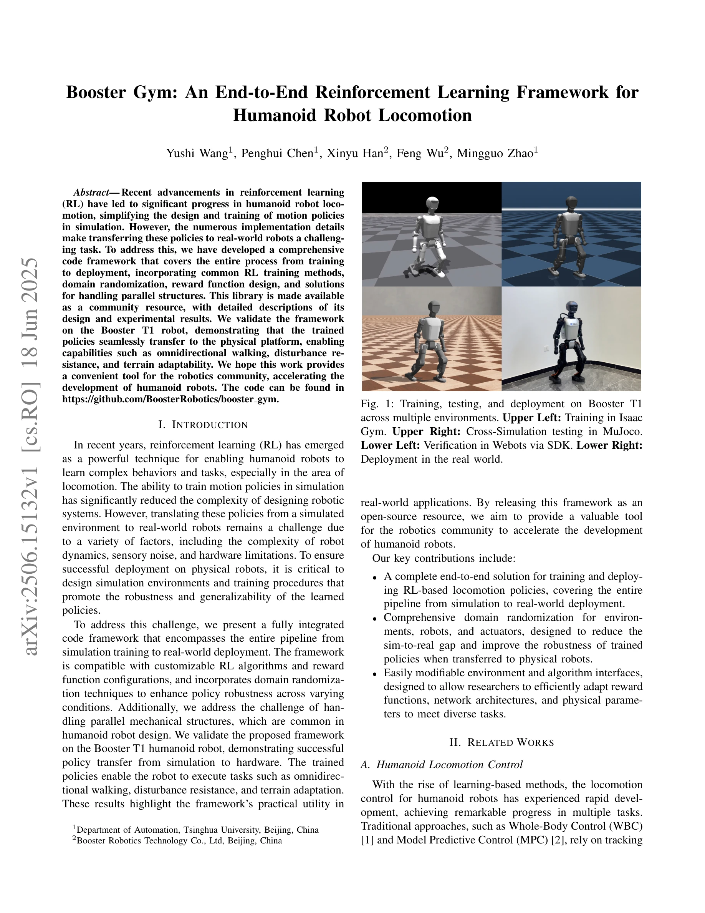
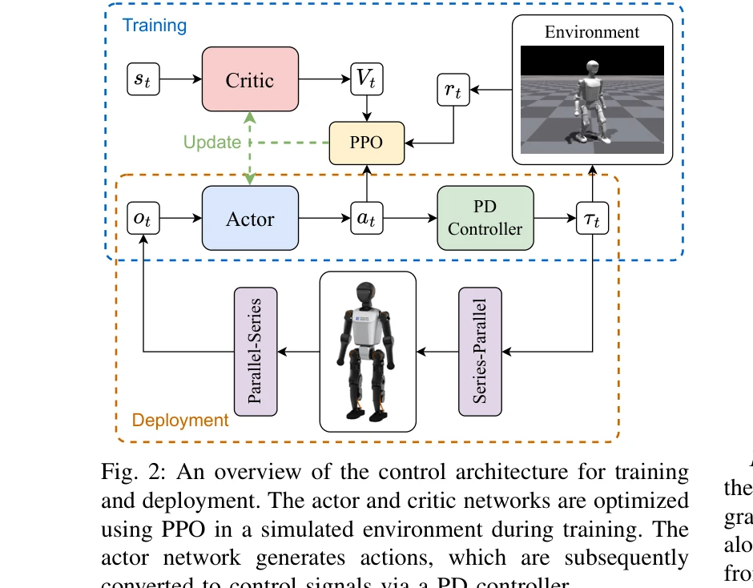

# Booster Gym: An End-to-End Reinforcement Learning Framework for Humanoid Robot Locomotion

> **저자**: Yushi Wang, Penghui Chen, Xinyu Han, Feng Wu, Mingguo Zhao | **날짜**: 2025-06-18 | **URL**: [https://arxiv.org/abs/2506.15132](https://arxiv.org/abs/2506.15132)

---

## Essence

*Fig. 1: Training, testing, and deployment on Booster T1*

Booster Gym은 시뮬레이션에서 실제 로봇까지 humanoid robot locomotion을 위한 RL 기반 정책을 훈련하고 배포하는 end-to-end 프레임워크를 제시한다. 이 프레임워크는 domain randomization, 보상 함수 설계, parallel structures 처리 등을 포함하며 Booster T1 로봇에서 omnidirectional walking, disturbance resistance, terrain adaptability를 달성했다.

## Motivation

- **Known**: RL은 humanoid robot locomotion 제어를 위한 강력한 기술이며, GPU 가속화 시뮬레이터인 Isaac Gym은 대규모 병렬화를 통해 훈련을 가속화한다. 기존 연구들은 teacher-student distillation이나 RMA와 같은 multi-stage 방법들과 end-to-end 프레임워크들을 제시했다.
- **Gap**: RL 기반 정책의 sim-to-real 전환은 여전히 도전적이며, 구현 세부 사항이 복잡하여 실제 로봇 배포가 어렵다. 또한 parallel mechanical structures 처리와 cross-simulator 검증을 포함한 완전한 통합 프레임워크가 부족했다.
- **Why**: humanoid robot 개발을 가속화하고 RL 기반 정책의 실제 배포를 단순화하기 위해 완전한 end-to-end 프레임워크를 제공하는 것은 로보틱스 커뮤니티에 중요한 자원이 될 수 있다.
- **Approach**: Isaac Gym, MuJoCo, Webots 등 다중 시뮬레이터를 활용한 multi-simulator 전략을 채택하고, PPO 알고리즘을 사용한 asymmetric actor-critic 아키텍처를 구현했다. Domain randomization을 포괄적으로 적용하고 PD controller를 통해 액추에이터 명령을 생성한다.

## Achievement

*Fig. 1: Training, testing, and deployment on Booster T1*

- **완전한 end-to-end 파이프라인**: 시뮬레이션 훈련부터 실제 로봇 배포까지 전체 과정을 다루는 통합 프레임워크 개발
- **포괄적인 domain randomization**: 환경, 로봇, 액추에이터에 대한 체계적인 domain randomization으로 sim-to-real gap 감소
- **다양한 로봇 성능**: Booster T1 로봇에서 omnidirectional walking, disturbance resistance, terrain adaptability 달성
- **cross-simulator 검증**: Isaac Gym, MuJoCo, Webots에서의 일관된 성능으로 정책의 일반화 검증
- **오픈소스 공개**: 커뮤니티 자원으로서 GitHub에 코드 공개하여 재현 가능성 확보

## How

*Fig. 2: An overview of the control architecture for training*

- POMDP 기반 formulation으로 부분 관찰 문제 정의
- PPO 알고리즘과 asymmetric actor-critic 아키텍처 사용 (관찰 공간이 비대칭)
- Generalized Advantage Estimation (GAE)를 통한 advantage 계산
- 환경 파라미터, 로봇 파라미터, 액추에이터 파라미터에 대한 광범위한 domain randomization 적용
- PD controller를 통한 action을 제어 신호로의 변환
- parallel mechanical structures 처리를 위한 series-parallel 및 parallel-series 변환
- MuJoCo와 Webots에서의 cross-simulator 검증으로 정책 일반화 확인

## Originality

- 완전한 프로덕션급 프레임워크 제시로 기존의 학술적 방법론을 실무적으로 통합
- Parallel mechanical structures 처리를 위한 series-parallel 변환 메커니즘 제시
- 다중 시뮬레이터 (Isaac Gym, MuJoCo, Webots) 활용 전략으로 신뢰성 향상
- 실제 하드웨어 (Booster T1)에서의 성공적인 배포 검증으로 실용성 입증

## Limitation & Further Study

- Isaac Gym의 PhysX 엔진 제약 (폐쇄 운동학적 체인 미지원, 접촉력 추정 정확도 낮음) 존재
- Domain randomization의 정도 결정이 휴리스틱 기반이며, 과도한 randomization이 보수적 정책을 생성할 수 있음
- Booster T1 단일 로봇에서만 검증되었으므로 다른 humanoid 로봇 설계에 대한 일반화 가능성 불명확
- Real-world 데이터 활용 없이 순수 sim-to-real 전환만 다루어 실제 배포 후 성능 개선 방법 제시 부족
- Parallel structure 처리가 특정 로봇 디자인에 맞춤형이어서 다른 구조에 대한 확장성 제한 가능

## Evaluation

- Novelty: 3/5
- Technical Soundness: 3/5
- Significance: 4/5
- Clarity: 4/5
- Overall: 4/5

**총평**: 이 논문은 humanoid robot locomotion의 RL 기반 훈련과 배포를 위한 실용적이고 완전한 오픈소스 프레임워크를 제시하며, 다중 시뮬레이터 검증과 실제 로봇 배포를 통해 실용성을 입증한다. 학술적 기여는 제한적이지만 로보틱스 커뮤니티에 즉시 활용 가능한 도구를 제공하는 점에서 가치 있다.

## Related Papers

- ⚖️ 반론/비판: [[papers/1805_Architecture_Is_All_You_Need_Diversity-Enabled_Sweet_Spots_f/review]] — Architecture 논문에서 제시한 계층화 구조의 우월성과 대조적으로 end-to-end RL 프레임워크의 실용성을 입증한다.
- 🏛 기반 연구: [[papers/1818_Berkeley_Humanoid_A_Research_Platform_for_Learning-based_Con/review]] — Berkeley Humanoid 플랫폼에서 검증된 하드웨어 특성이 Booster Gym 프레임워크 설계에 중요한 참고가 되었다.
- 🔄 다른 접근: [[papers/1791_Advancing_Humanoid_Locomotion_Mastering_Challenging_Terrains/review]] — 휴머노이드 locomotion을 위한 end-to-end RL 프레임워크에서 서로 다른 구현과 적용 환경을 제시한다.
- 🔄 다른 접근: [[papers/1794_AGILE_A_Comprehensive_Workflow_for_Humanoid_Loco-Manipulatio/review]] — 휴머노이드 학습을 위한 포괄적 프레임워크로서 유사한 목표를 가지지만 서로 다른 구조적 접근을 사용한다.
- 🏛 기반 연구: [[papers/2007_HumanoidBench_Simulated_Humanoid_Benchmark_for_Whole-Body_Lo/review]] — end-to-end RL 프레임워크의 기초가 되는 simulated humanoid benchmark를 제공하여 표준화된 평가를 가능하게 한다.
- 🔄 다른 접근: [[papers/2006_Humanoid-Gym_Reinforcement_Learning_for_Humanoid_Robot_with/review]] — end-to-end 휴머노이드 RL 프레임워크로 Booster Gym vs Humanoid-Gym이라는 서로 다른 구현 접근법을 비교할 수 있다
- 🔗 후속 연구: [[papers/1647_RoboPlayground_구조화된_물리_도메인을_통한_로봇_평가_민주화/review]] — Booster Gym의 end-to-end 프레임워크가 RoboPlayground의 구조화된 평가 도메인으로 확장되어 더 체계적인 로봇 성능 평가를 제공할 수 있다
- 🔄 다른 접근: [[papers/1805_Architecture_Is_All_You_Need_Diversity-Enabled_Sweet_Spots_f/review]] — Booster Gym의 end-to-end RL 프레임워크와 대조적으로 계층화된 제어 구조의 우월성을 보인 연구다.
- 🏛 기반 연구: [[papers/1817_Benchmarking_Potential_Based_Rewards_for_Learning_Humanoid_L/review]] — PBRS 벤치마킹 결과가 Booster Gym의 reward 함수 설계에 중요한 가이드라인을 제공한다.
- 🔄 다른 접근: [[papers/1818_Berkeley_Humanoid_A_Research_Platform_for_Learning-based_Con/review]] — 두 논문 모두 학습 기반 humanoid 플랫폼을 제시하지만 Berkeley는 하드웨어 설계, Booster는 소프트웨어 프레임워크에 중점을 둔다.
- 🏛 기반 연구: [[papers/1791_Advancing_Humanoid_Locomotion_Mastering_Challenging_Terrains/review]] — end-to-end RL 프레임워크의 이론적 기반을 제공하며 실제 휴머노이드에서의 적용 가능성을 보여준다.
- 🔄 다른 접근: [[papers/1794_AGILE_A_Comprehensive_Workflow_for_Humanoid_Loco-Manipulatio/review]] — 휴머노이드 강화학습을 위한 end-to-end 워크플로우로서 유사한 목표를 가지지만 서로 다른 구현 방식을 제시한다.
- 🏛 기반 연구: [[papers/2006_Humanoid-Gym_Reinforcement_Learning_for_Humanoid_Robot_with/review]] — Booster Gym의 end-to-end RL framework가 Humanoid-Gym의 강화학습 기반 humanoid training 시스템 구축 기초를 제공한다.
- 🔄 다른 접근: [[papers/2031_Iterative_Closed-Loop_Motion_Synthesis_for_Scaling_the_Capab/review]] — 둘 다 강화학습 프레임워크이지만 CLAIMS는 반복적 데이터 생성, Booster Gym은 end-to-end 학습 환경 제공
- 🧪 응용 사례: [[papers/2061_Learning_Sim-to-Real_Humanoid_Locomotion_in_15_Minutes/review]] — 빠른 강화학습 레시피가 end-to-end RL 프레임워크를 통한 실제 로봇 배포에 적용된다.
- 🏛 기반 연구: [[papers/2077_Learning_with_pyCub_A_Simulation_and_Exercise_Framework_for/review]] — Python 기반 시뮬레이션 프레임워크가 end-to-end 강화학습 프레임워크의 교육적 기반을 제공한다.
- 🏛 기반 연구: [[papers/2084_LiPS_Large-Scale_Humanoid_Robot_Reinforcement_Learning_with/review]] — 종단간 강화학습 프레임워크의 이론적 기반을 제공한다.
