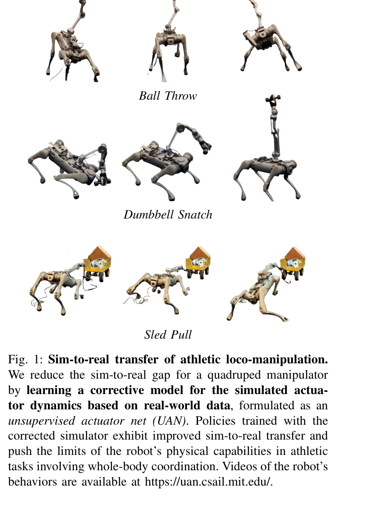

# Bridging the Sim-to-Real Gap for Athletic Loco-Manipulation

> **저자**: Nolan Fey, Gabriel B. Margolis, Martin Peticco, Pulkit Agrawal | **날짜**: 2025-02-15 | **URL**: [https://arxiv.org/abs/2502.10894](https://arxiv.org/abs/2502.10894)

---

## Essence

*Fig. 2: Unsupervised Actuator Network (UAN) approach for real-to-sim-to-real. Our training pipeline involves three steps*

로봇의 운동 조작 작업에서 시뮬레이션-현실 간 격차를 줄이기 위해 실제 데이터로부터 액추에이터 동역학을 학습하는 Unsupervised Actuator Net (UAN)과 참조 궤적을 탐색 힌트로 활용하는 두 단계 학습 파이프라인을 제안한다.

## Motivation

- **Known**: 전통적인 추적 보상을 사용한 시뮬레이션-현실 전이는 참조 궤적을 정의하기 어렵고, 작업 보상 학습은 보상 해킹과 탐색 부족의 문제가 있다.
- **Gap**: 복잡한 액추에이터(예: 하모닉 드라이브)의 비선형 마찰과 히스테리시스를 정확히 모델링할 수 있는 토크 센서 없는 시뮬레이터 보정 방법이 부족하고, 운동 선행 지식과 작업 보상의 균형을 맞추는 방법이 필요하다.
- **Why**: 운동 로봇이 던지기, 들기, 끌기와 같은 역동적 운동 능력을 습득하기 위해서는 시뮬레이션의 물리 정확도 향상과 효율적인 탐색 전략이 필수적이다.
- **Approach**: UAN을 통해 실제 로봇 데이터로부터 보정 토크를 학습하여 시뮬레이터를 정확하게 만들고, 사전학습된 전신 제어기(WBC)에서 참조 궤적으로 초기화한 후 작업 보상으로 미세조정하는 방식으로 탐색을 유도한다.

## Achievement

*Fig. 1: Sim-to-real transfer of athletic loco-manipulation.*

- **UAN 개발**: 토크 센싱 없이 관절 인코더 측정만으로 액추에이터 동역학의 잔차 모델을 학습하여 시뮬레이션-현실 격차를 효과적으로 해소
- **두 단계 학습 파이프라인**: 사전학습(기본 운동 기술 확보) → 미세조정(작업별 성능 최적화) 구조로 보상 해킹을 완화하고 탐색을 가속화
- **실제 운동 능력 구현**: Unitree B2 사족 로봇 + Z1 Pro 팔 조합에서 공 던지기, 덤벨 스내치, 썰매 끌기 등 복잡한 전신 조작 작업의 현실 전이 성공

## How

*Fig. 2: Unsupervised Actuator Network (UAN) approach for real-to-sim-to-real. Our training pipeline involves three steps*

- UAN: 2계층 MLP [128, 128] 아키텍처로 과거 20 타임스텝(100ms)의 위치/속도 오차를 관찰하고 보정 토크 δτ를 출력
- UAN 훈련: 실제 로봇 롤아웃 데이터에서 시뮬레이션 전이와 실제 전이의 불일치를 최소화하도록 RL로 훈련
- WBC 사전학습: 무작위 기본 속도와 말단 위치 명령으로 범용 운동 선행 학습
- WBC 미세조정: 참조 궤적으로 초기화하되 작업 보상(예: 던진 거리, 들어올린 속도)을 최적화하며 정책이 필요시 참조에서 이탈 가능하도록 허용
- Domain randomization: 시뮬레이션 환경의 물리 매개변수를 무작위화하여 시뮬-현실 격차에 대한 견고성 강화

## Originality

- UAN의 자율(비감독) 학습 접근: 토크 센서 필요 없이 인코더 데이터만으로 액추에이터 동역학의 잔차 모델을 RL로 직접 학습하는 아이디어는 기존 시스템 식별 및 도메인 무작위화와 구별됨
- 참조 궤적을 '보상 해킹 완화 및 탐색 가속화'의 도구로 재정의: 추적 제약 대신 초기 탐색 힌트로 사용하여 정책의 자율성을 유지하면서도 탐색 효율성 향상", "운동 능력 중심 작업 정의: '최대한 멀리 던지기
- 최대한 빠르게 들기' 같은 명령은 전통적 추적 보상을 벗어나 로봇의 극한 능력을 끌어내는 새로운 학습 목표

## Limitation & Further Study

- 하모닉 드라이브 액추에이터에 특화된 설계로 보이며, 다른 유형의 액추에이터(직접 구동 모터, 케이블 구동 등)에 대한 일반화 능력이 명확하지 않음
- UAN 훈련에 필요한 실제 로봇 데이터 수집 비용과 시간이 초기 투자로 소요되며, 완전히 새로운 로봇에 적용 시 재수집 필요
- 참조 궤적의 품질에 여전히 의존: 미세조정 초기화 시 좋은 참조가 필요하므로, 참조를 얻기 어려운 비표준 로봇 형태에서는 여전히 과제 존재
- 보상 함수 설계(예: 작업 보상 + 보조 보상의 가중치)에 대한 명시적 가이드라인이 부족하여 새로운 작업 적용 시 튜닝 필요

## Evaluation

- Novelty: 4/5
- Technical Soundness: 4/5
- Significance: 4/5
- Clarity: 4/5
- Overall: 4/5

**총평**: 본 논문은 토크 센싱 없는 UAN으로 복잡한 액추에이터 동역학을 학습하고, 참조 궤적을 탐색 힌트로 활용하는 우아한 두 단계 파이프라인으로 운동 로봇의 시뮬-현실 전이 문제를 체계적으로 해결했다. 실제 사족 조작 로봇에서 다양한 운동 작업의 성공적 구현으로 높은 실용성을 보여주며, RL 기반 로보틱스 분야에 기여도 높은 연구이다.
