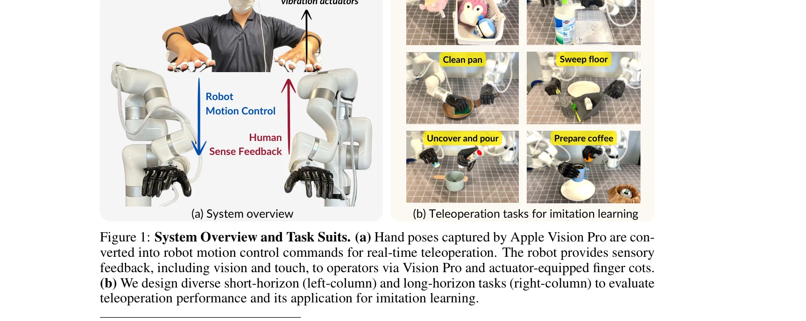
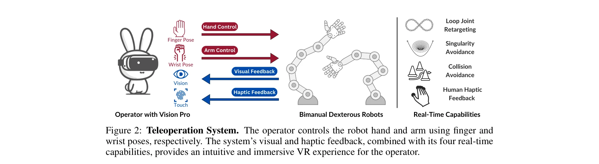

# Bunny-VisionPro: Real-Time Bimanual Dexterous Teleoperation for Imitation Learning

> **저자**: Runyu Ding, Yuzhe Qin, Jiyue Zhu, Chengzhe Jia, Shiqi Yang, Ruihan Yang, Xiaojuan Qi, Xiaolong Wang | **날짜**: 2024-07-03 | **URL**: [https://arxiv.org/abs/2407.03162](https://arxiv.org/abs/2407.03162)

---

## Essence

*Figure 1: System Overview and Task Suits. (a) Hand poses captured by Apple Vision Pro are con-*

Apple Vision Pro의 손 추적 기능을 활용하여 양손 민첩한 조작이 가능한 실시간 텔레오퍼레이션 시스템 Bunny-VisionPro를 제시하며, 저비용 햅틱 피드백과 충돌/특이점 회피를 통해 모방 학습용 고품질 시연 데이터를 수집한다.

## Motivation

- **Known**: 기존 텔레오퍼레이션 시스템은 ALOHA 같은 joint-space 매핑이나 간단한 gripper 기반 end-effector 제어에 국한되어 있으며, 양손 고DoF 조작의 실시간 제어와 안전성 보장에 어려움이 있다.
- **Gap**: 비전 기반 텔레오퍼레이션 시스템에서 양손 민첩한 조작을 실시간으로 제어하면서 동시에 충돌/특이점 회피를 수행하고 몰입감 있는 햅틱 피드백을 제공하는 통합 시스템이 부재하다.
- **Why**: 고품질의 양손 long-horizon 텔레오퍼레이션 시연은 복잡한 조작 작업에 대한 모방 학습의 일반화 능력을 크게 향상시키므로, 현실적이고 효율적인 데이터 수집 도구의 필요성이 높다.
- **Approach**: Vision Pro의 손/손목 포즈 추적을 활용하여 손가락 움직임을 로봇 관절로 변환하는 retargeting 모듈, arm 특이점 및 충돌 회피 모듈, 저비용 ERM 액튜에이터 기반 햅틱 피드백 모듈을 독립적으로 설계하여 실시간 처리를 보장한다.

## Achievement

*Figure 1: System Overview and Task Suits. (a) Hand poses captured by Apple Vision Pro are con-*

- **성능 우수성**: Telekinesis 벤치마크에서 기존 시스템 대비 11% 높은 성공률 달성 및 작업 완료 시간 45% 단축
- **모방 학습 개선**: 수집된 고품질 시연으로 학습한 정책이 새로운 포즈/미숙한 객체에 대해 20% 향상된 일반화 성능 달성
- **long-horizon 작업 지원**: 기존 시스템에서 거의 다루지 않은 다단계 장시간 양손 민첩 조작 작업 수행 가능
- **실시간 특수 기능**: Loop joint retargeting을 1개 CPU 코어로 300Hz 처리, GPU 없이 arm collision/singularity avoidance 실시간 수행

## How

*Figure 2: Teleoperation System. The operator controls the robot hand and arm using finger and*

- Hand motion retargeting: 인간 손가락 키포인트와 로봇 손 forward kinematics 간 거리 최소화 및 joint 변화율 정규화를 통해 fingertip keypoint 벡터 매핑
- Arm motion control: Sphere modeling을 통한 효율적 충돌 감지 및 Jacobian 기반 특이점 회피로 실시간 arm 제어
- Loop joint retargeting: Four-bar linkage 같은 복잡한 로봇 손 구조에 대한 특화된 retargeting 알고리즘
- Haptic feedback: 로봇 손의 FSR 센서 촉각 신호를 operator 손가락의 저비용 ERM 액튜에이터로 변환
- Bimanual coordination: 로봇 양손 간 거리를 인간 양손 거리와 일치시키는 초기화 모드 설계
- Modular architecture: 각 모듈을 독립 프로세스로 운영하여 지연 누적 방지

## Originality

- Vision Pro 기반 양손 고DoF 텔레오퍼레이션 시스템의 최초 구현으로, 기존 글러브 기반/카메라 기반 솔루션과 차별화
- Loop joint retargeting의 실시간 처리: 4-bar linkage 같은 복잡한 구조를 1개 CPU 코어, 300Hz로 처리하는 novel 알고리즘
- 저비용 ERM 액튜에이터 ($1.2) 기반 haptic feedback 설계로 immersion 향상
- 실시간 충돌/특이점 회피와 양손 coordination을 통합하는 통일된 시스템 구조
- Long-horizon multi-stage 양손 조작 작업의 성공적 수행 및 모방 학습 개선 검증

## Limitation & Further Study

- Vision Pro의 손 추적 정확도 및 occlusion 문제에 대한 분석 부재
- 초기화 모드 설계 세부사항과 다양한 작업에 따른 모드 선택 방법론 부분 제시
- Telekinesis 벤치마크만 평가하여 타 도메인/로봇 플랫폼에 대한 일반화 가능성 미지
- Long-horizon 작업의 scalability 한계 및 operator fatigue에 대한 연구 필요
- Haptic feedback의 정보량 한계 (단순 진동) 및 보다 정교한 tactile sensation 구현 연구 진행 가능

## Evaluation

- Novelty: 4/5
- Technical Soundness: 4/5
- Significance: 4/5
- Clarity: 4/5
- Overall: 4/5

**총평**: Vision Pro를 활용한 양손 민첩 텔레오퍼레이션에서 실시간 성능, 안전성, 몰입감을 동시에 달성한 혁신적 시스템으로, 장시간 복잡 조작의 시연 수집을 통해 모방 학습의 새로운 가능성을 제시하는 높은 기술적·응용적 가치의 연구다.

## Related Papers

- 🔄 다른 접근: [[papers/1873_Dexterous_Teleoperation_of_20-DoF_ByteDexter_Hand_via_Human/review]] — Bunny-VisionPro는 Apple Vision Pro로 양손 조작을, ByteDexter는 20-DoF 손으로 정교한 텔레오퍼레이션을 구현하는 서로 다른 하드웨어 접근법을 보여준다.
- 🔗 후속 연구: [[papers/1839_CLONE_Closed-Loop_Whole-Body_Humanoid_Teleoperation_for_Long/review]] — Bunny-VisionPro의 실시간 양손 텔레오퍼레이션 기술이 CLONE의 MR 헤드셋 기반 전신 협응 제어로 확장되어 더 포괄적인 휴머노이드 제어를 가능하게 한다.
- 🔄 다른 접근: [[papers/2124_Open-TeleVision_Teleoperation_with_Immersive_Active_Visual_F/review]] — Bunny-VisionPro와 Open-TeleVision 모두 몰입형 시각 피드백을 활용한 텔레오퍼레이션을 제공하지만 서로 다른 하드웨어와 접근 방식을 사용한다.
- 🏛 기반 연구: [[papers/1921_ExtremControl_Low-Latency_Humanoid_Teleoperation_with_Direct/review]] — ExtremControl의 저지연 텔레오퍼레이션 기술이 Bunny-VisionPro의 실시간 양손 조작 시스템 구현에 필요한 기술적 기반을 제공한다.
- 🏛 기반 연구: [[papers/1806_ARMADA_Augmented_Reality_for_Robot_Manipulation_and_Robot-Fr/review]] — 실시간 이중팔 원격조작 기술이 ARMADA의 AR 기반 로봇 조작 데이터 수집에 피드백 시스템의 기반을 제공합니다.
- 🏛 기반 연구: [[papers/1839_CLONE_Closed-Loop_Whole-Body_Humanoid_Teleoperation_for_Long/review]] — Bunny-VisionPro의 실시간 양손 텔레오퍼레이션 기술이 CLONE의 MR 헤드셋 기반 전신 협응 제어 시스템 개발에 기초적인 프레임워크를 제공한다.
- 🔗 후속 연구: [[papers/1786_ACE_A_Cross-Platform_Visual-Exoskeletons_System_for_Low-Cost/review]] — 실시간 이중팔 정교한 원격조작을 ACE의 저비용 cross-platform 시각 시스템과 결합할 수 있습니다.
- 🧪 응용 사례: [[papers/1870_DexterCap_An_Affordable_and_Automated_System_for_Capturing_D/review]] — 실시간 양손 정교한 텔레오퍼레이션의 실제 구현 사례를 보여줍니다.
- 🔄 다른 접근: [[papers/1873_Dexterous_Teleoperation_of_20-DoF_ByteDexter_Hand_via_Human/review]] — ByteDexter의 20-DoF 링크구동과 Bunny-VisionPro의 Apple Vision Pro 기반 시스템은 정교한 손 텔레오퍼레이션에서 서로 다른 하드웨어와 추적 기술을 사용한다.
- 🔄 다른 접근: [[papers/2014_HumDex_Humanoid_Dexterous_Manipulation_Made_Easy/review]] — 둘 다 실시간 양손 조작 텔레오퍼레이션이지만 HumDex는 IMU 기반, Bunny-VisionPro는 비전 기반
- 🔄 다른 접근: [[papers/2092_MaskedMimic_Unified_Physics-Based_Character_Control_Through/review]] — 둘 다 motion inpainting 접근법이지만 MaskedMimic은 physics-based control에, Flexible Motion In-betweening은 애니메이션 생성에 중점을 둔다
- 🔗 후속 연구: [[papers/2119_OmniControl_Control_Any_Joint_at_Any_Time_for_Human_Motion_G/review]] — Flexible Motion In-betweening의 diffusion model이 OmniControl의 text-conditioned spatial control로 더욱 정교하게 발전된 것이다
- 🔄 다른 접근: [[papers/2164_TWIST2_Scalable_Portable_and_Holistic_Humanoid_Data_Collecti/review]] — Bunny-VisionPro의 bimanual dexterous teleoperation과 TWIST2의 whole-body teleoperation은 상호 보완적인 VR 기반 접근법임
- 🏛 기반 연구: [[papers/2124_Open-TeleVision_Teleoperation_with_Immersive_Active_Visual_F/review]] — Bunny-VisionPro의 실시간 이중팔 정교한 텔레오퍼레이션 기술이 Open-TeleVision의 VR 기반 몰입형 원격 조종 시스템 개발에 기반을 제공한다.
