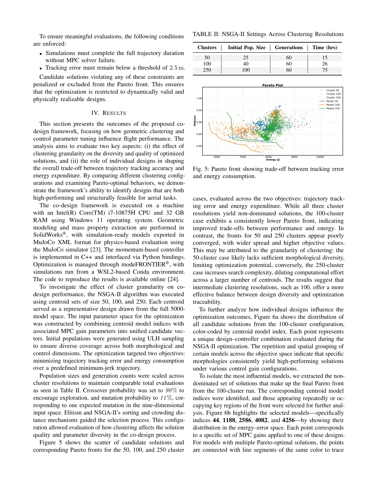
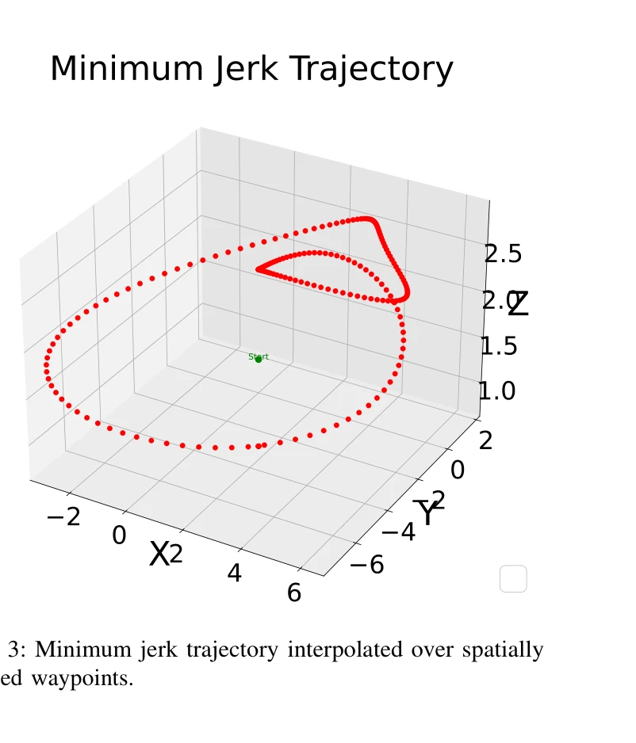

# CAD-Driven Co-Design for Flight-Ready Jet-Powered Humanoids

> **저자**: Punith Reddy Vanteddu, Davide Gorbani, Giuseppe L'Erario, Hosameldin Awadalla Omer Mohamed, Fabio Bergonti, Daniele Pucci | **날짜**: 2025-09-18 | **URL**: [https://arxiv.org/abs/2509.14935](https://arxiv.org/abs/2509.14935)

---

## Essence

*Fig. 2: CAD assemblies of the links being modified. 1: Jetpack Turbine Angle; 2: Jetpack Turbine offset distance; 3: Jet*

CAD 기반 설계-제어 공동 최적화 프레임워크를 통해 제트 추진 휴머노이드 로봇의 형태와 MPC 제어 파라미터를 동시에 최적화하여 비행 가능한 구성을 도출한다.

## Motivation

- **Known**: 로봇 시스템의 형태와 제어는 긴밀히 결합되어 있으며, 매니퓰레이터와 사족 로봇 등에서 공동 설계의 이점이 입증되었다.
- **Gap**: 휴머노이드 플랫폼, 특히 제트 추진 항공 휴머노이드의 경우 대규모 형태 변화 공간에서 비행 궤적 성능을 기반으로 전체 구성을 평가하는 체계적 프레임워크가 부재하다.
- **Why**: 제트 추진 항공 휴머노이드는 추력 인터페이스 배치와 질량 분포가 비행 동역학 및 제어성에 직접적으로 영향을 미치므로, 제조 가능성을 보장하면서 동적 궤적 추적 성능을 최대화하는 설계 선택이 필요하다.
- **Approach**: Design of Experiments를 통해 5,000개의 CAD 기반 모델을 생성하고, K-means 클러스터링으로 계산 비용을 줄인 후, 최소 저크 궤적에서 linearized momentum-based MPC의 성능을 평가하여 NSGA-II 알고리즘으로 형태와 제어 가중치를 공동 최적화한다.

## Achievement

*Fig. 5: Pareto front showing trade-off between tracking error*

- **5,000개 기하학적 변형 모델의 체계적 생성**: Design of Experiments를 통해 관절 길이, 제트 인터페이스 기하(각도, 오프셋), 질량 분포를 변경한 기하학적으로 다양하고 기계적으로 실현 가능한 설계를 생성하였으며, FEM 분석으로 구조적 타당성 검증
- **CAD 기반 자동 특성 추출**: CAD 조립으로부터 질량, 무게중심, 링크 관성 등을 자동으로 추출하여 동역학 모델에 직접 연결
- **효율적 탐색을 위한 K-means 클러스터링**: 5,000개 모델을 클러스터링하여 대표 centroids를 선별함으로써 계산 비용을 감소시키면서 매개변수 민감도 분석 가능
- **16차원 공동 최적화 공간**: 8개 기하학적 매개변수와 8개 제어 가중치 매개변수를 NSGA-II로 동시에 최적화하여 궤적 추적 오류와 기계적 에너지 소비 간 트레이드오프 탐색
- **비행 가능한 휴머노이드 구성의 도출**: 검증된 제어 파라미터와 함께 실행 가능한 항공 휴머노이드 구성 집합을 제시하여 설계 선택의 체계적 방법 제공

## How

*Fig. 3: Minimum jerk trajectory interpolated over spatially*

- iRonCub-Mk3 베이스 모델로부터 8개 기하학적 매개변수(제트팩 터빈 각도, 오프셋, 높이, 전완길이, 어깨 너비, 엉덩이 거리, 발목 링크 높이, 발 길이)를 선정하여 Design of Experiments 통해 5,000개 설계 생성
- 각 모델을 CAD 조립으로 구성하여 구조적 타당성 확보 및 시뮬레이션 도구와의 호환성 보장
- CAD로부터 질량, CoM, 관성 자동 추출 및 FEM 분석으로 제조 가능성 검증
- K-means 클러스터링으로 5,000개 모델을 축약하고 representative centroids 선정
- Minimum-jerk 궤적을 정의하여 위치 및 속도 참조값 생성
- Centroidal momentum 표현을 기반으로 한 linearized momentum-based MPC 구성, 8개 제어 가중치 매개변수 포함
- NSGA-II 알고리즘으로 설계 centroids와 MPC 게인 파라미터를 공동 탐색
- 목적함수로 궤적 추적 오류와 기계적 에너지 소비를 최소화하여 Pareto front 생성

## Originality

- **전체 본체 CAD 기반 대규모 탐색**: 기존 연구의 부품 수준 최적화를 넘어 수천 개의 완전한 CAD 기하학적 변형 모델을 비행 성능 지표로 평가
- **형태-제어 공동 최적화의 확장**: 기존 공동 설계 프레임워크를 제트 추진 항공 휴머노이드로 확대하여 추력 벡터링, 언더액추에이션, 비행 동역학 하에서의 공동 최적화 달성
- **CAD 기반 설계 공간의 체계화**: Design of Experiments + K-means 클러스터링을 통해 고차원 설계 공간의 탐색 비용을 줄이면서 대표성 유지
- **궤적 추적 성능 기반 평가**: 최소 저크 궤적과 linearized MPC를 통한 동적 비행 시나리오에서의 평가로 구조적 실현 가능성과 제어 성능 동시 확보
- **제조 가능성 보장**: FEM 분석을 통한 검증으로 탐색된 솔루션이 프로토타입 제작 가능성을 갖도록 제한

## Limitation & Further Study

- **선형화 기반 MPC의 제약**: Linearized momentum-based MPC는 큰 편차에서의 성능 저하 가능성이 있으며, 비선형 동역학의 완전한 반영 부족
- **클러스터링으로 인한 정보 손실**: K-means 클러스터링으로 representative centroids 선정 시 클러스터 내 설계 다양성이 손실될 수 있음
- **제한된 궤적 평가**: 최소 저크 궤적 하나로만 성능 평가하였으므로, 다양한 비행 시나리오(급격한 기동, 외란 대응 등)에서의 강건성 미검증
- **제어 가중치 8개로의 제한**: 실제 MPC 구현에서 더 많은 파라미터 튜닝이 필요할 수 있으며, 제약 조건(관절 한계, 추력 한계) 처리의 상세 설명 부족
- **후속 연구 방향**: (1) 비선형 MPC 또는 model predictive control과 trajectory optimization의 통합, (2) 강건성 평가 및 불확실성 하에서의 성능 분석, (3) 실제 프로토타입 제작 및 검증, (4) 다중 비행 작업에 대한 평가

## Evaluation

- Novelty: 4/5
- Technical Soundness: 3/5
- Significance: 4/5
- Clarity: 4/5
- Overall: 4/5

**총평**: 본 논문은 CAD 기반 설계-제어 공동 최적화를 제트 추진 항공 휴머노이드에 적용한 것으로, 대규모 형태 공간 탐색과 비행 성능 평가를 체계적으로 통합한 점에서 기여가 크다. 다만 선형화된 제어와 제한된 평가 시나리오는 실제 적용의 견고성을 위해 추가 검증이 필요하다.

## Related Papers

- 🔗 후속 연구: [[papers/2028_iRonCub_3_The_Jet-Powered_Flying_Humanoid_Robot/review]] — iRonCub 3의 실제 제트 추진 비행 로봇 구현 경험이 CAD 기반 설계 최적화의 실용성을 검증하고 개선 방향을 제시한다
- 🏛 기반 연구: [[papers/2072_Learning_to_Walk_and_Fly_with_Adversarial_Motion_Priors/review]] — 비행과 보행을 결합한 adversarial motion prior 학습이 제트 추진 휴머노이드의 복합 모션 제어에 필요한 기초 기술을 제공한다
- 🔄 다른 접근: [[papers/2044_Learning_Aerodynamics_for_the_Control_of_Flying_Humanoid_Rob/review]] — 제트 추진 휴머노이드를 위해 CAD 기반 형태 최적화와 공기역학 제어 학습이라는 서로 다른 설계 접근법을 제시한다
- 🔗 후속 연구: [[papers/1916_Evolutionary_Continuous_Adaptive_RL-Powered_Co-Design_for_Hu/review]] — CAD 기반 co-design이 진화적 연속 적응 RL co-design으로 확장되어 더 동적인 형태-제어 최적화를 달성할 수 있다
- 🧪 응용 사례: [[papers/1910_Embracing_Evolution_A_Call_for_Body-Control_Co-Design_in_Emb/review]] — 비행 가능한 휴머노이드 설계가 신체-제어 공동 설계의 실제 적용 사례이다.
- 🏛 기반 연구: [[papers/1920_Explosive_Output_to_Enhance_Jumping_Ability_A_Variable_Reduc/review]] — 비행 인간형 로봇의 폭발적 출력 설계가 점프 능력 향상에 필요한 이론적 기반을 제공한다.
- 🏛 기반 연구: [[papers/2028_iRonCub_3_The_Jet-Powered_Flying_Humanoid_Robot/review]] — 비행용 제트 추진 휴머노이드의 CAD 기반 공동 설계가 iRonCub 3 개발의 설계 기반을 제공한다.
- 🔄 다른 접근: [[papers/2044_Learning_Aerodynamics_for_the_Control_of_Flying_Humanoid_Rob/review]] — Learning Aerodynamics는 실험적 접근, CAD-Driven Co-Design은 설계 최적화 접근으로 비행 휴머노이드 개발에 서로 다른 방법론을 사용한다.
