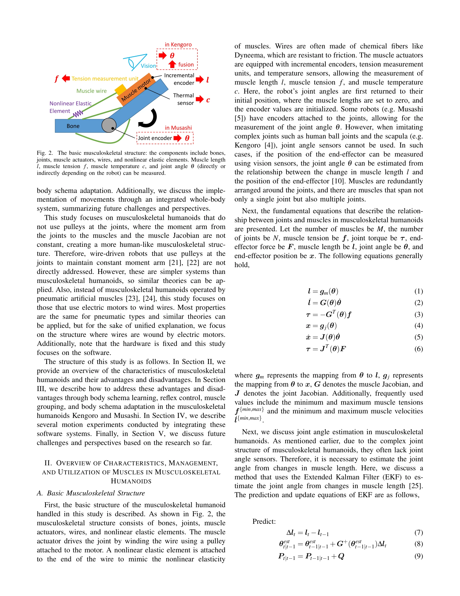

# Characteristics, Management, and Utilization of Muscles in Musculoskeletal Humanoids: Empirical Study on Kengoro and Musashi

> **저자**: Kento Kawaharazuka, Kei Okada, Masayuki Inaba | **날짜**: 2026-02-09 | **URL**: [https://arxiv.org/abs/2602.08518](https://arxiv.org/abs/2602.08518)

---

## Essence

*Fig. 2. The basic musculoskeletal structure: the components include bones,*

본 논문은 Kengoro와 Musashi 근골격 휴머노이드 로봇의 근육 특성을 5가지 속성(Redundancy, Independency, Anisotropy, Variable Moment Arm, Nonlinear Elasticity)으로 분류하고, 이를 효과적으로 관리·활용하는 방법론을 제시한다.

## Motivation

- **Known**: 근골격 휴머노이드는 다양하게 개발되어 왔으며, 근육의 중복성과 비선형 탄성은 가변 강성 제어 등의 장점을 제공하지만 동시에 모델링과 제어를 복잡하게 만든다.
- **Gap**: 기존 연구는 대부분 시뮬레이션이나 2D 단순화 모델에 집중되어 있으며, 실제 전신 근골격 로봇의 근육 특성에 대한 통합적이고 체계적인 논의가 부족하다.
- **Why**: 근육 특성의 장단점을 명확히 이해하고 체계적으로 관리·활용할 수 있다면, 근골격 휴머노이드의 제어 성능을 향상시키고 생체모방 로봇의 이점을 더욱 효과적으로 활용할 수 있다.
- **Approach**: 실제 구현된 Kengoro와 Musashi 로봇을 대상으로 다양한 연구 결과를 바탕으로 근육 특성을 5가지 속성으로 분류하고, body schema learning, reflex control, muscle grouping, body schema adaptation 등의 소프트웨어 기법을 통해 관리·활용 방법을 제시한다.

## Achievement

*Fig. 4. The overview of the system which manages and utilizes advantages/disadvantages of the musculoskeletal structure.*

- **근육 특성의 체계적 분류**: Redundancy, Independency, Anisotropy, Variable Moment Arm, Nonlinear Elasticity의 5가지 속성으로 근골격 구조를 분류하여 복잡한 특성을 단순화
- **장단점 통합 분석**: 각 속성의 조합으로부터 발생하는 장단점을 체계적으로 분석하고 정리
- **실제 로봇 기반 검증**: 실제 구현된 Kengoro와 Musashi 로봇에서 다양한 연구 결과를 바탕으로 이론 검증
- **통합 제어 시스템**: body schema learning, reflex control, muscle grouping, body schema adaptation을 통합한 소프트웨어 시스템 구현
- **관절각 추정 방법론**: 복잡한 관절 구조에서 근육 길이 변화만으로 EKF와 비전 기반 AR marker를 이용한 관절각 추정 기법 제시

## How

*Fig. 4. The overview of the system which manages and utilizes advantages/disadvantages of the musculoskeletal structure.*

- Extended Kalman Filter(EKF)를 이용한 근육 길이 변화로부터의 관절각 추정 (식 7-15)
- Vision 기반 AR marker 인식을 통한 관절각 추정값 보정 (식 16)
- Quadratic programming을 이용한 목표 관절 토크 실현 근육 장력 계산 (식 17)
- Body schema learning: 근육-관절 복합 관계의 학습을 통한 제어 모델 구축
- Reflex control: 근육 이완 제어 등의 반사 제어 시스템 구현
- Muscle grouping: 근육 그룹화를 통한 제어 차원 축소
- Body schema adaptation: 환경 변화 대응을 위한 신체 스키마 적응

## Originality

- 실제 전신 근골격 휴머노이드 로봇의 다양한 연구 사례를 바탕으로 근육 특성을 체계적으로 분류한 첫 시도
- 근육 특성의 장단점을 통합적으로 논의하고 관리·활용 방법론을 제시한 통일된 프레임워크 구축
- 복잡한 관절 구조를 갖춘 근골격 로봇에서 joint encoder 없이 근육 길이와 비전 정보만으로 관절각을 추정하는 실용적 방법론 제시
- 여러 소프트웨어 기법(body schema learning, reflex control, muscle grouping 등)을 통합한 실제 동작 구현 사례 제공

## Limitation & Further Study

- 소프트웨어 중심의 논의로, 하드웨어 설계 및 최적화에 대한 논의 부재
- Pulley를 사용하는 wire-driven robot과 pneumatic artificial muscle 기반 로봇은 직접 대상으로 하지 않음
- Joint angle estimation에서 모델링되지 않은 요인(근육 신축, 마찰 등)의 영향으로 인한 오류 존재
- 모션 실험 결과에 대한 정량적 성능 평가 지표 및 비교 분석 부재 (본문 발췌 범위 내)
- 후속 연구로 각 특성의 장단점을 최적화하는 제어 알고리즘 개발 필요
- 다양한 작업 환경과 동작에서의 일반화 성능 검증 필요

## Evaluation

- Novelty: 4/5
- Technical Soundness: 3/5
- Significance: 4/5
- Clarity: 4/5
- Overall: 4/5

**총평**: 본 논문은 근골격 휴머노이드의 근육 특성을 처음으로 체계적으로 분류하고 관리·활용 방법을 제시한 중요한 기여이며, 실제 로봇 구현 사례를 바탕으로 높은 실용성을 갖추고 있다. 다만 정량적 성능 평가 및 일반화 가능성에 대한 보완이 필요하다.
