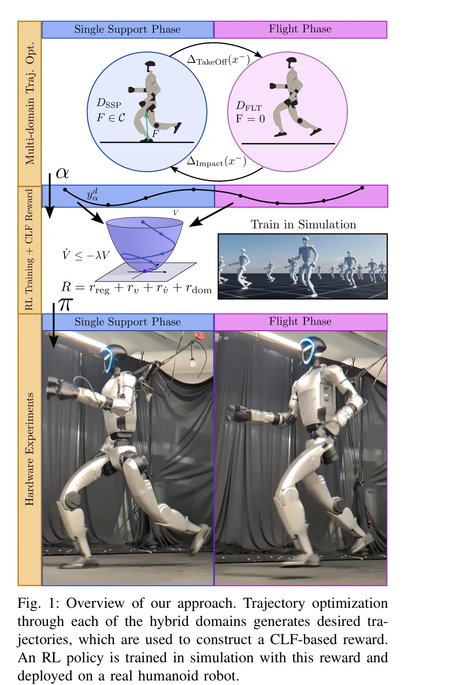

# Chasing Stability: Humanoid Running via Control Lyapunov Function Guided Reinforcement Learning

> **저자**: Zachary Olkin, Kejun Li, William D. Compton, Aaron D. Ames | **날짜**: 2025-09-23 | **URL**: [https://arxiv.org/abs/2509.19573](https://arxiv.org/abs/2509.19573)

---

## Essence

*Fig. 1: Overview of our approach. Trajectory optimization*

본 논문은 Control Lyapunov Function(CLF)의 안정성 조건을 RL 보상에 임베딩하여 휴머노이드 로봇의 달리기를 실현하는 CLF-RL 방법을 제시한다. 이는 휴머노이드가 비행 및 단일 지지 상(flight and single support phases)를 포함한 동적 달리기를 수행하도록 한다.

## Motivation

- **Known**: HZD(Hybrid Zero Dynamics) 프레임워크는 virtual constraints와 feedback linearization을 통해 bipedal 달리기에 certifiable stability를 제공해 왔다. 근래 RL은 접촉이 풍부한 동역학을 직접 학습하여 로봇 제어에서 인기를 얻고 있다.
- **Gap**: 기존 RL 방법은 보상 설계의 휴리스틱한 조정이 필요하며, HZD 기반 하이브리드 궤적을 포함한 선행 연구도 여전히 ad-hoc 방식의 보상 구조를 사용한다. 또한 대부분의 연구는 biped에 국한되고 달리기 시 충분한 위치 추적(low positional drift)을 보이지 못했다.
- **Why**: 휴머노이드 로봇의 동적 달리기는 비선형 하이브리드 시스템 제어의 도전 과제이며, 실제 배포 시 견고성과 정밀한 추적 성능이 필요하다. 이는 자율성 스택(autonomy stack)에 동적 운동을 통합하기 위한 중요한 단계이다.
- **Approach**: 다중 도메인 궤적 최적화로 nominal motion을 생성하고, 이를 CLF 기반 추적 제어기에 통합하며, CLF를 직접 RL 보상에 임베딩하여 보상 설계 없이 certifiable stability를 보장한다. 학습된 정책은 런타임에 CLF나 궤적이 불필요하다.

## Achievement

- **CLF-RL 프레임워크**: CLF의 안정성 조건 ∇V(f+gu)<-λV를 RL 보상에 직접 포함시켜, 휴리스틱한 보상 조정을 제거하고 의미 있는 중간 보상을 제공
- **하이브리드 달리기 실현**: 비행(flight)과 단일 지지(single support) 상을 포함한 완전한 동적 달리기 달성
- **강건한 실제 배포**: Unitree G1 휴머노이드 로봇에서 트레드밀 및 야외 환경에서 안정적으로 작동
- **정확한 추적 제어**: 온보드 센서만으로 위치 및 속도 전역 참조 추적, positional drift 최소화
- **외란 견고성**: 몸통과 발에 적용된 외란에 대한 강건성 실증

## How

- 다중 쏘팅(multi-domain multiple shooting) 궤적 최적화를 통해 SSP(single support phase)와 FLT(flight phase) 도메인에서 가상 제약(virtual constraints) 기반 주기 궤적 생성
- 생성된 궤적으로부터 CLF 기반 추적 제어기 설계: e=x-x_ref에 대해 V(e)=e^T P e로 정의하고 안정성 조건 구성
- CLF의 Lyapunov 함수와 안정성 부등식을 RL 보상으로 변환: r = -V(e) - λV(e) 형태로 보상 구조화
- PPO(Proximal Policy Optimization) 또는 유사 RL 알고리즘으로 시뮬레이션에서 정책 학습
- 학습된 정책을 실제 로봇(Unitree G1)에 배포하여 트레드밀 및 야외 환경에서 검증

## Originality

- CLF의 안정성 조건을 보상 설계에 직접 포함시킨 방식은 기존 ad-hoc 보상 구조의 근본적 개선
- 전체 휴머노이드(biped 아님)에서 flight phase를 포함한 완전한 달리기를 HZD 궤적과 RL 결합으로 실현
- runtime에 CLF나 궤적이 불필요한 순수 정책 기반 제어로, 온보드 컴퓨팅 효율성 향상
- multi-domain 하이브리드 시스템의 transient 및 steady-state 동작을 동시에 생성하는 능력

## Limitation & Further Study

- 궤적 최적화 단계에서 높은 계산 비용 및 초기 조건 민감성에 대한 분석 부족
- Unitree G1 특정 플랫폼에 대한 검증으로, 다른 휴머노이드로의 일반화 가능성 불명확
- CLF 기반 보상의 hyperparameter (λ, P 행렬) 선택에 대한 체계적 가이드라인 부재
- 실외 환경에서의 장시간 실험 데이터 및 에너지 효율성 분석 미흡
- 후속 연구: 더 높은 속도에서의 안정성, 계단 등 복잡한 지형 주행, 다양한 휴머노이드 플랫폼으로의 확장, CLF 보상 구조의 자동 조정 기법 개발

## Evaluation

- Novelty: 4/5
- Technical Soundness: 4/5
- Significance: 4/5
- Clarity: 4/5
- Overall: 4/5

**총평**: 본 논문은 고전 제어 이론(CLF)과 최신 RL을 매우 효과적으로 통합하여, 휴머노이드 로봇의 동적 달리기 제어를 위한 원리 기반의 체계적 프레임워크를 제시한다. 실제 하드웨어에서의 안정적 배포와 강건한 추적 성능은 높은 실용적 가치를 입증한다.
