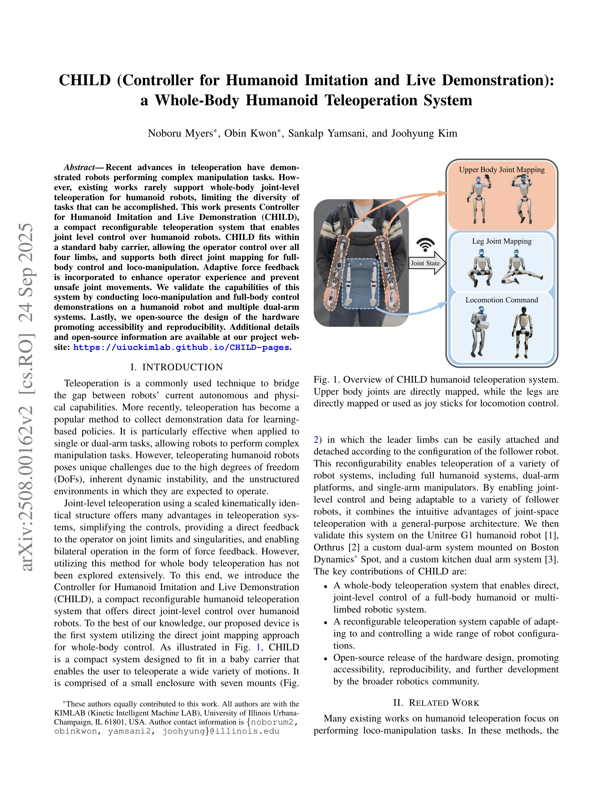
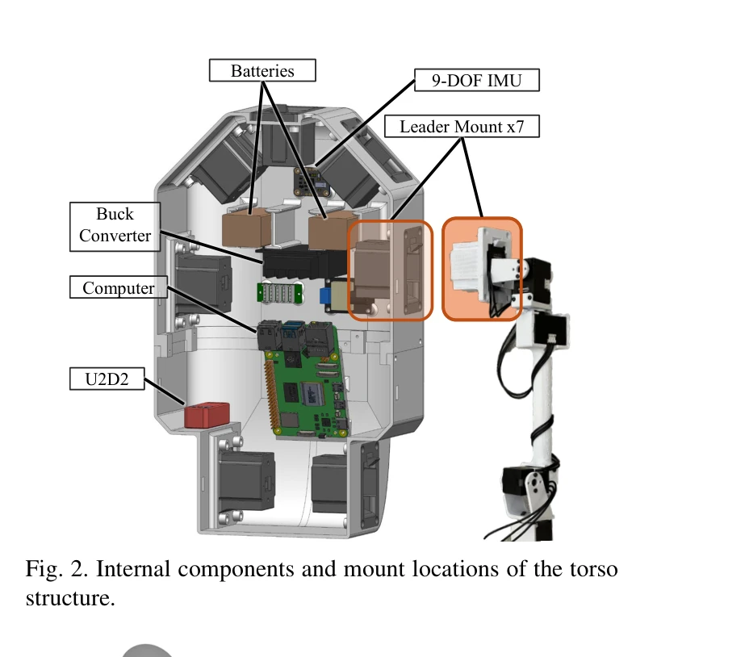

# CHILD (Controller for Humanoid Imitation and Live Demonstration): a Whole-Body Humanoid Teleoperation System

> **저자**: Noboru Myers, Obin Kwon, Sankalp Yamsani, Joohyung Kim | **날짜**: 2025-07-31 | **URL**: [https://arxiv.org/abs/2508.00162](https://arxiv.org/abs/2508.00162)

---

## Essence

*Fig. 1. Overview of CHILD humanoid teleoperation system.*

CHILD는 베이비 캐리어 크기의 컴팩트한 텔레오퍼레이션 장치로, 직접 관절 매핑을 통해 휴머노이드 로봇의 전신 관절 수준 제어를 가능하게 하는 시스템이다.

## Motivation

- **Known**: 기존 텔레오퍼레이션 연구는 단일/이중팔 작업이나 시각 기반 방식에 집중했으며, 휴머노이드 로봇의 전신 관절 제어는 exoskeleton, VR, 모션캡처 등 비용이 높고 복잡한 방식에만 의존해왔다.
- **Gap**: 휴머노이드 로봇의 전신 관절 수준 직접 매핑 텔레오퍼레이션 시스템이 부재하며, 이는 다양한 작업 수행의 다양성을 제한한다.
- **Why**: 전신 관절 제어는 loco-manipulation과 복잡한 전신 움직임을 더 직관적이고 정확하게 수행할 수 있으며, 양방향 피드백을 통해 안전성과 사용성을 향상시킬 수 있기 때문이다.
- **Approach**: kinematically identical scaled leader 구조를 기반으로 7개 마운트가 있는 컴팩트 토르소를 설계하여 다양한 로봇 구성에 재구성 가능하도록 하고, DYNAMIXEL XL330 서보 모터와 적응형 힘 피드백을 통합했다.

## Achievement

*Fig. 1. Overview of CHILD humanoid teleoperation system.*

- **전신 관절 제어 시스템**: 직접 관절 매핑 방식으로 휴머노이드 로봇의 모든 사지를 동시에 관절 수준에서 제어 가능
- **재구성 가능한 아키텍처**: 7개 마운트와 착탈식 클립을 통해 humanoid, dual-arm, single-arm 시스템 등 다양한 로봇에 적응 가능
- **양방향 피드백**: 적응형 힘 피드백으로 관절 한계 및 특이점에 대한 직관적 피드백 제공
- **저비용 오픈소스**: 약 $1k의 저비용으로 3D 프린팅 가능하며 설계를 오픈소스화하여 접근성과 재현성 향상

## How

*Fig. 2. Internal components and mount locations of the torso*

- 베이비 캐리어 내부에 컴퓨터, 9-DoF IMU, U2D2, 배터리, 컨버터 및 7개 리더 마운트 통합
- 각 shoulder configuration에 대응하기 위해 병렬 마운트와 45도 경사진 마운트 포함
- 리더의 관절 설정을 follower와 kinematically identical하게 유지하되 α 계수(예: 0.65~0.9)로 스케일링
- pogo pin 커넥터를 사용하여 리더의 신속한 착탈과 전력/통신 관리 간소화
- IMU를 토르소 관절로 매핑하고 end-effector에 단일-DoF 트리거를 부착하여 그리퍼 제어
- 정적 플랫폼 배치를 위해 6-DoF 모니터 암 스탠드 어댑터 설계

## Originality

- 전신 humanoid 로봇 제어를 위한 직접 관절 매핑 텔레오퍼레이션 시스템 최초 제시
- 베이비 캐리어라는 일상용품을 활용한 혁신적이고 컴팩트한 하드웨어 디자인
- 7개 마운트 구조로 다양한 shoulder configuration과 로봇 플랫폼에 대응하는 재구성성
- 양방향 힘 피드백을 지원하는 joint-level 텔레오퍼레이션의 저비용 구현

## Limitation & Further Study

- 단일 operator가 착용 시 동시에 최대 2개 사지만 직접 제어 가능하며, 전신 제어는 stationary deployment 필요
- kinematically identical 구조의 한계로 인해 특정 로봇의 어깨 각도를 완벽히 일치시키지 못할 수 있음
- adaptive force feedback의 구체적 알고리즘과 효과에 대한 자세한 분석 부족
- Unitree G1, Orthrus, custom kitchen dual-arm 시스템에만 검증되어 다른 humanoid 로봇에 대한 일반화 가능성 미검증
- 후속 연구는 다중 operator 협력 제어, 더 복잡한 과제에 대한 학습 기반 정책 수집, 더 경량의 하드웨어 설계를 다루어야 함

## Evaluation

- Novelty: 4/5
- Technical Soundness: 3/5
- Significance: 4/5
- Clarity: 4/5
- Overall: 4/5

**총평**: 이 논문은 전신 humanoid 텔레오퍼레이션을 위한 직접 관절 매핑 방식을 최초로 제시하였으며, 베이비 캐리어를 활용한 혁신적이고 저비용의 하드웨어 설계와 오픈소스 공개를 통해 robotics 커뮤니티에 실질적인 기여를 제공한다.
