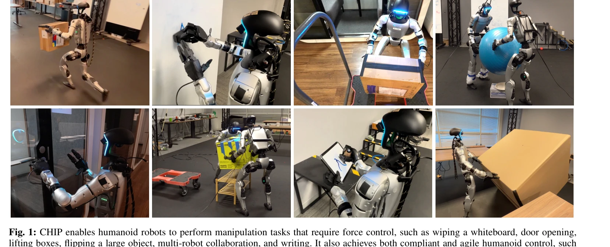
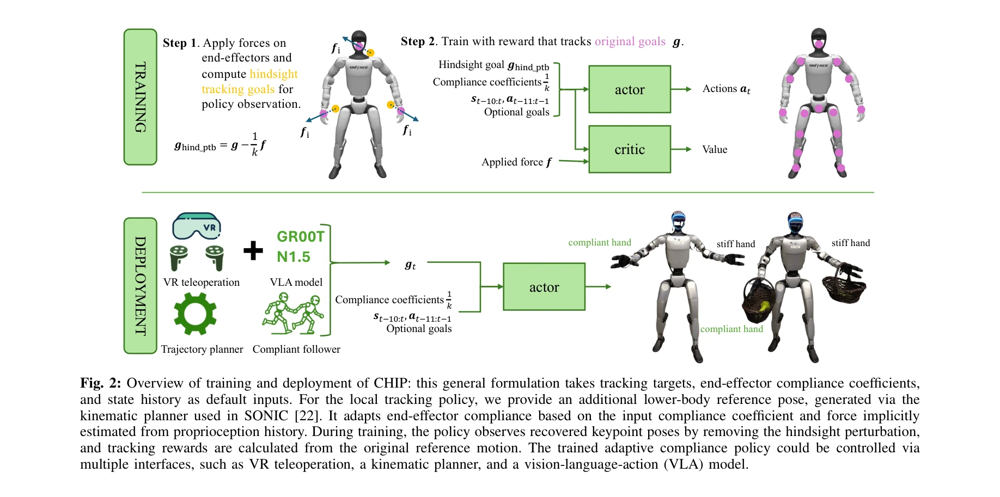

# CHIP: Adaptive Compliance for Humanoid Control through Hindsight Perturbation

> **저자**: Sirui Chen, Zi-ang Cao, Zhengyi Luo, Fernando Castañeda, Chenran Li, Tingwu Wang, Ye Yuan, Linxi "Jim" Fan, C. Karen Liu, Yuke Zhu | **날짜**: 2026-02-09 | **DOI**: [10.48550/arXiv.2512.14689](https://doi.org/10.48550/arXiv.2512.14689)

---

## Essence

*Fig. 1: CHIP enables humanoid robots to perform manipulation tasks that require force control, such as wiping a whiteboa*

CHIP는 hindsight perturbation을 통해 humanoid robot이 민첩한 움직임을 유지하면서도 적응적 compliance를 갖춘 forceful manipulation을 수행할 수 있게 하는 plug-and-play 모듈이다.

## Motivation

- **Known**: Humanoid robot은 backflipping, running 등의 agile locomotion은 성공했으나, forceful manipulation 같은 접촉-풍부한 작업에서는 여전히 제약이 있다. RL 기반 motion tracking은 고정된 stiffness를 가져 compliance 제어에 어려움이 있다.
- **Gap**: 기존 방법들(FACET, SoftMimic, GentleHumanoid)은 synthetic data augmentation이나 offline reward tuning을 요구하며, humanoid에 확장할 때 자연스러운 human motion 분포 밖의 합성 데이터 생성이 어렵다.
- **Why**: Humanoid robot이 agile motion과 safe contact-rich manipulation을 동시에 수행할 수 있으면 실제 산업 응용(wiping, door opening, multi-robot collaboration)에서 일반용 로봇으로 활용 가능해진다.
- **Approach**: 참고 motion을 hindsight perturbation의 compliant response로 해석하여, reference trajectory를 수정하지 않고 sparse tracking goal만 조정함으로써 dense tracking reward는 보존하면서 adaptive compliance를 통합한다.

## Achievement

*Fig. 1: CHIP enables humanoid robots to perform manipulation tasks that require force control, such as wiping a whiteboa*

- **Plug-and-play 모듈**: 기존 humanoid tracking framework에 minimal modification으로 통합 가능하며, data augmentation이나 reward tuning 불필요
- **다양한 forceful manipulation 수행**: Wiping, writing, cart pushing, door opening, multi-robot collaboration 등을 일반화된 motion tracker로 수행
- **Agility 보존**: Dancing, running, squatting 같은 agile locomotion 성능을 유지하면서 compliance control 달성
- **복합 제어 인터페이스**: Local 3-point tracking으로 teleoperation과 VLA policy learning 지원, global 3-point tracking으로 multi-robot coordination 가능

## How

*Fig. 2: Overview of training and deployment of CHIP: this general formulation takes tracking targets, end-effector compl*

- Hindsight perturbation: 원본 reference motion에서 perturbation 효과를 빼서 tracking goal을 정의하되, dense reward 계산은 원본 reference motion 사용
- Adaptive impedance control: 각 task에 필요한 end-effector stiffness를 정책이 학습하도록 하여 variable compliance 달성
- Motion tracking framework 통합: 기존 RL-based humanoid tracking 구조(reference trajectory, tracking reward)를 유지하면서 input space의 tracking goal만 수정
- 3-point keypoint control: Head와 두 손(end-effectors)의 pose를 tracking goal로 사용하여 whole-body control 구현

## Originality

- **Hindsight interpretation의 혁신**: Reference motion을 compliant response로 재해석하여 기존 synthetic data augmentation 패러다임을 회피
- **Input space 수정 전략**: Reference trajectory 자체가 아닌 tracking goal만 수정하여 reliable reward computation 보장
- **확장성**: 기존 humanoid motion tracking framework(Deep-Mimic 계열)에 직접 적용 가능하며, 대규모 diverse motion dataset 처리에 최적화
- **Multi-robot 적용**: Global 3-point tracking을 통해 humanoid 간 world-space coordination 실현

## Limitation & Further Study

- **Simulation-to-reality gap**: 논문이 주로 simulation 결과를 제시하며, 실제 humanoid robot에서의 force control 정확도와 안정성 검증 부족
- **Compliance 범위의 한계**: End-effector stiffness 범위와 modulation 속도에 대한 구체적 분석이나 제약 조건 미명시
- **Contact force 추정**: 실제 접촉력 정보 없이 proprioceptive signal만으로 compliance 제어하므로, high-precision force control이 필요한 응용은 제한적
- **후속 연구**: (1) 실제 humanoid robot(예: Tesla Bot, Boston Dynamics Atlas)에서의 검증, (2) Model-based impedance control과의 fusion, (3) Tactile sensing 통합으로 접촉 감각 기반 compliance 향상

## Evaluation

- Novelty: 4/5
- Technical Soundness: 3/5
- Significance: 4/5
- Clarity: 4/5
- Overall: 4/5

**총평**: CHIP는 humanoid의 agile motion과 compliant manipulation을 양립시키는 우아한 해결책으로, hindsight perturbation이라는 핵심 아이디어의 단순함과 기존 framework와의 호환성이 강점이다. 다만 실제 로봇 검증과 force control의 정량적 분석이 보완되면 더욱 완성도 있는 연구가 될 것이다.
