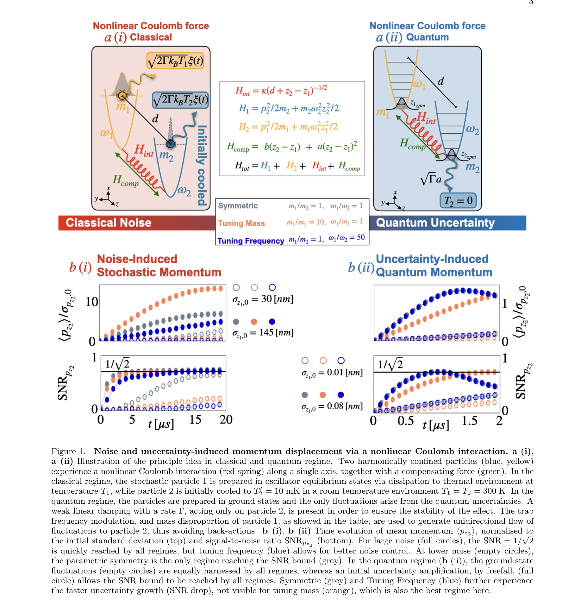

# Climber Force and Motion Estimation from Video

> **저자**:  | **날짜**:  | **URL**: [https://rihat99.github.io/climb_force/](https://rihat99.github.io/climb_force/)

---

## Essence

*Figure 1.*

Coulomb 상호작용의 고조파 부분을 보정하여 남은 비선형 상호작용이 한 입자의 위치 잡음에 의해 다른 입자의 운동량을 일관성 있게 변위시키는 현상을 고전 및 양자 영역에서 관찰한다.

## Motivation

- **Known**: 양자 시스템에서 선형 시스템의 제어는 잘 확립되어 있으며, 대규모 비선형 시스템 구성은 현재의 과제이다. Coulomb 상호작용은 charged particles 간의 기본적인 상호작용이다.
- **Gap**: 고조파 근사를 넘어 비선형 Coulomb 효과를 직접 관찰하는 방법과, 거시적 기계 시스템에서 이러한 효과를 활용하는 방법이 부족하다.
- **Why**: 비선형 양자 상호작용의 제어는 현대 양자 기술의 핵심이며, 기본 물리력(Coulomb force)으로부터 직접 유도되는 비선형 효과는 양자 센싱, 양자 열역학, 양자 컴퓨팅 등 고급 응용에 필수적이다.
- **Approach**: 두 개의 대전된 입자를 고조파 트랩에 가둔 후 Coulomb 상호작용의 고조파 부분을 선형 보정력으로 제거하고, 남은 3차 비선형 항의 효과를 classical stochastic 및 quantum 영역에서 분석한다.

## Achievement

*Figure 2.*

- **비선형 Coulomb 상호작용의 직접 관찰**: 고조파 근사를 벗어난 3차 Coulomb 상호작용이 noise/uncertainty-driven signal-to-noise ratio 증가를 통해 관찰 가능함을 증명
- **광범위한 파라미터 범위에서의 보편성**: trap frequency, mass scale, 온도 범위에 걸쳐 비선형 효과가 지속적으로 나타남을 확인
- **Classical-Quantum 연속성**: 고전 stochastic 영역에서 양자 영역까지 동일한 비선형 현상의 연속적 관찰 가능성 제시
- **비역학적 효과의 역학적 상호작용**: 역학적(reciprocal) Coulomb Hamiltonian으로부터 비역학적(non-reciprocal) noise-induced 효과의 출현 메커니즘 규명

## How

*Figure 1.*

- Hamiltonian 형성: 3차원 고조파 트랩에 갇힌 두 charged particle의 Coulomb 상호작용을 Hamiltonian으로 표현
- 보정력 설계: 전기정적 선형 tilt와 parametric feedback을 통해 1차, 2차 항 제거 및 3차 cubic 상호작용만 남김
- Classical 분석: 온도 불균형 준비(particle 1: 300K, particle 2: 10mK→300K)로 초기 noise distribution을 비대칭화
- 양자화: canonical variables를 operators로 승격하여 quantum 영역 분석, ground state 준비
- Noise-induced 효과 측정: 한 입자의 위치 noise variance가 다른 입자의 momentum displacement mean을 구동하는 과정을 정량화

## Originality

- 기존 trapped ion system에서의 rotating wave approximation을 넘어 일반적인 비선형 Coulomb 효과를 3차 근사 내에서 분석
- Reciprocal Coulomb force로부터 non-reciprocal noise-induced 현상을 유도하는 새로운 물리 메커니즘 제시
- Macroscopic levitated nanoparticle부터 microscopic trapped ion까지 광범위한 질량/빈도 스케일에서 보편적 효과 입증
- High temperature classical stochastic 영역에서 quantum 영역까지의 평탄한 전환 경로에서 비선형 효과 추적

## Limitation & Further Study

- 최적 보정 조건 가정: 실제 구현에서는 불완전한 보정으로 신호 가시성 감소 가능 (SM Note 3 참고)
- 경쟁하는 비선형성의 상쇄: z₁³, z₂³ single-particle 항과 z₁z₂² interparticle 항이 서로 경쟁하여 직접 관찰 어려움 가능
- 후속 연구 방향: Gaussian entanglement 넘어선 non-Gaussian 양자 상태 생성 및 활용, 다중 입자 시스템으로의 확장, 실험적 구현 최적화

## Evaluation

- Novelty: 4/5
- Technical Soundness: 3/5
- Significance: 4/5
- Clarity: 4/5
- Overall: 4/5

**총평**: 이 논문은 기본 물리력(Coulomb force)의 비선형 부분을 체계적으로 분리·강조하여 noise-driven coherent displacement라는 새로운 현상을 이론적으로 제시하며, 고전에서 양자 영역까지 보편적으로 관찰 가능함을 보인 의미 있는 기초 이론 연구이다.
