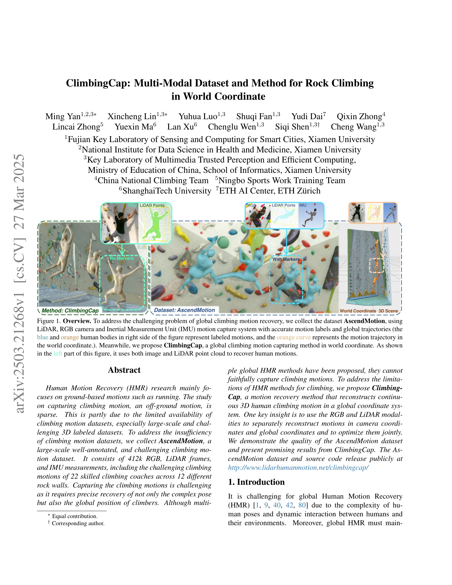
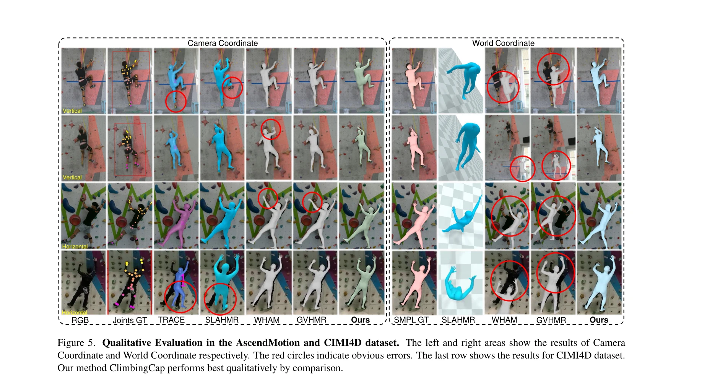

# ClimbingCap: Multi-Modal Dataset and Method for Rock Climbing in World Coordinate

> **저자**: Ming Yan, Xincheng Lin, Yuhua Luo, Shuqi Fan, Yudi Dai, Qixin Zhong, Lincai Zhong, Yuexin Ma, Lan Xu, Chenglu Wen, Siqi Shen, Cheng Wang | **날짜**: 2025-03-27 | **URL**: [https://arxiv.org/abs/2503.21268](https://arxiv.org/abs/2503.21268)

---

## Essence

*Figure 1. Overview. To address the challenging problem of global climbing motion recovery, we collect the dataset Ascend*

ClimbingCap은 RGB와 LiDAR 멀티모달 데이터를 활용하여 암벽 등반 동작을 글로벌 좌표계에서 정확하게 복원하는 방법을 제안하며, 대규모 도전적 등반 동작 데이터셋 AscendMotion을 구축했다.

## Motivation

- **Known**: 기존 Human Motion Recovery 연구는 주로 달리기 같은 지면 기반 동작에 집중했으며, RGB 이미지 기반 카메라 공간 HMR 방법들과 최근의 월드 좌표 HMR 방법들이 제안되었다. 등반 동작 데이터셋으로는 SPEED21(2D, 46k 프레임)과 CIMI4D(3D, 180k 프레임)만 공개되어 있다.
- **Gap**: 기존 등반 동작 데이터셋은 규모가 작고 난이도가 낮으며, 현존하는 HMR 방법들은 오프-그라운드 움직임이면서 복잡한 포즈와 글로벌 위치 정확한 복원이 필요한 등반 동작을 제대로 캡처하지 못한다.
- **Why**: 등반은 올림픽 정식 종목이 되었지만 동작 캡처 연구는 부족하며, 정확한 등반 동작 분석은 스포츠 성능 분석, 안전 교육, 기술 개선에 필수적이다.
- **Approach**: RGB에서는 카메라 좌표의 포즈를, LiDAR 포인트 클라우드에서는 글로벌 좌표의 위치를 별도로 복원한 후 이들을 결합하고 최적화하는 separate coordinate decoding 전략을 채택하며, post-processing과 semi-supervised 학습으로 일관성과 성능을 향상시킨다.

## Achievement

*Figure 5. Qualitative Evaluation in the AscendMotion and CIMI4D dataset. The left and right areas show the results of Ca*

- **AscendMotion 데이터셋**: 412k 프레임의 RGB, LiDAR, IMU 데이터로 구성되며 22명의 숙련된 등반 코치의 12개 암벽에서의 동작을 포함하여 기존 데이터셋(CIMI4D 180k)보다 2배 이상 크고 난이도가 높다.
- **ClimbingCap 방법**: Separate coordinate decoding, post-processing, semi-supervised training의 삼중 전략으로 글로벌 좌표계에서 연속적인 3D 등반 동작을 복원하며 기존 최첨단 방법들을 능가한다.
- **포괄적 검증**: 다중 데이터셋에서 다양한 최첨단 방법들과의 광범위한 실험을 통해 ClimbingCap의 우수성을 입증했다.

## How

*Figure 2. Overview of ClimbingCap. The arrows indicate the three stages of the ClimbingCap framework: separate coordinat*

- **입력 및 특성 추출**: RGB 이미지와 포인트 클라우드를 입력받으며, 포인트 클라우드를 extrinsic matrix로 월드 좌표에서 카메라 좌표로 변환한다.
- **Separate coordinate decoding**: RGB 시퀀스에서 카메라 좌표 포즈를 추출하고 LiDAR 포인트 클라우드에서 글로벌 좌표 위치를 예측한다.
- **Post-processing**: 두 좌표계 간 포즈의 일관성을 확보하고 에러 누적을 방지한다.
- **Semi-supervised training**: Teacher-student 학습 방식으로 쉽게 획득 가능한 비라벨 등반 동작 데이터를 활용하여 모델 성능을 향상시킨다.
- **자동 주석과 수동 정제**: 주석의 정확성을 보장하기 위해 자동 주석을 수동으로 정제한다.

## Originality

- **등반 특화 접근법**: 기존 HMR 방법들과 달리 오프-그라운드 등반 동작의 고유한 도전과제(극단적 팔다리 연장, 암벽과의 인터랙션)를 명시적으로 다룬다.
- **멀티모달 분리 복원**: RGB와 LiDAR를 서로 다른 좌표계 추정에 활용하는 separate coordinate decoding 전략은 기존 방법들의 좌표계 변환 모호성을 해결한다.
- **대규모 도전적 데이터셋**: 숙련된 등반가의 동작만 포함하여 기존 데이터셋보다 난이도와 규모 모두에서 진전을 이룬다.
- **반지도 학습 활용**: 비라벨 등반 데이터의 활용으로 실무적 데이터 수집 제약을 극복한다.

## Limitation & Further Study

- **실내 암벽 환경 제한**: 데이터셋이 12개 실내 암벽에서만 수집되어 야외 자연암벽이나 다양한 환경 일반화 검증이 부족하다.
- **LiDAR 의존성**: 방법이 LiDAR 센서에 의존하여 장비 가용성이 제한된 환경에서의 적용 어려움이 있다.
- **소수 피험자**: 22명의 등반 코치로 제한되어 일반 등반가(초보자, 아마추어)에 대한 성능 검증이 부족할 수 있다.
- **장기 시퀀스 에러 누적**: 논문에서 언급한 대로 글로벌 HMR은 장기 시퀀스에서 에러 누적 문제가 여전히 존재할 수 있다.
- **후속 연구 방향**: 야외 자연암벽 데이터 수집, RGB만으로 작동하는 방식 개발, 실시간 등반 교습 시스템으로의 확장, 다양한 난이도 등반가 포함이 필요하다.

## Evaluation

- Novelty: 4/5
- Technical Soundness: 4/5
- Significance: 4/5
- Clarity: 4/5
- Overall: 4/5

**총평**: ClimbingCap은 미개발 분야인 등반 동작 캡처에 대해 대규모 고품질 데이터셋과 멀티모달 별도 좌표 복원 방식의 창의적 방법론을 제시하여 높은 독창성과 실질적 기여도를 보여준다. 광범위한 실험 검증과 공개 예정인 데이터셋·코드는 커뮤니티 기여도 높으나, 환경 일반화와 단일 모달 방식의 개발이 후속 과제다.

## Related Papers

- 🔄 다른 접근: [[papers/1837_Climber_Force_and_Motion_Estimation_from_Video/review]] — 비디오 기반 동작 추정에서 하나는 암벽 등반의 multi-modal 접근, 다른 하나는 force와 motion의 general한 추정을 다룬다.
- 🔗 후속 연구: [[papers/1907_EmbodMocap_In-the-Wild_4D_Human-Scene_Reconstruction_for_Emb/review]] — RGB와 LiDAR를 활용한 climbing motion 복원을 in-the-wild 4D human-scene reconstruction으로 확장하여 더 일반적인 환경에 적용한다.
- 🧪 응용 사례: [[papers/2015_HUMOTO_A_4D_Dataset_of_Mocap_Human_Object_Interactions/review]] — multi-modal climbing motion dataset이 4D mocap human object interaction 데이터셋의 특수한 케이스로 활용된다.
- 🧪 응용 사례: [[papers/2134_Perceptive_Humanoid_Parkour_Chaining_Dynamic_Human_Skills_vi/review]] — ClimbingCap에서 구축한 등반 동작 데이터셋이 Perceptive Humanoid Parkour의 동적 인간 기술 체이닝에 실제 적용될 수 있는 도전적 동작 데이터를 제공한다.
- 🏛 기반 연구: [[papers/1978_Hiking_in_the_Wild_A_Scalable_Perceptive_Parkour_Framework_f/review]] — Hiking in the Wild의 지각적 파쿠어 프레임워크가 ClimbingCap의 복잡한 지형에서의 동작 분석과 복원에 필요한 환경 인식 기술을 제공한다.
- 🏛 기반 연구: [[papers/1870_DexterCap_An_Affordable_and_Automated_System_for_Capturing_D/review]] — DexterCap의 동작 캡처 시스템이 ClimbingCap에서 복잡한 등반 동작의 정확한 3D 복원을 위한 기술적 기반을 제공한다
- 🔗 후속 연구: [[papers/1837_Climber_Force_and_Motion_Estimation_from_Video/review]] — 암벽 등반의 다중 모달 데이터셋과 방법론이 클라이머의 힘과 운동 추정을 더욱 포괄적이고 실용적으로 확장한다
