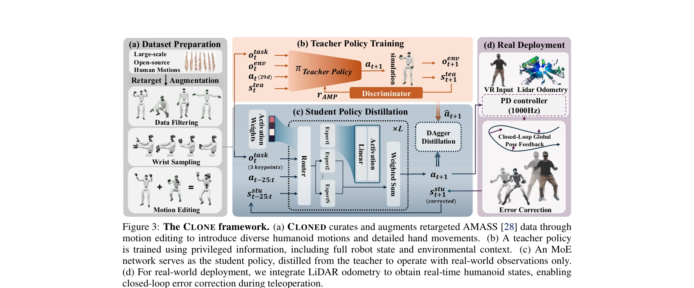

# CLONE: Closed-Loop Whole-Body Humanoid Teleoperation for Long-Horizon Tasks

> **저자**: Yixuan Li, Yutang Lin, Jieming Cui, Tengyu Liu, Wei Liang, Yixin Zhu, Siyuan Huang | **날짜**: 2025-06-10 | **URL**: [https://arxiv.org/abs/2506.08931](https://arxiv.org/abs/2506.08931)

---

## Essence

CLONE은 MoE 기반 폐루프 제어 시스템으로 MR 헤드셋의 헤드와 손 추적만으로 휴머노이드 로봇의 전신 협응 동작을 정밀하게 원격 조종하고 장시간 작업에서 위치 드리프트를 최소화한다.

## Motivation

- **Known**: 기존 휴머노이드 원격 조종 시스템들은 안정성을 위해 상체와 하체 제어를 분리하거나 폐루프 피드백 없이 개루프로 작동하여 누적된 위치 오차가 발생한다.
- **Gap**: 전신 협응을 유지하면서 장시간 작업 동안 정확한 위치 추적을 동시에 달성하는 방법이 부족하며, 폐루프 피드백을 통한 드리프트 보정 메커니즘이 미흡하다.
- **Why**: 휴머노이드 로봇이 인간처럼 자연스러운 움직임으로 복잡한 작업을 수행하려면 전신 협응과 장시간 정밀 제어가 필수적이며, 이는 가정용 보조 로봇과 위험 환경 작업 등 실제 응용에 필수적이다.
- **Approach**: MoE 정책 아키텍처로 다양한 동작 스킬을 학습하면서 자연스러운 상하체 협응을 유지하고, LiDAR 오도메트리와 Apple Vision Pro 추적을 통한 폐루프 오차 보정으로 위치 드리프트를 실시간으로 방지한다.

## Achievement

*Figure 3: The CLONE framework. (a) CLONED curates and augments retargeted AMASS [28] data through*

- **전신 협응 텔레오퍼레이션**: MoE 기반 프레임워크로 걷기와 웅크리기 같은 상충하는 목표를 자연스럽게 통합하여 최초로 장거리 궤적에서 전신 협응을 유지
- **폐루프 오차 보정**: LiDAR 오도메트리 기반 실시간 글로벌 포즈 피드백으로 장시간 작업 중 누적 드리프트를 최소화
- **최소 입력으로 최대 제어**: 상용 MR 헤드셋의 헤드 및 손 포즈 3개 키포인트만으로 전신 29 DoF 제어
- **복잡 협응 동작 실현**: 지면에서 물체 집기 등 정교한 조작과 이동의 통합 동작 구현
- **포괄적 데이터셋**: CLONED 데이터셋으로 AMASS 확장 및 온라인 손 방향 생성 방법으로 조작 시나리오에 강건한 학습

## How

*Figure 3: The CLONE framework. (a) CLONED curates and augments retargeted AMASS [28] data through*

- **데이터셋 구성**: 오픈소스 인간 동작 데이터에서 필터링, 손목 샘플링, 모션 편집을 거쳐 CLONED 데이터셋 준비
- **티처 정책 학습**: AMP(Adversarial Motion Prior) 판별기를 이용한 모방 학습으로 티처 정책 π 훈련
- **MoE 정책 아키텍처**: 라우터를 통해 입력에 따라 여러 Expert를 가중치 조합으로 선택하여 다양한 동작 스킬 통합
- **폐루프 오차 보정**: VR 입력과 LiDAR 오도메트리에서 얻은 글로벌 포즈 피드백으로 실시간 위치 오차 보정
- **학생 정책 증류**: 티처 정책을 학생 정책으로 압축하여 실시간 로봇 제어 가능하도록 최적화
- **저수준 제어**: 1000Hz PD 컨트롤러로 예측된 동작 명령을 실제 관절 제어로 변환

## Originality

- **MoE 기반 전신 제어**: 휴머노이드 텔레오퍼레이션에서 MoE 아키텍처를 최초로 적용하여 상충하는 동작 목표를 자연스럽게 통합
- **폐루프 드리프트 보정**: 양족 로봇의 복잡한 발-지면 상호작용을 고려한 LiDAR 오도메트리 기반 폐루프 오차 보정 메커니즘 도입
- **최소 입력 인터페이스**: 3개 키포인트(헤드, 양손)만으로 전신 29 DoF 제어하는 최소 정보 입력 전략
- **포괄적 데이터 증강**: 기존 모션 캡처 데이터에 온라인 손 방향 생성과 모션 편집을 통한 로봇 특화 데이터셋 구성

## Limitation & Further Study

- **실험 환경 제한**: 주로 실내 환경과 특정 시나리오에서 검증되었으며, 실외 및 극단적 환경 성능 미정
- **LiDAR 의존성**: 폐루프 보정이 LiDAR 오도메트리에 의존하므로 LiDAR가 작동하지 않는 환경에서 성능 저하 가능성
- **일반화 한계**: CLONED 데이터셋이 특정 형태의 동작에 치우쳐 있을 수 있으며, 보이지 않은 복잡한 동작으로의 일반화 정도 미지수
- **지연 시간**: MR 헤드셋에서 로봇까지의 통신 지연이 실시간 폐루프 제어 성능에 미치는 영향 분석 필요
- **후속 연구**: 다양한 환경과 긴급 상황에 대한 강건성 검증, 적응형 동작 학습, 사람-로봇 협력 시나리오 확대 필요

## Evaluation

- Novelty: 4/5
- Technical Soundness: 4/5
- Significance: 4/5
- Clarity: 4/5
- Overall: 4/5

**총평**: CLONE은 MoE 기반 폐루프 제어와 최소 입력 인터페이스를 결합하여 휴머노이드 텔레오퍼레이션의 근본적 제약을 해결한 선도적 연구로, 전신 협응과 장시간 정밀 제어를 동시에 달성한 최초의 실제 시스템 구현이다.

## Related Papers

- 🔗 후속 연구: [[papers/1842_CLOT_Closed-Loop_Global_Motion_Tracking_for_Whole-Body_Human/review]] — 두 논문 모두 폐루프 전역 추적을 다루며 CLONE의 MoE 기반 제어와 CLOT의 고주파 피드백이 상호 보완적인 기술을 제시한다.
- 🏛 기반 연구: [[papers/1806_ARMADA_Augmented_Reality_for_Robot_Manipulation_and_Robot-Fr/review]] — ARMADA의 AR 기반 데이터 수집 기술이 CLONE의 MR 기반 원격조종 시스템 개발에 중요한 기반을 제공했다.
- 🏛 기반 연구: [[papers/1830_Bunny-VisionPro_Real-Time_Bimanual_Dexterous_Teleoperation_f/review]] — Bunny-VisionPro의 실시간 양손 텔레오퍼레이션 기술이 CLONE의 MR 헤드셋 기반 전신 협응 제어 시스템 개발에 기초적인 프레임워크를 제공한다.
- 🔄 다른 접근: [[papers/2147_TeleGate_Whole-Body_Humanoid_Teleoperation_via_Gated_Expert/review]] — CLONE의 MoE 기반 폐루프 제어와 TeleGate의 게이트 전문가 방식은 휴머노이드 전신 텔레오퍼레이션에 대한 서로 다른 제어 아키텍처를 제시한다.
- 🔗 후속 연구: [[papers/2163_TWIST_Teleoperated_Whole-Body_Imitation_System/review]] — TWIST의 전신 모방 시스템이 CLONE의 폐루프 제어에 더 정교한 전신 동작 모방 기능을 추가하여 확장된다.
- 🏛 기반 연구: [[papers/1756_Whole-Body_Bilateral_Teleoperation_with_Multi-Stage_Object_P/review]] — 전신 양측 텔레오퍼레이션의 다단계 객체 처리 기술이 CLONE의 장시간 작업에서 위치 드리프트 최소화에 필요한 기술적 토대를 제공한다.
- 🏛 기반 연구: [[papers/2124_Open-TeleVision_Teleoperation_with_Immersive_Active_Visual_F/review]] — Open-TeleVision의 몰입형 시각적 원격조종이 CLONE에서 MR 헤드셋 기반 원격 제어의 시각적 피드백 향상에 기술적 기반을 제공한다
- 🔄 다른 접근: [[papers/1756_Whole-Body_Bilateral_Teleoperation_with_Multi-Stage_Object_P/review]] — 두 시스템 모두 전신 휴머노이드 원격조작을 다루지만 CLONE은 closed-loop 제어에, 이 연구는 물체 매개변수 추정에 중점을 둡니다.
- 🔄 다른 접근: [[papers/1806_ARMADA_Augmented_Reality_for_Robot_Manipulation_and_Robot-Fr/review]] — 두 논문 모두 AR/MR 기술을 활용한 원격조종 시스템이지만 ARMADA는 데이터 수집, CLONE은 실시간 제어에 집중한다.
- 🔗 후속 연구: [[papers/1830_Bunny-VisionPro_Real-Time_Bimanual_Dexterous_Teleoperation_f/review]] — Bunny-VisionPro의 실시간 양손 텔레오퍼레이션 기술이 CLONE의 MR 헤드셋 기반 전신 협응 제어로 확장되어 더 포괄적인 휴머노이드 제어를 가능하게 한다.
- 🔄 다른 접근: [[papers/1842_CLOT_Closed-Loop_Global_Motion_Tracking_for_Whole-Body_Human/review]] — 두 논문 모두 전신 humanoid 원격조종의 폐루프 제어를 다루지만 CLOT은 전역 추적, CLONE은 협응 동작에 특화되었다.
- 🔗 후속 연구: [[papers/1775_A_Closed-Form_Geometric_Retargeting_Solver_for_Upper_Body_Hu/review]] — CLONE의 closed-loop teleoperation이 SEW-Mimic의 실시간 inverse kinematics와 결합되어 더 정확한 원격조작을 가능하게 합니다.
- 🏛 기반 연구: [[papers/1860_Deep_Imitation_Learning_for_Humanoid_Loco-manipulation_throu/review]] — 폐쇄 루프 전신 텔레오퍼레이션의 기본 프레임워크를 제공합니다.
- 🏛 기반 연구: [[papers/1921_ExtremControl_Low-Latency_Humanoid_Teleoperation_with_Direct/review]] — CLONE의 장기간 폐루프 전신 원격 조작 기술이 ExtremControl의 저지연 원격 조작을 위한 기본적인 teleoperation 프레임워크를 제공한다.
- 🏛 기반 연구: [[papers/1977_High-Speed_and_Impact_Resilient_Teleoperation_of_Humanoid_Ro/review]] — CLONE의 closed-loop 전신 텔레오퍼레이션이 고속 충격 강건 제어의 기반이 됩니다.
- 🔄 다른 접근: [[papers/1983_HOMIE_Humanoid_Loco-Manipulation_with_Isomorphic_Exoskeleton/review]] — 원격조종 시스템을 HOMIE는 외골격 기반으로, CLONE는 closed-loop 기반으로 각각 접근한다.
- 🔗 후속 연구: [[papers/2043_Learning_Adaptive_Neural_Teleoperation_for_Humanoid_Robots_F/review]] — 적응형 신경 텔레오퍼레이션을 폐쇄 루프 전신 제어와 결합하여 장기간 안정적인 원격 조작 시스템을 구현할 수 있다.
- 🏛 기반 연구: [[papers/2118_OmniClone_Engineering_a_Robust_All-Rounder_Whole-Body_Humano/review]] — CLONE의 closed-loop 전신 텔레오퍼레이션 기술이 OmniClone의 robust한 전신 휴머노이드 텔레오퍼레이션 시스템 개발에 핵심적인 기반을 제공한다.
- 🔗 후속 연구: [[papers/2163_TWIST_Teleoperated_Whole-Body_Imitation_System/review]] — 폐루프 전신 휴머노이드 원격조작이 전신 모방 시스템의 확장된 형태이다.
- 🔗 후속 연구: [[papers/2164_TWIST2_Scalable_Portable_and_Holistic_Humanoid_Data_Collecti/review]] — TWIST2의 확장 가능한 데이터 수집을 CLONE의 closed-loop 전신 텔레오퍼레이션과 결합하면 더 효율적인 장기 학습 데이터 생성이 가능합니다.
- 🔄 다른 접근: [[papers/2147_TeleGate_Whole-Body_Humanoid_Teleoperation_via_Gated_Expert/review]] — CLONE의 closed-loop teleoperation이 TeleGate의 gated expert selection과 다른 continuous control 접근법으로 real-time whole-body teleoperation을 달성합니다.
