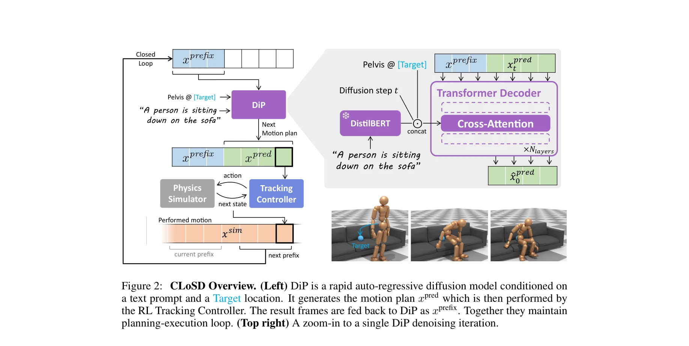

# CLoSD: Closing the Loop between Simulation and Diffusion for multi-task character control

> **저자**: Guy Tevet, Sigal Raab, Setareh Cohan, Daniele Reda, Zhengyi Luo, Xue Bin Peng, Amit H. Bermano, Michiel van de Panne | **날짜**: 2024-10-04 | **URL**: [https://arxiv.org/abs/2410.03441](https://arxiv.org/abs/2410.03441)

---

## Essence

*Figure 1: CLoSD is a multi-task physics-based RL controller, capable of performing object inter-*

CLoSD는 motion diffusion 모델과 RL 기반 physics 시뮬레이션을 폐쇄 루프로 연결하여, 텍스트 프롬프트와 타겟 위치로 제어되는 다중 태스크 캐릭터 제어를 실현한다.

## Motivation

- **Known**: Motion diffusion 모델은 다양한 모션 생성이 가능하고 텍스트 제어가 직관적이지만, RL 기반 physics 제어는 물리적 그럴듯성과 환경 상호작용을 제공한다.
- **Gap**: 기존 RL 방법들은 개별 태스크마다 별도의 정책과 보상 엔지니어링이 필요했으며, 큰 규모의 human motion 데이터셋을 활용하기 어려웠다.
- **Why**: 텍스트 제어와 물리적 그럴듯성, 그리고 환경 상호작용을 모두 지원하는 통합 시스템은 실시간 인터렉티브 캐릭터 애니메이션을 위해 중요하다.
- **Approach**: Diffusion Planner (DiP)라는 autoregressive diffusion 모델을 motion tracker와 폐쇄 루프로 연결하되, DiP는 텍스트와 타겟 위치로 조건화된 빠른 모션 계획을 생성하고, 추적 컨트롤러가 이를 실행하며 시뮬레이션 피드백을 다시 제공한다.

## Achievement

*Figure 1: CLoSD is a multi-task physics-based RL controller, capable of performing object inter-*

- **다중 태스크 통합 제어**: 목표 지점 도달, 손/발로 객체 타격, 앉기/일어나기 등 다양한 태스크를 단일 정책으로 수행
- **실시간 성능**: 40프레임 계획 생성을 3,500 fps(175배 실시간)로 달성하여 대화형 제어 가능
- **우수한 성능**: 기존 text-to-motion 컨트롤러 및 다중 태스크 SOTA 방법 대비 성능 향상
- **환경 상호작용**: physics 시뮬레이션을 통해 객체 상호작용 시 non-physical 아티팩트(부동, 미끄러짐, 침투) 자동 보정

## How

*Figure 2: CLoSD Overview. (Left) DiP is a rapid auto-regressive diffusion model conditioned on*

- Diffusion Planner (DiP)를 autoregressive 방식으로 설계하여 단 10 diffusion steps로 고품질 모션 생성
- MDM의 HumanML3D 표현과 PHC의 global position/velocity 표현 간 변환 함수 R2G 구현
- PHC 기반 motion tracking policy를 DiP와 in-the-loop 방식으로 파인튜닝하여 폐쇄 루프 상태 수열에 대한 견고성 확보
- 텍스트 프롬프트와 타겟 위치(예: 손/발 타겟)를 모두 조건으로 사용하여 세밀한 제어 구현
- 시뮬레이션 피드백을 DiP에 autoregressive하게 전달하여 환경 인식 행동 생성

## Originality

- Motion diffusion을 offline 생성 모델이 아닌 **on-the-fly universal planner**로 활용하는 새로운 패러다임
- Diffusion 기반 계획과 RL 기반 추적 실행을 폐쇄 루프로 연결한 최초의 시도
- Autoregressive diffusion으로 실시간 인터렉티브 텍스트 제어 달성
- 단일 정책으로 다중 태스크(goal-reaching, object interaction, striking)를 통합 처리

## Limitation & Further Study

- 논문에서 정량적 평가 지표나 비교 실험 상세 결과가 발췌 부분에 부족함
- Diffusion 모델의 hallucination 또는 부정확한 계획에 대한 대응 메커니즘 설명 부족
- 복잡한 다중 객체 상호작용이나 매우 동적인 환경에서의 성능 한계 미언급
- DiP의 학습 데이터셋, 파인튜닝 전략, 수렴 특성 등 구체적 학습 세부사항 미제공
- 후속 연구: 더 복잡한 인간-환경 상호작용, 멀티 에이전트 제어, 사용자 연구를 통한 평가

## Evaluation

- Novelty: 4/5
- Technical Soundness: 3/5
- Significance: 4/5
- Clarity: 3/5
- Overall: 4/5

**총평**: CLoSD는 diffusion 기반 계획과 RL 기반 추적을 폐쇄 루프로 통합하여 텍스트 제어와 물리적 그럴듯성을 동시에 달성하는 창의적인 접근법을 제시하며, 실시간 다중 태스크 캐릭터 제어의 새로운 가능성을 보여준다.

## Related Papers

- 🔗 후속 연구: [[papers/1643_RL_from_Physical_Feedback_Aligning_Large_Motion_Models_with/review]] — RLPF의 물리 피드백 기반 모션 모델 정제를 CLoSD의 diffusion-시뮬레이션 폐쇄루프로 확장한 형태
- 🏛 기반 연구: [[papers/1670_SENTINEL_A_Fully_End-to-End_Language-Action_Model_for_Humano/review]] — SENTINEL의 flow matching 기반 행동 생성이 CLoSD의 motion diffusion 모델과 직접적으로 연관된 기반 기술
- 🔄 다른 접근: [[papers/2026_InterMimic_Towards_Universal_Whole-Body_Control_for_Physics-/review]] — diffusion-시뮬레이션 폐쇄루프와 InterMimic의 물리 기반 전신 제어는 다중 태스크 캐릭터 제어의 서로 다른 접근법
- 🔄 다른 접근: [[papers/1820_BeyondMimic_From_Motion_Tracking_to_Versatile_Humanoid_Contr/review]] — 텍스트 기반 캐릭터 제어에서 CLoSD는 diffusion-physics 루프, BeyondMimic은 motion tracking 기반으로 다른 접근법을 사용한다.
- 🏛 기반 연구: [[papers/1701_Taming_Diffusion_Probabilistic_Models_for_Character_Control/review]] — diffusion 모델을 캐릭터 제어에 적용하는 기본 개념이 CLoSD의 physics-diffusion 폐쇄루프 설계에 이론적 토대를 제공한다.
- 🔗 후속 연구: [[papers/2168_UniAct_Unified_Motion_Generation_and_Action_Streaming_for_Hu/review]] — CLoSD의 diffusion-RL 폐쇄 루프가 UniAct의 통합 모션 생성으로 확장되어 더 seamless한 행동 스트리밍을 달성할 수 있다
- 🔄 다른 접근: [[papers/1930_Flexible_Motion_In-betweening_with_Diffusion_Models/review]] — 모션 생성을 위해 diffusion-RL 폐쇄 루프 vs flexible motion in-betweening이라는 서로 다른 diffusion 활용 방식을 비교할 수 있다
- 🏛 기반 연구: [[papers/1643_RL_from_Physical_Feedback_Aligning_Large_Motion_Models_with/review]] — CLoSD의 diffusion-시뮬레이션 폐쇄루프가 RLPF의 물리 피드백 기반 모델 정제 방법론의 직접적 기반
- 🔄 다른 접근: [[papers/1614_Physically_Consistent_Humanoid_Loco-Manipulation_using_Laten/review]] — 두 논문 모두 diffusion 모델로 휴머노이드 제어를 다루지만, 본 논문은 latent space에서, CLoSD는 simulation-diffusion loop에서 작동함
- 🏛 기반 연구: [[papers/1820_BeyondMimic_From_Motion_Tracking_to_Versatile_Humanoid_Contr/review]] — CLoSD의 diffusion-physics 폐쇄루프 개념이 BeyondMimic의 motion tracking과 classifier guidance 결합에 이론적 토대를 제공한다.
- 🧪 응용 사례: [[papers/2092_MaskedMimic_Unified_Physics-Based_Character_Control_Through/review]] — 시뮬레이션과 확산 모델 간의 폐루프 연결을 통해 마스킹된 모션 제어를 실제 구현한 응용이다.
- 🔗 후속 연구: [[papers/2170_Unified_Human-Scene_Interaction_via_Prompted_Chain-of-Contac/review]] — 시뮬레이션과 diffusion 간의 루프를 닫는 기본 개념을 인간-장면 상호작용의 물리적 타당성 보장으로 확장한다.
