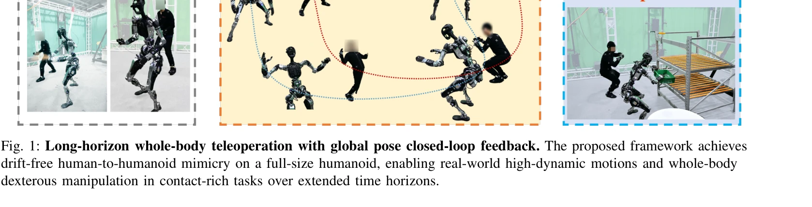
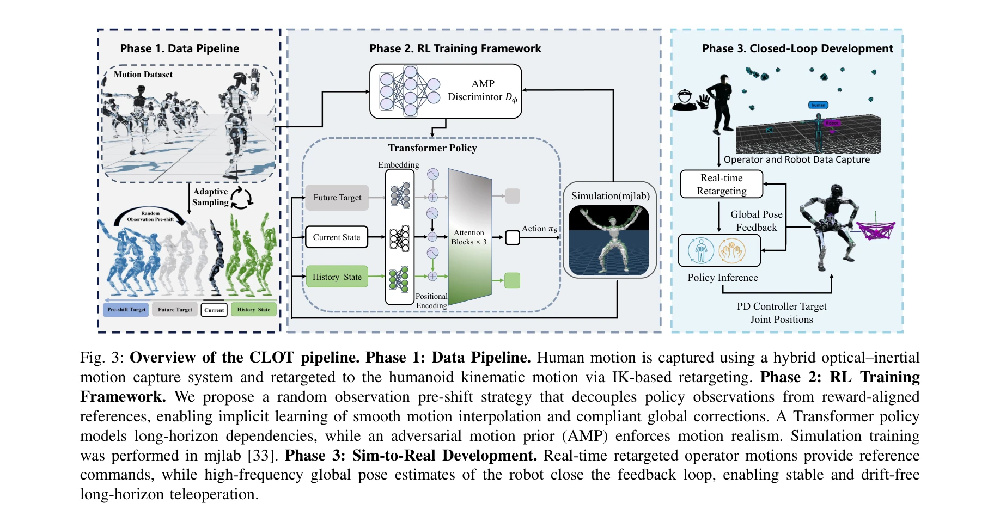

# CLOT: Closed-Loop Global Motion Tracking for Whole-Body Humanoid Teleoperation

> **저자**: Tengjie Zhu, Guanyu Cai, Yang Zhaohui, Guanzhu Ren, Haohui Xie, ZiRui Wang, Junsong Wu, Jingbo Wang, Xiaokang Yang, Yao Mu, Yichao Yan | **날짜**: 2026-02-13 | **URL**: [https://arxiv.org/abs/2602.15060](https://arxiv.org/abs/2602.15060)

---

## Essence

*Fig. 1: Long-horizon whole-body teleoperation with global pose closed-loop feedback. The proposed framework achieves*

CLOT는 고주파 로컬라이제이션 피드백을 통해 폐루프 전역 자세 추적을 달성하는 실시간 인간형 로봇 원격조종 시스템으로, 장시간 운영 중 누적되는 전역 드리프트 문제를 해결한다.

## Motivation

- **Known**: 최근 학습 기반 추적 방법은 민첩하고 조율된 움직임을 가능하게 하지만, 로봇의 로컬 프레임에서 작동하며 전역 자세 피드백을 무시하여 장시간 실행 중 드리프트와 불안정성이 발생한다.
- **Gap**: 기존 전체 신체 추적 시스템은 로컬 로봇 프레임에서 작동하여 전역 드리프트 문제가 있으며, 강화학습에서 직접적인 전역 추적 보상을 적용하면 공격적이고 불안정한 보정이 발생한다.
- **Why**: 장시간 안정적인 인간형 로봇 원격조종은 현실 세계 데이터 수집과 구체화된 지능 발전의 필수 요소이며, 전역 드리프트 제거는 안전성과 작업 성공률을 크게 향상시킨다.
- **Approach**: Observation Pre-shift라는 데이터 기반 무작위화 전략으로 관찰 궤적과 보상 궤적을 분리하여 암묵적 모션 보간 학습을 가능하게 하고, Transformer 기반 정책과 adversarial motion prior 정규화를 결합한다.

## Achievement

*Fig. 1: Long-horizon whole-body teleoperation with global pose closed-loop feedback. The proposed framework achieves*

- **폐루프 전역 제어**: 로컬라이제이션 피드백을 통한 실시간 전체 신체 원격조종으로 장시간 드리프트 없는 인간-인간형 로봇 모방 달성
- **Observation Pre-shift 전략**: 목표 자세를 관찰에서만 미래 타임스탬프로 무작위 설정하면서 보상은 현재 시간과 정렬하여 부드럽고 안정적인 전역 보정 가능
- **고품질 인간 모션 데이터셋**: 인간형 로봇 역학과 호환되도록 엄격한 프로토콜로 수집한 20시간의 다양한 인간 모션 데이터
- **Transformer 기반 정책**: 시공간 정보 포착 능력이 강화된 정책 네트워크로 1300 GPU시간 이상 훈련
- **실제 배포 및 검증**: 31 DoF Adam Pro 인간형 로봇에서 동적 모션, 고정밀 추적, 강건한 sim-to-real 전이 검증

## How

*Fig. 3: Overview of the CLOT pipeline. Phase 1: Data Pipeline. Human motion is captured using a hybrid optical–inertial*

- OptiTrack 광학 동작 포착 시스템으로 인간 움직임과 로봇 전역 자세를 동시에 고정밀도로 기록
- Pinocchio IK solver를 사용한 온라인 동작 재타겟팅으로 인간 동작을 로봇 목표 궤적으로 변환
- 목표 자세를 관찰 입력에서는 무작위 미래 타임스탬프로, 보상 계산에서는 현재 시간으로 설정하는 Observation Pre-shift 기법 적용
- PPO(Proximal Policy Optimization)로 전체 신체 추적 정책 훈련
- Adversarial Motion Prior (AMP) 보상으로 부자연스러운 동작 아티팩트 억제
- 손과 손가락 움직임에는 재타겟팅된 조인트 참조에 대한 직접 PD 추적 적용

## Originality

- **Observation Pre-shift 전략**: 관찰과 보상 궤적 분리를 통한 새로운 데이터 기반 무작위화 기법으로, 기존 강화학습 방식의 공격적 보정 문제를 해결하는 창의적 접근
- **폐루프 전역 제어 통합**: 기존 로컬 프레임 기반 추적에 고주파 로컬라이제이션 피드백을 시스템적으로 통합한 구조
- **목표 지향형 인간형 로봇 데이터셋**: 기존 애니메이션 목적의 공개 데이터셋과 달리 실제 인간형 로봇 역학과 호환성을 위해 엄격하게 수집한 자체 데이터셋
- **Transformer 기반 정책 아키텍처**: 시공간 정보 포착에 최적화된 신경망 설계로 복잡한 전체 신체 움직임 모델링

## Limitation & Further Study

- 광학 동작 포착 시스템에 의존하여 야외 환경이나 GPS 신호가 약한 환경에서의 적용 가능성 제한
- 20시간의 인간 모션 데이터는 특정 유형의 움직임에 편향될 가능성 있으며, 더 광범위한 동작 범주에 대한 일반화 성능 검증 필요
- 31 DoF의 Adam Pro 로봇에만 배포되었으므로, 다른 형태의 인간형 로봇 플랫폼으로의 이전성 검증 부족
- 손과 손가락 움직임에는 폐루프 피드백 없이 직접 PD 추적만 적용되어 복잡한 조작 작업에서의 정밀도 제한 가능성
- **후속연구**: 시각 기반 또는 라이더 기반 로컬라이제이션으로 광학 시스템 의존성 제거, 더 큰 규모의 다양한 인간 모션 데이터셋 수집, 다양한 인간형 로봇 플랫폼에 대한 적응 학습 방법 개발

## Evaluation

- Novelty: 4/5
- Technical Soundness: 3/5
- Significance: 4/5
- Clarity: 4/5
- Overall: 4/5

**총평**: CLOT는 폐루프 전역 제어와 Observation Pre-shift 데이터 기반 무작위화 전략을 통해 장시간 드리프트 없는 인간형 로봇 원격조종을 달성한 혁신적 시스템으로, 실제 인간형 로봇에서의 포괄적 검증과 고품질 데이터셋 공개는 이 분야의 중요한 기여이다.

## Related Papers

- 🔄 다른 접근: [[papers/1839_CLONE_Closed-Loop_Whole-Body_Humanoid_Teleoperation_for_Long/review]] — 두 논문 모두 전신 humanoid 원격조종의 폐루프 제어를 다루지만 CLOT은 전역 추적, CLONE은 협응 동작에 특화되었다.
- 🏛 기반 연구: [[papers/2163_TWIST_Teleoperated_Whole-Body_Imitation_System/review]] — TWIST의 whole-body teleoperation 기술이 CLOT의 closed-loop global tracking 시스템 개발에 기본 프레임워크를 제공했다.
- 🔗 후속 연구: [[papers/2164_TWIST2_Scalable_Portable_and_Holistic_Humanoid_Data_Collecti/review]] — CLOT의 폐루프 전역 추적이 TWIST2의 확장 가능한 데이터 수집으로 확장되어 더 견고한 원격조종 데이터 생성을 가능하게 한다
- 🏛 기반 연구: [[papers/1921_ExtremControl_Low-Latency_Humanoid_Teleoperation_with_Direct/review]] — 저지연 휴머노이드 원격조종이 CLOT에서 실시간 전역 자세 추적의 고주파 피드백 구현에 기술적 기반을 제공한다
- 🔗 후속 연구: [[papers/1839_CLONE_Closed-Loop_Whole-Body_Humanoid_Teleoperation_for_Long/review]] — 두 논문 모두 폐루프 전역 추적을 다루며 CLONE의 MoE 기반 제어와 CLOT의 고주파 피드백이 상호 보완적인 기술을 제시한다.
- 🔗 후속 연구: [[papers/1974_Hierarchical_Vision-Language_Planning_for_Multi-Step_Humanoi/review]] — CLOT의 closed-loop 추적 기술을 다단계 조작 작업의 저수준 제어기로 확장 적용한 형태다.
