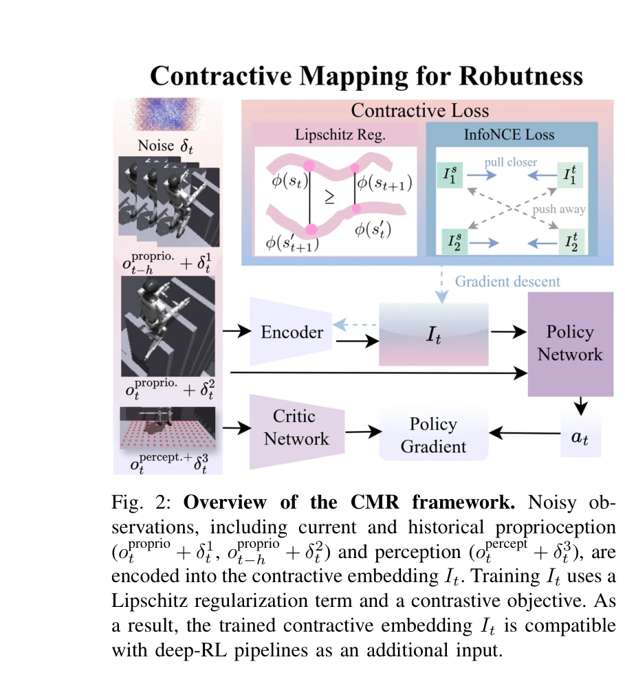

# CMR: Contractive Mapping Embeddings for Robust Humanoid Locomotion on Unstructured Terrains

> **저자**: Qixin Zeng, Hongyin Zhang, Shangke Lyu, Junxi Jin, Donglin Wang, Chao Huang | **날짜**: 2026-02-03 | **URL**: [https://arxiv.org/abs/2602.03511](https://arxiv.org/abs/2602.03511)

---

## Essence

*Fig. 2: Overview of the CMR framework. Noisy ob-*

CMR은 관찰 노이즈에 강건한 휴머노이드 로봇 보행을 위해 contrastive representation learning과 Lipschitz regularization을 결합하여 disturbance를 attenuate하는 latent space를 학습하는 프레임워크이다.

## Motivation

- **Known**: deep RL을 통한 휴머노이드 보행이 복잡한 지형에서 가능하나, 센서 노이즈와 sim-to-real gap으로 인해 정책이 불안정해진다. 기존 Lipschitz 제약 방법(LCP)은 단순한 보행에만 제한된다.
- **Gap**: 복잡한 휴머노이드 보행에서 관찰 노이즈에 대한 체계적 robustness 분석과 이론적 보장이 부족하다. 기존 low-pass filter나 smoothness reward는 튜닝 오버헤드와 탐색 제한 문제가 있다.
- **Why**: 미구조화된 지형에서 휴머노이드 로봇의 배포 시 센서 노이즈는 불가피하며, 이를 견디는 강건한 제어기는 실세계 응용에 필수적이다.
- **Approach**: CMR은 관찰 값을 contractive mapping을 통해 latent space로 인코딩하여 local perturbation이 시간에 따라 감소하도록 유도하고, contraction mapping theorem을 적용하여 return gap에 대한 이론적 경계를 제시한다.

## Achievement

*Fig. 1: The left panel illustrates diverse types of challenging*

- **이론적 기여**: contraction mapping theorem을 learning-based 휴머노이드 보행에 처음 적용하여 observation noise 하에서 return gap의 엄밀한 상한을 도출
- **실험적 성능**: 다양한 지형(stairs, stepping stones, balance beams 등)에서 CMR이 기존 알고리즘 대비 노이즈 증가 시 우수한 성능 달성
- **통합 용이성**: CMR이 auxiliary loss term으로 표현되어 기존 deep RL 파이프라인에 최소한의 추가 노력으로 통합 가능
- **일반화**: sim-to-sim 실험에서 zero-shot 배포 시에도 성능 유지 확인

## How

*Fig. 2: Overview of the CMR framework. Noisy ob-*

- POMDP 기반 휴머노이드 보행 문제를 정식화하되, 관찰값에 uniform noise δ_t^s를 추가하여 모델링
- encoder I_t가 현재/과거 proprioception 및 perception을 latent space로 매핑하도록 학습
- Lipschitz regularization을 통해 latent dynamics의 Lipschitz constant를 제어하여 contraction 성질 보장
- contrastive representation learning objective를 결합하여 task-relevant geometry 보존 동시에 노이즈 감쇠 달성
- deep RL policy optimizer와 함께 end-to-end 학습 수행

## Originality

- contraction mapping theorem을 휴머노이드 로봇 제어 문제에 처음 엄밀하게 적용하고 robustness 보장과 연계
- contrastive learning과 Lipschitz constraint를 결합한 novel한 결합 방식으로 semantic preservation과 disturbance attenuation을 동시 달성
- 기존 low-pass filter, smoothness reward, teacher-student 방식과 달리 적응적이고 parameter-free한 robust embedding 학습 제시

## Limitation & Further Study

- 논문에서 제시된 실험은 주로 시뮬레이션 기반이며, 실제 로봇에서의 검증 부족
- contraction 강도를 제어하는 하이퍼파라미터 선택에 대한 체계적 지침 미흡
- noise model이 uniform distribution으로 제한되어 있으며, 색상 노이즈(colored noise)나 비정상 노이즈에 대한 확장 미흡
- 고차원 관찰(high-resolution camera 등)에 대한 scalability 분석 부재
- 후속연구로 실제 로봇 배포, 다양한 노이즈 분포에 대한 적응, 그리고 vision-based 고차원 입력 처리 개선 필요

## Evaluation

- Novelty: 4/5
- Technical Soundness: 4/5
- Significance: 4/5
- Clarity: 4/5
- Overall: 4/5

**총평**: CMR은 contraction mapping theorem을 휴머노이드 로봇 제어에 엄밀하게 도입하여 이론적 근거와 실증적 성능을 모두 제시한 강한 논문이다. 다양한 지형에서의 노이즈 robustness 개선과 기존 파이프라인과의 용이한 통합이 주요 강점이나, 실제 로봇 검증과 노이즈 모델 확장이 필요하다.

## Related Papers

- 🔗 후속 연구: [[papers/1780_A_Hybrid_Autoencoder_for_Robust_Heightmap_Generation_from_Fu/review]] — LiDAR 기반 지형 인식의 노이즈 문제를 contractive representation learning으로 해결하여 더 강건한 시스템을 구현한다.
- 🔄 다른 접근: [[papers/1791_Advancing_Humanoid_Locomotion_Mastering_Challenging_Terrains/review]] — 복잡한 지형에서의 강건한 휴머노이드 보행을 위해 서로 다른 노이즈 처리 방법론을 제시하는 상호 보완적 접근이다.
- 🏛 기반 연구: [[papers/1850_Contrastive_Representation_Learning_for_Robust_Sim-to-Real_T/review]] — contrastive representation learning의 기초 이론이 robust sim-to-real transfer에 활용되어 휴머노이드 locomotion에 적용된다.
- 🏛 기반 연구: [[papers/1826_Biomechanical_Comparisons_Reveal_Divergence_of_Human_and_Hum/review]] — GDAF의 인간-휴머노이드 보행 차이 분석이 CMR의 노이즈에 강건한 보행 학습에서 생체역학적 통찰을 제공한다.
- 🔄 다른 접근: [[papers/1849_Contact-Aided_Invariant_Extended_Kalman_Filtering_for_Robot/review]] — CMR의 contrastive learning 기반 강건성과 Contact-Aided InEKF의 센서 융합 기반 상태 추정은 노이즈 문제에 대한 서로 다른 해결책이다.
- 🧪 응용 사례: [[papers/2061_Learning_Sim-to-Real_Humanoid_Locomotion_in_15_Minutes/review]] — CMR의 관찰 노이즈에 강건한 표현 학습이 15분 만에 sim-to-real 휴머노이드 보행을 학습하는 빠른 적응에 실질적으로 활용될 수 있다.
- 🔗 후속 연구: [[papers/1843_CMR_Contractive_Mapping_Embeddings_for_Robust_Humanoid_Locom/review]] — CMR의 contractive mapping이 더 강력한 노이즈 저항성을 가진 휴머노이드 보행으로 확장될 수 있다
- 🏛 기반 연구: [[papers/1688_Spectral_Normalization_for_Lipschitz-Constrained_Policies_on/review]] — Lipschitz 제약 정책을 위한 spectral normalization이 CMR에서 disturbance attenuation을 위한 Lipschitz regularization의 구현 기반을 제공한다
- 🔗 후속 연구: [[papers/1826_Biomechanical_Comparisons_Reveal_Divergence_of_Human_and_Hum/review]] — GDAF의 생체역학적 분석이 CMR의 강건한 휴머노이드 보행 학습에서 인간-로봇 보행 차이를 이해하는 이론적 기반을 제공한다.
- 🔄 다른 접근: [[papers/1829_Bridging_the_Sim-to-Real_Gap_for_Athletic_Loco-Manipulation/review]] — sim-to-real gap 해결에서 하나는 unsupervised actuator net, 다른 하나는 contractive mapping을 사용하는 상호 보완적 접근이다.
- 🔄 다른 접근: [[papers/1849_Contact-Aided_Invariant_Extended_Kalman_Filtering_for_Robot/review]] — Contact-Aided InEKF의 센서 융합 기반 상태 추정과 CMR의 contrastive learning 기반 강건성은 센서 노이즈에 대한 서로 다른 대응 방식이다.
- 🔗 후속 연구: [[papers/1780_A_Hybrid_Autoencoder_for_Robust_Heightmap_Generation_from_Fu/review]] — 관찰 노이즈에 강건한 representation learning으로 LiDAR 기반 높이맵의 노이즈 문제를 해결할 수 있는 발전된 접근법이다.
- 🔄 다른 접근: [[papers/1791_Advancing_Humanoid_Locomotion_Mastering_Challenging_Terrains/review]] — 복잡한 지형에서의 강건한 휴머노이드 보행을 위해 하나는 denoising world model, 다른 하나는 contractive mapping을 사용한다.
- 🏛 기반 연구: [[papers/1984_HoRD_Robust_Humanoid_Control_via_History-Conditioned_Reinfor/review]] — CMR의 contractive mapping embeddings가 HoRD의 history-conditioned learning에서 robust representation을 위한 이론적 기반을 제공한다.
