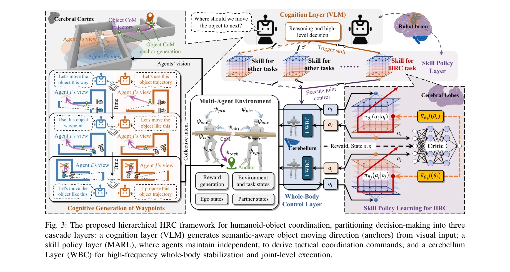
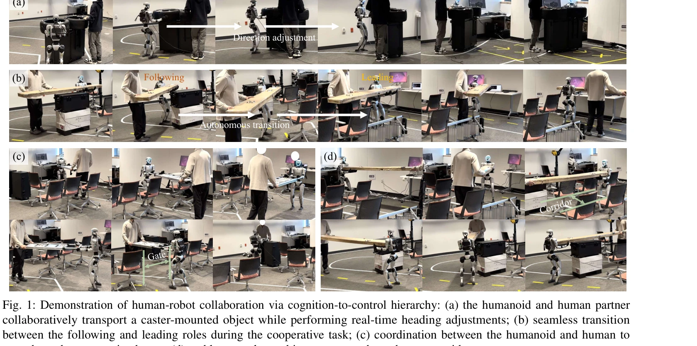

# Cognition to Control - Multi-Agent Learning for Human-Humanoid Collaborative Transport

> **저자**: Hao Zhang, Ding Zhao, H. Eric Tseng | **날짜**: 2026-03-04 | **URL**: [https://arxiv.org/abs/2603.03768](https://arxiv.org/abs/2603.03768)

---

## Essence

*Fig. 3: The proposed hierarchical HRC framework for humanoid-object coordination, partitioning decision-making into thre*

인간-휴머노이드 협업 운반을 위한 3계층 Cognition-to-Control 프레임워크로, VLM 기반 의미론적 추론, Markov potential game 기반 MARL 조정, 전신 제어를 통합하여 역할의 자동 형성과 강건한 협업을 실현한다.

## Motivation

- **Known**: 기존 HRC 시스템은 명시적 역할 할당이나 손설계 조정 스크립트에 의존하거나, 인간을 수동적 환경으로 취급하는 단일 에이전트 RL을 사용하여 인간의 행동 편차에 취약하다.
- **Gap**: 높은 수준의 인지적 추론(VLM)과 저수준의 고주파 물리 제어 사이의 의미론적 단절이 존재하며, 명시적 역할 할당 없이 상호적응이 자연스럽게 나타나는 협업 프레임워크가 부재하다.
- **Why**: 휴머노이드 로봇이 인간과 협력하여 복잡한 장시간 운반 작업을 안전하고 효율적으로 수행하려면 전략적 계획과 실시간 신체 안정성을 동시에 관리해야 하는데, 이는 인간 협력자의 예측 불가능한 변동성을 극복하는 핵심 문제이다.
- **Approach**: VLM을 통한 의미론적 공간 앵커 생성, Markov potential game으로 공식화된 MARL을 통한 자동 역할 형성, 그리고 Interaction-aware Whole-Body Control을 통한 고주파 물리 실행을 3계층 구조로 명시적으로 연결한다.

## Achievement

*Fig. 1: Demonstration of human-robot collaboration via cognition-to-control hierarchy: (a) the humanoid and human partne*

- **계층적 아키텍처**: VLM 기반 인지층, MARL 기반 기술층, WBC 제어층으로 의미론적 추론과 물리적 실행 사이의 단절을 체계적으로 해소
- **역할 자동 형성**: 명시적 역할 할당 없이 leader-follower 역할이 작업 구조로부터 자발적으로 나타남
- **강건성**: 단일 에이전트 및 end-to-end 기준선 대비 높은 성공률과 다양한 인간 행동 패턴에 대한 우수한 적응성
- **일관된 조정**: 좁은 통로 통과, 개체 운반 등 공간 제약이 있는 복잡한 작업에서 안정적인 협업 달성

## How

*Fig. 3: The proposed hierarchical HRC framework for humanoid-object coordination, partitioning decision-making into thre*

- **VLM 기반 의미론적 앵커 생성**: 시각 입력으로부터 'where to go' 수준의 고수준 목표를 생성하되, 저주파 의사결정만 담당", '**Markov potential game MARL**: 공유 potential function으로 작업 진행도를 인코딩하고, 각 에이전트가 독립적 정책을 학습하면서 자동으로 상호적응
- **Residual Policy 학습**: 명목상 제어기(nominal controller) 대비 잔차 정책으로 학습하여 인간 파트너의 동역학을 암시적으로 내재화
- **Interaction-aware WBC**: 고주파(~100Hz)에서 운동학/동역학 실행가능성과 접촉 안정성을 강제하면서 기술층의 명령을 실행
- **무역할 MARL 공식화**: explicit intent inference나 role assignment 모듈 없이 순수 협업 게임으로 모델링하여 진동 및 비정상성 제거

## Originality

- **의미론적 단절 해소**: VLM과 고주파 제어 사이의 granularity gap을 3계층 구조로 명시적으로 브릿징한 첫 시도
- **역할 자동 형성의 이론적 근거**: Markov potential game으로 명시적 역할 할당 없이도 leader-follower 구조가 자연스럽게 나타나도록 설계
- **상호적응의 내재화**: 인간을 환경의 일부가 아닌 동등한 학습 에이전트로 모델링하여 oscillatory behavior 제거
- **embodiment-aware VLM**: 로봇의 신체 특성을 고려한 affordance 및 제약 조건 추론

## Limitation & Further Study

- **실험 범위 제한**: 협업 운반 작업에 국한되어 있으며, 더 다양한 조작 작업(예: 조립, 정렬)으로의 일반화 미검증
- **인간 행동의 이상 케이스**: 갑작스러운 힘 변화나 예측 불가능한 회전 운동에 대한 강건성 미분석
- **VLM 의존성**: VLM의 시각 이해 오류가 상위 계층에 전파될 수 있으며, 저광도 환경에서의 성능 미평가
- **확장성 미검증**: 3명 이상의 다중 인간과의 협업, 또는 다중 휴머노이드 간 협업으로의 확장 가능성 미검토
- **후속 연구**: (1) adversarial human behavior에 대한 robustness 강화, (2) sim-to-real transfer 구체화, (3) 더 복잡한 기하학적 제약(예: 좁은 복도 회전)에 대한 성능 개선

## Evaluation

- Novelty: 4/5
- Technical Soundness: 4/5
- Significance: 4/5
- Clarity: 4/5
- Overall: 4/5

**총평**: 인간-로봇 협업의 근본적인 인지-제어 단절 문제를 3계층 구조로 체계적으로 해결하고, Markov potential game MARL을 통해 명시적 역할 할당 없이 협업 역할이 자동 형성되는 novel 접근법을 제시한다. 실험 결과는 강건성과 유효성을 잘 보여주지만, 작업 다양성 및 환경 조건 범위 확대가 필요하다.
