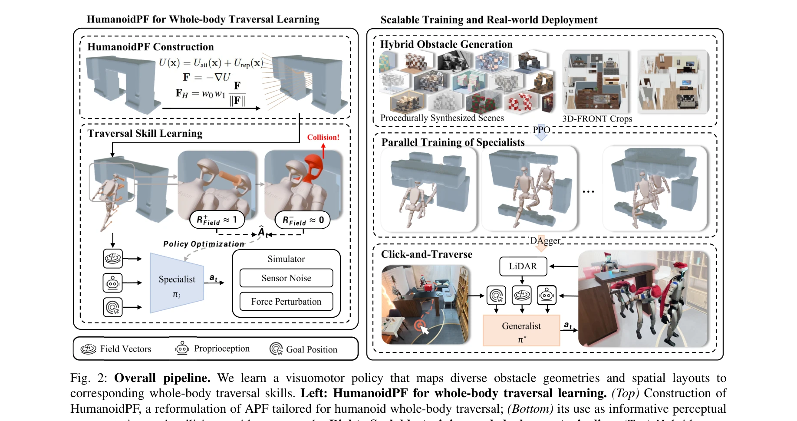
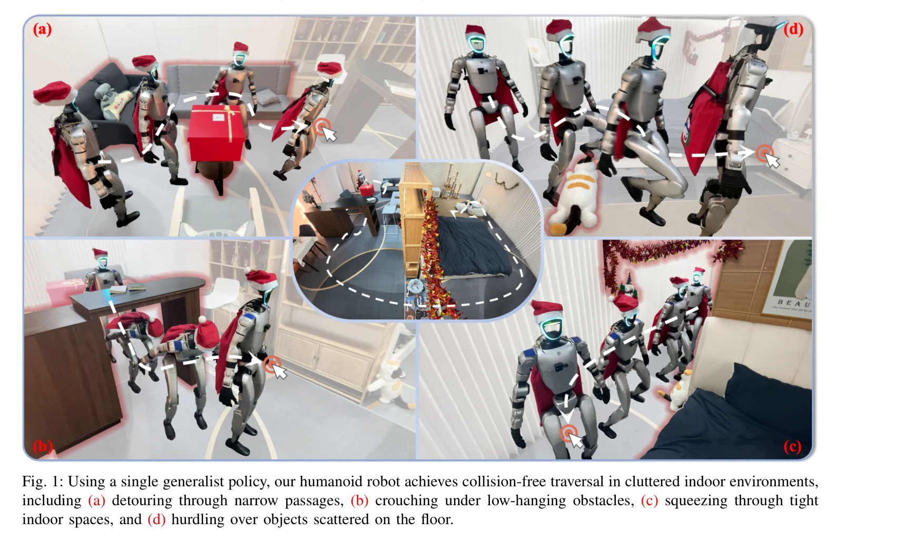

# Collision-Free Humanoid Traversal in Cluttered Indoor Scenes

> **저자**: Han Xue, Sikai Liang, Zhikai Zhang, Zicheng Zeng, Yun Liu, Yunrui Lian, Jilong Wang, Qingtao Liu, Xuesong Shi, Li Yi | **날짜**: 2026-01-23 | **DOI**: [10.48550/arXiv.2601.16035](https://doi.org/10.48550/arXiv.2601.16035)

---

## Essence

*Fig. 2: Overall pipeline. We learn a visuomotor policy that maps diverse obstacle geometries and spatial layouts to*

인간형 로봇이 어수선한 실내 환경에서 장애물을 피하며 이동할 수 있도록 Humanoid Potential Field (HumanoidPF)를 제안하고, 하이브리드 장면 생성 방식과 RL 기반 학습으로 현실 세계에 성공적으로 전이시킨 연구이다.

## Motivation

- **Known**: 사족 로봇은 복잡한 환경에서의 이동 능력이 입증되었고, 인간형 로봇도 특정 지형이나 장애물(계단, 평형대 등)에서의 이동이 가능하다. 그러나 기존 연구는 부분적 공간 배치와 단순한 기하학적 형태의 장애물만 다룬다.
- **Gap**: 완전한 공간 제약(바닥, 옆, 위)을 동시에 고려하면서 복잡한 기하학적 형태의 장애물이 있는 어수선한 실내 장면에서의 인간형 로봇 이동을 다룬 체계적인 연구가 부족하다. 또한 인간형 로봇-장애물 관계를 효과적으로 표현하는 방식이 없어 RL 기반 학습이 어렵다.
- **Why**: 가정용 인간형 로봇의 실제 적용을 위해서는 현실적인 실내 환경의 다양한 장애물을 인지하고 회피하면서 자연스럽게 이동할 수 있는 능력이 필수적이고, 이는 로봇의 안정성과 유용성을 크게 향상시킨다.
- **Approach**: APF(Artificial Potential Field)를 인간형 로봇의 전신 이동에 맞게 재구성한 HumanoidPF를 제안하여 인식 표현과 보상 신호로 활용하고, 현실적인 3D 실내 장면 조각과 절차적으로 생성된 장애물을 결합한 하이브리드 장면 생성 방식으로 다양한 시나리오에서의 학습을 실현한다.

## Achievement

*Fig. 1: Using a single generalist policy, our humanoid robot achieves collision-free traversal in cluttered indoor envir*

- **HumanoidPF 제안**: 인간형 로봇-장애물 관계를 collision-free motion direction의 연속 미분 가능한 gradient field로 인코딩하여, 정책이 raw 환경 정보가 아닌 명시적인 이동 방향 단서로부터 판단할 수 있게 함
- **Sim-to-real gap 최소화**: HumanoidPF의 연속 field 공식이 자연스럽게 low-pass perceptual filter 역할을 하여 인식 artifacts를 평활화하고 robust한 현실 이전 달성
- **하이브리드 장면 생성**: 현실적인 3D 실내 데이터셋과 절차적 합성 장애물을 결합하여 기존 데이터셋에 드문 고도로 제약된 clutter 배치 노출로 robustness 향상
- **완전한 공간 제약 처리**: ground, lateral, overhead 장애물이 동시에 존재하는 완전한 어수선한 실내 장면에서 이동 가능한 최초의 체계적 연구 달성
- **실세계 배포 성공**: Click-and-Traverse(CAT) 텔레오퍼레이션 시스템으로 사용자 친화적인 실시간 이동 제어 가능

## How

*Fig. 2: Overall pipeline. We learn a visuomotor policy that maps diverse obstacle geometries and spatial layouts to*

- APF의 목표 위치(attractive pole)와 장애물(repulsive surface) 개념을 기반으로 하되, 인간형 로봇의 복수 key body part에서 쿼리하여 각 부분별 이동 방향을 지도
- HumanoidPF를 정책의 observation으로 직접 활용하여 고차원 raw 환경 정보 대신 저차원 방향 신호 제공
- collision-aware reward design에 HumanoidPF의 field 분포를 활용하여 정책 이동과 field alignment를 유도하므로 dense하고 예측적인 supervision 제공
- specialist policies를 다양한 obstacle 구성에서 병렬 학습 후 distillation을 통해 generalist policy 획득
- 현실적인 3D indoor scene crops와 procedurally synthesized obstacles를 조합한 curriculum 형태의 장면 생성으로 다양성과 도전성 동시 확보
- 실제 humanoid 로봇에 정책 전이 후 텔레오퍼레이션 인터페이스로 goal click 기반 자동 collision-free traversal 실현

## Originality

- Classical APF를 humanoid whole-body traversal을 위해 첫 체계적으로 재구성하여, 기존의 center of mass나 foot joint 단일 rigid body 추상화를 넘어선 창신
- HumanoidPF를 perception representation과 reward signal으로 이중 활용하는 방식은 기존 potential field 활용과 차별화
- sim-to-real gap을 field formulation의 low-pass filter 특성으로 자연스럽게 해결하는 통찰력 있는 접근
- 현실적 dataset crop과 절차적 합성 장애물 결합의 하이브리드 scene generation은 데이터 다양성 확보의 새로운 전략
- ground/lateral/overhead 장애물을 동시에 다루는 첫 체계적 humanoid traversal 연구

## Limitation & Further Study

- HumanoidPF의 continuous field 구성 시 복잡한 기하학적 장애물에 대한 정확한 거리 계산 및 gradient 추출 방식의 계산 복잡도가 상세히 논의되지 않음
- 현실 실내 환경의 동적 장애물이나 이동 중인 다른 대상자에 대한 대응 능력이 미포함
- specialist policy 학습 단계에서의 장애물 구성별 수렴 특성 분석 및 distillation 효율에 대한 심층 분석 부족
- 정책의 generalization 범위 정량화(예: 훈련되지 않은 obstacle geometry에 대한 성공률)가 명확하지 않음
- **후속연구**: 동적 환경 및 실시간 obstacle detection/updating을 지원하는 확장 필요, 계산 효율성 개선 및 더 복잡한 indoor scene에 대한 평가

## Evaluation

- Novelty: 4/5
- Technical Soundness: 4/5
- Significance: 4/5
- Clarity: 4/5
- Overall: 4/5

**총평**: 이 논문은 humanoid 로봇의 현실적 실내 이동이라는 중요한 문제를 체계적으로 처음 다루면서, HumanoidPF라는 창의적이고 효과적인 표현 방식과 하이브리드 scene generation을 통해 실제 로봇에의 성공적 전이를 보여준다. 기술적 깊이, 실험의 포괄성, 그리고 실용적 가치 측면에서 humanoid robotics 분야에 상당한 기여를 하는 우수한 연구이다.
