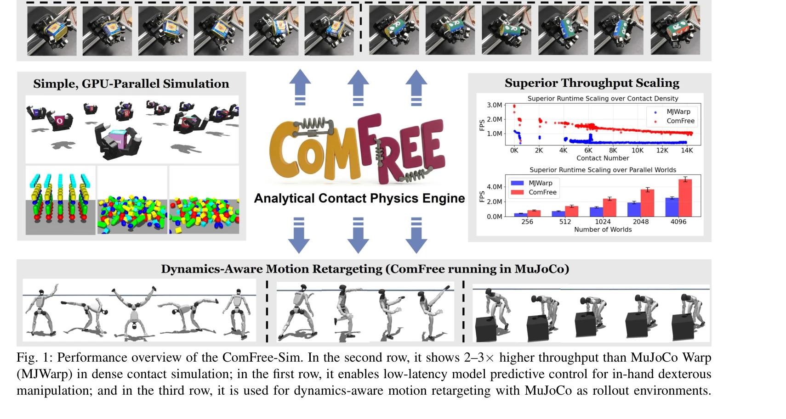

# ComFree-Sim: A GPU-Parallelized Analytical Contact Physics Engine for Scalable Contact-Rich Robotics Simulation and Control

> **저자**: Chetan Borse, Zhixian Xie, Wei-Cheng Huang, Wanxin Jin | **날짜**: 2026-03-12 | **URL**: [https://arxiv.org/abs/2603.12185](https://arxiv.org/abs/2603.12185)

---

## Essence

*Fig. 1: Performance overview of the ComFree-Sim. In the second row, it shows 2–3× higher throughput than MuJoCo Warp*

ComFree-Sim은 여집합-자유(complementarity-free) 접촉 모델링을 기반으로 한 GPU 병렬화 접촉 물리 엔진으로, 폐쇄형 해석해를 통해 접촉 임펄스를 계산하여 접촉 수에 대해 선형적 계산 복잡도를 달성한다.

## Motivation

- **Known**: 기존 물리 시뮬레이터는 complementarity constraint나 constrained optimization을 통해 접촉을 해결하지만, 접촉 밀도에 따라 비선형적으로 증가하는 반복적 풀이가 필요하다. MuJoCo, Drake 등의 로봇틱 시뮬레이터는 마찰 원뿔 제약을 강제하며 GPU 가속 버전(MJWarp 등)이 개발되었다.
- **Gap**: 기존 iterative complementarity-based 접근법은 고밀도 접촉 시나리오에서 계산 비용이 초선형으로 증가하여, 실시간 MPC와 고주파 제어가 필요한 손 조작 같은 접촉-풍부 작업에서 병목이 된다.
- **Why**: 접촉-풍부 로봇 제어 및 학습을 위해서는 대규모 병렬 시뮬레이션 롤아웃이 필수이며, 선형적 확장성을 가진 가볍고 정확한 접촉 해석기는 온라인 MPC와 실시간 폐루프 제어를 가능하게 한다.
- **Approach**: ComFree 접촉 모델링의 폐쇄형 해석해 구조를 활용하되, 이를 6D 통합 모델로 확장(접선, 토크, 구름마찰)하고 dual cone impedance heuristic을 도입한 후, GPU 커널에 자연스럽게 매핑되는 분산 계산 구조로 구현한다.

## Achievement

*Fig. 1: Performance overview of the ComFree-Sim. In the second row, it shows 2–3× higher throughput than MuJoCo Warp*

- **6D 통합 접촉 모델**: 기존 point contact 모델을 확장하여 접선, 토크, 구름마찰을 포함한 완전한 6차원 마찰 접촉 해석 프레임워크 개발
- **선형 시간 복잡도**: 접촉 수에 대해 거의 선형적 런타임 확장을 달성하며 MJWarp 대비 2-3배 높은 처리량 시현
- **하드웨어 검증**: LEAP 다중 손가락 로봇 하드에서 실시간 MPPI 기반 MPC를 통한 손 조작 제어 성공 및 동작 재타게팅 적용
- **Drop-in 호환성**: MuJoCo 호환 인터페이스로 MJWarp의 직접 대체 백엔드로 제공되어 기존 시스템과 통합 용이

## How

*Fig. 2: Different contact modes captured by ComFree-Sim.*

- Dual cone of Coulomb friction 공간에서 impedance-style prediction-correction 업데이트를 통한 폐쇄형 접촉 임펄스 계산
- 접촉 해석이 접촉 쌍 간에 완전히 분리(decouple)되고 원뿔 facet 간에 분리 가능하도록 수식화하여 GPU 병렬화에 최적화
- Warp 프레임워크에서 GPU 커널로 구현하고 MuJoCo 호환 API를 통해 노출
- Dual-cone impedance heuristic 도입으로 안정성을 확보하면서도 경량 사용자 파라미터화 유지 및 학습 기반 동적 임피던스 적응 가능
- Penetration depth, 마찰 동작, 수치 안정성, 런타임 확장성에 대한 MJWarp와의 벤치마킹

## Originality

- ComFree 접촉 모델을 처음으로 6D 통합 포뮬레이션으로 확장하여 접선, 토크, 구름마찰을 단일 프레임워크에서 처리
- Dual cone impedance 휴리스틱 도입으로 폐쇄형 해석 방식의 안정성과 학습 가능성을 동시에 확보
- GPU 병렬성에 최적화된 접촉 분산 구조를 통해 기존 iterative solver 기반 접근과 본질적으로 다른 계산 패러다임 제시
- MuJoCo 호환 인터페이스로 기존 생태계와의 실질적 통합 및 실시간 하드웨어 검증 수행

## Limitation & Further Study

- Complementarity-free 모델의 특성상 특정 extreme 접촉 시나리오(예: 매우 높은 마찰 계수)에서의 수렴 특성이나 물리 정확도 분석 부족
- Dual-cone impedance heuristic이 휴리스틱이므로 이론적 타당성과 최적 파라미터 선택 기준이 명확하지 않음
- 제한된 로봇 플랫폼(LEAP hand)에서만 하드웨어 검증되어 다양한 조작 작업과 로봇에 대한 일반화 가능성 미흡
- 기존 시뮬레이터와 물리 정확도 비교는 주로 침투 깊이와 정성적 마찰 동작에 국한되어 있으며, 정량적 정확도 메트릭이 제한적
- 후속 연구 방향: 더 엄밀한 이론적 수렴 분석, 다양한 환경과 로봇에 대한 대규모 비교 연구, 학습 기반 impedance 적응 전략의 수렴성 보증

## Evaluation

- Novelty: 4/5
- Technical Soundness: 4/5
- Significance: 4/5
- Clarity: 4/5
- Overall: 4/5

**총평**: ComFree-Sim은 complementarity-free 접촉 모델링의 폐쇄형 해석 구조를 효과적으로 GPU 병렬화하고 6D로 확장하여, 기존 iterative solver 기반 접근의 근본적 병목을 해결한 혁신적 접촉 물리 엔진이다. 선형 확장성과 2-3배 향상된 처리량을 실현하면서도 물리 정확도를 유지하고, 실제 로봇 하드웨어에서 고주파 MPC 제어를 성공적으로 구현함으로써 접촉-풍부 로봇 학습과 제어 분야에 상당한 실용적 가치를 제공한다.

## Related Papers

- 🏛 기반 연구: [[papers/1628_PyRoki_A_Modular_Toolkit_for_Robot_Kinematic_Optimization/review]] — PyRoki의 GPU 기반 운동학 최적화 툴킷이 ComFree-Sim의 접촉 물리 엔진과 통합되어 완전한 로봇 시뮬레이션 파이프라인을 구성할 수 있다.
- 🔄 다른 접근: [[papers/2083_Lightning_Grasp_High_Performance_Procedural_Grasp_Synthesis/review]] — Lightning Grasp의 Contact Field 데이터 구조가 ComFree-Sim의 여집합-자유 접촉 모델링과는 다른 방식으로 접촉 문제를 해결한다.
- 🧪 응용 사례: [[papers/1620_PolySim_Bridging_the_Sim-to-Real_Gap_for_Humanoid_Control_vi/review]] — PolySim의 sim-to-real 격차 해소를 위해 ComFree-Sim의 고성능 GPU 병렬화 접촉 물리 엔진이 실제 환경 시뮬레이션 정확도를 크게 향상시킬 수 있다.
- 🧪 응용 사례: [[papers/1942_GaussGym_An_open-source_real-to-sim_framework_for_learning_l/review]] — ComFree-Sim의 고성능 접촉 시뮬레이션 엔진이 GaussGym과 같은 실시간 학습 환경에서 실질적으로 활용될 수 있다.
- 🔄 다른 접근: [[papers/1622_Predictive_Sampling_Real-time_Behaviour_Synthesis_with_MuJoC/review]] — 실시간 행동 합성을 위한 다른 접근법으로 물리 엔진 최적화를 제시합니다.
- 🔗 후속 연구: [[papers/1846_ComFree-Sim_A_GPU-Parallelized_Analytical_Contact_Physics_En/review]] — 병렬화된 접촉 물리 계산이 대규모 시뮬레이션 성능을 크게 향상시킵니다.
- 🏛 기반 연구: [[papers/1628_PyRoki_A_Modular_Toolkit_for_Robot_Kinematic_Optimization/review]] — ComFree-Sim의 GPU 병렬화 해석적 접촉 물리 엔진이 PyRoki의 크로스 플랫폼 GPU/TPU 실행의 기술적 기초를 제공함
- 🔄 다른 접근: [[papers/1942_GaussGym_An_open-source_real-to-sim_framework_for_learning_l/review]] — 둘 다 고성능 로봇 시뮬레이션을 제공하지만 GaussGym은 3D Gaussian Splatting을, ComFree-Sim은 GPU 병렬 물리 엔진을 사용한다.
- 🔗 후속 연구: [[papers/1951_Genie_Sim_30__A_High-Fidelity_Comprehensive_Simulation_Platf/review]] — GPU 병렬화된 물리 시뮬레이션이 고충실도 플랫폼의 핵심 확장 기술이다.
- 🏛 기반 연구: [[papers/2077_Learning_with_pyCub_A_Simulation_and_Exercise_Framework_for/review]] — GPU 병렬 물리 시뮬레이션의 기술적 기반을 제공하여 pyCub의 효율적인 교육용 시뮬레이션을 가능하게 한다.
- 🔄 다른 접근: [[papers/2083_Lightning_Grasp_High_Performance_Procedural_Grasp_Synthesis/review]] — ComFree-Sim의 여집합-자유 접촉 모델링이 Lightning Grasp의 Contact Field보다 더 직접적인 접촉 임펄스 계산 방식을 제시한다.
- 🏛 기반 연구: [[papers/2084_LiPS_Large-Scale_Humanoid_Robot_Reinforcement_Learning_with/review]] — GPU 기반 병렬 물리 시뮬레이션의 핵심 기술적 기반을 제공하여 LiPS의 대규모 훈련을 가능하게 한다.
- 🏛 기반 연구: [[papers/2094_Mechanical_Intelligence-Aware_Curriculum_Reinforcement_Learn/review]] — ComFree-Sim의 GPU 병렬화된 접촉 물리 엔진이 BRUCE의 병렬 구동 메커니즘 시뮬레이션의 기술적 기반을 제공한다.
