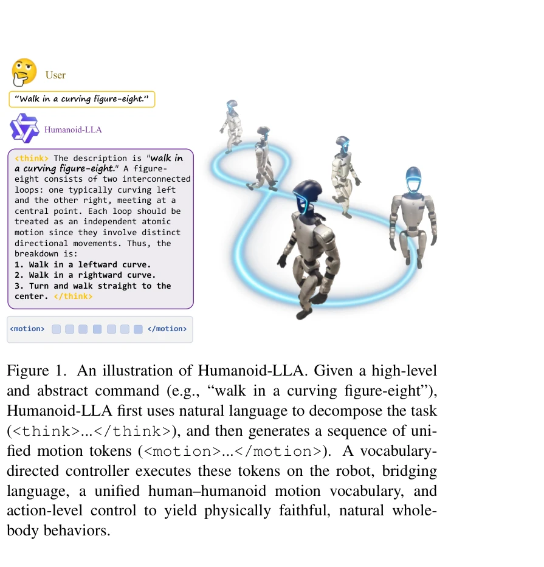
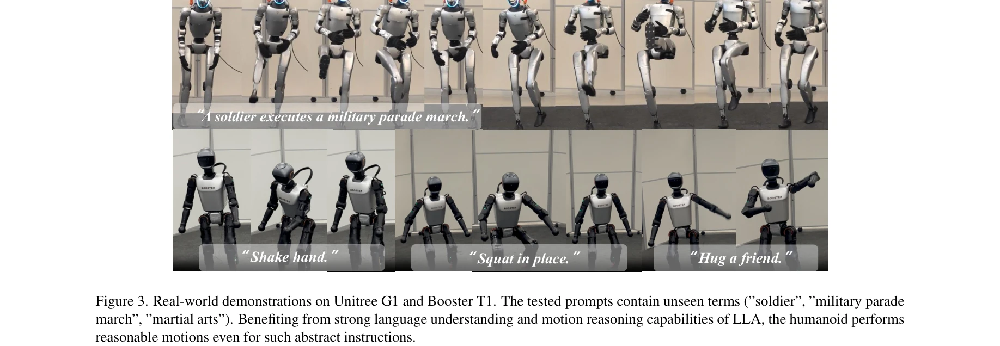

# Commanding Humanoid by Free-form Language: A Large Language Action Model with Unified Motion Vocabulary

> **저자**: Zhirui Liu, Kaiyang Ji, Ke Yang, Jingyi Yu, Ye Shi, Jingya Wang | **날짜**: 2026-04-10 | **DOI**: [10.48550/arXiv.2511.22963](https://doi.org/10.48550/arXiv.2511.22963)

---

## Essence

*Figure 1. An illustration of Humanoid-LLA. Given a high-level*

자유형식 자연언어 명령을 인간형 로봇의 신체 전체 제어로 매핑하는 Large Language Action Model(Humanoid-LLA)을 제안하며, 통합 모션 어휘, 어휘-지향 컨트롤러 증류, 강화학습 기반 파인튜닝을 통해 언어 일반화와 물리적 타당성을 동시에 달성한다.

## Motivation

- **Known**: 로봇 조작 등 단순 작업은 Vision-Language-Action(VLA) 모델로 진전이 있었으나, 고자유도 인간형 로봇의 전신 제어는 여전히 도전 과제이며, 기존 방법은 언어 충실도와 물리적 타당성 간 트레이드오프를 겪는다.
- **Gap**: 고품질의 다양한 물리적으로 근거한 인간형 로봇 데이터 부족으로 인해 정확한 언어-로봇 정렬이 제한되며, 기존의 인간 모션 모방 접근법은 체계적 투영 오류와 운동학적 불일치로 인해 로봇 실행 정밀도를 저하시킨다.
- **Why**: 자유형식 언어 명령을 따르는 인간형 로봇은 원활한 인간-로봇 상호작용, 협업 작업 실행, 범용 embodied intelligence 실현에 필수적이다.
- **Approach**: 인간과 인간형 모션 원시 요소를 공유 이산 공간으로 정렬하는 통합 모션 어휘를 구성하고, 이를 기반으로 privileged policy로부터 증류된 어휘-지향 컨트롤러와 dynamics-aware reward를 통한 강화학습 파인튜닝을 결합한다.

## Achievement

*Figure 3. Real-world demonstrations on Unitree G1 and Booster T1. The tested prompts contain unseen terms (”soldier”, ”m*

- **통합 모션 어휘(Unified Motion Vocabulary)**: 양방향 교차-embodiment 재구성 감독을 통해 인간과 인간형 로봇 간 동일 토큰이 동일 모션 원시 요소를 나타내도록 보장하며, 인간 모션 데이터셋의 확장성을 활용하면서 데이터 부족을 완화
- **어휘-지향 액션 증류**: Privileged tracking policy로부터 이산 모션 토큰 조건의 student controller로 증류하여 동적 강건성과 접촉 안정성을 유지하면서 밀집 궤적에서 컴팩트 토큰 시퀀스로 제어 패러다임 전환
- **두 단계 파인튜닝**: 대규모 텍스트-인간 모션 데이터셋에서의 Supervised Fine-Tuning(SFT)과 모션 chain-of-thought 프롬핑, 그리고 인간형 피드백을 통한 강화학습 파인튜닝(RLFT)으로 언어 표현력과 물리적 타당성 동시 달성
- **실세계 검증**: Unitree G1, Booster T1 인간형 로봇에서 기존 언어-조건 컨트롤러 대비 모션 자연스러움, 안정성, 실행 성공률 우수성 입증

## How

*Figure 2. An overview of Humanoid-LLA. In stage one, we build a unified motion vocabulary leveraging a large-scale paire*

- VQ-VAE 기반 교차-embodiment 토큰화로 인간과 인간형 로봇 모션의 공유 이산 어휘 학습
- Privileged teacher policy를 밀집 재타겟팅된 인간형 모션 참조로 학습하여 높은 물리적 충실도 달성
- Student controller를 이산 모션 토큰으로 조건화된 정책으로 증류하여 컴팩트 인터페이스 제공
- Chain-of-thought 프롬핑으로 언어 모델이 구조화된 추론 후 모션 토큰 생성하도록 유도
- Group relative policy optimization을 사용한 강화학습으로 의미론적 정렬과 물리적 실행 가능성 모두 보상
- 시뮬레이션 환경에서 물리 피드백을 통한 폐루프 훈련으로 물리적 선험 정보를 토큰 생성에 주입

## Originality

- 기존 humanoid-only 모션 양자화와 달리 양방향 교차-embodiment 재구성 감독을 통한 통합 모션 어휘의 혁신적 설계
- 언어 모델과 물리 기반 컨트롤러의 긴밀한 통합으로 순수 운동학적 접근의 한계 극복
- 모션 chain-of-thought 프롬핑이라는 새로운 구조화 추론 전략으로 복잡한 자연언어를 원시 요소로 분해
- Dynamics-aware reward를 통한 강화학습 파인튜닝으로 LLM의 물리적 추론 능력 향상
- 대규모 인간 모션 데이터에서 시작하여 실세계 인간형 로봇까지의 완전한 파이프라인 제시

## Limitation & Further Study

- 제한된 인간형 로봇 플랫폼(Unitree G1, Booster T1)에서만 검증되었으며 다른 동역학이나 체형의 로봇으로의 전이 가능성 불명확
- 통합 모션 어휘의 granularity와 어휘 크기에 따른 성능 트레이드오프 분석 부재
- 복잡한 물체 조작을 요구하는 dexterous 작업의 확장 가능성 미검토
- 시뮬레이션-to-reality 갭을 완전히 폐쇄하지 못했으며 현실에서의 분포 외 상황에 대한 강건성 평가 부족
- 후속 연구로 multimodal 인지 입력(비전, 터치 등)의 통합, 온라인 적응 능력, 더 다양한 인간형 플랫폼 지원 필요

## Evaluation

- Novelty: 4/5
- Technical Soundness: 4/5
- Significance: 4/5
- Clarity: 4/5
- Overall: 4/5

**총평**: Humanoid-LLA는 통합 모션 어휘, 어휘-지향 증류, 강화학습 파인튜닝을 통합하여 자유형식 언어에서 물리적으로 실행 가능한 인간형 로봇 제어로의 매핑을 최초로 달성한 중요한 기여이며, 실세계 검증과 명확한 기술 혁신으로 인간-로봇 상호작용 분야의 중대한 진전을 나타낸다.
