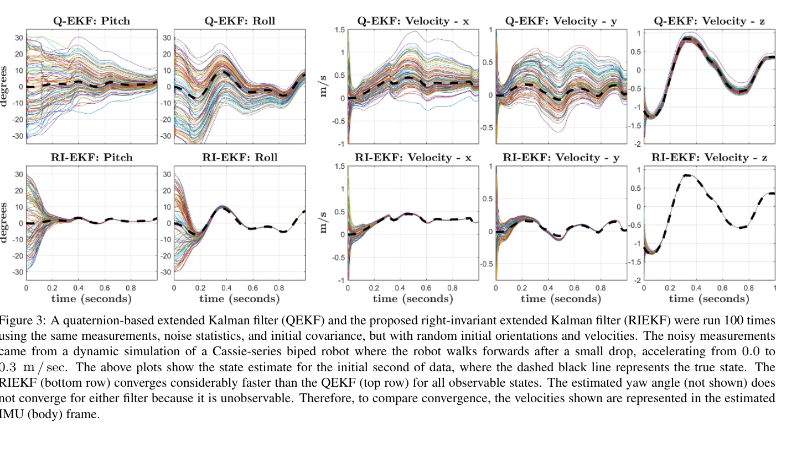
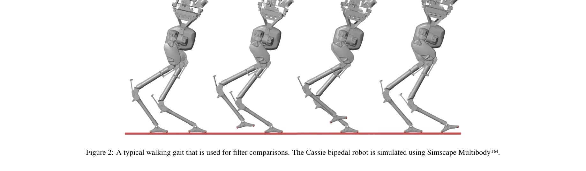

# Contact-Aided Invariant Extended Kalman Filtering for Robot State Estimation

> **저자**: Ross Hartley, Maani Ghaffari, Ryan M. Eustice, Jessy W. Grizzle | **날짜**: 2019-04-19 | **URL**: [https://arxiv.org/abs/1904.09251](https://arxiv.org/abs/1904.09251)

---

## Essence

*Figure 1: A Cassie-series biped robot is used for both simulation and experimental results. The robot was developed by A*

Lie군 이론과 불변 관찰자 설계를 기반으로 IMU와 접촉 센서 데이터를 융합하는 Contact-Aided Invariant Extended Kalman Filter (InEKF)를 개발하여 이족 로봇의 자세와 속도를 추정한다.

## Motivation

- **Known**: 기존 EKF 기반 상태 추정 방법들이 legged robot에서 널리 사용되고 있으며, quaternion-based EKF (QEKF)가 표준적 접근법이다. 하지만 표준 EKF는 현재 상태 추정값에 의존하는 선형화로 인해 수렴 특성이 제한적이다.
- **Gap**: 기존 QEKF는 선형화된 오류 동역학이 현재 상태 추정값에 의존하고, 국소 관측성 행렬이 비선형 시스템과 일치하지 않는 문제를 가진다. 시스템 대칭성을 활용하여 이러한 문제를 해결한 InEKF 기반 접촉-관성 네비게이션이 필요하다.
- **Why**: 정확한 자세 및 속도 추정은 legged robot의 안정성 유지와 보행 경로 실행에 필수적이며, 비전 기반 방법의 환경 및 조명 의존성을 피할 수 있는 proprioceptive sensor 기반 고신뢰도 추정이 필요하다.
- **Approach**: Lie군 기반 불변 관찰자 설계 이론을 적용하여 접촉-관성 동역학과 순운동학 보정을 결합한 InEKF를 도출한다. 오류 동역학이 log-linear 자율 미분방정식을 만족함을 증명하여 우수한 수렴 특성을 달성한다.

## Achievement

*Figure 3: A quaternion-based extended Kalman filter (QEKF) and the proposed right-invariant extended Kalman filter (RIEKF)*

- **Log-linear 오류 동역학**: 오류 동역학이 log-linear 자율 미분방정식을 따르므로, 관측 가능한 상태 변수를 시스템 궤적에 무관한 수렴 영역으로 렌더링할 수 있다.
- **상태 독립성**: 선형화된 오류 동역학과 관측 모델이 현재 상태 추정값에 의존하지 않아, QEKF 대비 개선된 수렴 특성과 비선형 시스템과 일치하는 국소 관측성 행렬을 획득한다.
- **포괄적 확장성**: IMU 바이어스 증강, 접촉점 추가/제거, 월드-중심 및 로봇-중심 버전 모두 지원하는 체계적 프레임워크를 제시한다.
- **실험적 검증**: Cassie-series 이족 로봇을 이용한 시뮬레이션 및 실제 실험에서 QEKF 대비 우수한 수렴 성능을 입증하고, LiDAR 맵핑 응용을 통해 실용성을 검증한다.
- **오픈소스 라이브러리**: aided-inertial navigation을 위한 C++ 구현 라이브러리를 공개하여 재현성과 확산을 촉진한다.

## How

*Figure 2: A typical walking gait that is used for filter comparisons. The Cassie bipedal robot is simulated using Simscap*

- Lie군 SO(3)와 SE(3) 이론을 활용한 상태 공간 정의 및 group-affine 성질 증명
- Right-invariant 오류 정의를 통한 log-linear 오류 동역학 도출
- IMU 프로세스 모델과 순운동학 측정 모델의 불변성 구조 활용
- 연속시간 RIEKF 필터 설계 및 해석적 이산화 알고리즘 제시
- 접촉점 추가/제거 시 상태 증강/축소 메커니즘 구현
- Left-invariant 오류 정의를 이용한 대안적 도출 및 월드/로봇-중심 버전 변환 방법
- Cassie 로봇에서 모션캡처와 LiDAR 데이터를 이용한 검증 실험

## Originality

- Contact-inertial 네비게이션에 Lie군 기반 InEKF 이론을 최초로 적용한 체계적 도출
- Log-linear 오류 동역학의 상태 독립적 선형화라는 새로운 수렴 특성 증명
- Right-invariant와 left-invariant 오류 정의 간 상호 변환 및 월드/로봇-중심 추정기 연결 관계 명확화
- 현실 legged robot 플랫폼에서 대칭성 활용 기반 상태 추정의 실제 성능 향상 입증
- observability-consistency 개선을 통한 기존 QEKF 한계 극복 방안 제시

## Limitation & Further Study

- IMU 바이어스와 센서 노이즈 존재 시 log-linear 특성이 근사적만 유지되어, 극단적 초기 조건에서 보장된 전역 수렴성 부재
- 접촉 상태의 정확한 감지와 순간적 접촉점 변화에 대한 민감도 분석 부족
- 복잡한 Lie군 이론으로 인한 구현 난이도와 실시간 계산 부하 상세 분석 미흡
- 다양한 legged robot 플랫폼에 대한 일반화 평가 부재 (Cassie 중심 실험)
- 극한 환경(급격한 회전, 높은 가속도)에서의 필터 강건성 검증 필요
- 후속연구: 전역 수렴 조건 도출, 확장된 로봇 플랫폼 검증, 지형 적응 알고리즘 개발

## Evaluation

- Novelty: 4/5
- Technical Soundness: 4/5
- Significance: 4/5
- Clarity: 4/5
- Overall: 4/5

**총평**: 이 논문은 Lie군 기반 불변 관찰자 이론을 legged robot의 접촉-관성 상태 추정에 체계적으로 적용하여, 기존 EKF의 수렴성과 일관성 문제를 근본적으로 해결한 중요한 기여를 제시한다. 이론적 엄밀성과 실험적 검증, 오픈소스 구현까지 겸비한 완성도 높은 연구로, 자율 legged robot의 장시간 안정 운영을 위한 핵심 기술이다.

## Related Papers

- 🔄 다른 접근: [[papers/1710_The_invariant_extended_Kalman_filter_as_a_stable_observer/review]] — 둘 다 불변 확장 칼만 필터를 다루지만 접촉 보조 상태 추정과 안정한 관찰자라는 서로 다른 응용 관점을 제시한다
- 🔗 후속 연구: [[papers/2023_InEKFormer_A_Hybrid_State_Estimator_for_Humanoid_Robots/review]] — InEKFormer의 하이브리드 상태 추정이 Contact-Aided InEKF의 접촉 기반 추정을 트랜스포머 아키텍처로 발전시킨다
- 🏛 기반 연구: [[papers/2078_Legged_Robot_State-Estimation_Through_Combined_Forward_Kinem/review]] — 전진 운동학과 결합한 다리 로봇 상태 추정이 접촉 보조 InEKF의 센서 융합 방법론에 필요한 기초 이론을 제공한다
- 🔄 다른 접근: [[papers/1843_CMR_Contractive_Mapping_Embeddings_for_Robust_Humanoid_Locom/review]] — Contact-Aided InEKF의 센서 융합 기반 상태 추정과 CMR의 contrastive learning 기반 강건성은 센서 노이즈에 대한 서로 다른 대응 방식이다.
- 🏛 기반 연구: [[papers/1710_The_invariant_extended_Kalman_filter_as_a_stable_observer/review]] — Contact-Aided IEKF가 기본 IEKF 이론을 접촉 상황으로 확장한 발전된 형태이다
- 🏛 기반 연구: [[papers/1810_AutoOdom_Learning_Auto-regressive_Proprioceptive_Odometry_fo/review]] — 로봇 상태 추정을 위한 contact-aided 칼만 필터링이 AutoOdom의 고유감각 기반 추정의 이론적 기반을 제공한다
- 🔄 다른 접근: [[papers/1843_CMR_Contractive_Mapping_Embeddings_for_Robust_Humanoid_Locom/review]] — CMR의 contrastive learning 기반 강건성과 Contact-Aided InEKF의 센서 융합 기반 상태 추정은 노이즈 문제에 대한 서로 다른 해결책이다.
- 🏛 기반 연구: [[papers/1981_HMC_Learning_Heterogeneous_Meta-Control_for_Contact-Rich_Loc/review]] — contact-aided invariant EKF의 접촉 상태 추정 기법이 HMC의 contact-rich manipulation을 위한 기초 이론을 제공한다.
- 🏛 기반 연구: [[papers/2016_HUSKY_Humanoid_Skateboarding_System_via_Physics-Aware_Whole-/review]] — 접촉 기반 불변 확장 칼만 필터가 HUSKY의 하이브리드 접촉 다이내믹스 모델링에 핵심적인 상태 추정 기반 제공
- 🔗 후속 연구: [[papers/2023_InEKFormer_A_Hybrid_State_Estimator_for_Humanoid_Robots/review]] — 접촉 지원 불변 확장 칼만 필터링이 transformer와 결합되어 더 정확한 상태 추정을 달성할 수 있다.
- 🔗 후속 연구: [[papers/2025_INTENTION_Inferring_Tendencies_of_Humanoid_Robot_Motion_Thro/review]] — 접촉 보조 상태 추정이 상호작용 기반 물리 이해의 확장된 응용이다.
- 🏛 기반 연구: [[papers/2078_Legged_Robot_State-Estimation_Through_Combined_Forward_Kinem/review]] — 접촉 보조 불변 확장 칼만 필터링이 다리 로봇 상태 추정의 이론적 기반 제공
- 🏛 기반 연구: [[papers/2106_MorphoGuard_A_Morphology-Based_Whole-Body_Interactive_Motion/review]] — Contact-Aided Invariant Extended Kalman Filtering의 접촉 추정 기법이 MorphoGuard의 1cm 접촉점 관리 정확도 달성에 기술적 기반을 제공한다.
- 🏛 기반 연구: [[papers/2120_OmniRetarget_Interaction-Preserving_Data_Generation_for_Huma/review]] — Contact-aided motion capture 기술이 OmniRetarget의 interaction mesh 기반 제약 최적화에서 human-object interaction 보존의 기술적 토대를 제공합니다.
