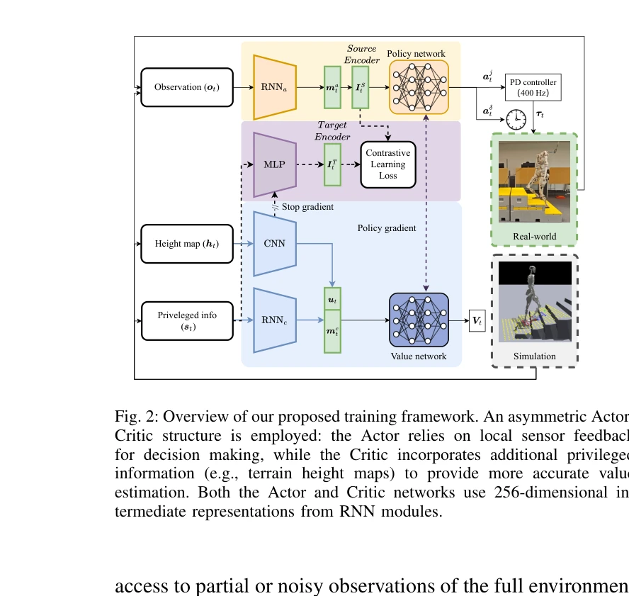
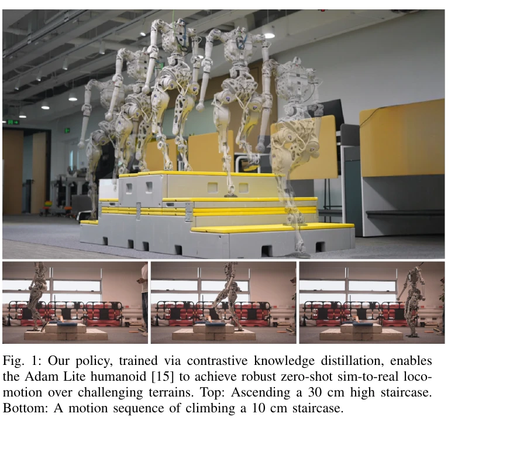

# Contrastive Representation Learning for Robust Sim-to-Real Transfer of Adaptive Humanoid Locomotion

> **저자**: Yidan Lu, Rurui Yang, Qiran Kou, Mengting Chen, Tao Fan, Peter Cui, Yinzhao Dong, Peng Lu | **날짜**: 2025-09-16 | **URL**: [https://arxiv.org/abs/2509.12858](https://arxiv.org/abs/2509.12858)

---

## Essence

*Fig. 2: Overview of our proposed training framework. An asymmetric Actor-*

Contrastive learning을 이용해 시뮬레이션의 특권 정보(terrain heightmap)를 순수 proprioceptive policy에 증류시켜 지각의 선견성을 얻으면서도 배포 시 지각 센서의 비용을 피한다. Adaptive gait clock을 통해 고정된 클럭 보행과 불안정한 자유 클럭 보행 사이의 근본적 trade-off를 해결한다.

## Motivation

- **Known**: Deep reinforcement learning은 인간형 로봇 보행에서 놀라운 성과를 이루었으나, 시뮬레이션에서는 terrain geometry, 마찰 계수 등의 특권 정보에 접근 가능하지만 실제 배포 시에는 proprioceptive 센서(joint encoder, IMU)만 사용 가능한 정보 격차가 존재한다.
- **Gap**: 기존 reactive proprioceptive 정책은 강건하지만 장애물에 능동적으로 대응할 수 없고, exteroceptive 센서(카메라, LiDAR)를 탑재한 정책은 능동적이나 시스템 복잡도와 배포 비용이 높다. 이 두 전략 사이의 근본적 trade-off를 해결하는 방법이 부재하다.
- **Why**: 실제 로봇 배포에서 강건하고 능동적인 보행 제어는 매우 도전적인 문제이며, 특히 계단, 경사면 같은 불규칙한 지형에서의 적응적 이동성이 인간형 로봇의 실용성을 크게 좌우한다.
- **Approach**: Asymmetric actor-critic 프레임워크에서 Actor는 proprioceptive 관측만 받고, Critic은 privileged information(height map)에도 접근하도록 한다. Contrastive learning 손실을 통해 Actor의 latent state를 환경 맥락과 일치시켜 환경 인식을 증류한다. 이렇게 얻은 환경 이해를 adaptive gait clock에 활용해 능동적으로 보행 리듬을 조절한다.

## Achievement

*Fig. 1: Our policy, trained via contrastive knowledge distillation, enables*

- **Contrastive knowledge distillation 프레임워크**: Privileged 환경 정보(height map)를 순수 proprioceptive policy에 직접 증류하는 공간적 대조학습 방법 제안으로, 기존 auxiliary world model 또는 teacher-student 프레임워크의 비효율성을 극복
- **Adaptive gait clock의 지능적 제어**: Distilled awareness를 통해 정책이 고정된 클럭 보행의 강건성과 자유 클럭 보행의 유연성을 결합한 적응적 gait mechanism 실현
- **Zero-shot sim-to-real 검증**: Full-sized humanoid (Adam Lite)에서 시뮬레이션 없이 실제 배포 시 30 cm 높이 계단과 26.5° 경사면 같은 극도로 도전적인 지형에서 강건한 보행 달성

## How

*Fig. 2: Overview of our proposed training framework. An asymmetric Actor-*

- RNN 기반 asymmetric actor-critic 아키텍처: Actor는 84차원 센서 입력을 받아 256차원 RNN 숨김 상태를 생성하고 26차원 action을 출력
- Critic은 Actor 입력에 추가로 CNN으로 처리된 height map 특징을 포함하여 가치 추정
- Spatial contrastive objective: Actor의 proprioceptive history와 privileged environmental context의 matching/non-matching 쌍을 구분하도록 훈련하여 latent state가 지형 관련 정보 인코딩
- Adaptive gait clock 메커니즘: Policy가 동적으로 gait frequency와 phase를 조절 가능하도록 설계하여 environment awareness를 활용한 능동적 적응
- PD controller (400 Hz)를 통한 저수준 action 실행으로 안정성 보장

## Originality

- 기존 temporal contrastive objective (동적 예측)나 auxiliary world model 재구성 대신 spatial contrastive learning으로 환경 맥락을 직접 정렬하는 더 직접적이고 효율적인 접근
- Privileged information distillation과 adaptive gait control의 새로운 결합으로 reactive vs proactive control의 근본적 trade-off 해소
- End-to-end representation learning을 통해 다단계 복잡도(teacher-student) 없이 proprioceptive policy 성능 상한선 제거

## Limitation & Further Study

- 현재 연구는 Adam Lite humanoid에서만 검증되었으므로 다양한 로봇 형태로의 일반화 가능성이 불명확
- Height map이라는 특정 형태의 privileged information에 최적화되어 있어 다른 환경 특성(마찰, 감쇠 등)에 대한 확장성 검토 필요
- Sim-to-real 전이의 성공이 충분한 domain randomization에 의존하는 정도를 정량적으로 분석하지 않음
- **후속 연구**: (1) 다양한 보행 표면 및 극한 환경에서의 장기 안정성 평가, (2) 다른 형태의 privileged information (동적 특성, 장애물 형태 등)으로의 확장, (3) Online adaptation 또는 few-shot learning을 통한 빠른 신환경 적응 메커니즘 개발

## Evaluation

- Novelty: 4/5
- Technical Soundness: 3/5
- Significance: 4/5
- Clarity: 4/5
- Overall: 4/5

**총평**: 이 논문은 contrastive learning을 통해 시뮬레이션 특권 정보를 proprioceptive policy에 효과적으로 증류하여 지각 센서 없이도 선견성 있는 제어를 달성하는 창의적 해결책을 제시한다. Zero-shot sim-to-real 전이로 극도로 도전적인 지형에서의 강건한 보행을 실증함으로써 인간형 로봇 실용화의 중요한 진전을 보여준다.

## Related Papers

- 🔄 다른 접근: [[papers/1856_CReF_Cross-modal_and_Recurrent_Fusion_for_Depth-conditioned/review]] — sim-to-real 전이에서 contrastive learning은 지각 정보 증류, CReF는 depth 기반 직접 학습으로 서로 다른 접근법을 제시한다.
- 🔗 후속 연구: [[papers/1829_Bridging_the_Sim-to-Real_Gap_for_Athletic_Loco-Manipulation/review]] — 액추에이터 동역학 학습과 지각 정보 증류를 결합하면 더 포괄적인 sim-to-real 전이 솔루션을 구성할 수 있다.
- 🏛 기반 연구: [[papers/1780_A_Hybrid_Autoencoder_for_Robust_Heightmap_Generation_from_Fu/review]] — 높이맵 생성 기술이 지형 인식 정책 학습의 기반이 됩니다.
- 🔗 후속 연구: [[papers/1658_RPL_Learning_Robust_Humanoid_Perceptive_Locomotion_on_Challe/review]] — 도전적 지형에서의 강건한 지각 기반 보행을 더욱 발전시킵니다.
- 🔄 다른 접근: [[papers/1881_Distillation-PPO_A_Novel_Two-Stage_Reinforcement_Learning_Fr/review]] — 시뮬레이션-현실 전이를 위한 다른 학습 패러다임을 제시합니다.
- 🔗 후속 연구: [[papers/1664_Sampling-Based_System_Identification_with_Active_Exploration/review]] — SPI-Active의 Fisher Information 기반 exploration이 Contrastive Representation Learning의 robust sim-to-real 전이와 결합되어 더 효율적인 domain adaptation을 달성할 수 있다
- 🏛 기반 연구: [[papers/1652_Robot_Trains_Robot_Automatic_Real-World_Policy_Adaptation_an/review]] — Contrastive Representation Learning의 robust sim-to-real 전이 기법이 RTR의 dynamics-encoded latent 최적화의 기초가 됨
- 🏛 기반 연구: [[papers/1620_PolySim_Bridging_the_Sim-to-Real_Gap_for_Humanoid_Control_vi/review]] — Sim-to-real transfer를 위한 contrastive representation learning 방법론 제공
- 🏛 기반 연구: [[papers/1627_PvP_Data-Efficient_Humanoid_Robot_Learning_with_Propriocepti/review]] — PvP의 고유감각-특권상태 대조 학습이 Contrastive Representation Learning의 robust sim-to-real 전이 방법론을 휴머노이드 WBC에 적용한 것이다
- 🏛 기반 연구: [[papers/1632_RAPT_Model-Predictive_Out-of-Distribution_Detection_and_Fail/review]] — Sim-to-real gap 해결을 위한 representation learning 기반 제공
- 🔗 후속 연구: [[papers/1746_VB-Com_Learning_Vision-Blind_Composite_Humanoid_Locomotion_A/review]] — 강건한 sim-to-real 전이를 위한 대조적 표현 학습을 시각 결손 상황에서의 정책 전환이라는 구체적 메커니즘으로 확장했다.
- 🔄 다른 접근: [[papers/1749_VIRAL_Visual_Sim-to-Real_at_Scale_for_Humanoid_Loco-Manipula/review]] — 강건한 sim-to-real 전이를 위해 서로 다른 접근(대규모 visual 프레임워크 vs 대조적 표현 학습)을 통해 현실 환경에서의 성능을 보장한다.
- 🏛 기반 연구: [[papers/1829_Bridging_the_Sim-to-Real_Gap_for_Athletic_Loco-Manipulation/review]] — 두 논문 모두 sim-to-real 전이를 다루지만 UAN은 액추에이터 동역학, contrastive learning은 지각 정보에 집중하여 상호 보완적이다.
- 🏛 기반 연구: [[papers/1843_CMR_Contractive_Mapping_Embeddings_for_Robust_Humanoid_Locom/review]] — contrastive representation learning의 기초 이론이 robust sim-to-real transfer에 활용되어 휴머노이드 locomotion에 적용된다.
- 🏛 기반 연구: [[papers/1856_CReF_Cross-modal_and_Recurrent_Fusion_for_Depth-conditioned/review]] — raw depth 입력의 직접 학습과 지각 정보 증류는 모두 sim-to-real 전이에서 센서 데이터 처리의 다른 패러다임을 제시한다.
- 🔄 다른 접근: [[papers/1881_Distillation-PPO_A_Novel_Two-Stage_Reinforcement_Learning_Fr/review]] — 지각 기반 보행을 위한 다른 시뮬레이션-현실 전이 접근법을 제시합니다.
- 🏛 기반 연구: [[papers/1984_HoRD_Robust_Humanoid_Control_via_History-Conditioned_Reinfor/review]] — robust sim-to-real transfer를 위한 대조 표현 학습이 HoRD의 도메인 시프트 상황에서의 강건한 제어 기반을 제공합니다.
- 🏛 기반 연구: [[papers/2045_Learning_agile_and_dynamic_motor_skills_for_legged_robots/review]] — 대조 표현 학습이 Learning agile의 견고한 sim-to-real 전이에서 도메인 간 특징 정렬의 이론적 기반 제공
- 🏛 기반 연구: [[papers/2060_Learning_Perceptive_Humanoid_Locomotion_over_Challenging_Ter/review]] — sim-to-real 전이를 위한 대조적 표현 학습이 지형 인식 보행의 기반 제공
- 🏛 기반 연구: [[papers/2155_Towards_bridging_the_gap_Systematic_sim-to-real_transfer_for/review]] — 시뮬레이션-실제 전이에서 대조 표현 학습이 제공하는 견고성이 PMSM 에너지 모델 기반 전이 방법론의 이론적 기반이 됩니다.
- 🏛 기반 연구: [[papers/2151_Toward_Reliable_Sim-to-Real_Predictability_for_MoE-based_Rob/review]] — contrastive representation learning이 RoboGauge의 sim-to-real 예측성 평가에서 robust feature 추출을 위한 이론적 기반을 제공함
