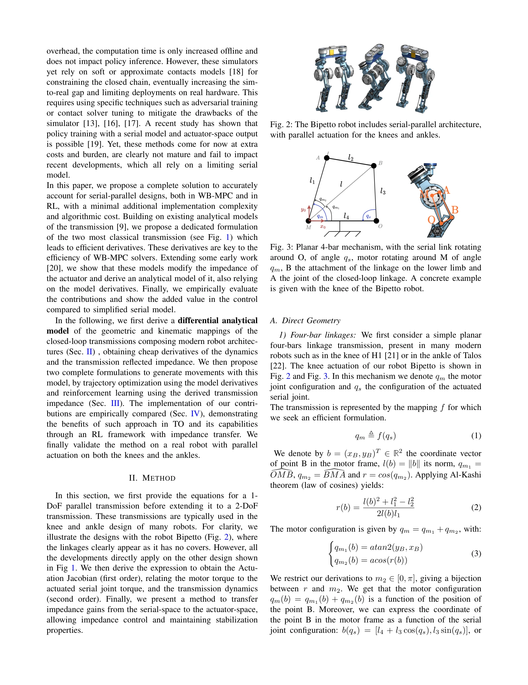

# Control of Humanoid Robots with Parallel Mechanisms using Differential Actuation Models

> **저자**: Victor Lutz, Ludovic de Matteis, Virgile Batto, Nicolas Mansard | **날짜**: 2025-03-28 | **URL**: [https://arxiv.org/abs/2503.22459](https://arxiv.org/abs/2503.22459)

---

## Essence

*Fig. 3: Planar 4-bar mechanism, with the serial link rotating*

Cassie 영감의 휴머노이드 로봇에 사용되는 병렬 구동 메커니즘에 대한 미분가능한 해석 모델을 제시하여 정확한 비선형 전달 특성을 효율적으로 계산 가능하게 한다.

## Motivation

- **Known**: 최근 휴머노이드 로봇들은 모터를 관절에서 떨어뜨려 배치하는 serial-parallel 아키텍처를 채용하여 다리 관성을 감소시킨다. 하지만 loop-closure 제약으로 인한 계산 복잡도 증가로 인해 대부분 상수 감속비로 근사하여 제어한다.
- **Gap**: 정확한 parallel mechanism 모델링은 계산 비용이 높아 trajectory optimization과 reinforcement learning에서 실용적으로 사용되지 못하고 있다. 상수 감속비 근사는 메커니즘의 전체 능력을 활용하지 못한다.
- **Why**: 정확한 비선형 전달 특성 모델링은 궤적 최적화의 동적 미분 계산과 강화학습의 임피던스 제어를 효율적으로 수행하여 제어 정확도와 로버스트성을 향상시킨다.
- **Approach**: 표준 4-bar linkage와 intricate dual 4-bar linkage 메커니즘에 대해 Actuation Jacobian과 transmission dynamics를 해석적으로 도출하고, 이를 2차 미분까지 효율적으로 계산 가능하게 최소 형식(minimal formulation)으로 표현한다.

## Achievement

*Fig. 2: The Bipetto robot includes serial-parallel architecture,*

- **해석적 미분가능 모델**: 1-DoF 4-bar linkage와 2-DoF intricate 4-bar linkage에 대한 compact 해석 공식을 도출하여 정확한 비선형 전달을 2차 미분까지 지원
- **임피던스 전달 이론**: motor space 임피던스 게인을 serial space로 변환하는 해석적 모델을 개발하여 impedance control 구현 가능
- **두 가지 응용 통합**: trajectory optimization에서는 동적 미분 활용, reinforcement learning에서는 임피던스 기반 control policy 학습
- **하드웨어 검증**: Bipetto 로봇에서 무릎과 발목 양쪽에 parallel actuation을 적용하여 상수 감속비 방식 대비 개선된 정확도와 로버스트성 실증

## How

*Fig. 4: Sub projected planar four-bar from the ankle in*

- Direct geometry: Al-Kashi 정리를 이용한 4-bar linkage 기하학 매핑 f(q_s) → q_m 공식화
- Planar projection: Intricate 4-bar를 motor 축 직교 평면으로 투영하여 가상 planar 메커니즘으로 단순화
- Actuation Jacobian: chain rule로 ∂f/∂q_s를 계산하여 motor torque τ_m과 serial joint torque τ_s 간 관계식 유도
- Transmission dynamics: second-order 미분으로 Hessian 계산 가능하게 구성
- Impedance transfer: serial space 임피던스 게인을 Actuation Jacobian 역행렬의 전치로 actuator space로 변환
- WB-MPC 통합: trajectory optimization 문제 정식화에 미분가능 모델 직접 활용
- RL 적용: Actuation Jacobian과 transmission impedance를 policy network에 전달하여 학습

## Originality

- 기존 [9]의 systematic analytical model 기반이지만, minimal formulation으로 2차 미분까지 효율적으로 계산 가능하게 개선
- Intricate dual 4-bar의 3D 구조를 planar projection으로 단순화하면서도 정확성 유지하는 새로운 기하학적 접근
- Serial space 임피던스 게인을 actuator space로 명시적으로 변환하는 해석적 공식 제시 (기존 [20] 기초 확장)
- WB-MPC과 RL 양쪽 응용에 통합하여 실용성 입증한 것은 이전 연구에 비해 포괄적

## Limitation & Further Study

- Planar projection 방식은 intricate 4-bar에 적용되지만, 비평면(out-of-plane) 기하학이 큰 구조에서는 근사 오차 가능성
- q_m2 ∈ [0, π] 제약으로 인한 mechanism 설계 의존성 - 다른 범위의 메커니즘에는 재공식화 필요
- 강화학습 실험에서 impedance transfer 효과의 정량적 비교가 제한적이며, 다양한 locomotion task에 대한 일반화 검증 부재
- 후속 연구: 3D 일반화된 projection 이론 개발, 실시간 GPU 시뮬레이터와의 통합, 다양한 parallel mechanism 설계에 대한 확장적용 연구

## Evaluation

- Novelty: 4/5
- Technical Soundness: 3/5
- Significance: 4/5
- Clarity: 4/5
- Overall: 4/5

**총평**: Parallel actuation 메커니즘의 정확한 모델링을 minimal하고 미분가능한 형식으로 구현하여 현대 제어 및 학습 알고리즘에 실용적으로 통합 가능하게 한 의미 있는 기여다. 하드웨어 검증으로 이론의 실효성을 입증했으나, 보다 일반적인 mechanism 설계에 대한 확장성 검증이 추가로 필요하다.

## Related Papers

- 🏛 기반 연구: [[papers/1630_Quasi-Direct_Drive_for_Low-Cost_Compliant_Robotic_Manipulati/review]] — 저비용 컴플라이언트 로봇 조작을 위한 quasi-direct drive가 Cassie 영감 병렬 구동 메커니즘의 효율적인 제어에 필요한 기초 기술을 제공한다
- 🔗 후속 연구: [[papers/2045_Learning_agile_and_dynamic_motor_skills_for_legged_robots/review]] — 다리 로봇을 위한 agile하고 동적인 운동 기술 학습이 병렬 메커니즘의 미분가능한 모델을 실제 동작에 효과적으로 활용할 수 있다
- 🔄 다른 접근: [[papers/1859_DecARt_Leg_Design_and_Evaluation_of_a_Novel_Humanoid_Robot_L/review]] — 휴머노이드 다리의 agile locomotion을 병렬 구동 메커니즘 모델링과 decoupled actuation이라는 서로 다른 접근법으로 달성한다
- 🧪 응용 사례: [[papers/1833_Characteristics_Management_and_Utilization_of_Muscles_in_Mus/review]] — 병렬 구동 메커니즘의 미분가능한 해석이 근골격 휴머노이드의 복잡한 근육-텐던 시스템의 정확한 동역학 모델링에 실질적으로 응용된다.
- 🔗 후속 연구: [[papers/1776_A_Framework_for_Optimal_Ankle_Design_of_Humanoid_Robots/review]] — 병렬 메커니즘의 미분가능한 모델이 휴머노이드 발목의 최적 설계 프레임워크로 확장되어 더 정교한 다리 설계를 가능하게 한다.
- 🏛 기반 연구: [[papers/1664_Sampling-Based_System_Identification_with_Active_Exploration/review]] — 로봇 상태 추정을 위한 접촉 기반 필터링의 기초 방법론을 제공한다.
- 🏛 기반 연구: [[papers/1833_Characteristics_Management_and_Utilization_of_Muscles_in_Mus/review]] — 병렬 구동 메커니즘의 미분가능한 해석 모델이 근골격 휴머노이드의 복잡한 근육 특성을 효율적으로 계산하고 관리하는 데 필요한 수학적 기반을 제공한다.
- 🔄 다른 접근: [[papers/1859_DecARt_Leg_Design_and_Evaluation_of_a_Novel_Humanoid_Robot_L/review]] — 휴머노이드 다리의 agile locomotion을 decoupled actuation과 병렬 구동 메커니즘이라는 서로 다른 설계 철학으로 달성한다
- 🏛 기반 연구: [[papers/2094_Mechanical_Intelligence-Aware_Curriculum_Reinforcement_Learn/review]] — 병렬 메커니즘을 사용한 휴머노이드 로봇 제어의 이론적 기반을 제공한다.
