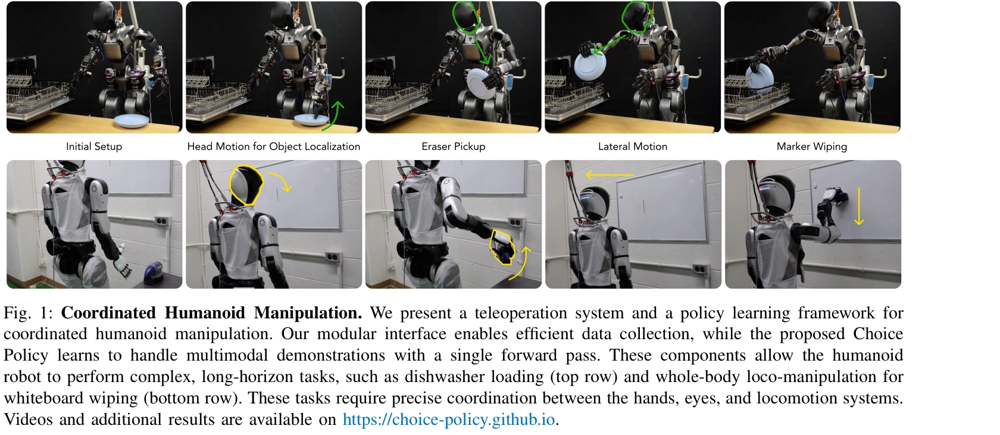
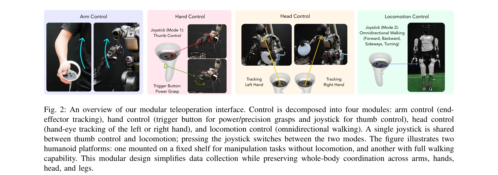

# Coordinated Humanoid Manipulation with Choice Policies

> **저자**: Haozhi Qi, Yen-Jen Wang, Toru Lin, Brent Yi, Yi Ma, Koushil Sreenath, Jitendra Malik | **날짜**: 2025-12-31 | **DOI**: [10.48550/arXiv.2512.25072](https://doi.org/10.48550/arXiv.2512.25072)

---

## Essence

*Fig. 1: Coordinated Humanoid Manipulation. We present a teleoperation system and a policy learning framework for*

휴머노이드 로봇의 전신 협조 조작을 위해 모듈식 텔레오퍼레이션 인터페이스와 Choice Policy라는 모방 학습 방식을 결합한 시스템을 제시한다. Choice Policy는 다중 후보 행동을 생성하고 점수를 학습하여 멀티모달 행동을 효율적으로 모델링한다.

## Motivation

- **Known**: 휴머노이드 로봇의 조작은 기존 연구에서 주로 상체만 제어하거나 능동적 머리 제어가 부족했으며, diffusion policy는 실시간성이 떨어지고 행동 복제는 멀티모달 특성을 잘 포착하지 못한다.
- **Gap**: 머리, 손, 다리를 포함한 전신 협조 제어의 동시 달성이 어렵고, 멀티모달 행동을 실시간으로 모델링할 수 있는 효율적인 방법이 부족하다.
- **Why**: 휴머노이드 로봇이 인간 중심 환경에서 복잡한 조작 작업을 자율적으로 수행하려면 전신 협조가 필수적이며, 이는 로봇의 실제 배치 가능성을 크게 높인다.
- **Approach**: 모듈식 텔레오퍼레이션을 통해 고품질 시연 데이터를 효율적으로 수집하고, Choice Policy를 사용하여 다중 행동 후보를 생성 및 점수 매김으로써 단일 forward pass로 멀티모달 행동을 모델링한다.

## Achievement

*Fig. 1: Coordinated Humanoid Manipulation. We present a teleoperation system and a policy learning framework for*

- **모듈식 텔레오퍼레이션 인터페이스**: VR 컨트롤러 기반 직관적 제어로 팔 end-effector 추적, 파지 원시형(grasp primitives), 손-눈 협조, 로코모션을 분리하여 효율적인 데이터 수집 가능
- **Choice Policy 알고리즘**: K개의 행동 후보를 생성하고 scoring network로 평가하여 diffusion policy 대비 빠른 추론과 behavior cloning 대비 우수한 멀티모달 행동 모델링 달성
- **실제 작업 검증**: 식기세척기 로딩과 화이트보드 닦기 로코-조작 작업에서 Choice Policy가 diffusion policy와 standard behavior cloning을 현저히 능가
- **손-눈 협조의 중요성 증명**: 장기 지평 작업에서 머리 추적이 성공에 필수적임을 실증적으로 입증

## How

*Fig. 2: An overview of our modular teleoperation interface. Control is decomposed into four modules: arm control (end-*

- VR 컨트롤러 입력을 4개의 모듈(팔, 손, 머리, 로코모션)로 분해하고 각 모듈별 직관적 제어 매핑 설계
- teleoperator의 변동성으로 인한 멀티모달 시연 데이터 자동 생성
- Choice Policy: action proposal network가 K개의 행동 후보 생성, score network가 각 후보와 ground-truth 행동의 겹침 정도(음수 MSE)를 학습
- Training: winner-takes-all 패러다임으로 MSE가 최소인 제안만 backpropagation 적용
- Inference: K개 후보 중 최고 점수 행동 선택하여 실행

## Originality

- 텔레오퍼레이션 측면에서 머리 추적을 포함한 진정한 전신 협조 제어 인터페이스 최초 제시
- Choice Policy는 multi-choice learning을 로봇 제어에 적용한 새로운 접근법으로, diffusion의 느린 추론과 behavior cloning의 낮은 표현력 문제를 동시에 해결
- modular 텔레오퍼레이션과 learning 프레임워크의 시스템 수준 통합 설계

## Limitation & Further Study

- 선정된 두 작업(식기세척기, 화이트보드)이 여전히 제한적이며 더 광범위한 조작 작업에 대한 평가 필요
- Choice Policy의 K값 선택과 최적화, scoring network 설계에 대한 상세한 ablation 분석 부족
- 시뮬레이션과 실제 로봇 간의 차이 분석 및 sim-to-real transfer 성능 평가 미흡
- 텔레오퍼레이션 효율성(데이터 수집 시간, operator 피로도) 측정의 정량적 지표 부재
- 후속 연구: 더 복잡한 다물체 조작 작업 확장, 온라인 학습을 통한 정책 개선, 다양한 휴머노이드 플랫폼 일반화

## Evaluation

- Novelty: 4/5
- Technical Soundness: 3/5
- Significance: 4/5
- Clarity: 4/5
- Overall: 4/5

**총평**: 이 논문은 휴머노이드 전신 조작을 위한 실용적이고 확장 가능한 시스템을 제시하며, Choice Policy는 멀티모달 행동 모델링에서 효율성과 표현력의 균형을 잘 달성했다. 모듈식 텔레오퍼레이션과 함께 실제 로봇 작업에서의 성공적 검증은 고가치의 실제 기여를 보여준다.

## Related Papers

- 🔄 다른 접근: [[papers/1700_TACT_Humanoid_Whole-body_Contact_Manipulation_through_Deep_I/review]] — Choice Policy의 다중 후보 행동 학습과 TACT의 촉각 기반 모방학습은 휴머노이드 조작의 서로 다른 학습 방식
- 🏛 기반 연구: [[papers/1614_Physically_Consistent_Humanoid_Loco-Manipulation_using_Laten/review]] — LDM 기반 인간-물체 상호작용 생성이 Choice Policy의 멀티모달 행동 모델링을 위한 데이터 생성 기반
- 🔗 후속 연구: [[papers/1966_Hand-Eye_Autonomous_Delivery_Learning_Humanoid_Navigation_Lo/review]] — Hand-Eye 자율 배송이 협조 조작의 Choice Policy를 내비게이션과 결합한 확장 응용
- 🔄 다른 접근: [[papers/1997_Humanoid_Manipulation_Interface_Humanoid_Whole-Body_Manipula/review]] — 휴머노이드 조작을 위한 인터페이스 설계에서 Choice Policy와 전통적인 whole-body manipulation interface의 서로 다른 접근법을 비교할 수 있다.
- 🏛 기반 연구: [[papers/2164_TWIST2_Scalable_Portable_and_Holistic_Humanoid_Data_Collecti/review]] — Choice Policy의 모듈식 텔레오퍼레이션 데이터 수집 방법론이 TWIST2의 확장 가능한 데이터 수집 시스템과 기본 원리를 공유한다.
- 🏛 기반 연구: [[papers/1869_DexMimicGen_Automated_Data_Generation_for_Bimanual_Dexterous/review]] — Choice Policy의 모듈식 모방 학습 방식이 DexMimicGen의 대규모 양손 정교 조작 데이터 생성에서 다중 행동 후보 생성의 이론적 기반을 제공한다.
- 🔄 다른 접근: [[papers/1967_HandX_Scaling_Bimanual_Motion_and_Interaction_Generation/review]] — Choice Policy의 다중 후보 행동 생성과 HandX의 양손 동작 생성은 복잡한 조작 작업에서 서로 다른 행동 모델링 접근법을 제시한다.
- 🔗 후속 연구: [[papers/2091_MaskedManipulator_Versatile_Whole-Body_Manipulation/review]] — Choice Policy의 전신 협조 조작이 MaskedManipulator의 다양한 전신 조작으로 확장되어 더 범용적인 휴머노이드 제어를 달성한다.
- 🏛 기반 연구: [[papers/1775_A_Closed-Form_Geometric_Retargeting_Solver_for_Upper_Body_Hu/review]] — 휴머노이드 시각-촉각-행동 데이터셋이 Choice Policy의 모듈식 텔레오퍼레이션과 모방 학습에 필요한 멀티모달 훈련 데이터를 제공한다.
- 🔄 다른 접근: [[papers/1700_TACT_Humanoid_Whole-body_Contact_Manipulation_through_Deep_I/review]] — TACT의 촉각 기반 모방학습과 Choice Policy의 다중 후보 행동 학습은 휴머노이드 조작의 서로 다른 센서 활용 방식
- 🏛 기반 연구: [[papers/1869_DexMimicGen_Automated_Data_Generation_for_Bimanual_Dexterous/review]] — Choice Policy의 다중 후보 행동 생성 방식이 DexMimicGen의 소수 인간 시연으로부터 대규모 양손 조작 궤적을 자동 생성하는 데 필요한 행동 다양성 확보 방법론을 제공한다.
- 🧪 응용 사례: [[papers/2054_Learning_Humanoid_Arm_Motion_via_Centroidal_Momentum_Regular/review]] — Learning Humanoid Arm Motion의 팔-다리 분리 제어가 Coordinated Humanoid Manipulation의 choice policies에서 상하체 협응 최적화에 활용될 수 있다.
