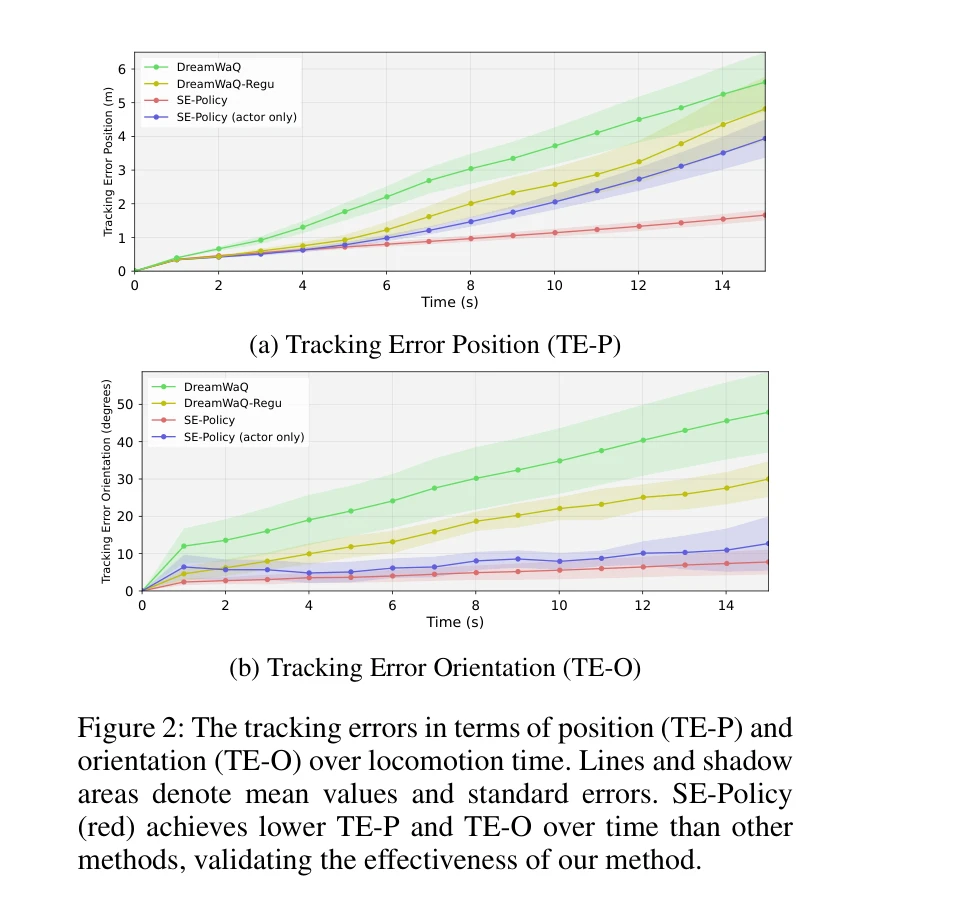

# Coordinated Humanoid Robot Locomotion with Symmetry Equivariant Reinforcement Learning Policy

> **저자**: Buqing Nie, Yang Zhang, Rongjun Jin, Zhanxiang Cao, Huangxuan Lin, Xiaokang Yang, Yue Gao | **날짜**: 2025-08-02 | **URL**: [https://arxiv.org/abs/2508.01247](https://arxiv.org/abs/2508.01247)

---

## Essence

*Figure 1: The overall architecture of SE-Policy. (a) Left: the architecture of the actor and critic model. (b) upper rig*

인간의 신경계에서 영감을 받은 Symmetry Equivariant Policy (SE-Policy)를 제안하여, 휴머노이드 로봇의 형태적 대칭성을 DRL 프레임워크에 엄격하게 임베딩함으로써 조정되고 균형잡힌 보행을 실현한다.

## Motivation

- **Known**: Deep Reinforcement Learning (DRL)은 로봇 제어 작업에서 높은 성능을 보이고 있으나, 기존 방법들은 로봇의 형태적 대칭성을 무시하여 비대칭적이고 부조화된 행동을 야기한다.
- **Gap**: 휴머노이드 로봇의 엄격한 대칭성 등변성(equivariance)과 불변성(invariance)을 네트워크 아키텍처에 직접 통합하면서도 추가 하이퍼파라미터 없이 실제 로봇에서 효과적으로 작동하는 방법이 부족하다.
- **Why**: 대칭성을 올바르게 활용하면 정책 성능을 향상시키고 더 자연스럽고 조정된 동작을 생성하여 사용자 경험을 개선하고 작업 효율성을 높일 수 있다.
- **Approach**: Actor에는 symmetry equivariance를, Critic에는 symmetry invariance를 네트워크 아키텍처에 엄격하게 임베딩하는 SE-Policy를 제안하며, Equivariant MLP를 통해 대칭 관측에 대해 일관된 행동을 강제한다.

## Achievement

*Figure 2: The tracking errors in terms of position (TE-P) and*

- **성능 향상**: Unitree G1 휴머노이드 로봇의 속도 추적 작업에서 기존 최고 성능 방법 대비 40%까지 추적 정확도 개선
- **공간-시간 조정성 달성**: 대칭적이고 자연스러운 동작 생성으로 좌우 관절의 균형잡힌 움직임 실현
- **하이퍼파라미터 자유성**: 추가 하이퍼파라미터 튜닝 없이 엄격한 대칭성 제약 적용
- **실세계 검증**: 시뮬레이션과 실제 로봇 배포 모두에서 효과성 입증

## How

*Figure 1: The overall architecture of SE-Policy. (a) Left: the architecture of the actor and critic model. (b) upper rig*

- 관측 공간에 속도 명령, 관절 상태, 이전 액션, 위상 신호(sinusoidal clock signal) 포함
- Actor 네트워크에 Equivariant MLP를 사용하여 대칭 관측에 대해 대칭 액션 출력 강제
- Critic 네트워크에 불변성(invariance)을 임베딩하여 대칭 관측에 동일한 가치 평가 제공
- 네트워크 아키텍처의 하드 제약을 통해 데이터 증강이나 손실 정규화 없이 대칭성 구현
- 높이맵 인코더-디코더와 선형-ReLU 계층으로 구성된 모듈식 설계

## Originality

- 기존 소프트 제약(보상 형성, 데이터 증강, 손실 정규화) 대신 네트워크 아키텍처에 엄격한 대칭성 제약을 직접 통합하는 접근
- 휴머노이드 로봇의 실제 배포(sim-to-real)에서 엄격한 Equivariant RL 방법의 실효성을 처음으로 입증
- Actor와 Critic에 각각 다른 대칭성 속성(등변성과 불변성)을 선택적으로 적용하는 설계의 명확한 동기 제시

## Limitation & Further Study

- 실험이 Unitree G1과 속도 추적 작업에 제한되어 있으므로, 다른 휴머노이드 로봇 플랫폼과 작업(예: 조작, 점프)에서의 일반화 검증 필요
- 형태적 대칭성이 완전하지 않은 로봇이나 비대칭 작업에 대한 적용 가능성 미흡
- Equivariant MLP의 계산 복잡도와 학습 수렴 특성에 대한 상세 분석 부족
- 정성적 평가(자연스러움, 안정성)에 대한 정량적 메트릭 부재

## Evaluation

- Novelty: 4/5
- Technical Soundness: 4/5
- Significance: 4/5
- Clarity: 4/5
- Overall: 4/5

**총평**: SE-Policy는 휴머노이드 로봇의 형태적 대칭성을 엄격한 네트워크 제약으로 구현하여 추가 하이퍼파라미터 없이 40% 성능 향상을 달성한 혁신적인 방법이며, 실제 로봇 배포를 통해 실용성을 입증했다는 점에서 높은 기여도를 가진다.
