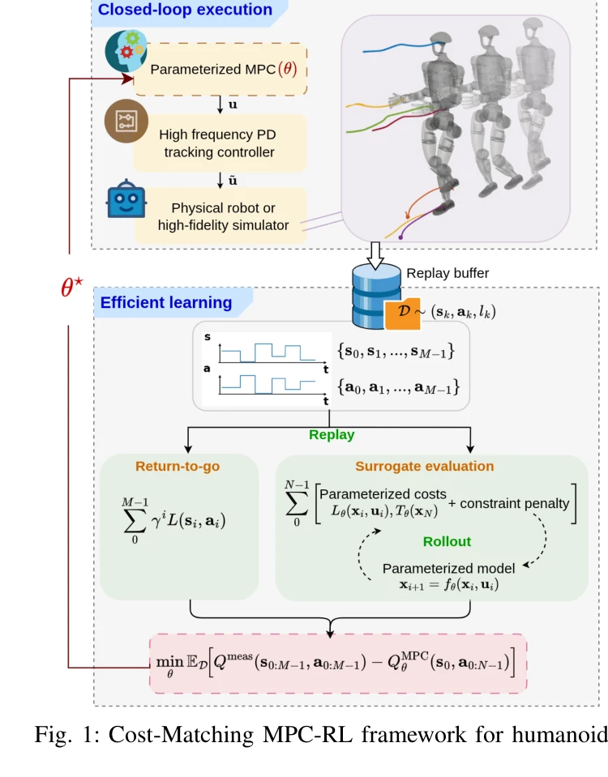

# Cost-Matching Model Predictive Control for Efficient Reinforcement Learning in Humanoid Locomotion

> **저자**:  | **날짜**: 2026-03-30 | **URL**: [https://arxiv.org/abs/2603.28243](https://arxiv.org/abs/2603.28243)

---

## Essence

*Fig. 1: Cost-Matching MPC-RL framework for humanoids.*

인간형 로봇 보행 제어를 위해 MPC를 RL로 학습할 때 반복적인 MPC 해결의 계산 부담을 제거하는 Cost-Matching MPC 방법을 제안한다. 매개변수화된 MPC의 비용-미래가치(cost-to-go)와 실제 측정된 리턴값의 불일치를 최소화하여 효율적으로 학습한다.

## Motivation

- **Known**: MPC는 인간형 로봇 보행 제어에서 제약 조건 처리와 안정성으로 인해 지배적 방법이며, RL은 데이터로부터 견고한 동작을 학습할 수 있으나 샘플 비효율성과 안전 제약 강제의 어려움이 있다.
- **Gap**: 기존 MPC-RL 방법은 학습 루프 내에서 MPC를 반복적으로 풀어야 하므로 계산 비용이 높고, 실시간 제어 요구 사항이 있는 복잡한 인간형 로봇 보행 제어에는 적용이 어렵다.
- **Why**: 인간형 로봇 보행은 간헐적 접촉, 높은 자유도, 엄격한 안전 제약이 있어 도전적이며, MPC의 제약 처리 능력과 RL의 학습 능력을 결합하면서도 계산 효율성을 달성하는 것은 실제 배포에 필수적이다.
- **Approach**: 실시간 MPC 해결 대신 기록된 폐루프 궤적을 따라 매개변수화된 예측 모델을 롤아웃하고 단계별 비용을 누적하여 MPC cost-to-go를 평가한다. 이 대리 비용과 실제 측정 리턴의 차이를 최소화하도록 gradient 기반 학습을 수행한다.

## Achievement

*Fig. 4: Simulation snapshots of the humanoid during locomo-*

- **계산 효율성**: MPC 해결-루프 제거로 학습 시간을 획기적으로 단축하면서 MPC-RL 프레임워크 보존
- **우수한 성능**: 수동으로 조정된 기준선 대비 향상된 보행 성능과 모델 불일치 및 외부 외란에 대한 견고성 입증
- **제약 처리 유지**: MPC의 명시적 제약 조건 처리(마찰 원뿔, 중심압 등) 및 안전성 특성을 보존
- **일반적 프레임워크**: Optimal Control Problem으로 정식화된 다양한 시스템에 적용 가능한 통용 가능한 방법론

## How

*Fig. 1: Cost-Matching MPC-RL framework for humanoids.*

- Centroidal dynamics 기반 OCP 정식화: 질량 중심 운동량과 관절 각도로 상태 구성, 접촉 레ンch와 관절 속도를 제어 입력으로 설정
- 다층 제약 조건 포함: 관절 한계, 발 충돌 회피(SDF 기반), 마찰 원뿔, 중심압(CoP), 접촉 강직성, 스윙 발의 수직 속도 추적
- Cost-matching 손실함수: QMPC_θ(x,u) = T(x_N) + Σ L(x_i, u_i)의 MPC 예측값과 실제 측정 리턴 Q_meas의 불일치 최소화
- Differentiable cost 구성: 매개변수화된 단계 비용 L과 상태 제약 위반에 대한 미분 가능 페널티로 gradient 기반 최적화 가능
- 계층적 제어 아키텍처: 상위 MPC 플래너가 저주파로 참조 명령 생성, 저수준 PD 추적 제어기가 관절 토크로 매핑
- 폐루프 데이터 활용: 기록된 상태-행동 궤적을 따라 모델을 롤아웃하여 실제 닫힌 루프 동작과의 불일치 직접 최소화

## Originality

- MPC solve-in-the-loop 제거: 기존 MPC-RL 방법의 핵심 병목을 해결하는 새로운 학습 패러다임 제시
- Cost-matching 손실: MPC의 내부 구조(predictive model, cost, constraints)를 보존하면서 학습하는 효율적 방법
- Centroidal dynamics 기반 인간형 로봇 OCP: 완전한 중심 운동량 모델과 다양한 물리적 제약을 통합한 상세한 제어 정식화
- 폐루프 검증 방법론: 시뮬레이션에서 고충실도 데이터를 활용한 체계적 검증 및 모델 불일치 테스트

## Limitation & Further Study

- 고충실도 시뮬레이션 검증만 제시: 실제 물리 로봇 배포 결과 부재로 sim-to-real 갭 미해결
- 학습된 매개변수의 해석성 제한: 비용 함수 매개변수가 학습되면서 원래의 명확한 물리적 의미 해석 어려움
- MPC 모델 구조 고정: centroidal dynamics 선택은 고정되어 있어 근본적인 모델 오류는 매개변수 학습만으로 보정 불가
- 확장성 분석 부족: 더 복잡한 동작(계단 오르기, 불규칙 지형) 또는 더 긴 예측 지평선에서의 성능 미분석
- **후속연구**: (1) 물리 로봇 실험으로 sim-to-real 갭 검증, (2) 적응형 제약 조건 매개변수 학습, (3) 실시간 MPC 계산 한계에서의 지평선 선택 최적화

## Evaluation

- Novelty: 4/5
- Technical Soundness: 3/5
- Significance: 4/5
- Clarity: 4/5
- Overall: 4/5

**총평**: 본 논문은 MPC-RL의 계산 병목을 해결하는 창의적인 cost-matching 방법을 제시하며, 복잡한 인간형 로봇 제어 문제에 체계적으로 적용한 우수한 연구다. 다만 실제 로봇 검증의 부재가 임팩트를 제한하므로, 향후 sim-to-real 전이 연구가 필요하다.
