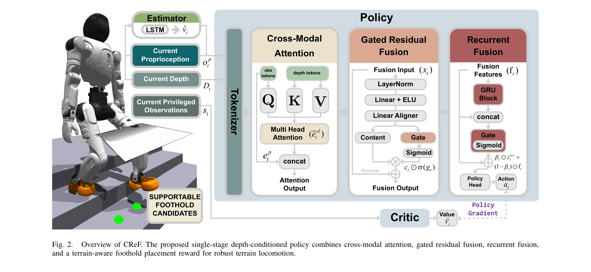
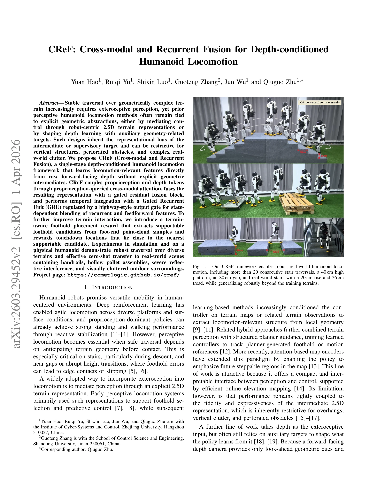

# CReF: Cross-modal and Recurrent Fusion for Depth-conditioned Humanoid Locomotion

> **저자**:  | **날짜**: 2026-03-31 | **URL**: [https://arxiv.org/abs/2603.29452](https://arxiv.org/abs/2603.29452)

---

## Essence

*Fig. 2.*

CReF는 cross-modal attention과 gated residual fusion을 활용하여 raw depth 입력으로부터 직접 locomotion-relevant 특징을 학습하는 단일 단계 depth-conditioned humanoid locomotion 프레임워크로, 명시적 기하학적 중간 표현 없이 zero-shot sim-to-real transfer를 달성한다.

## Motivation

- **Known**: Deep reinforcement learning 기반의 humanoid locomotion은 proprioception만으로 안정적인 보행을 달성할 수 있으며, 2.5D terrain representation을 통한 depth 기반 인지 locomotion이 널리 채택되어 왔다. 다만 이러한 기존 방법들은 명시적 기하학적 추상화에 의존하거나 auxiliary geometry-related targets를 필요로 한다.
- **Gap**: 기존 2.5D terrain representation 기반 방법들은 overhangs, vertical clutter, perforated obstacles 등의 표현에 제한적이며, auxiliary targets에 의존하는 방법들은 중간 표현의 representational bias를 상속하게 된다. End-to-end depth learning 방법들은 종종 synthetic depth corruption을 포함한 복잡한 훈련 설계가 필요하다.
- **Why**: Humanoid 로봇이 계단 하강, 갭 통과, 높이 변화 등 기하학적으로 복잡한 지형에서 안전하게 움직이려면 명시적 중간 표현의 제약 없이 depth로부터 직접 relevant feature를 학습할 수 있는 더 유연한 프레임워크가 필요하다. Zero-shot transfer 가능성은 실제 배포 효율성을 크게 향상시킨다.
- **Approach**: CReF는 proprioception-queried cross-modal attention으로 proprioception과 depth tokens를 결합하고, gated residual fusion block으로 표현을 fuse한 후, GRU와 highway-style output gate를 통해 temporal integration을 수행한다. 추가로 terrain-aware foothold placement reward가 foot-end point-cloud samples로부터 supportable foothold candidates를 추출하고 touchdown을 guide한다.

## Achievement

*Fig. 1.*

- **단일 단계 프레임워크**: 명시적 기하학적 중간 표현이나 multi-stage supervision 없이 raw depth와 proprioception으로부터 직접 joint position targets 생성
- **강건한 지형 횡단**: 20회 이상 연속 계단 횡단, 40cm 높은 플랫폼, 80cm 갭, 20cm rise/26cm tread 실제 계단 등 다양한 지형에서 안정적 성능
- **Zero-shot sim-to-real transfer**: 훈련 중 synthetic depth corruption 없이 실제 하드웨어(AGIBOT X2 Ultra)에 직접 배포 가능하며 핸드레일, hollow pallet assemblies, 반사 간섭, 야외 clutter 환경에서 효과적
- **개선된 내려오기 성능**: Terrain-aware foothold placement reward를 통해 계단 내려오기에서 특히 substantial gains 달성

## How

*Fig. 2.*

- **Cross-modal attention**: Proprioception tokens이 depth tokens를 query하여 modalities 간 상호작용 실현
- **Gated residual fusion**: Linear + ELU와 sigmoid gate를 통해 fusion된 depth 특징 조정
- **Recurrent fusion**: GRU with highway-style output gate로 recurrent 및 feedforward features의 state-dependent blending 수행
- **Terrain-aware foothold placement reward (Eq. 23)**: Foot-end point-cloud samples로부터 supportable candidates 추출 후 touchdown locations을 nearest candidate에 가깝게 reward
- **Asymmetric value network**: Simulation에서만 ground-truth base linear velocity와 robot-centric terrain height observation 제공
- **PPO 기반 훈련**: Table I의 velocity tracking, contact shaping, foothold placement 등 12개 reward terms 활용

## Originality

- **End-to-end depth learning 패러다임**: Explicit terrain reconstruction, decoder-constrained latent estimation, privileged teacher transfer 등의 auxiliary supervision 제거
- **Proprioception-queried cross-modal attention**: Proprioception을 query로 사용하여 depth 정보를 동적으로 선택적 활용
- **Highway-style output gate in GRU**: Locomotion state에 따라 recurrent와 feedforward 특징을 적응적으로 blend
- **Terrain-aware foothold placement reward**: 단순 prohibitive constraints 대신 supportable regions으로 적극적으로 touchdown guide
- **Synthetic corruption 없는 zero-shot transfer**: 현실적 sensor simulation 없이도 실제 depth sensing의 artifacts에 robust

## Limitation & Further Study

- **Forward-facing depth의 한계**: 로봇 정면만 관찰 가능하여 instantaneous underfoot region을 직접 볼 수 없음
- **Point-cloud 기반 foothold 추출의 계산 비용**: Real-time foot-end point-cloud processing의 computational overhead 미상세
- **특정 sensor 의존성**: 논문에서 사용된 특정 depth camera에 대한 transfer 성능 변동 가능성
- **Sim-to-real gap의 완전한 극복 미결**: Zero-shot transfer 달성했으나, 더 극단적인 실제 환경 조건이나 camera 종류에 대한 robustness 검증 필요
- **후속연구**: Multi-view depth 통합, 더 강한 빛 간섭 환경 대응, 다양한 humanoid 플랫폼 일반화 가능성 탐색

## Evaluation

- Novelty: 4/5
- Technical Soundness: 3/5
- Significance: 4/5
- Clarity: 4/5
- Overall: 4/5

**총평**: CReF는 명시적 기하학적 중간 표현을 제거하고 cross-modal attention과 gated recurrent fusion을 통해 raw depth로부터 직접 locomotion-relevant features를 학습하는 혁신적 접근법으로, zero-shot sim-to-real transfer와 다양한 실제 환경에서의 강건한 성능을 통해 humanoid locomotion 분야에 significant contribution을 제시한다.
