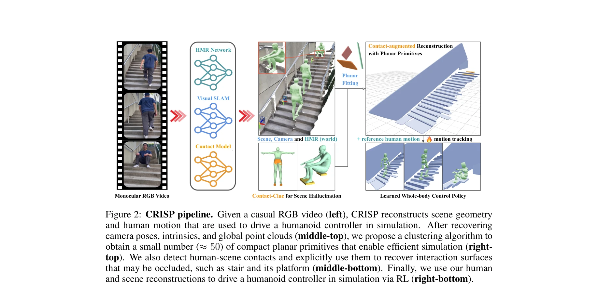
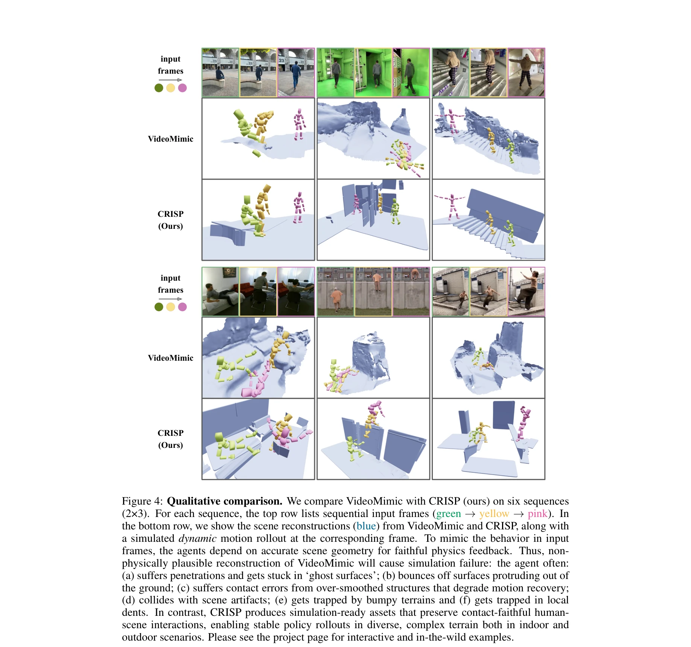
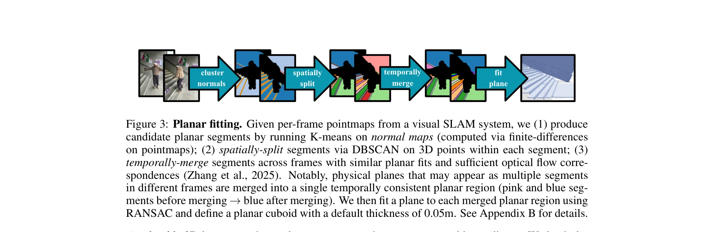

# CRISP: Contact-Guided Real2Sim from Monocular Video with Planar Scene Primitives

> **저자**: Zihan Wang, Jiashun Wang, Jeff Tan, Yiwen Zhao, Jessica Hodgins, Shubham Tulsiani, Deva Ramanan | **날짜**: 2025-12-16 | **URL**: [https://arxiv.org/abs/2512.14696](https://arxiv.org/abs/2512.14696)

---

## Essence

*Figure 2: CRISP pipeline. Given a casual RGB video (left), CRISP reconstructs scene geometry*

단안 비디오에서 planar primitive 기반 scene geometry 복원과 human motion 추정을 통해 물리 시뮬레이션 가능한 human-scene reconstruction을 수행하는 real-to-sim 파이프라인을 제안한다.

## Motivation

- **Known**: Human mesh recovery와 3D scene reconstruction 기술은 각각 발전했으나, joint human-scene reconstruction 시 노이즈와 artifacts로 인해 물리 시뮬레이션 실패가 빈번하다. 기존 방식은 data-driven prior에 의존하거나 physics 제약이 없다.
- **Gap**: Monocular video에서 depth 노이즈, occlusion, 물리 시뮬레이션 호환성 부족으로 인해 human-scene interaction을 정확히 복원하기 어렵다. 특히 small geometry artifact도 humanoid simulation을 실패하게 만든다.
- **Why**: Robotics, embodied AI, AR/VR 등의 응용에서 in-the-wild video로부터 직접 물리 시뮬레이션 가능한 character 및 scene 생성이 필수적이며, 이는 대규모 학습 데이터 생성의 병목이다.
- **Approach**: Point cloud에서 depth, normal, optical flow 기반 clustering으로 convex planar primitive를 자동 추출하고, contact modeling을 통해 occluded geometry를 복원한 후, RL-driven humanoid controller로 물리적 타당성을 확보한다.

## Achievement

*Figure 4: Qualitative comparison. We compare VideoMimic with CRISP (ours) on six sequences*

- **Motion tracking 실패율 감소**: EMDB, PROX 벤치마크에서 55.2%에서 6.9%로 8배 감소 (93.1% real-to-sim 성공율)
- **Simulation 효율성**: Dense mesh 대비 43% 빠른 RL throughput 달성
- **일반화 능력**: Casually-captured video, Internet video, Sora-generated video 등 in-the-wild 데이터에서 검증
- **물리 기반 개선**: Physical reasoning이 human과 scene reconstruction 품질 모두 향상

## How

*Figure 3: Planar fitting. Given per-frame pointmaps from a visual SLAM system, we (1) produce*

- Visual SLAM (camera pose, intrinsics)과 HMR network로 world coordinate에서 global point cloud 및 human mesh 생성
- K-means clustering on normal maps로 candidate planar segment 추출
- DBSCAN으로 spatial split, 유사 planar fit과 optical flow 일관성으로 temporal merge 수행
- VLM 기반 contact type 감지 (sitting-on-chair 등)로 occluded geometry 복원 단서 추출
- Reconstructed human motion과 scene geometry로 RL-trained humanoid controller 구동하여 physical plausibility 확인
- Reinforcement learning을 통한 motion tracking 정책 학습으로 interactive trajectory 생성

## Originality

- Planar primitive fitting을 통한 깔끔한 simulation-ready geometry 생성 방식의 단순성과 효과성
- Human posture를 contact hallucination cue로 활용하여 occluded scene geometry 복원하는 창의적 접근
- Physics-based RL을 reconstruction refinement pipeline의 필수 단계로 통합하여 순환적 개선 실현
- Concurrent work (VideoMimic)대비 contact modeling, planar representation, depth prior 활용에서 차별화

## Limitation & Further Study

- Static scene 가정으로 동적 환경 확장 필요
- Planar primitive로 표현 불가능한 complex curved geometry (예: 원형 물체) 처리 제한
- VLM 기반 contact detection이 특정 interaction type에 의존하여 미학습 interaction 대응 어려움
- RL training 수렴 시간과 hyperparameter tuning의 계산 비용 불명시
- Single human 가정으로 multi-person interaction 확장 미지원
- Outdoor scene과 extreme illumination 조건에 대한 평가 부재

## Evaluation

- Novelty: 4/5
- Technical Soundness: 3/5
- Significance: 4/5
- Clarity: 4/5
- Overall: 4/5

**총평**: CRISP는 planar primitive 기반의 간단하면서도 효과적인 real-to-sim 파이프라인으로, 기존 human-scene reconstruction의 근본적 문제(simulation incompatibility)를 physics 기반 검증으로 해결하며, substantial empirical improvement와 in-the-wild generalization을 통해 embodied AI 분야에 실질적 기여를 한다.
