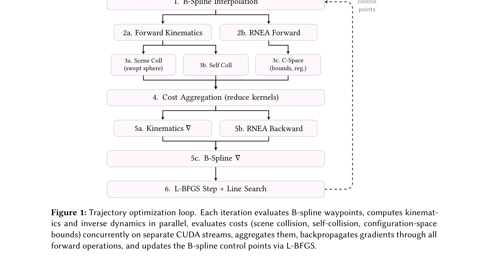
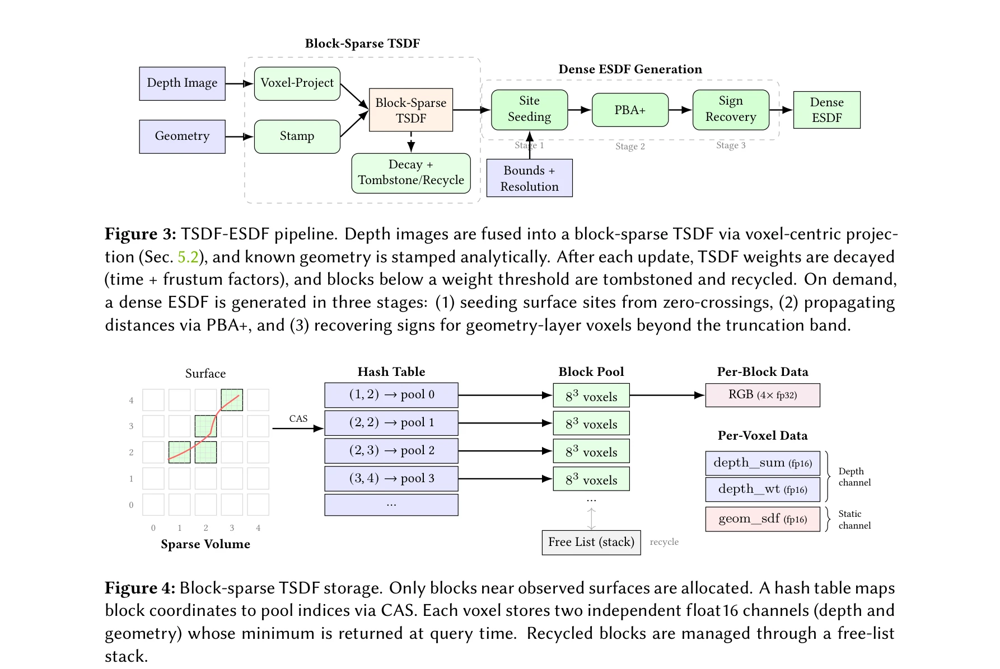

# cuRoboV2: Dynamics-Aware Motion Generation with Depth-Fused Distance Fields for High-DoF Robots

> **저자**: Balakumar Sundaralingam, Adithyavairavan Murali, Stan Birchfield | **날짜**: 2026-03-05 | **URL**: [https://arxiv.org/abs/2603.05493](https://arxiv.org/abs/2603.05493)

---

## Essence

*Figure 1: Trajectory optimization loop. Each iteration evaluates B-spline waypoints, computes kinemat-*

cuRoboV2는 B-spline 궤적 최적화, GPU 기반 TSDF/ESDF 인식 파이프라인, 확장 가능한 고자유도 로봇 계산을 통합하여 조작기부터 인형로봇까지 안전하고 동역학 인식적인 운동 생성을 제공하는 통합 프레임워크이다.

## Motivation

- **Known**: 로봇 운동 생성은 전통적으로 전역 계획과 반응형 제어로 분리되었으며, 기존 방법들은 충돌 회피와 동역학 제약을 동시에 만족하거나 고자유도 시스템으로 확장하는 데 어려움을 겪고 있다.
- **Gap**: 현존하는 방법들은 세 가지 근본적 문제를 가지고 있다: (1) 빠른 계획기는 물리적으로 실행 불가능한 궤적을 생성, (2) 반응형 제어는 고충실도 인식과 안전 보장 사이의 트레이드오프 존재, (3) 고자유도 시스템으로의 확장성 부족.
- **Why**: 로봇 자율성을 위해서는 실시간으로 안전하고 실행 가능하며 동역학 인식적인 운동 생성이 필수적이며, 이는 조작 작업과 인형로봇 제어 등 실세계 응용에 직접적으로 영향을 미친다.
- **Approach**: B-spline 제어점 최적화로 부드러움과 토크 제약을 자동 보장하고, 블록-희소 TSDF를 밀집 ESDF로 변환하는 GPU 네이티브 인식 파이프라인을 구축하며, 위상 인식 운동학, 미분 가능한 역동역학, 맵-리듀스 자충돌 검사로 고자유도 확장성을 확보한다.

## Achievement

*Figure 3: TSDF-ESDF pipeline. Depth images are fused into a block-sparse TSDF via voxel-centric projec-*

- **B-spline 궤적 최적화**: 제어점 최적화를 통해 부드러움과 토크 제약을 자동으로 보장하여 동역학 인식적 계획과 비정적 경계 조건의 반응형 제어를 통합
- **GPU 네이티브 인식 파이프라인**: 블록-희소 TSDF를 밀집 ESDF로 변환하여 작업공간 전역에 대한 O(1) 거리 쿼리 제공, nvblox 대비 10배 빠르고 8배 메모리 절감, 99% 충돌 감지율
- **고자유도 확장성**: 위상 인식 운동학, 미분 가능 역동역학, 맵-리듀스 자충돌로 GPU 구현이 실패하던 48-DoF 인형로봇에서 99.6% 충돌 회피 역운동학 달성, 40배 가속화
- **실험 성과**: 3kg 페이로드에서 99.7% 성공률(기존 72-77%), 48-DoF 인형로봇 역운동학 99.6%, PyRoki 대비 89.5% vs 61% 재타겟팅 제약 만족도, 21% 낮은 추적 오차

## How

- B-spline 기저 함수의 국소 지지 특성(local support property)을 활용하여 제어점 미분 계산 및 경계 조건 설정
- 깊이 이미지와 메시 기하를 통합하는 복셀-중심 투영 전략으로 원자 경쟁(atomic contention) 제거
- Parallel Banding Algorithm (PBA+)을 CUDA 그래프 캡처로 완전히 구현하여 TSDF에서 ESDF로의 변환을 온디맨드 수행
- 블록-희소 저장소에서 관찰된 표면 근처 블록만 할당하는 메모리 효율적 구조 구현
- 희소 야코비안 계산으로 위상 인식 운동학을 GPU에서 효율적으로 구현
- Recursive Newton-Euler Algorithm (RNEA)를 미분 가능하게 구현하여 역동역학 제약 적용
- 맵-리듀스 패턴으로 자충돌 검사를 병렬화하여 고자유도 시스템 지원

## Originality

- B-spline 궤적 최적화를 고자유도 조작 로봇의 토크 제약과 함께 적용한 최초 시도
- 블록-희소 TSDF에서 작업공간 전역 밀집 ESDF 생성하는 새로운 GPU 파이프라인 제시
- CUDA 그래프 캡처를 활용한 완전 병렬화된 PBA+ 구현으로 reactive control 지원
- 고자유도 로봇(48-DoF 인형로봇)에서 동작하는 GPU 네이티브 역동역학 및 자충돌 검사 최초 구현
- LLM 코딩 어시스턴트와의 협업을 통한 73% 모듈 개발로 코드 구조화의 새로운 패러다임 제시

## Limitation & Further Study

- ESDF 생성의 밀집 그리드 특성상 매우 넓은 작업공간에서 메모리 효율성 저하 가능성
- B-spline 최적화의 초기값 민감성과 비볼록 최적화 문제로 인한 국소 최적해 문제 미해결
- 실제 로봇의 센서 노이즈, 레이턴시, 모델링 오차에 대한 견고성 평가 부족
- 학습 기반 방법과의 비교 실험 제한적
- LLM 기여도 정량화 시 코드 검증 과정의 표준화 부재
- 후속 연구: 적응형 ESDF 해상도 조정, 확률적 충돌 회피, 실시간 모델 학습 통합 필요

## Evaluation

- Novelty: 4/5
- Technical Soundness: 4/5
- Significance: 4/5
- Clarity: 4/5
- Overall: 4/5

**총평**: cuRoboV2는 동역학 인식적 운동 생성, GPU 가속 인식 처리, 고자유도 확장성에서 근본적 한계를 극복한 통합 프레임워크로, 조작 로봇부터 인형로봇까지 대폭 개선된 성능을 달성하여 로봇 자율성의 실용화에 크게 기여한다.

## Related Papers

- 🔗 후속 연구: [[papers/1633_Real-Time_Polygonal_Semantic_Mapping_for_Humanoid_Robot_Stai/review]] — 실시간 다각형 의미 맵핑의 GPU 가속 기술을 cuRoboV2의 TSDF/ESDF 인식 파이프라인과 결합하여 더 정확한 환경 인식이 가능하다.
- 🏛 기반 연구: [[papers/2120_OmniRetarget_Interaction-Preserving_Data_Generation_for_Huma/review]] — cuRoboV2의 동역학 인식 운동 생성 프레임워크가 OmniRetarget의 interaction-preserving data generation에 필수적인 기술적 기반을 제공한다.
- 🧪 응용 사례: [[papers/1749_VIRAL_Visual_Sim-to-Real_at_Scale_for_Humanoid_Loco-Manipula/review]] — VIRAL의 대규모 시각적 sim-to-real 전환 과정에서 cuRoboV2의 통합적 동역학 인식 운동 생성이 핵심적인 역할을 수행한다.
- 🏛 기반 연구: [[papers/1951_Genie_Sim_30__A_High-Fidelity_Comprehensive_Simulation_Platf/review]] — Genie Sim의 high-fidelity 시뮬레이션 환경이 cuRoboV2의 dynamics-aware motion generation을 검증하고 개발하는 플랫폼을 제공한다.
- 🔗 후속 연구: [[papers/1691_Stabilizing_Humanoid_Robot_Trajectory_Generation_via_Physics/review]] — physics-based trajectory stabilization과 dynamics-aware motion generation이 함께 안전하고 안정적인 로봇 운동 생성의 완전한 솔루션을 구성한다.
- 🔄 다른 접근: [[papers/1891_DynaRetarget_Dynamically-Feasible_Retargeting_using_Sampling/review]] — 고자유도 로봇의 동역학 인식 운동 생성에서 unified framework와 sampling-based trajectory optimization의 서로 다른 최적화 접근법을 보여준다.
- 🧪 응용 사례: [[papers/2088_Make_Tracking_Easy_Neural_Motion_Retargeting_for_Humanoid_Wh/review]] — cuRoboV2의 B-spline 궤적 최적화와 TSDF 파이프라인이 humanoid motion retargeting의 동적 실행 가능성 보장에 직접 활용될 수 있다.
- 🔄 다른 접근: [[papers/1667_SCDP_Learning_Humanoid_Locomotion_from_Partial_Observations/review]] — 부분 관측 기반 diffusion vs depth-fused motion generation이라는 다른 센서 조건부 접근법입니다.
- 🏛 기반 연구: [[papers/1628_PyRoki_A_Modular_Toolkit_for_Robot_Kinematic_Optimization/review]] — cuRoboV2의 B-spline 궤적 최적화 기법이 PyRoki의 모듈식 로봇 운동학 최적화 프레임워크에 핵심적인 기반 기술을 제공한다.
- 🔗 후속 연구: [[papers/1799_AMO_Adaptive_Motion_Optimization_for_Hyper-Dexterous_Humanoi/review]] — cuRoboV2의 dynamics-aware motion generation이 AMO의 29-DoF 실시간 적응형 전신 제어의 동역학적 정확성을 향상시킬 수 있다.
- 🔄 다른 접근: [[papers/1877_DiffCoTune_Differentiable_Co-Tuning_for_Cross-domain_Robot_C/review]] — cuRoboV2의 dynamics-aware motion generation이 differentiable simulator 없이도 도메인 전이 문제를 해결하는 다른 접근법을 제시한다.
- 🔄 다른 접근: [[papers/1891_DynaRetarget_Dynamically-Feasible_Retargeting_using_Sampling/review]] — 동적 실행 가능성 보장을 위한 sampling-based trajectory optimization과 unified dynamics-aware motion generation의 서로 다른 최적화 접근법을 제시한다.
- 🔗 후속 연구: [[papers/1930_Flexible_Motion_In-betweening_with_Diffusion_Models/review]] — cuRoboV2의 dynamics-aware motion generation을 텍스트 조건과 keyframe 제약이 결합된 더 복잡한 시나리오로 확장한 연구입니다.
- 🏛 기반 연구: [[papers/2067_Learning_to_Control_Physically-simulated_3D_Characters_via_G/review]] — 2D 키포인트를 활용한 물리 기반 제어가 깊이 융합 동역학 인식 운동 생성에 이론적 기반을 제공한다.
- 🔗 후속 연구: [[papers/2095_MeshMimic_Geometry-Aware_Humanoid_Motion_Learning_through_3D/review]] — MeshMimic의 geometry-aware 학습을 depth-fused dynamics로 확장하여 더 정확한 물리 기반 상호작용을 구현할 수 있다.
- 🏛 기반 연구: [[papers/2120_OmniRetarget_Interaction-Preserving_Data_Generation_for_Huma/review]] — cuRoboV2의 동역학 인식 운동 생성이 OmniRetarget의 고품질 kinematic reference 생성에 필수적인 기술적 토대를 마련한다.
- 🏛 기반 연구: [[papers/2162_TTT-Parkour_Rapid_Test-Time_Training_for_Perceptive_Robot_Pa/review]] — 동역학 인식 동작 생성과 깊이 융합 기법이 RGB-D 입력으로부터 고충실도 메시 재구성 기반 TTT 방법론의 기반이 됩니다.
- 🔄 다른 접근: [[papers/2137_PhysDiff_Physics-Guided_Human_Motion_Diffusion_Model/review]] — cuRoboV2의 dynamics-aware motion generation이 PhysDiff의 physics-guided approach와 다른 dynamics 통합 방식으로 물리적으로 타당한 motion을 생성합니다.
