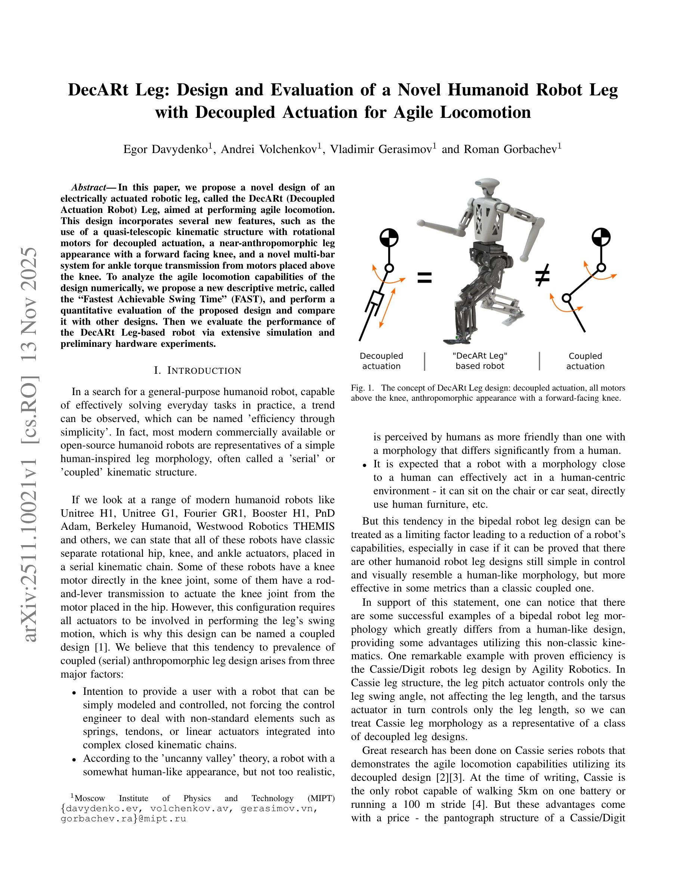

# DecARt Leg: Design and Evaluation of a Novel Humanoid Robot Leg with Decoupled Actuation for Agile Locomotion

> **저자**: Egor Davydenko, Andrei Volchenkov, Vladimir Gerasimov, Roman Gorbachev | **날짜**: 2025-11-13 | **URL**: [https://arxiv.org/abs/2511.10021](https://arxiv.org/abs/2511.10021)

---

## Essence

*Fig. 1. The concept of DecARt Leg design: decoupled actuation, all motors*

본 논문은 decoupled actuation을 활용하면서도 인간형 다리의 외형을 유지하는 DecARt Leg을 제안하며, FAST(Fastest Achievable Swing Time) 메트릭을 통해 agile locomotion 능력을 평가한다.

## Motivation

- **Known**: 기존 humanoid robot은 serial/coupled kinematic structure를 사용하며 제어 단순성과 인간형 외형을 추구한다. Cassie/Digit 로봇은 decoupled design으로 우수한 locomotion 성능을 보이지만 조류 같은 외형을 가진다.
- **Gap**: Decoupled actuation의 효율성과 human-like morphology를 동시에 달성하는 설계가 부재한 상태이다.
- **Why**: Agile locomotion 능력을 갖춘 일반목적형 humanoid robot 개발을 위해 decoupled design의 장점을 활용하면서도 인간형 외형을 유지하는 것이 필요하다.
- **Approach**: Quasi-telescopic kinematic structure를 통해 leg pitch motor와 leg length motor를 분리하고, novel multi-bar ankle actuation system으로 모든 모터를 무릎 위에 배치하여 decoupled actuation과 human-like appearance를 동시에 달성한다.

## Achievement

*Fig. 2.*

- **DecARt Leg 설계**: Decoupled actuation을 실현하면서도 forward-facing knee의 인간형 외형을 유지하는 quasi-telescopic leg design 제시
- **FAST 메트릭**: Agile locomotion capability를 정량적으로 평가하기 위한 새로운 descriptive metric 제안
- **설계 비교**: 기존 leg designs와의 정량적 비교를 통해 DecARt Leg의 우수성 검증
- **시뮬레이션 및 하드웨어 평가**: Extensive simulation과 preliminary hardware experiments로 성능 검증

## How

*Fig. 3. DecARt Leg multi-bar ankle torque transmission structure: different*

- Passive gears와 4-bar parallel structure를 결합하여 leg length motor의 회전을 foot의 직선 운동으로 변환
- Multi-bar linkage system으로 ankle actuation을 실현하고 모든 모터를 leg root 근처에 배치하여 swing inertia 최소화
- Analytical inverse kinematics 도출로 제어 단순성 확보
- Full compact/stretch 가능성과 fully compacted knee 상태에서 ankle 위치 조절 가능성 구현

## Originality

- Decoupled actuation과 human-like morphology의 결합이 기존 연구와 차별화되며, Cassie의 장점을 유지하면서 bird-like appearance 극복
- Rotational actuator만 사용하면서 decoupled design 실현하여 modeling/control 단순성 유지
- FAST 메트릭의 신규 제안으로 agile locomotion capability 정량화
- Multi-bar ankle torque transmission의 novel design으로 motor placement 최적화

## Limitation & Further Study

- Preliminary hardware experiments에 그쳐 full-scale locomotion performance 검증 부족
- FAST 메트릭의 실제 locomotion 성능과의 상관성에 대한 충분한 검증 필요
- Decoupled vs coupled design의 energy efficiency 비교 분석 미흡
- 제어 알고리즘 및 안정성 분석에 대한 상세 기술 부재
- 후속 연구로 full-scale robot 구현, 실제 동적 locomotion 실험, 다양한 terrain에서의 성능 평가 필요

## Evaluation

- Novelty: 4/5
- Technical Soundness: 3/5
- Significance: 4/5
- Clarity: 4/5
- Overall: 4/5

**총평**: 본 논문은 humanoid robotics의 오랜 설계 갈등(efficiency vs. human-like appearance)을 새로운 kinematic approach로 해결하려는 의미 있는 시도이며, FAST 메트릭 제안과 함께 충분한 설계 혁신성을 보여준다. 다만 preliminary hardware 수준의 검증에 그쳐 실제 성능 우위를 완전히 입증하지는 못한 한계가 있다.
