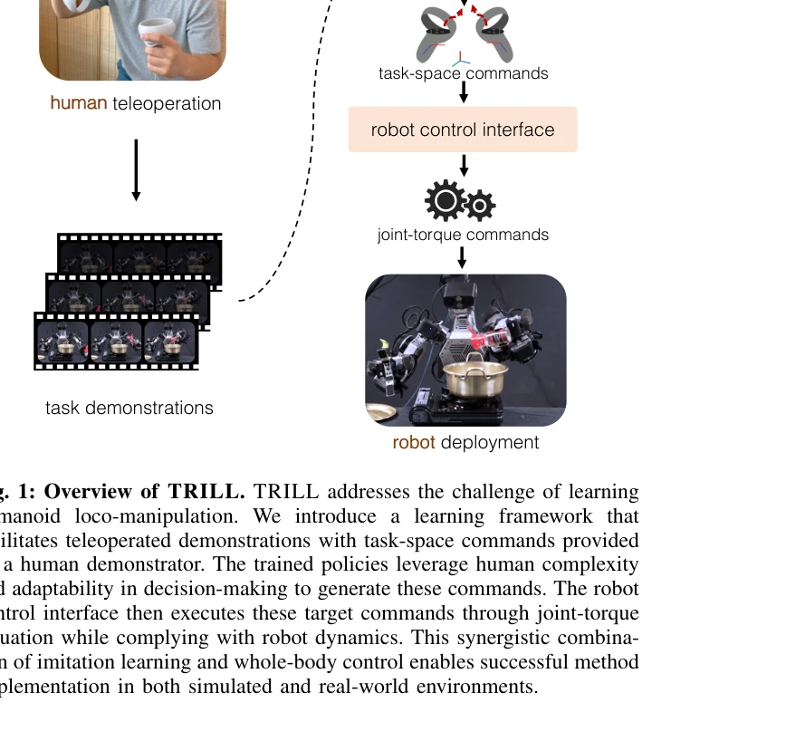
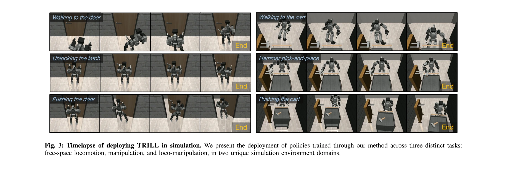
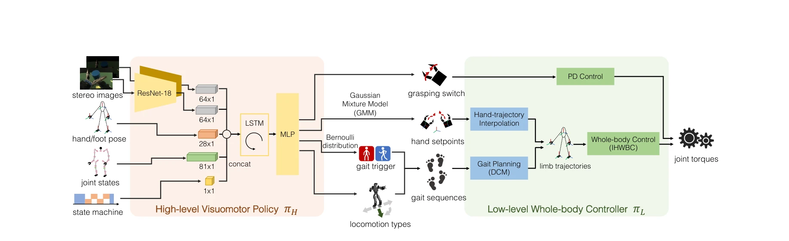

# Deep Imitation Learning for Humanoid Loco-manipulation through Human Teleoperation

> **저자**: Mingyo Seo, Steve Han, Kyutae Sim, Seung Hyeon Bang, Carlos Gonzalez, Luis Sentis, Yuke Zhu | **날짜**: 2023-09-05 | **URL**: [https://arxiv.org/abs/2309.01952](https://arxiv.org/abs/2309.01952)

---

## Essence

*Fig. 1: Overview of TRILL. TRILL addresses the challenge of learning*

본 논문은 VR 텔레오퍼레이션을 통해 수집한 인간 시연 데이터로부터 humanoid 로봇의 loco-manipulation 능력을 deep imitation learning으로 학습하는 TRILL 프레임워크를 제시한다. Whole-body control 기반의 계층적 정책 구조를 통해 높은 자유도 humanoid의 복잡한 동작을 데이터 효율적으로 학습할 수 있다.

## Motivation

- **Known**: Humanoid 로봇의 loco-manipulation은 floating-base 동역학, 높은 자유도, 접촉-풍부한 상호작용 등으로 인해 제어가 어렵다. 기존 방법들은 테이블탑 arm이나 바퀴 달린 플랫폼 같은 단순한 로봇 형태에는 성공했으나 humanoid에 적용하기는 어려웠다.
- **Gap**: Humanoid의 복잡한 부유기저 동역학을 안정적으로 유지하면서 고차원 action space에서 효율적으로 정책을 학습할 수 있는 데이터 효율적 방법이 부족했다. 특히 접촉-풍부한 manipulation 작업을 위한 인간 시연 데이터 수집 시스템이 실제로 구현되지 못했다.
- **Why**: Humanoid 로봇이 인간 중심 환경에서 일상 작업을 자율적으로 수행할 수 있게 하려면 복잡한 loco-manipulation 능력이 필수적이다. 수동 프로그래밍의 어려움을 극복하고 확장 가능한 학습 방법이 필요하다.
- **Approach**: 본 논문은 VR 인터페이스를 통한 직관적 시연 수집, whole-body control 기반의 task-space 명령 변환, high-level action abstraction을 통한 hierarchical policy 학습의 세 가지 핵심 요소를 결합했다. High-level visuomotor policy πH이 task-space 명령을 생성하고 low-level whole-body controller πL이 이를 joint-torque 액션으로 변환하는 두 수준의 계층 구조를 도입했다.

## Achievement

*Fig. 3: Timelapse of deploying TRILL in simulation. We present the deployment of policies trained through our method acr*

- **시뮬레이션 성능**: 자유 공간 이동 96%, 조작 80%, loco-manipulation 92%의 성공률 달성
- **우수한 성과**: state-of-the-art imitation learning baseline 대비 28% 높은 성공률
- **실제 로봇 배포**: DRACO 3 humanoid에서 두 가지 접촉-풍부한 manipulation 작업에서 평균 85% 성공률 달성
- **선도적 성과**: Humanoid 로봇에서 deep imitation learning을 이용한 복잡한 manipulation 작업의 첫 성공적 구현

## How

*Fig. 2: Model architecture of TRILL. The trained policies generate the target task-space command ut at 20 Hz from the on*

- VR 기반 텔레오퍼레이션 인터페이스로 직관적인 인간 시연 데이터 수집
- Whole-body control (Inverse Hierarchical Whole-Body Control, IHWBC) 기반의 task-space 명령을 joint-torque로 변환
- ResNet-18 기반 시각 인코더로 stereo 이미지 처리
- LSTM을 통한 temporal 정보 추출
- Gaussian Mixture Model으로 gait sequence 학습 및 상태 머신으로 locomotion 제어
- High-level policy가 손의 pose setpoint와 gait trigger 신호를 20 Hz로 생성
- Whole-body controller가 이를 100 Hz로 joint torque 명령으로 변환하여 안정성 유지
- Hierarchical decomposition π(at|st) = πL(at|st, ut)πH(ut|st)으로 action abstraction 달성

## Originality

- Whole-body control을 imitation learning 데이터 수집 및 정책 학습에 통합한 novel한 프레임워크
- VR 기반 텔레오퍼레이션과 whole-body control의 결합으로 humanoid의 복잡한 동역학을 효과적으로 처리
- Task-space action abstraction을 통해 humanoid의 높은 자유도를 다루는 데이터 효율적 방법 제시
- High-level policy와 low-level controller의 계층적 분해로 안정성과 학습 효율성을 동시에 달성
- Humanoid에서 복잡한 manipulation 작업을 위한 첫 end-to-end deep imitation learning 구현

## Limitation & Further Study

- 데이터 효율성: 시뮬레이션에서도 충분한 성공률 달성을 위해 상당한 양의 시연 데이터 필요 (Fig. 5 참조)
- 시실 로봇 배포 제한: DRACO 3 단일 플랫폼에서만 검증되었으며 다른 humanoid 플랫폼에 대한 일반화 가능성 미검증
- Task 다양성: 실제 로봇 실험이 두 가지 manipulation 작업으로 제한됨
- Generalization: 학습된 정책의 미학습 작업이나 환경 변화에 대한 generalization 능력 평가 부재
- 후속 연구: 더 적은 시연 데이터로 학습 가능한 메타-러닝 기법 적용, 다양한 humanoid 플랫폼에 대한 프레임워크 확장, 강화학습과의 결합을 통한 온라인 정책 개선

## Evaluation

- Novelty: 4/5
- Technical Soundness: 4/5
- Significance: 4/5
- Clarity: 4/5
- Overall: 4/5

**총평**: 본 논문은 humanoid loco-manipulation을 위한 데이터 효율적 deep imitation learning 방법을 제시하며, whole-body control과의 영리한 결합을 통해 높은 자유도 시스템의 안정성과 학습 효율성을 동시에 달성했다. 실제 humanoid 로봇에서 처음으로 성공적으로 복잡한 manipulation을 학습한 선도적 성과로, 앞으로 humanoid의 자율 능력 향상에 중요한 기여를 할 것으로 예상된다.
