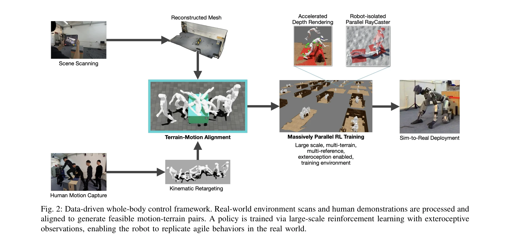
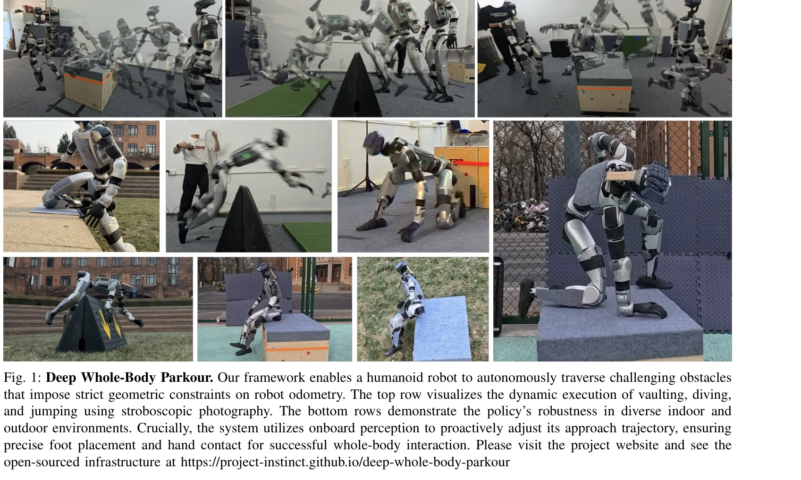

# Deep Whole-body Parkour

> **저자**: Ziwen Zhuang, Shaoting Zhu, Mengjie Zhao, Hang Zhao | **날짜**: 2026-01-12 | **DOI**: [10.48550/arXiv.2601.07701](https://doi.org/10.48550/arXiv.2601.07701)

---

## Essence

*Fig. 2: Data-driven whole-body control framework. Real-world environment scans and human demonstrations are processed an*

본 연구는 외부 센싱(depth perception)을 whole-body motion tracking에 통합하여 인간형 로봇이 불규칙한 지형에서 vaulting, dive-rolling 등의 동적 parkour 움직임을 수행하도록 하는 프레임워크를 제시한다.

## Motivation

- **Known**: Deep RL 기반 perceptive locomotion은 지형을 잘 다루지만 발 접촉만 사용하고, DeepMimic/AMP 같은 motion tracking은 복잡한 스킬을 재현하지만 환경에 무시한다.
- **Gap**: 기존 두 패러다임 모두 단점이 있다: perceptive locomotion은 발 기반 걷기/달리기로 제한되고, motion tracking은 고정 궤적을 추적하여 환경 기하에 적응할 수 없다.
- **Why**: human-level 유동성을 위해서는 vaulting, climbing 같은 다중 접촉 스킬이 필수이며, 실제 배포를 위해서는 시작 위치/각도 변화에 강건해야 한다.
- **Approach**: optical motion capture로 human parkour 동작을 기록하고 LiDAR로 환경을 동시에 스캔하여 motion-terrain 쌍을 생성한 뒤, depth observation을 포함한 reinforcement learning으로 single policy를 훈련하여 다양한 terrain에서 적응적 행동이 가능하도록 한다.

## Achievement

*Fig. 1: Deep Whole-Body Parkour. Our framework enables a humanoid robot to autonomously traverse challenging obstacles*

- **다중 패러다임 통합**: perceptive locomotion과 general motion tracking을 통합하여 환경 인식이 가능한 whole-body 제어 달성
- **강건한 적응 제어**: depth 기반 폐쇄루프 제어로 로봇 초기 위치/각도 변화에 대한 강건성 확보
- **다양한 동적 스킬**: vault, dive-roll, jump 등 단순 보행을 초월한 multi-contact 움직임을 비정형 terrain에서 수행
- **sim-to-real 전이**: custom dataset 기반 training으로 실제 로봇(Unitree G1)에서 동작 검증

## How

*Fig. 2: Data-driven whole-body control framework. Real-world environment scans and human demonstrations are processed an*

- **Dataset 구성**: optical motion capture system으로 human expert의 parkour 동작 기록 + LiDAR-enabled iPad Pro로 동시에 환경 스캔하여 spatially aligned motion-terrain 쌍 생성
- **Motion Retargeting**: GMR framework 활용하여 human motion을 Unitree G1 robot으로 retarget, optimization-based kinematic filtering 및 manual keyframe adjustment로 물리적 가능성 보장
- **Procedural Environment Generation**: scanned mesh에서 functional geometry(obstacle, platform, rail)만 추출하고 procedurally instantiate하여 generalization 확보
- **Massively Parallel Ray-Casting**: custom GPU ray-caster (NVIDIA Warp 기반)로 thousands of parallel environment에서 depth simulation 고속화, mesh instancing과 collision grouping으로 agent 간 interference 차단
- **Policy Training**: NVIDIA IsaacLab 대규모 병렬 시뮬레이션 환경에서 exteroceptive depth observation을 포함한 reinforcement learning으로 단일 policy 훈련

## Originality

- **paradigm 통합**: perceptive locomotion의 환경 적응성과 motion tracking의 복잡한 스킬 재현을 처음으로 통합한 접근
- **자동 adaptation**: blind tracking과 달리 depth feedback을 통해 approach gait를 동적으로 조정하여 접촉 정확도 자동 보정
- **custom dataset 파이프라인**: optical mocap + LiDAR simultaneous capture로 motion-terrain spatial correspondence 정확성 극대화
- **optimized ray-casting algorithm**: Algorithm 1의 grouped ray-casting으로 scale 문제 해결, mesh instancing으로 메모리 효율성과 계산 속도 동시 달성

## Limitation & Further Study

- **Dataset 규모 제한**: custom motion capture는 high cost이므로 다양성이 제한될 수 있음, 추가 스킬 확장 시 재촬영 필요
- **실시간 제약**: depth rendering 최적화가 있으나 매우 복잡한 obstacle geometry에서의 scalability 미제시
- **robot morphology 종속성**: Unitree G1 특화 설계로 다른 humanoid 형태로의 일반화 가능성 불명확
- **실외 환경 제한**: LiDAR 기반 scan이 강한 태양광/반사 환경에서 성능 저하 가능성
- **후속 연구**: (1) 대규모 public motion dataset 활용으로 data efficiency 개선, (2) multi-robot morphology 대응, (3) online depth noise handling 강화, (4) unseen obstacle type에 대한 zero-shot generalization

## Evaluation

- Novelty: 4/5
- Technical Soundness: 3/5
- Significance: 4/5
- Clarity: 4/5
- Overall: 4/5

**총평**: 본 논문은 두 상충하는 제어 패러다임을 창의적으로 통합하여 humanoid robot의 traversability를 획기적으로 확장했으며, custom motion-terrain dataset과 최적화된 ray-casting algorithm은 기술적 기여도 충실하다. sim-to-real gap 해소와 실제 동작 검증으로 실무적 가치가 높으나, dataset 확장성과 타 robot morphology 적용에 개선 여지가 있다.
