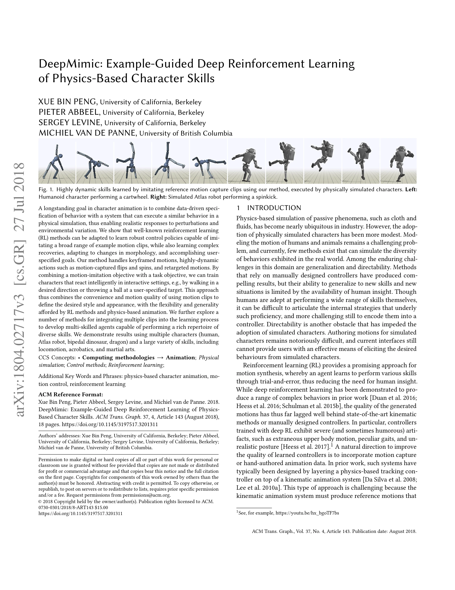
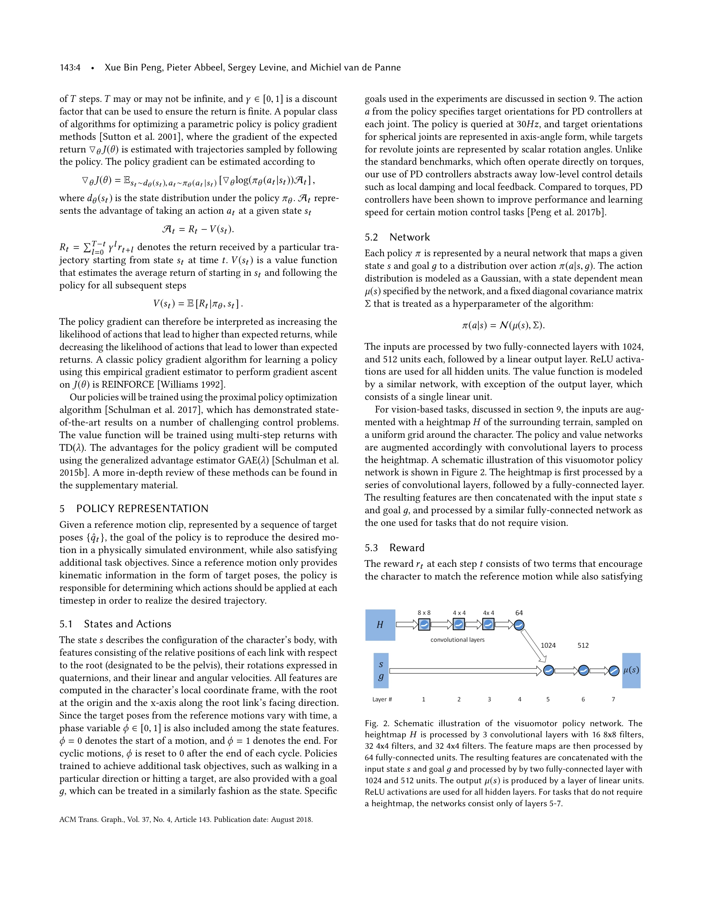

# DeepMimic: Example-Guided Deep Reinforcement Learning of Physics-Based Character Skills

> **저자**: Xue Bin Peng, Pieter Abbeel, Sergey Levine, Michiel van de Panne | **날짜**: 2018-04-08 | **URL**: [https://arxiv.org/abs/1804.02717](https://arxiv.org/abs/1804.02717)

---

## Essence

*Fig. 1. Highly dynamic skills learned by imitating reference motion capture clips using our method, executed by physical*

Motion capture 데이터를 활용한 example-guided reinforcement learning으로 물리 기반 캐릭터 애니메이션을 학습하는 방법을 제안하며, 모션 모방과 task 목표를 결합하여 강건하고 다양한 기술을 수행하는 제어 정책을 학습한다.

## Motivation

- **Known**: Physics 기반 캐릭터 애니메이션은 오래된 연구 분야이며, Deep RL은 복잡한 행동을 학습할 수 있지만 생성된 모션 품질이 낮고 부자연스러운 artifacts를 보이는 것으로 알려져 있다.
- **Gap**: 기존 RL 방법은 모션 품질이 낮고, kinematic animation과 physics 기반 tracking controller를 결합한 방식은 복잡하며 제한된 유연성을 가진다.
- **Why**: Animation 품질과 physics 기반 시뮬레이션의 강건성을 동시에 달성할 수 있다면 사용자가 원하는 스타일을 유지하면서도 환경 변화와 perturbation에 자연스럽게 대응하는 캐릭터 애니메이션이 가능해진다.
- **Approach**: Motion capture 데이터에 기반한 reference state imitation reward와 task objective를 결합한 RL 프레임워크를 구성하며, phase-aware policy를 사용하여 reference motion과 유사한 물리 기반 행동을 학습한다.

## Achievement

*Fig. 1. Highly dynamic skills learned by imitating reference motion capture clips using our method, executed by physical*

- **Motion quality와 robustness의 결합**: Reference motion capture 데이터를 활용하여 prior deep RL 방법보다 훨씬 자연스럽고 품질 높은 모션을 생성하면서도 perturbation에 강건한 제어 정책을 달성
- **다양한 동적 기술 학습**: Cartwheel, spinkick 등 매우 동적인 acrobatic 기술부터 locomotion, martial arts까지 광범위한 기술을 단일 프레임워크로 학습
- **다중 클립 통합**: Max-operator 기반 multi-clip reward, multi-task policy 학습, value function 기반 policy sequencing 등 여러 모션 클립을 통합하는 방법 제시
- **다양한 캐릭터 적용**: Humanoid, Atlas robot, bipedal dinosaur, dragon 등 여러 morphology의 캐릭터에 대한 scalability 입증
- **Ablation study**: Reference state initialization과 early termination이 highly dynamic skill 학습에 critical한 요소임을 규명

## How

*Fig. 2. Schematic illustration of the visuomotor policy network. The*

- Reference motion capture 데이터로부터 target state trajectory를 추출하고, imitation reward를 통해 학습 정책이 reference motion을 따르도록 유도
- Phase-aware policy network를 사용하여 motion의 cyclic nature를 명시적으로 모델링
- Motion imitation objective와 task objective (e.g., 특정 방향으로 걷기, 목표 던지기)를 weighted combination으로 결합
- Reference state initialization을 통해 학습 초기에 reference trajectory 근처에서 시작하는 trajectory distribution 활용
- Early termination을 통해 reference motion에서 벗어나면 episode를 종료하여 학습 효율 증대
- Multi-clip 통합: (1) max operator 기반 reward로 여러 클립 중 가장 적합한 것 선택, (2) Multi-task policy 학습으로 diverse skills 동시 학습, (3) Value function 기반 feasibility 평가로 single-clip policies 연결

## Originality

- Motion capture와 deep RL의 결합 자체는 새로운 것은 아니지만, 구체적인 reward design (phase-aware imitation reward), reference state initialization, early termination 등의 특정 기법 조합이 physics-based character animation 맥락에서 효과적임을 처음 체계적으로 입증
- 다양한 morphology의 캐릭터와 기술에 대한 광범위한 실증적 검증으로 방법의 일반성 입증
- Multi-clip 통합을 위한 여러 전략 제시 (max-operator, multi-task, policy sequencing)로 실제 애니메이션 제작 워크플로우에 실용적 가치 추가
- Phase-aware representation을 통해 cyclic motion의 특성을 명시적으로 활용하는 설계

## Limitation & Further Study

- Method의 각 component가 individually well-known이므로 기술적 novelty 자체는 제한적 (조합의 효과성이 주요 기여)
- Reference motion capture 데이터에 대한 의존성으로 인해 새로운 기술 개발보다는 기존 모션의 재현과 변형에 주로 활용 가능
- Highly dynamic skill 학습에 있어서도 reference trajectory 근처에서의 학습 bias로 인해 reference와 크게 다른 새로운 동작 생성의 한계
- Multiple characters에 대한 실험이 보여지지만, 각 morphology별 reward function 조정의 필요성에 대한 논의 부족
- 후속 연구: Reinforcement learning과 data-driven 방식의 균형을 자동으로 조정하는 adaptive weighting 메커니즘 개발, hierarchical policy structure를 통한 더 복잡한 skill composition 실현, sim-to-real transfer를 위한 robust domain adaptation 기법 연구

## Evaluation

- Novelty: 3/5
- Technical Soundness: 3/5
- Significance: 4/5
- Clarity: 4/5
- Overall: 4/5

**총평**: 본 논문은 개별 기술의 novel 한 조합보다는 physics-based character animation에서의 효과적 시스템 설계를 통해 실질적 가치를 제시하며, 광범위한 실증 결과로 방법의 실용성과 확장성을 강력히 입증한 매우 영향력 있는 기여이다.
