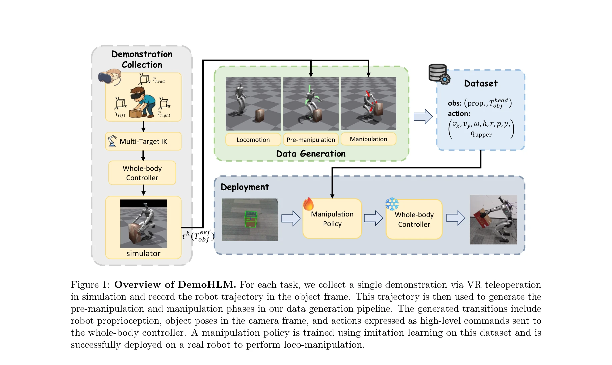
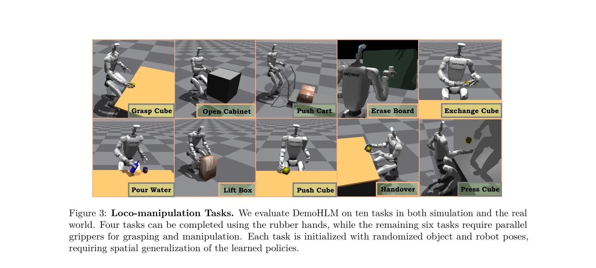

# DemoHLM: From One Demonstration to Generalizable Humanoid Loco-Manipulation

> **저자**: Yuhui Fu, Feiyang Xie, Chaoyi Xu, Jing Xiong, Haoqi Yuan, Zongqing Lu | **날짜**: 2025-10-13 | **DOI**: [10.48550/arXiv.2510.11258](https://doi.org/10.48550/arXiv.2510.11258)

---

## Essence

*Figure 1: Overview of DemoHLM. For each task, we collect a single demonstration via VR teleoperation*

DemoHLM은 단일 시뮬레이션 데모로부터 합성 데이터를 생성하여 휴머노이드 로봇의 일반화된 로코-매니퓰레이션 정책을 학습하는 프레임워크이다. 계층적 제어 구조를 통해 저수준 전신 제어기와 고수준 조작 정책을 통합하여 실제 로봇에 시뮬레이션-현실 전이를 달성한다.

## Motivation

- **Known**: 최근 휴머노이드 전신 제어 연구가 진전되었으나, 로코-매니퓰레이션은 여전히 덜 탐구되었으며 기존 방법들은 하드코딩된 작업 정의, 많은 실제 데이터 수집, 또는 SMPL 모델 기반으로 실제 로봇 배포가 어렵다.
- **Gap**: 휴머노이드 로코-매니퓰레이션에서 확장 가능한 데이터 생성과 일반화를 동시에 달성하면서 최소한의 텔레오퍼레이션 데이터로 실제 로봇에 효과적으로 전이할 수 있는 방법이 부재하다.
- **Why**: 휴머노이드 로봇이 인간 환경에서 다양한 상호작용을 수행하려면 로코-매니퓰레이션 능력이 필수적이며, 현재 접근법들의 확장성 부족과 실제 배포의 어려움을 해결하는 것이 중요하다.
- **Approach**: MimicGen의 객체 중심 행동 재생 개념을 휴머노이드에 확장하되, RL 기반 전신 제어기를 도입하여 균형 유지 문제를 해결하고, 단일 데모로부터 수백~수천 개의 합성 궤적을 생성한 후 behavior cloning으로 정책을 학습한다.

## Achievement

*Figure 3: Loco-manipulation Tasks. We evaluate DemoHLM on ten tasks in both simulation and the real*

- **확장 가능한 데이터 생성**: 단일 시뮬레이션 데모로부터 다양한 로봇 및 객체 초기 상태를 갖는 수백~수천 개의 성공 궤적을 자동 생성하는 파이프라인 개발
- **계층적 제어 구조**: 저수준 RL 기반 전신 제어기(torque 명령)와 고수준 조작 정책(상위신체 관절 목표 및 토르소 동작 명령)의 효과적인 통합
- **강력한 현실 전이**: Unitree G1 휴머노이드 로봇에서 10가지 로코-매니퓰레이션 작업 전반에 걸쳐 시뮬레이션 대비 성능 달성
- **데이터 효율성**: 합성 데이터 양과 정책 성능 간의 양의 상관관계 입증, 다양한 behavior cloning 알고리즘에서 일관된 효과 확인

## How

*Figure 1: Overview of DemoHLM. For each task, we collect a single demonstration via VR teleoperation*

- 단일 VR 텔레오퍼레이션 데모 수집: 휴머노이드 인간 포즈를 VR 장치로 캡처하여 시뮬레이션에서 수행
- 데모 분할: 수집된 궤적을 로코모션, 사전-매니퓰레이션, 매니퓰레이션 세 단계로 구분
- 객체 중심 행동 재생: 각 단계의 고수준 명령을 임의의 초기 로봇 및 객체 포즈에 맞게 수정 후 재생
- RL 기반 전신 제어기 학습: 전신 관절 토크를 제어하여 고수준 명령(상위신체 관절 목표, 토르소 속도/회전)을 추적하는 제어기 사전 훈련
- Behavior cloning 정책 훈련: 생성된 모든 성공 궤적으로부터 자율 조작 정책 학습
- 폐루프 시각 피드백: RGB-D 카메라 입력을 포함한 관찰로 정책 학습 및 실행

## Originality

- 휴머노이드 로코-매니퓰레이션으로 MimicGen 패러다임 확장: 고정베이스 조작기 데이터 생성에서 전신 균형을 필요로 하는 로코-매니퓰레이션으로의 비자명한 확장
- 전신 제어기와 객체 중심 계획의 통합: 균형 유지라는 추가 제약을 해결하기 위해 RL 기반 전신 제어기와 고수준 명령 공간에서의 정책 학습을 결합
- 최소 시뮬레이션 데이터로 현실 전이 달성: 단일 데모와 합성 데이터만으로 실제 로봇에서 강건한 성능을 달성하는 데이터 효율적 접근

## Limitation & Further Study

- 작업 복잡도 제한: 평가된 10개 작업이 상대적으로 제한적이며, 더 복잡한 다중 객체 상호작용이나 장기 작업 체인에 대한 성능 미평가
- 초기 상태 분포의존성: 데모 데이터 생성 파이프라인이 시뮬레이션 환경의 특성에 민감할 수 있으며, 시뮬레이션-현실 갭 분석 부족
- 전신 제어기 일반화: 새로운 로봇 형태나 크기에 대한 전신 제어기 재훈련 필요성 및 다양한 로봇 플랫폼으로의 확장 가능성 미평가
- 정책 학습 알고리즘 최적화: 현재 behavior cloning만 사용하였으며, 다른 imitation learning 또는 RL 기법의 성능 비교 부재
- 후속연구 방향: (1) 장기 수평적 작업 계획과의 통합, (2) 시뮬레이션 파라미터의 도메인 랜덤화 체계화, (3) 실제 환경의 다양한 물체 재질 및 동역학에 대한 강건성 개선

## Evaluation

- Novelty: 4/5
- Technical Soundness: 3/5
- Significance: 4/5
- Clarity: 4/5
- Overall: 4/5

**총평**: 본 논문은 MimicGen 개념을 휴머노이드 로코-매니퓰레이션으로 확장하여 단일 데모로부터 확장 가능한 데이터 생성을 실현하고, 계층적 제어 구조를 통해 현실 로봇에 효과적인 시뮬레이션-현실 전이를 달성했다. 데이터 효율성과 다중 작업 일반화 측면에서 강력한 기여를 제공하며, 실제 로봇 검증이 완전하여 실질적 가치가 높다.
