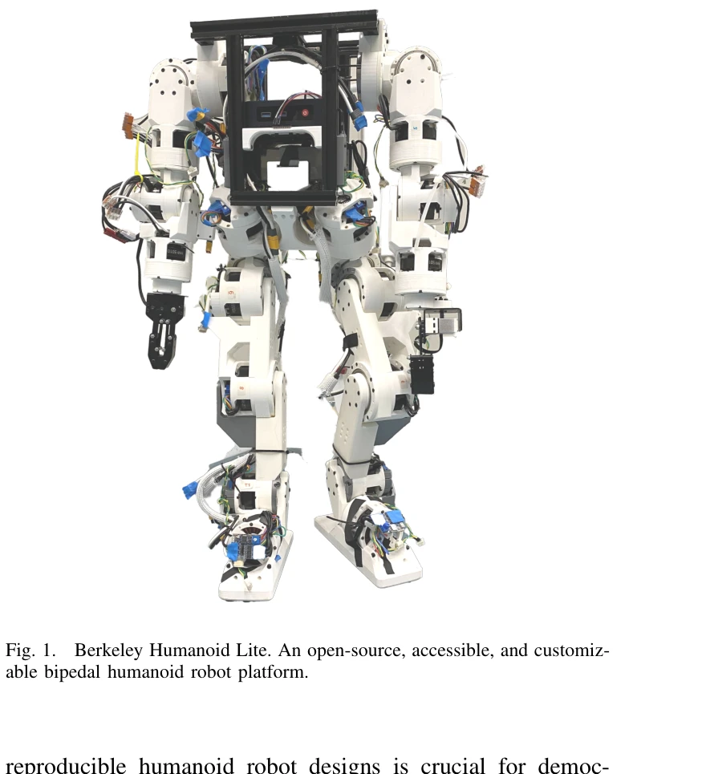

# Demonstrating Berkeley Humanoid Lite: An Open-source, Accessible, and Customizable 3D-printed Humanoid Robot

> **저자**: Yufeng Chi, Qiayuan Liao, Junfeng Long, Xiaoyu Huang, Sophia Shao, Borivoje Nikolic, Zhongyu Li, Koushil Sreenath | **날짜**: 2025-04-24 | **URL**: [https://arxiv.org/abs/2504.17249](https://arxiv.org/abs/2504.17249)

---

## Essence

*Fig. 1.*

Berkeley Humanoid Lite는 3D-printed cycloidal gearbox를 활용한 오픈소스 휴머노이드 로봇으로, $5,000 이하의 저비용으로 데스크톱 3D프린터와 e-commerce 부품으로 제작 가능하며 강화학습 기반 locomotion controller를 통해 sim-to-real transfer를 입증했다.

## Motivation

- **Known**: 상용 휴머노이드 로봇은 고가이며 폐쇄형이고, 연구실 기반 설계는 CNC 가공 등 특수 제조 설비를 요구한다. 서보 모터 기반 오픈소스 플랫폼(Poppy Humanoid, OP3)은 접근성이 좋으나 역동성과 스케일링 측면에서 제한된다.
- **Gap**: 저비용으로 접근 가능하면서도 3D-printed 소재의 내구성 문제를 해결하고, 중규모 휴머노이드 로봇의 복잡한 구동 메커니즘을 구현할 수 있는 오픈소스 플랫폼이 부재하다.
- **Why**: 휴머노이드 로봇의 민주화는 더 많은 연구자와 학생이 bipedal locomotion, human-robot interaction, 제어 연구에 참여할 수 있게 하며, 필드의 전반적인 기술 발전을 촉진한다.
- **Approach**: 3D-printed cycloidal gear 설계로 비용과 내구성의 균형을 맞추고, 모듈식 구조와 널리 이용 가능한 전자 부품으로 제작 난이도를 낮혔으며, reinforcement learning 기반 locomotion controller와 zero-shot sim-to-real transfer로 플랫폼의 실용성을 입증했다.

## Achievement

*Fig. 1.*

- **접근성과 비용 효율성**: 데스크톱 3D프린터와 e-commerce 부품으로만 구성되어 $5,000 이하의 저비용으로 제작 가능
- **3D-printed 소재의 내구성 해결**: Cycloidal gear 설계를 채택하고 광범위한 테스트를 통해 플라스틱 부품의 신뢰성 문제를 완화
- **모듈식 설계**: 모듈형 구조로 높은 커스터마이징 가능성과 확장성 제공
- **Sim-to-real transfer 입증**: Reinforcement learning 기반 locomotion controller의 zero-shot policy transfer 성공으로 연구 검증 플랫폼으로서의 적합성 증명
- **완전 오픈소스 공개**: 하드웨어 설계, 임베디드 코드, 학습 및 배포 프레임워크 전체 공개로 재현성과 커뮤니티 기여 극대화

## How

*Fig. 2.*

- 3D-printed cycloidal gearbox의 최적화된 형태 설계를 통해 금속 대체품 대비 강도 손실 보완
- 광범위한 내구성 테스트(durability testing) 실시로 플라스틱 구동 부품의 신뢰성 검증
- Reinforcement learning 기반 locomotion controller 개발로 bipedal 보행 제어 구현
- Simulation 환경에서 학습한 정책의 하드웨어 로봇으로의 직접 전이(zero-shot transfer) 검증
- Teleoperation 시스템 구현으로 전신 제어 및 조작 작업 시연

## Originality

- FDM 3D프린팅 기반 cycloidal gear 설계를 mid-scale 휴머노이드에 처음 적용하여 비용과 내구성의 트레이드오프 해결
- 완전 오픈소스(하드웨어, 소프트웨어, 학습 프레임워크) 정책으로 휴머노이드 로봇 연구의 민주화 실현
- Zero-shot sim-to-real transfer를 3D-printed actuator 플랫폼에서 성공적으로 입증하여 신뢰성 강화

## Limitation & Further Study

- 3D-printed 소재의 장기 내구성에 대한 장시간 운영 데이터 부족—추가 현장 운영 데이터와 마모 분석 필요
- 환경 온도와 습도 변화에 따른 3D-printed 부품의 성능 변동에 대한 분석 미흡—극한 환경 테스트 필요
- 현재 데스크톱 FDM 프린터의 정밀도 한계로 인한 공차(tolerance) 관리 어려움—공차 설계 가이드라인 확충 필요
- 단일 플랫폼의 성능 입증에 그쳤으며, 다양한 연구 그룹에서의 재현 시도와 피드백 축적 필요
- 더 복잡한 손가락 조작이나 전신 민첩 운동(agile locomotion)을 위한 actuator 확장성 평가 필요

## Evaluation

- Novelty: 4/5
- Technical Soundness: 3/5
- Significance: 4/5
- Clarity: 4/5
- Overall: 4/5

**총평**: Berkeley Humanoid Lite는 3D-printed cycloidal gear 기반 저비용 휴머노이드 로봇의 설계와 구현을 통해 로봇 연구의 접근성을 획기적으로 낮추고, 완전 오픈소스 공개 정책으로 커뮤니티 주도의 발전을 가능하게 했다. Reinforcement learning 기반 locomotion control의 성공적인 sim-to-real transfer는 플랫폼의 실용성을 입증하며, 향후 휴머노이드 로봇 연구의 민주화를 주도할 초석이 될 가능성이 크다.
